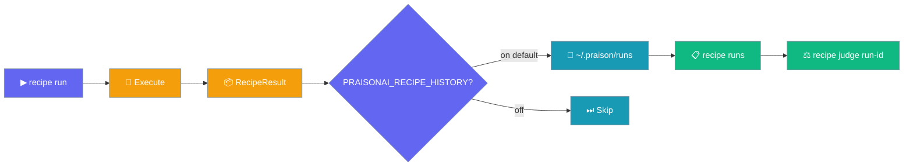
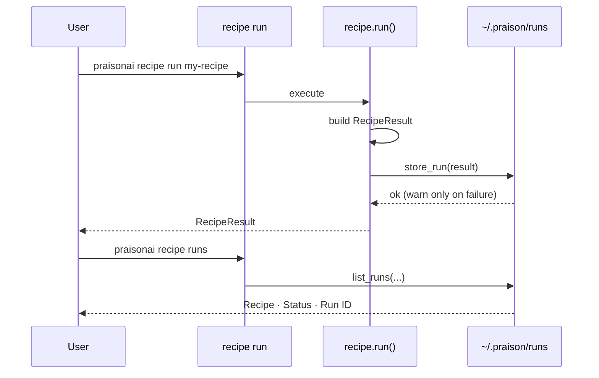

Every `recipe run` is recorded automatically. Use `recipe runs` to see what happened, and `recipe judge <run-id>` to evaluate it.

```python
from praisonaiagents import Agent

agent = Agent(
    name="Recipe Historian",
    instructions="After running a recipe, list the last 5 runs and pick the most recent success to judge."
)

agent.start("Show me my recent recipe runs and grade the newest successful one.")
```



## Quick Start

<Steps>
<Step title="Run a recipe">
Every run is recorded automatically — no `--save` needed.

```bash
praisonai recipe run ai-url-blog-generator --var url="https://example.com/article"
```
</Step>

<Step title="List past runs">
```bash
praisonai recipe runs
```
</Step>

<Step title="Judge a run">
Copy a **Run ID** from the table and evaluate it.

```bash
praisonai recipe judge run-abc123
```
</Step>
</Steps>

---

## How It Works

Each run returns a `RecipeResult`, which is persisted to history before the result is returned.



| Behavior | Detail |
|----------|--------|
| Recorded on | Every `run()` and `run_stream()` execution |
| Terminal statuses | `success`, `failed`, `missing_deps`, `policy_denied`, `dry_run`, `timeout` |
| Failure mode | History write errors log a warning; the run still succeeds |
| Registry-independent | Runs for deleted or unknown recipes are still listed |

---

## Configuration

Persistence is on by default and controlled by one environment variable.

| Setting | Value | Effect |
|---------|-------|--------|
| `PRAISONAI_RECIPE_HISTORY` | unset / `true` / `1` | Enabled (default) |
| `PRAISONAI_RECIPE_HISTORY` | `0`, `false`, `no`, `off` | Disabled |

**Disable persistence:**

```bash
export PRAISONAI_RECIPE_HISTORY=false
praisonai recipe run my-recipe   # not recorded
```

**Re-enable (default):**

```bash
unset PRAISONAI_RECIPE_HISTORY
```

---

## Common Patterns

**Find and judge the last failure:**

```bash
praisonai recipe runs --status failed --limit 1
praisonai recipe judge run-abc123
```

**Filter by session for a JSON pipeline:**

```bash
praisonai recipe runs --session session-abc123 --json
```

**List runs with the Python API:**

```python
from praisonai.recipe.history import list_runs

runs = list_runs(recipe="my-recipe", status="success", limit=5)
for run in runs:
    print(run["run_id"], run["status"], run["stored_at"])
```

---

## Best Practices

<AccordionGroup>
<Accordion title="Let history run by default">
Leave `PRAISONAI_RECIPE_HISTORY` unset so every run is captured. Disable it only in ephemeral CI where run records add no value.
</Accordion>

<Accordion title="Use runs as the entry point to judge">
Start with `praisonai recipe runs`, copy a Run ID, then `praisonai recipe judge <run-id>`. This avoids guessing trace names.
</Accordion>

<Accordion title="Filter before you scan">
Combine `NAME`, `--status`, and `--session` to narrow results instead of increasing `--limit`.
</Accordion>

<Accordion title="Add --save for deep debugging">
History captures Run IDs, statuses, and timings. Add `--save` to `recipe run` only when you need a full replay trace.
</Accordion>
</AccordionGroup>

---

## Related

<CardGroup cols={2}>
<Card title="Run History CLI" icon="terminal" href="/cli/recipe-runs">
Full `recipe runs` options and storage layout
</Card>
<Card title="Recipe Command" icon="book" href="/cli/recipe">
Top-level recipe commands
</Card>
<Card title="Recipe Workflow" icon="utensils" href="/features/recipe-workflow">
Run → judge → apply cycle
</Card>
<Card title="LLM as Judge" icon="scale-balanced" href="/features/llm-judge">
Evaluate a run by its Run ID
</Card>
</CardGroup>
