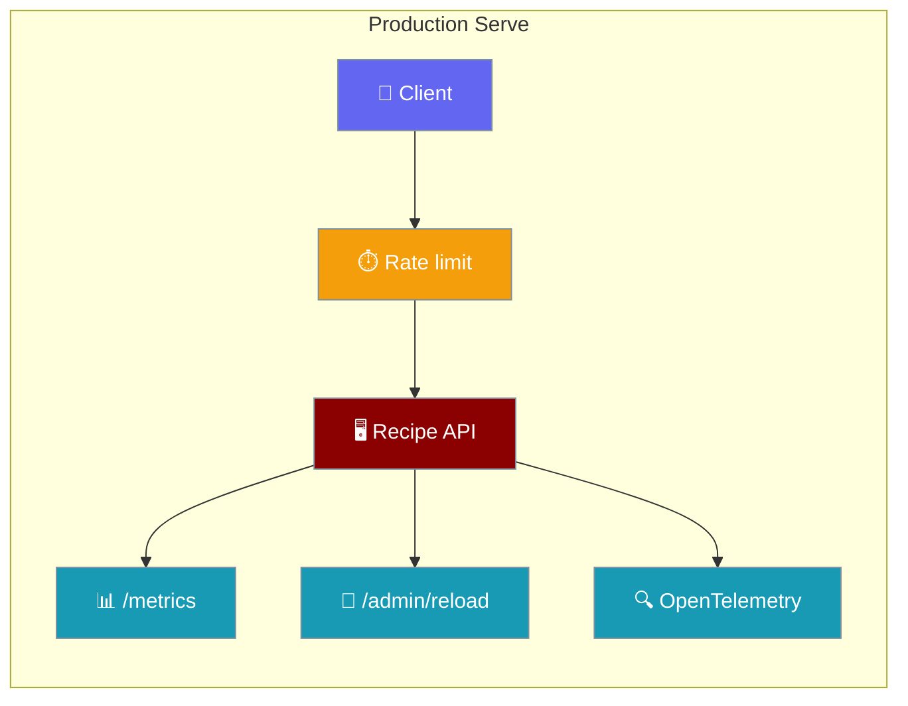

```python
from praisonaiagents import Agent

agent = Agent(name="recipe-server", instructions="Serve advanced recipes as HTTP endpoints.")
agent.start("Serve the data-analysis recipe on port 8000.")
```


Harden a recipe HTTP server with rate limits, Prometheus metrics, admin reload, and distributed tracing.

```python
import os
from praisonai.recipe.serve import serve

serve(
    host="0.0.0.0",
    port=8765,
    workers=2,
    config={
        "auth": "api-key",
        "api_key": os.environ["PRAISONAI_API_KEY"],
        "rate_limit": 100,
        "enable_metrics": True,
    },
)
```



## Quick Start

<Steps>
<Step title="Simple Usage">

Enable rate limiting and metrics on an existing server:

```python
from praisonai.recipe.serve import serve

serve(
    host="127.0.0.1",
    port=8765,
    config={
        "rate_limit": 100,
        "enable_metrics": True,
    },
)
```

Scrape metrics at `GET /metrics` (Prometheus format).

</Step>

<Step title="With Configuration">

Production setup with auth, admin reload, workers, and tracing:

```python
import os
from praisonai.recipe.serve import serve

serve(
    host="0.0.0.0",
    port=8765,
    workers=4,
    config={
        "auth": "api-key",
        "api_key": os.environ["PRAISONAI_API_KEY"],
        "rate_limit": 100,
        "max_request_size": 10 * 1024 * 1024,
        "enable_metrics": True,
        "enable_admin": True,
        "trace_exporter": "otlp",
        "otlp_endpoint": "http://localhost:4317",
        "service_name": "praisonai-recipe",
    },
)
```

</Step>
</Steps>

---

## How It Works

Advanced features layer onto the base recipe server from [Recipe Serve](/docs/features/recipe-serve-code). Rate limiting uses a sliding window per client; metrics expose request counts and latency; admin endpoints hot-reload recipes without restart.

| Feature | Endpoint / API | Purpose |
|---------|----------------|---------|
| Rate limiting | middleware | Cap requests per minute per client |
| Metrics | `GET /metrics` | Prometheus exposition |
| Admin reload | `POST /admin/reload` | Refresh recipe registry |
| Tracing | OpenTelemetry | Distributed request spans |
| Workers | `serve(workers=N)` | Multi-process scaling |

---

## Configuration Options

| Key | Type | Default | Description |
|-----|------|---------|-------------|
| `rate_limit` | `int` | `0` (disabled) | Requests per minute per client |
| `rate_limit_exempt_paths` | `list` | `["/health", "/metrics"]` | Paths exempt from rate limiting |
| `max_request_size` | `int` | `10485760` (10MB) | Maximum request body size |
| `enable_metrics` | `bool` | `false` | Enable `/metrics` endpoint |
| `enable_admin` | `bool` | `false` | Enable `/admin/*` endpoints |
| `trace_exporter` | `str` | `"none"` | Tracing exporter (`none`, `otlp`, `jaeger`, `zipkin`) |
| `otlp_endpoint` | `str` | `"http://localhost:4317"` | OTLP collector endpoint |
| `service_name` | `str` | `"praisonai-recipe"` | Service name for tracing |
| `workers` | `int` | `1` | Worker processes (`serve()` argument) |

---

## Common Patterns

### Programmatic rate limiter

```python
from praisonai.recipe.serve import create_rate_limiter

limiter = create_rate_limiter(requests_per_minute=100)
allowed, retry_after = limiter.check("client-ip-or-key")

if not allowed:
    print(f"Rate limited. Retry after {retry_after} seconds")
```

### Admin reload

```bash
curl -X POST http://localhost:8765/admin/reload \
  -H "X-API-Key: $PRAISONAI_API_KEY"
```

### Prometheus scrape config

```yaml
scrape_configs:
  - job_name: praisonai-recipe
    static_configs:
      - targets: ["localhost:8765"]
    metrics_path: /metrics
```

### OpenTelemetry dependencies

```bash
pip install opentelemetry-sdk opentelemetry-exporter-otlp
```

OpenTelemetry is lazily imported — if packages are missing, the server logs a warning and continues without tracing.

---

## Best Practices

<AccordionGroup>
  <Accordion title="Always enable auth with admin endpoints">
    Set `enable_admin=True` only alongside `auth: api-key` and load the key from `PRAISONAI_API_KEY`. Admin reload can change live behaviour — protect it.
  </Accordion>
  <Accordion title="Use workers for CPU-bound recipe loads">
    Set `workers` to roughly `2 × CPU cores + 1`. Workers above 1 disable hot reload automatically.
  </Accordion>
  <Accordion title="Exempt health and metrics from rate limits">
    Keep `/health` and `/metrics` in `rate_limit_exempt_paths` so orchestrators and Prometheus can poll without consuming quota.
  </Accordion>
  <Accordion title="Use Redis for distributed rate limiting">
    The built-in limiter is in-memory per worker. For multi-node deployments, place a shared rate limiter in front of the service (API gateway or Redis-backed middleware).
  </Accordion>
</AccordionGroup>

---

## Related

<CardGroup cols={2}>
  <Card title="Recipe Serve" icon="server" href="/docs/features/recipe-serve-code">
    Programmatic server configuration and deployment
  </Card>
  <Card title="Endpoints Code" icon="code" href="/docs/features/endpoints-code">
    Client-side code for calling recipe endpoints
  </Card>
</CardGroup>
