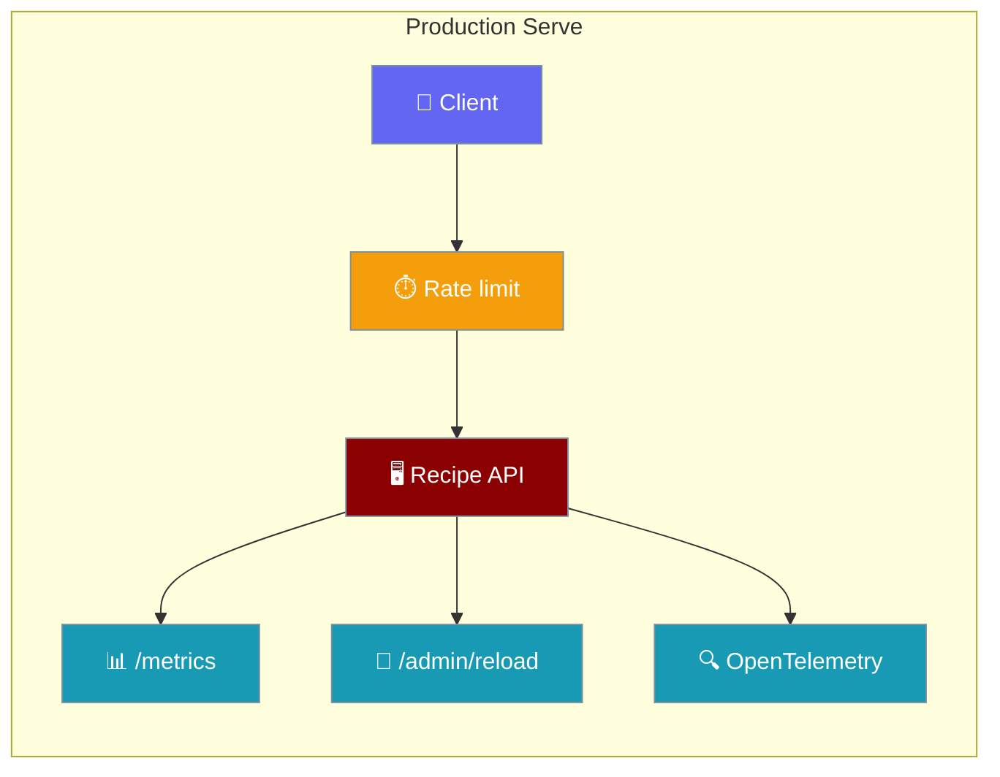
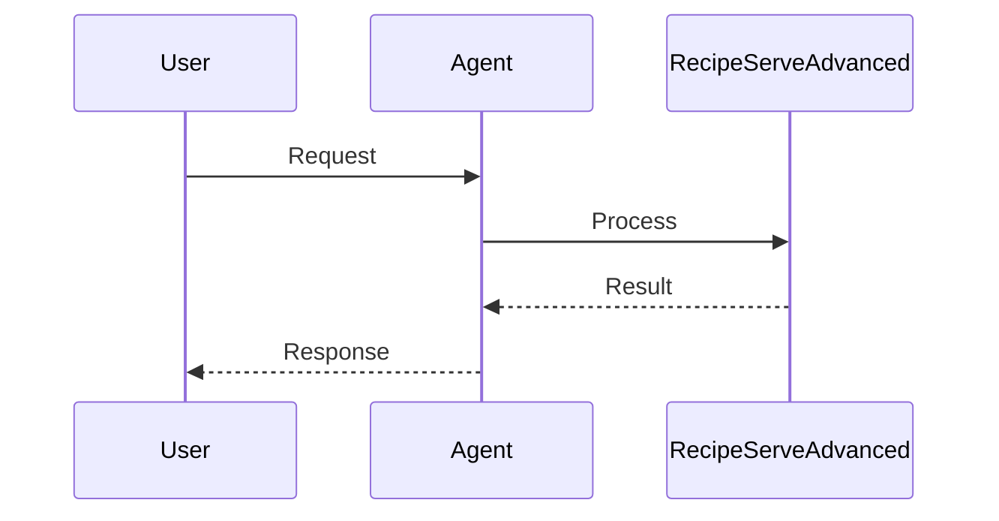
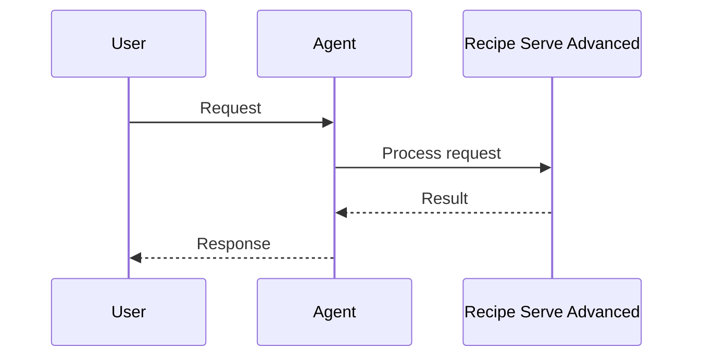
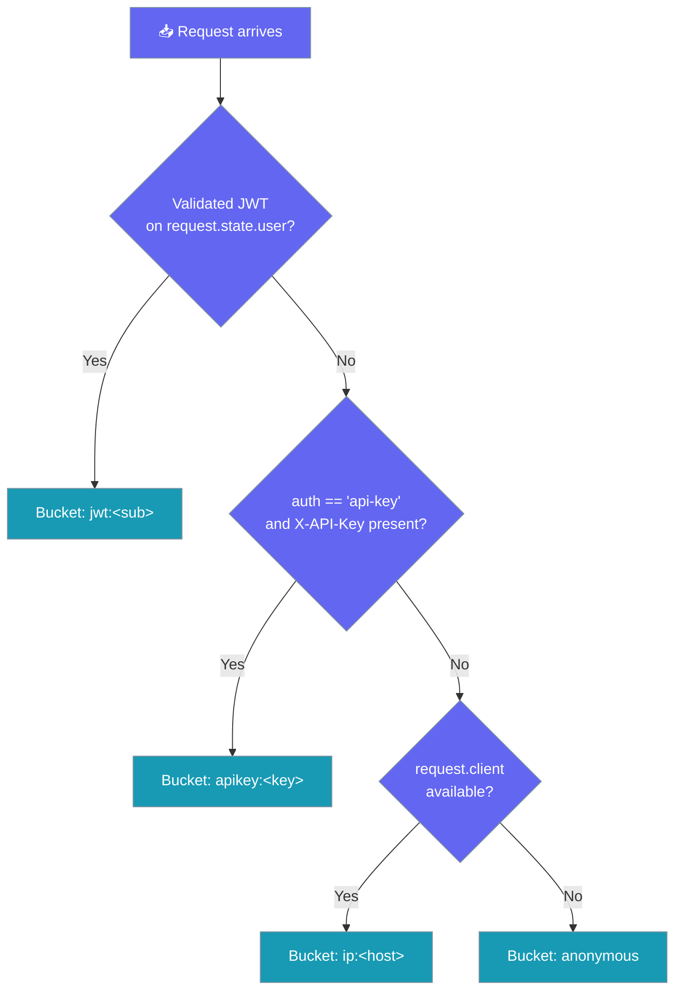

```python
from praisonaiagents import Agent

agent = Agent(name="recipe-server", instructions="Serve advanced recipes as HTTP endpoints.")
agent.start("Serve the data-analysis recipe on port 8000.")
```

The user calls a hardened recipe HTTP endpoint; rate limits, metrics, and auth guard production traffic.


Harden a recipe HTTP server with rate limits, Prometheus metrics, admin reload, and distributed tracing.

```python
import os
from praisonai.recipe.serve import serve

serve(
    host="0.0.0.0",
    port=8765,
    workers=2,
    config={
        "auth": "api-key",
        "api_key": os.environ["PRAISONAI_API_KEY"],
        "rate_limit": 100,
        "enable_metrics": True,
    },
)
```


```mermaid
graph LR
    subgraph "Production Serve"
        Client["📱 Client"] --> RL["⏱️ Rate limit"]
        RL --> API["🖥️ Recipe API"]
        API --> Metrics["📊 /metrics"]
        API --> Admin["🔧 /admin/reload"]
        API --> Trace["🔍 OpenTelemetry"]
    end

    classDef client fill:#6366F1,stroke:#7C90A0,color:#fff
    classDef guard fill:#F59E0B,stroke:#7C90A0,color:#fff
    classDef server fill:#8B0000,stroke:#7C90A0,color:#fff
    classDef observe fill:#189AB4,stroke:#7C90A0,color:#fff

    class Client client
    class RL guard
    class API server
    class Metrics,Admin,Trace observe
```

## How It Works


```mermaid
sequenceDiagram
    participant User
    participant Agent
    participant RecipeServeAdvanced

    User->>Agent: Request
    Agent->>RecipeServeAdvanced: Process
    RecipeServeAdvanced-->>Agent: Result
    Agent-->>User: Response
```


## Quick Start

<Steps>
<Step title="Simple Usage">

Enable rate limiting and metrics on an existing server:

```python
from praisonai.recipe.serve import serve

serve(
    host="127.0.0.1",
    port=8765,
    config={
        "rate_limit": 100,
        "enable_metrics": True,
    },
)
```

Scrape metrics at `GET /metrics` (Prometheus format).

</Step>

<Step title="With Configuration">

Production setup with auth, admin reload, workers, and tracing:

```python
import os
from praisonai.recipe.serve import serve

serve(
    host="0.0.0.0",
    port=8765,
    workers=4,
    config={
        "auth": "api-key",
        "api_key": os.environ["PRAISONAI_API_KEY"],
        "rate_limit": 100,
        "max_request_size": 10 * 1024 * 1024,
        "enable_metrics": True,
        "enable_admin": True,
        "trace_exporter": "otlp",
        "otlp_endpoint": "http://localhost:4317",
        "service_name": "praisonai-recipe",
    },
)
```

</Step>
</Steps>

---

## How It Works


```mermaid
sequenceDiagram
    participant User
    participant Agent
    participant Feature as Recipe Serve Advanced 

    User->>Agent: Request
    Agent->>Feature: Process request
    Feature-->>Agent: Result
    Agent-->>User: Response
```


Advanced features layer onto the base recipe server from [Recipe Serve](/features/recipe-serve-code). Rate limiting uses a sliding window per client; metrics expose request counts and latency; admin endpoints hot-reload recipes without restart.

| Feature | Endpoint / API | Purpose |
|---------|----------------|---------|
| Rate limiting | middleware | Cap requests per minute per client |
| Metrics | `GET /metrics` | Prometheus exposition |
| Admin reload | `POST /admin/reload` | Refresh recipe registry |
| Tracing | OpenTelemetry | Distributed request spans |
| Workers | `serve(workers=N)` | Multi-process scaling |

---

## Rate limiter internals

The middleware buckets requests by the strongest identity the auth layer has already validated — never by a raw client header — so rotating a header cannot defeat the limit.

| Auth mode | Bucket id | Notes |
|-----------|-----------|-------|
| `jwt` | `jwt:<sub>` from the validated JWT payload | Falls through to `ip:` if no valid JWT |
| `api-key` | `apikey:<validated-key>` | Only in this mode is `X-API-Key` used as a bucket — because the auth middleware has already validated it |
| `none` | `ip:<client-host>` | Or `"anonymous"` if the request has no client host |

`RateLimiter` exposes two entry points:

- `check(client_id)` — **synchronous, thread-safe** (backward-compatible). `check_sync` remains as an alias.
- `check_async(client_id)` — **async**, guarded by an `asyncio.Lock`. Used by the middleware hot path so overlapping requests can never both pass the length check before either appends.


```mermaid
graph TB
    Req["📥 Request arrives"] --> HasJwt{"Validated JWT<br/>on request.state.user?"}
    HasJwt -->|Yes| BJwt["Bucket: jwt:&lt;sub&gt;"]
    HasJwt -->|No| IsApi{"auth == 'api-key'<br/>and X-API-Key present?"}
    IsApi -->|Yes| BKey["Bucket: apikey:&lt;key&gt;"]
    IsApi -->|No| HasClient{"request.client<br/>available?"}
    HasClient -->|Yes| BIp["Bucket: ip:&lt;host&gt;"]
    HasClient -->|No| BAnon["Bucket: anonymous"]

    classDef q fill:#6366F1,stroke:#7C90A0,color:#fff
    classDef bucket fill:#189AB4,stroke:#7C90A0,color:#fff
    class Req,HasJwt,IsApi,HasClient q
    class BJwt,BKey,BIp,BAnon bucket
```

<Note>
If you rely on rate limiting in `auth: none` or `auth: jwt` mode, the bucket id is derived from the **validated** identity (JWT sub or client IP), never from the raw `X-API-Key` header. A client cannot rotate `X-API-Key` values to escape the limit. In `auth: api-key` mode the validated key is the bucket, so distinct valid keys naturally get distinct buckets — this is intentional.
</Note>

Precedence: `jwt:<sub>` > `apikey:<key>` (only in `api-key` mode) > `ip:<host>` > `"anonymous"`.

---

## Configuration Options

| Key | Type | Default | Description |
|-----|------|---------|-------------|
| `rate_limit` | `int` | `0` (disabled) | Requests per minute per client |
| `rate_limit_exempt_paths` | `list` | `["/health", "/metrics"]` | Paths exempt from rate limiting |
| `max_request_size` | `int` | `10485760` (10MB) | Maximum request body size |
| `enable_metrics` | `bool` | `false` | Enable `/metrics` endpoint |
| `enable_admin` | `bool` | `false` | Enable `/admin/*` endpoints |
| `trace_exporter` | `str` | `"none"` | Tracing exporter (`none`, `otlp`, `jaeger`, `zipkin`) |
| `otlp_endpoint` | `str` | `"http://localhost:4317"` | OTLP collector endpoint |
| `service_name` | `str` | `"praisonai-recipe"` | Service name for tracing |
| `workers` | `int` | `1` | Worker processes (`serve()` argument) |

<Warning>
`rate_limit` is enforced **per worker process**. When `workers > 1`, `serve()` splits the configured value across workers (`rate_limit // workers`, minimum 1) and emits a `UserWarning` at startup. This is best-effort — for exact cross-process limiting, use a shared store.
</Warning>

---

## Common Patterns

### Programmatic rate limiter

<Tabs>
<Tab title="Sync">
```python
from praisonai.recipe.serve import create_rate_limiter

limiter = create_rate_limiter(requests_per_minute=100)

# Backward-compatible sync API. Guarded by a threading.Lock.
allowed, retry_after = limiter.check("ip:127.0.0.1")
# `check_sync` is retained as an alias of `check`.
if not allowed:
    print(f"Rate limited. Retry after {retry_after} seconds")
```
</Tab>
<Tab title="Async">
```python
import asyncio
from praisonai.recipe.serve import create_rate_limiter

limiter = create_rate_limiter(requests_per_minute=5)

async def burst():
    # 100 concurrent checks — exactly 5 succeed (async race closed).
    results = await asyncio.gather(
        *[limiter.check_async("burst") for _ in range(100)]
    )
    return sum(1 for allowed, _ in results if allowed)

print(asyncio.run(burst()))  # -> 5
```
</Tab>
</Tabs>

### Admin reload

```bash
curl -X POST http://localhost:8765/admin/reload \
  -H "X-API-Key: $PRAISONAI_API_KEY"
```

### Prometheus scrape config

```yaml
scrape_configs:
  - job_name: praisonai-recipe
    static_configs:
      - targets: ["localhost:8765"]
    metrics_path: /metrics
```

### OpenTelemetry dependencies

```bash
pip install opentelemetry-sdk opentelemetry-exporter-otlp
```

OpenTelemetry is lazily imported — if packages are missing, the server logs a warning and continues without tracing.

---

## Best Practices

<AccordionGroup>
  <Accordion title="Always enable auth with admin endpoints">
    Set `enable_admin=True` only alongside `auth: api-key` and load the key from `PRAISONAI_API_KEY`. Admin reload can change live behaviour — protect it.
  </Accordion>
  <Accordion title="Use workers for CPU-bound recipe loads">
    Set `workers` to roughly `2 × CPU cores + 1`. Workers above 1 disable hot reload automatically. Under the hood, `serve(workers=N>1)` hands uvicorn an app-factory import string (`praisonai.recipe.serve:_app_factory`) and ships the config to each worker through the `PRAISONAI_RECIPE_SERVE_CONFIG` environment variable. The same app-factory pattern now also enables `--reload` on single-worker runs (previously silently dropped). Previously, passing `workers=N` silently degraded to a single worker — that regression is fixed.
  </Accordion>
  <Accordion title="Exempt health and metrics from rate limits">
    Keep `/health` and `/metrics` in `rate_limit_exempt_paths` so orchestrators and Prometheus can poll without consuming quota.
  </Accordion>
  <Accordion title="Use Redis for distributed rate limiting">
    The built-in limiter is in-memory per worker. When you set `workers > 1`, `serve()` automatically divides the configured `rate_limit` across workers (`rate_limit // workers`, floor 1) so the aggregate rate stays close to the value you configured — and prints a `warnings.warn` at startup explaining exactly what it did.

    Example: `serve(workers=4, config={"rate_limit": 100})` → each worker enforces `25/min` locally, so the OS-load-balanced aggregate is ≈ `100/min`.

    For **exact** cross-process enforcement, front the service with an API gateway or a Redis-backed limiter — the built-in in-memory limiter cannot share state across worker processes.
  </Accordion>
</AccordionGroup>

---

## Related

<CardGroup cols={2}>
  <Card title="Recipe Serve" icon="server" href="/features/recipe-serve-code">
    Programmatic server configuration and deployment
  </Card>
  <Card title="Endpoints Code" icon="code" href="/features/endpoints-code">
    Client-side code for calling recipe endpoints
  </Card>
</CardGroup>
