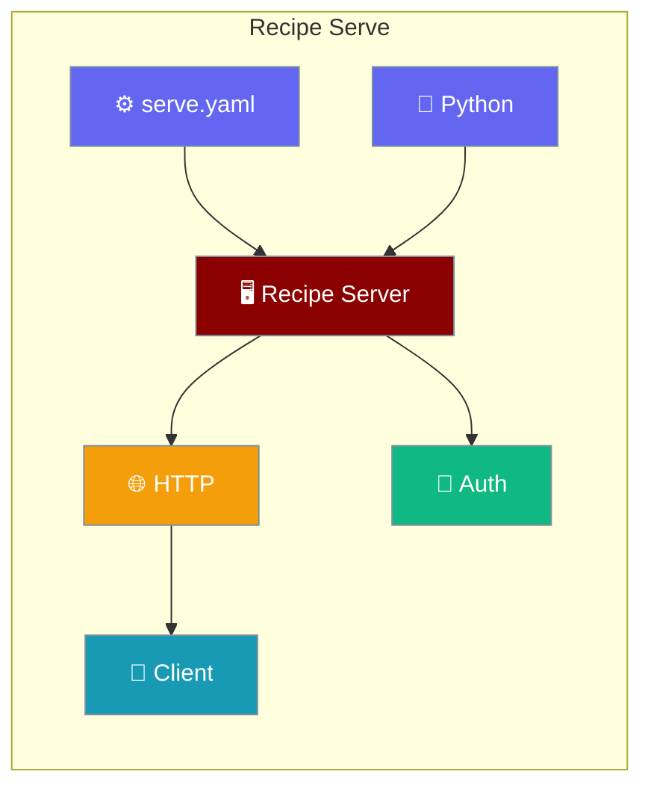

Expose recipe workflows over HTTP — configure auth, CORS, and deployment from Python or YAML.

```python
from praisonai.recipe.serve import serve

serve(host="127.0.0.1", port=8765)
```



## Quick Start

<Steps>
<Step title="Simple Usage">

Start a local recipe server:

```python
from praisonai.recipe.serve import serve

serve(host="127.0.0.1", port=8765)
```

Or via CLI:

```bash
praisonai recipe serve --host 127.0.0.1 --port 8765
```

</Step>

<Step title="With Configuration">

Load settings from `serve.yaml` and override auth:

```python
import os
from praisonai.recipe.serve import serve, load_config

config = load_config("serve.yaml")
config["auth"] = "api-key"
config["api_key"] = os.environ["PRAISONAI_API_KEY"]

serve(
    host=config.get("host", "127.0.0.1"),
    port=config.get("port", 8765),
    config=config,
)
```

</Step>
</Steps>

---

## How It Works

`create_app()` builds a Starlette ASGI application; `serve()` runs it with uvicorn. Configuration merges file, environment variables, and Python overrides — CLI flags take highest precedence.

| Route | Method | Description |
|-------|--------|-------------|
| `/health` | GET | Health check |
| `/v1/recipes` | GET | List recipes |
| `/v1/recipes/{name}` | GET | Describe recipe |
| `/v1/recipes/run` | POST | Run recipe (sync) |
| `/v1/recipes/stream` | POST | Run recipe (SSE) |

---

## Configuration Options

| Key | Type | Default | Description |
|-----|------|---------|-------------|
| `host` | `str` | `"127.0.0.1"` | Bind address |
| `port` | `int` | `8765` | Listen port |
| `auth` | `str` | `"none"` | Auth mode (`none`, `api-key`, `jwt`) |
| `api_key` | `str` | env | API key when `auth=api-key` |
| `recipes` | `list` | all | Recipe names to expose |
| `preload` | `bool` | `false` | Warm recipes on startup |
| `cors_origins` | `str` | `"*"` | Allowed CORS origins |
| `log_level` | `str` | `"info"` | Server log level |

### serve.yaml example

```yaml
host: 127.0.0.1
port: 8765
auth: api-key
recipes:
  - support-reply-drafter
  - meeting-action-items
preload: true
cors_origins: "https://app.example.com"
```

Set `PRAISONAI_API_KEY` in the environment instead of hardcoding keys.

---

## Common Patterns

### ASGI app for custom deployment

```python
from praisonai.recipe.serve import create_app
import uvicorn

app = create_app(config={"auth": "none", "cors_origins": "*"})
uvicorn.run(app, host="0.0.0.0", port=8765)
```

### Unified agents.yaml config

```yaml
serve:
  host: 127.0.0.1
  port: 8765
  auth: api-key
  preload: true
```

```python
from praisonai.recipe.serve import load_config, serve

config = load_config("agents.yaml").get("serve", {})
serve(host=config.get("host", "127.0.0.1"), port=config.get("port", 8765), config=config)
```

### Test with TestClient

```python
import os
from starlette.testclient import TestClient
from praisonai.recipe.serve import create_app

app = create_app(config={"auth": "api-key", "api_key": "test-key"})
client = TestClient(app)

assert client.get("/health").json()["status"] == "healthy"
assert client.get("/v1/recipes", headers={"X-API-Key": "test-key"}).status_code == 200
```

---

## Best Practices

<AccordionGroup>
  <Accordion title="Always use auth in production">
    Set `auth: api-key` and load the key from `PRAISONAI_API_KEY`. Never expose an unauthenticated recipe server on a public network.
  </Accordion>
  <Accordion title="Preload recipes for faster startup">
    Set `preload: true` to warm recipes at startup and eliminate cold-start latency on the first request.
  </Accordion>
  <Accordion title="Restrict CORS origins">
    Set `cors_origins` to your exact frontend domain in production rather than `"*"`.
  </Accordion>
  <Accordion title="Poll /health for orchestration">
    Use the `/health` endpoint in Docker, Kubernetes, and load-balancer health checks.
  </Accordion>
</AccordionGroup>

---

## Related

<CardGroup cols={2}>
  <Card title="Recipe Serve Advanced" icon="gauge-high" href="/docs/features/recipe-serve-advanced">
    Rate limiting, metrics, admin reload, and OpenTelemetry
  </Card>
  <Card title="Endpoints Code" icon="code" href="/docs/features/endpoints-code">
    Client-side code for calling recipe endpoints
  </Card>
</CardGroup>
