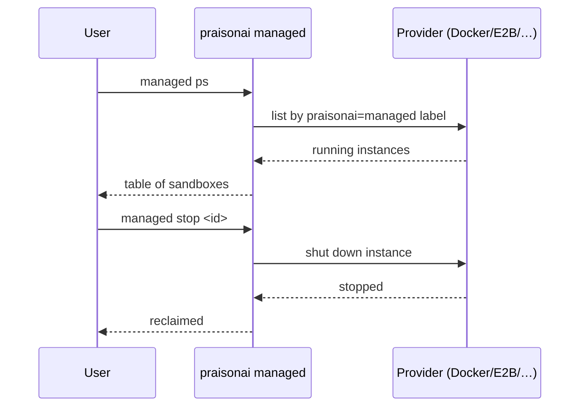

Sandboxes normally self-destruct when your run ends. A crashed script, a `SIGKILL`, or a laptop that slept before teardown can leave one behind — burning your Docker daemon, your E2B credits, or your Modal quota. Two commands find and reclaim them.


## Quick Start

<Steps>
<Step title="See what is still running">
```bash
praisonai managed ps
```

If nothing is up:

```text
No running sandboxes.
```

If something is up:

```text
INSTANCE ID                PROVIDER   STATUS     UPTIME   IMAGE
------------------------------------------------------------------------------
docker_5afaa3bfa704        docker     running    42s      python:3.12-slim

1 running. Stop with: praisonai managed stop <instance-id>
```
</Step>

<Step title="Reclaim it">
```bash
# One
praisonai managed stop docker_5afaa3bfa704

# All (across every provider)
praisonai managed stop --all

# All from one provider only
praisonai managed stop --all --provider docker
```
</Step>

<Step title="Confirm it is gone">
```bash
praisonai managed ps
# → No running sandboxes.
```
</Step>
</Steps>

---

## How It Works



Docker containers are found cross-process by the `praisonai=managed` label and the `praisonai_<id>` name, so containers started by an earlier script are visible from a fresh CLI.

---

## Behaviour change: the silent leak on shutdown

<Warning>
Before PR #4107, every `tools_run_on=` run **silently leaked its sandbox on shutdown**. The `weakref.finalize` release ran while `concurrent.futures` was already in atexit, so `run_in_executor` raised *"cannot schedule new futures after interpreter shutdown"* — and the error was **swallowed and logged as a successful release**. Docker and Fly.io have no idle reaper, so leaked containers/machines lived indefinitely.
</Warning>

Two collaborating fixes close the leak:

1. `SyncComputeProvider._offload()` falls back to inline execution when the executor is gone — it catches a `RuntimeError` whose message contains `"interpreter shutdown"` or `"no running event loop"` and calls the sync function directly (blocking is fine: there is no event loop left to starve). Unrelated `RuntimeError`s still propagate.
2. `_shutdown_orphan()` in `tools_placement.py` now logs at **warning** level (was debug), so a genuine teardown failure is visible instead of buried. `SharedCompute.shutdown()` re-raises the underlying exception after clearing `instance_id`, so the caller can log it.

If you ran an older version, reclaim any accumulated leaks with `praisonai managed ps` / `managed stop` (and `docker container prune` for stopped-but-not-removed containers).

---

## …and the `run_on=` finalizer that was never registered ([PR #4109](https://github.com/MervinPraison/PraisonAI/pull/4109))

The PR #4107 fix above only fires when a finalizer actually runs. On `ComputeManagedAgent` — the backend behind `run_on=` — **no finalizer had ever been registered**, so the release path was never invoked and the instance survived the whole process.

<Warning>
`ComputeManagedAgent` defaults to `keep_alive=True` — the instance is meant to survive *between calls*, not *between processes*. Without a finalizer, it survived the whole script:

- For `docker`, that was one container per script.
- For `e2b`, `modal`, `daytona`, `tenki`, `flyio`, that was a **billed cloud instance** whose only other reaper is the provider's idle timer.
- **Docker and Fly.io have no idle timer**, so those instances lived indefinitely.
</Warning>

Your `run_on=` instance is now reclaimed when your script exits — no code change:

```python
from praisonaiagents import Agent

agent = Agent(name="builder", instructions="You build things.", run_on="docker")
agent.start("Write a script that prints the first 10 primes, then run it")
# When the script exits, the container is reclaimed automatically.
```

Verified before/after: containers left after a `run_on=` script exits went from **1 → 0**; an ordinary run is still 42 → 42.

The mechanism is a `weakref.finalize` registered inside `_ensure()` right after `provision()` succeeds:

```python
# praisonai/integrations/compute_managed_agent.py (inside _ensure())
self._finalizer = weakref.finalize(self, _release, provider, self._instance, self._place)
```

- It runs on **garbage collection** *and* at **interpreter exit** — not one or the other.
- It deliberately does **not** close over the backend `self` — closing over `self` would keep the backend alive and prevent the very collection it waits for.

`_release(provider, instance_id, place)` is a module-level function that shuts the instance down safely on any thread:

- No running loop (`asyncio.get_running_loop()` raises) → `asyncio.run(_shutdown())`.
- A loop is already running → it bridges through `concurrent.futures.ThreadPoolExecutor(max_workers=1)` so the shutdown coroutine runs on its own loop instead of `RuntimeError`-ing. Without this bridge, GC landing inside async workflow code would raise and silently leak — the same class of bug PR #4107 fixed one layer down. This matches the pattern `SharedCompute` already uses.
- Errors are logged at **warning** and swallowed — teardown stays quiet.

<Note>
**Explicit `ashutdown()` detaches the finalizer.** An intentional teardown calls `self._finalizer.detach()` before shutting down, so the finalizer that fires shortly after never double-reclaims the same instance.
</Note>

PR #4107 made the release path survive interpreter shutdown; PR #4109 made sure the release path is actually invoked on `run_on=`. Together they close the container-leak story end to end for both `sandbox=` and `run_on=`.

---

## When a provider can't be queried

| Situation | Behaviour |
|:--|:--|
| Provider not installed / not configured (no E2B key, Docker daemon down) | Skipped silently. Absence of credentials is a normal state. |
| Explicit `--provider foo` for an unknown provider | Exits `1` with a clear message. |
| Provider is available but listing fails | Surfaced under `errors:` in `--json`, printed at the bottom of the text output, exit code `1`. `stop --all` never reports a clean sweep when some providers could not be queried. |

---

## From a script

```bash
# JSON output for scripting
praisonai managed ps --json
```

```json
{
  "sandboxes": [
    {
      "provider": "docker",
      "instance_id": "docker_5afaa3bfa704",
      "status": "running",
      "endpoint": "docker://5afaa3bfa704",
      "created_at": 1755253800.0,
      "metadata": {"image": "python:3.12-slim", "name": "praisonai_5afaa3bfa704"}
    }
  ],
  "errors": []
}
```

Exit code is `0` when the query is clean, `1` if any provider errored.

---

## Best Practices

<AccordionGroup>
<Accordion title="Run managed ps after any crash">
Any time a script that used `run_on=` (or per-agent `compute=`) crashed or you killed it, run `managed ps` before starting a new run. Costs stack quietly.
</Accordion>

<Accordion title="Wire stop --all into your exit hooks">
For long-running dev sessions, wire `praisonai managed stop --all` into your shell's exit trap or your IDE's on-close hook so nothing is left behind when you close the laptop.
</Accordion>

<Accordion title="local is not scanned — on purpose">
`managed ps` scans docker, e2b, modal, daytona, flyio, tenki. `local` runs on this machine and has nothing to reclaim.

Since [PR #4071](https://github.com/MervinPraison/PraisonAI/pull/4071), this list is **derived from the compute registry** rather than hardcoded, so a compute backend contributed by a plugin is listed and stopped automatically — no extra wiring. `local`, `subprocess`, `sandlock`, `ssh`, `native`, and `novita` are excluded on purpose. See [Bringing your own compute place](/features/placement#bringing-your-own-compute-place).
</Accordion>
</AccordionGroup>

---

## Related

<CardGroup cols={2}>
<Card title="Shared Sandbox" icon="share-nodes" href="/features/shared-sandbox">
  What `run_on=` does and how to choose a provider
</Card>
<Card title="Managed CLI" icon="terminal" href="/features/managed-cli">
  Full `praisonai managed` command reference
</Card>
</CardGroup>
