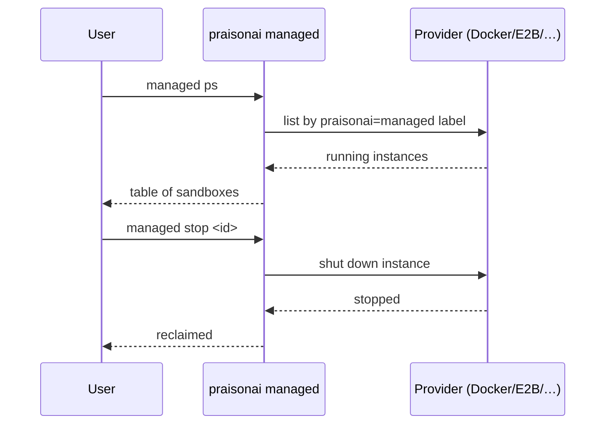

Sandboxes normally self-destruct when your run ends. A crashed script, a `SIGKILL`, or a laptop that slept before teardown can leave one behind — burning your Docker daemon, your E2B credits, or your Modal quota. Two commands find and reclaim them.


## Quick Start

<Steps>
<Step title="See what is still running">
```bash
praisonai managed ps
```

If nothing is up:

```text
No running sandboxes.
```

If something is up:

```text
INSTANCE ID                PROVIDER   STATUS     UPTIME   IMAGE
------------------------------------------------------------------------------
docker_5afaa3bfa704        docker     running    42s      python:3.12-slim

1 running. Stop with: praisonai managed stop <instance-id>
```
</Step>

<Step title="Reclaim it">
```bash
# One
praisonai managed stop docker_5afaa3bfa704

# All (across every provider)
praisonai managed stop --all

# All from one provider only
praisonai managed stop --all --provider docker
```
</Step>

<Step title="Confirm it is gone">
```bash
praisonai managed ps
# → No running sandboxes.
```
</Step>
</Steps>

---

## How It Works



Docker containers are found cross-process by the `praisonai=managed` label and the `praisonai_<id>` name, so containers started by an earlier script are visible from a fresh CLI.

---

## When a provider can't be queried

| Situation | Behaviour |
|:--|:--|
| Provider not installed / not configured (no E2B key, Docker daemon down) | Skipped silently. Absence of credentials is a normal state. |
| Explicit `--provider foo` for an unknown provider | Exits `1` with a clear message. |
| Provider is available but listing fails | Surfaced under `errors:` in `--json`, printed at the bottom of the text output, exit code `1`. `stop --all` never reports a clean sweep when some providers could not be queried. |

---

## From a script

```bash
# JSON output for scripting
praisonai managed ps --json
```

```json
{
  "sandboxes": [
    {
      "provider": "docker",
      "instance_id": "docker_5afaa3bfa704",
      "status": "running",
      "endpoint": "docker://5afaa3bfa704",
      "created_at": 1755253800.0,
      "metadata": {"image": "python:3.12-slim", "name": "praisonai_5afaa3bfa704"}
    }
  ],
  "errors": []
}
```

Exit code is `0` when the query is clean, `1` if any provider errored.

---

## Best Practices

<AccordionGroup>
<Accordion title="Run managed ps after any crash">
Any time a script that used `run_on=` (or per-agent `compute=`) crashed or you killed it, run `managed ps` before starting a new run. Costs stack quietly.
</Accordion>

<Accordion title="Wire stop --all into your exit hooks">
For long-running dev sessions, wire `praisonai managed stop --all` into your shell's exit trap or your IDE's on-close hook so nothing is left behind when you close the laptop.
</Accordion>

<Accordion title="local is not scanned — on purpose">
`managed ps` scans docker, e2b, modal, daytona, flyio, tenki. `local` runs on this machine and has nothing to reclaim.
</Accordion>
</AccordionGroup>

---

## Related

<CardGroup cols={2}>
<Card title="Shared Sandbox" icon="share-nodes" href="/features/shared-sandbox">
  What `run_on=` does and how to choose a provider
</Card>
<Card title="Managed CLI" icon="terminal" href="/features/managed-cli">
  Full `praisonai managed` command reference
</Card>
</CardGroup>
