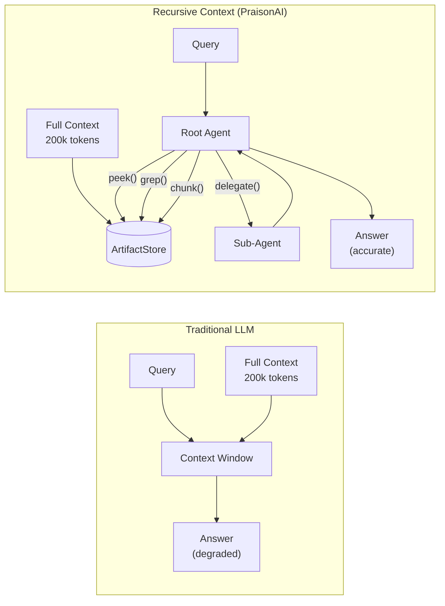
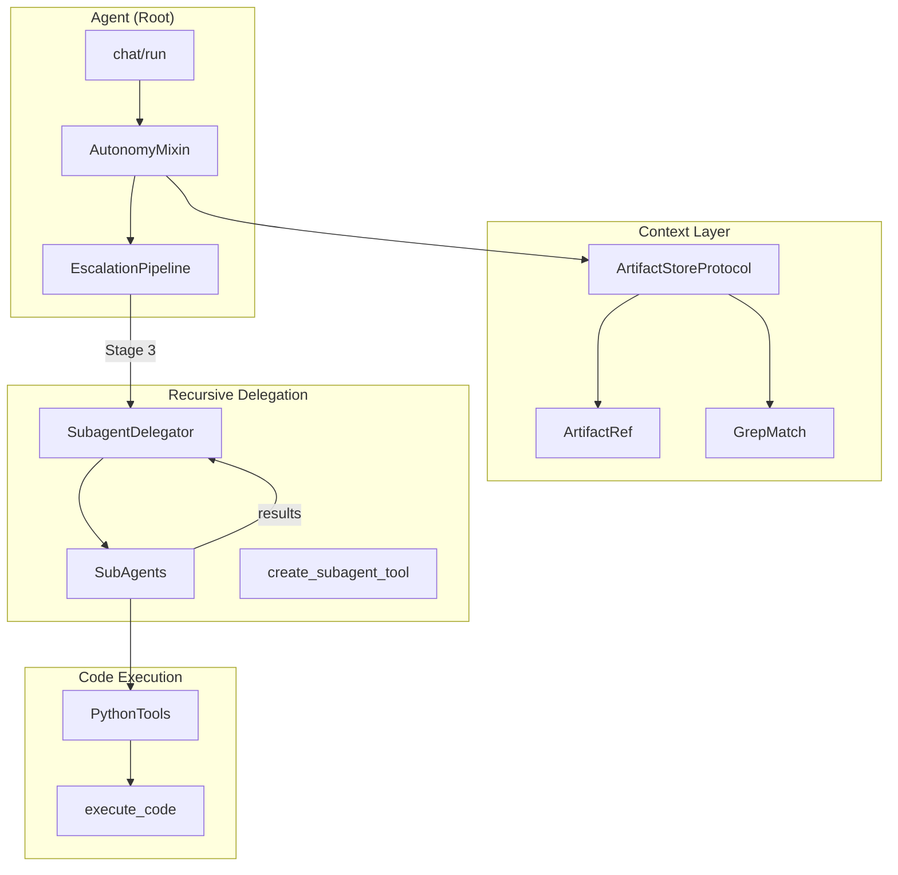
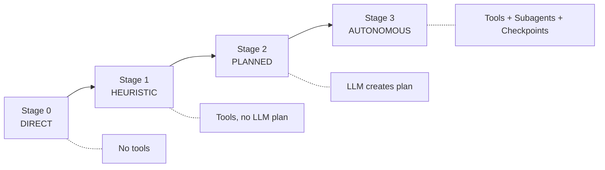

## Overview

PraisonAI implements **Recursive Context** - a pattern that solves "context rot" by treating context as programmatically explorable data instead of dumping everything into the LLM's context window.



---

## Architecture



---

## Core Components

### ArtifactStoreProtocol

Stores large outputs as external variables with programmatic access.

| Method | Purpose | Signature |
|--------|---------|-----------|
| `store()` | Save content, get reference | `(content, metadata) → ArtifactRef` |
| `load()` | Retrieve full content | `(ref) → Any` |
| `head()` | First N lines | `(ref, lines=50) → str` |
| `tail()` | Last N lines | `(ref, lines=50) → str` |
| `grep()` | Regex search | `(ref, pattern, max_matches=50) → List[GrepMatch]` |
| `chunk()` | Line range extraction | `(ref, start_line, end_line) → str` |

```python
from praisonaiagents.context.artifacts import ArtifactRef, ArtifactStoreProtocol

# ArtifactRef replaces large content in context
ref = ArtifactRef(
    path="/path/to/artifact.json",
    summary="API response with 50,000 records",
    size_bytes=1_200_000,
    mime_type="application/json",
)

# In context window: [Artifact: /path/to/artifact.json (1.2 MB) - API response...]
```

---

### SubagentDelegator

Spawns subagents with scoped permissions for recursive problem decomposition.

| Config | Default | Purpose |
|--------|---------|---------|
| `max_concurrent_subagents` | 3 | Concurrency limit |
| `max_total_subagents` | 10 | Total agents per task |
| `max_steps_per_subagent` | 50 | Step budget per subagent |
| `max_tokens_per_subagent` | 50000 | Token budget per subagent |
| `allow_nested_delegation` | False | Recursion control |

```python
from praisonaiagents.agents.delegator import SubagentDelegator

delegator = SubagentDelegator()
result = await delegator.delegate(
    agent_name="analyzer",
    objective="Count billing questions",
    context={"user_ids": [12345, 67890]}
)
```

---

### EscalationPipeline

Progressive complexity based on task signals.



---

### DoomLoopTracker

Prevents infinite loops by detecting repeated actions.

```python
# Automatic doom loop detection
agent = Agent(
    instructions="...",
    autonomy={"doom_loop_threshold": 3}  # Stop after 3 repeated actions
)
```

---

## Quick Start

```python
from praisonaiagents import Agent

# Enable recursive context handling
agent = Agent(
    instructions="You are a data analyst.",
    autonomy=True,  # Enables all RLM features
    allow_code_execution=True,  # REPL capability
)

# Runs with automatic:
# - Context windowing (artifacts for large outputs)
# - Subagent delegation (recursive problem decomposition)
# - Escalation (progressive complexity)
# - Doom loop protection
result = agent.run_autonomous("Analyze 5000 tickets and count billing issues")
```

---

## Key Functions

### Agent-Level

| Function | Purpose |
|----------|---------|
| `agent.run_autonomous(prompt)` | Full autonomous loop with escalation |
| `agent.delegate(task, profile)` | Spawn subagent for subtask |
| `agent.analyze_prompt(prompt)` | Detect complexity signals |
| `agent.get_recommended_stage(prompt)` | Get escalation stage |

### Artifact Operations

| Function | Location |
|----------|----------|
| `store(content, metadata)` | `ArtifactStoreProtocol` |
| `head(ref, lines)` | `ArtifactStoreProtocol` |
| `tail(ref, lines)` | `ArtifactStoreProtocol` |
| `grep(ref, pattern)` | `ArtifactStoreProtocol` |
| `chunk(ref, start, end)` | `ArtifactStoreProtocol` |
| `merge_adjacent_chunks(results)` | `knowledge/retrieval.py` |

### Delegation

| Function | Location |
|----------|----------|
| `delegate(agent_name, objective)` | `SubagentDelegator` |
| `delegate_parallel(tasks)` | `SubagentDelegator` |
| `create_subagent_tool(agent_factory)` | `tools/subagent_tool.py` |

---

## Configuration

### Autonomy Config

```python
agent = Agent(
    instructions="...",
    autonomy={
        "max_iterations": 30,      # Max turns before stopping
        "doom_loop_threshold": 3,  # Repeated actions limit
        "auto_escalate": True,     # Auto-increase complexity
    }
)
```

### Artifact Queueing

```python
from praisonaiagents.context.artifacts import QueueConfig

config = QueueConfig(
    enabled=True,
    inline_max_bytes=32 * 1024,  # >32KB → artifact
    redact_secrets=True,          # Auto-redact API keys
    summary_max_chars=200,
)
```

---

## Module Reference

| Module | Path | Purpose |
|--------|------|---------|
| Artifacts | `praisonaiagents/context/artifacts.py` | ArtifactRef, ArtifactStoreProtocol |
| Delegator | `praisonaiagents/agents/delegator.py` | SubagentDelegator, DelegationConfig |
| Autonomy | `praisonaiagents/agent/autonomy.py` | AutonomyMixin, DoomLoopTracker |
| Escalation | `praisonaiagents/escalation/pipeline.py` | EscalationPipeline, stages |
| Retrieval | `praisonaiagents/knowledge/retrieval.py` | merge_adjacent_chunks, RRF |
| Python Tools | `praisonaiagents/tools/python_tools.py` | execute_code (REPL) |
| Subagent Tool | `praisonaiagents/tools/subagent_tool.py` | create_subagent_tool |
