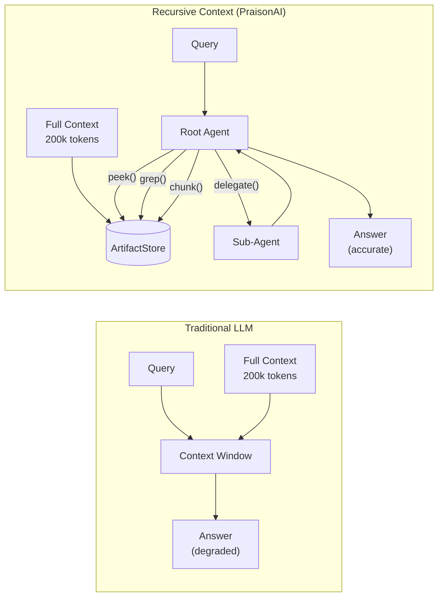
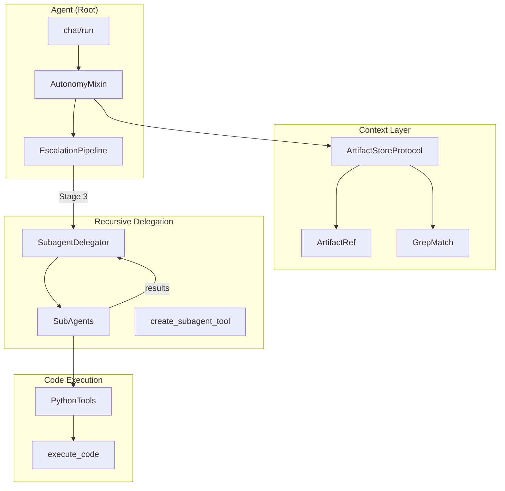
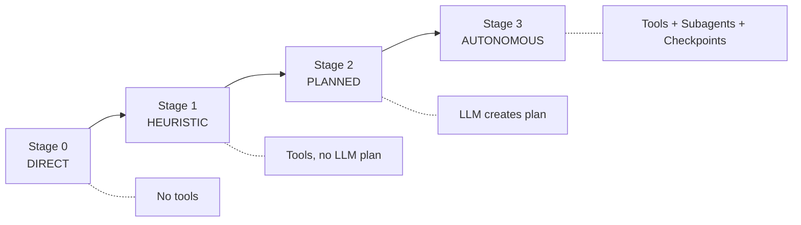

## Overview

PraisonAI implements **Recursive Context** - a pattern that solves "context rot" by treating context as programmatically explorable data instead of dumping everything into the LLM's context window.


```mermaid
flowchart LR
    subgraph Traditional["Traditional LLM"]
        Q1[Query] --> CW[Context Window]
        CTX1[Full Context<br/>200k tokens] --> CW
        CW --> A1["Answer<br/>(degraded)"]
    end
    
    subgraph RLM["Recursive Context (PraisonAI)"]
        Q2[Query] --> ROOT[Root Agent]
        CTX2[Full Context<br/>200k tokens] --> MEM[(ArtifactStore)]
        ROOT -- "peek()" --> MEM
        ROOT -- "grep()" --> MEM
        ROOT -- "chunk()" --> MEM
        ROOT -- "delegate()" --> SUB[Sub-Agent]
        SUB --> ROOT
        ROOT --> A2["Answer<br/>(accurate)"]
    end
```

---

## Architecture


```mermaid
flowchart TB
    subgraph Agent["Agent (Root)"]
        CHAT[chat/run]
        AUTO[AutonomyMixin]
        ESC[EscalationPipeline]
    end
    
    subgraph Context["Context Layer"]
        ART[ArtifactStoreProtocol]
        REF[ArtifactRef]
        GREP[GrepMatch]
    end
    
    subgraph Delegation["Recursive Delegation"]
        DEL[SubagentDelegator]
        SUB[SubAgents]
        TOOL[create_subagent_tool]
    end
    
    subgraph Execution["Code Execution"]
        PY[PythonTools]
        EXEC[execute_code]
    end
    
    CHAT --> AUTO
    AUTO --> ESC
    ESC --> |Stage 3| DEL
    DEL --> SUB
    SUB --> |results| DEL
    
    AUTO --> ART
    ART --> REF
    ART --> GREP
    
    SUB --> PY
    PY --> EXEC
```

---

## Core Components

### ArtifactStoreProtocol

Stores large outputs as external variables with programmatic access.

| Method | Purpose | Signature |
|--------|---------|-----------|
| `store()` | Save content, get reference | `(content, metadata) → ArtifactRef` |
| `load()` | Retrieve full content | `(ref) → Any` |
| `head()` | First N lines | `(ref, lines=50) → str` |
| `tail()` | Last N lines | `(ref, lines=50) → str` |
| `grep()` | Regex search | `(ref, pattern, max_matches=50) → List[GrepMatch]` |
| `chunk()` | Line range extraction | `(ref, start_line, end_line) → str` |

```python
from praisonaiagents.context.artifacts import ArtifactRef, ArtifactStoreProtocol

# ArtifactRef replaces large content in context
ref = ArtifactRef(
    path="/path/to/artifact.json",
    summary="API response with 50,000 records",
    size_bytes=1_200_000,
    mime_type="application/json",
)

# In context window: [Artifact: /path/to/artifact.json (1.2 MB) - API response...]
```

---

### SubagentDelegator

Spawns subagents with scoped permissions for recursive problem decomposition.

| Config | Default | Purpose |
|--------|---------|---------|
| `max_concurrent_subagents` | 3 | Concurrency limit |
| `max_total_subagents` | 10 | Total agents per task |
| `max_steps_per_subagent` | 50 | Step budget per subagent |
| `max_tokens_per_subagent` | 50000 | Token budget per subagent |
| `allow_nested_delegation` | False | Recursion control |

```python
from praisonaiagents.agents.delegator import SubagentDelegator

delegator = SubagentDelegator()
result = await delegator.delegate(
    agent_name="analyzer",
    objective="Count billing questions",
    context={"user_ids": [12345, 67890]}
)
```

---

### EscalationPipeline

Progressive complexity based on task signals.


```mermaid
flowchart LR
    S0["Stage 0<br/>DIRECT"] --> S1["Stage 1<br/>HEURISTIC"]
    S1 --> S2["Stage 2<br/>PLANNED"]
    S2 --> S3["Stage 3<br/>AUTONOMOUS"]
    
    S0 -.- D0["No tools"]
    S1 -.- D1["Tools, no LLM plan"]
    S2 -.- D2["LLM creates plan"]
    S3 -.- D3["Tools + Subagents + Checkpoints"]
```

---

### DoomLoopTracker

Prevents infinite loops by detecting repeated actions.

```python
# Automatic doom loop detection
agent = Agent(
    instructions="...",
    autonomy={"doom_loop_threshold": 3}  # Stop after 3 repeated actions
)
```

---

## Quick Start


<Steps>
<Step title="Quick Start">
```python
from praisonaiagents import Agent

# Enable recursive context handling
agent = Agent(
    instructions="You are a data analyst.",
    autonomy=True,  # Enables all RLM features
    execution=ExecutionConfig(code_execution=True),  # REPL capability
)

# Runs with automatic:
# - Context windowing (artifacts for large outputs)
# - Subagent delegation (recursive problem decomposition)
# - Escalation (progressive complexity)
# - Doom loop protection
result = agent.start("Analyze 5000 tickets and count billing issues")
```

---
</Step>
</Steps>


## Best Practices

<AccordionGroup>
  <Accordion title="Start simple">
    Enable the feature with a single parameter before adding configuration. Verify it works, then layer in options.
  </Accordion>
  <Accordion title="Use environment variables for secrets">
    Never hardcode API keys or tokens. Use `os.getenv("KEY_NAME")` to read from environment variables.
  </Accordion>
  <Accordion title="Test with minimal examples first">
    Copy the Quick Start example, run it, then extend it. This confirms your environment is set up correctly.
  </Accordion>
  <Accordion title="Check the logs">
    Set `verbose=True` on your agent to see detailed execution logs when debugging unexpected behavior.
  </Accordion>
</AccordionGroup>

## Related

<CardGroup cols={2}>
  <Card title="Features Overview" icon="grid-2" href="/docs/features">
    Browse all PraisonAI features
  </Card>
  <Card title="Quick Start" icon="rocket" href="/docs/introduction">
    Get started with PraisonAI agents
  </Card>
</CardGroup>
