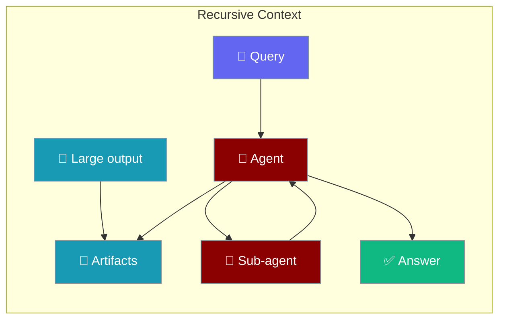
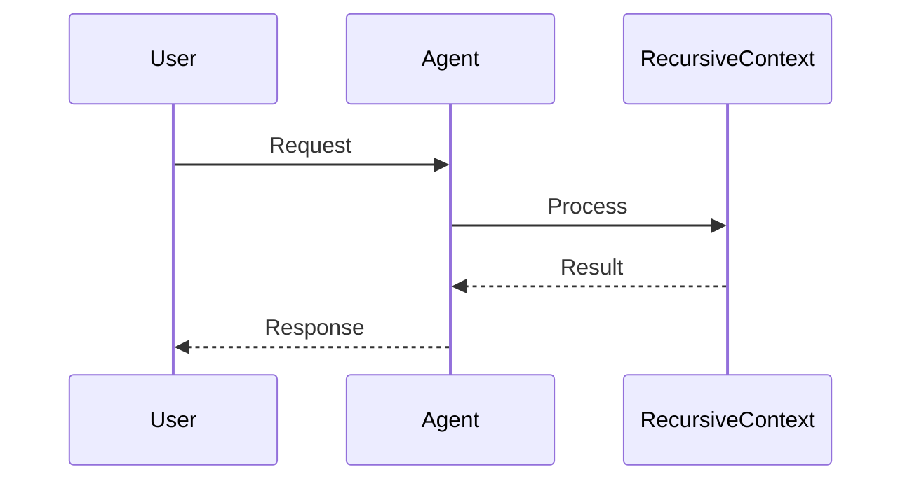
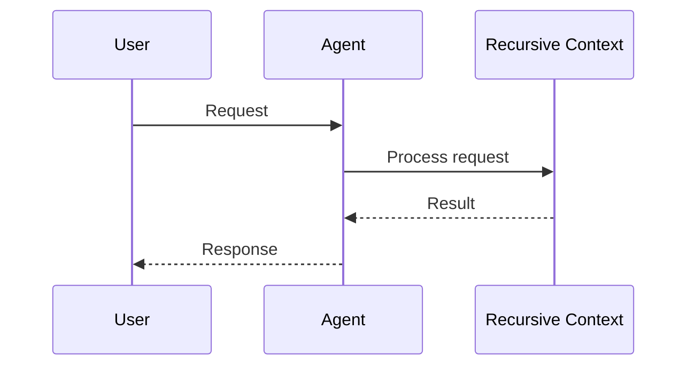
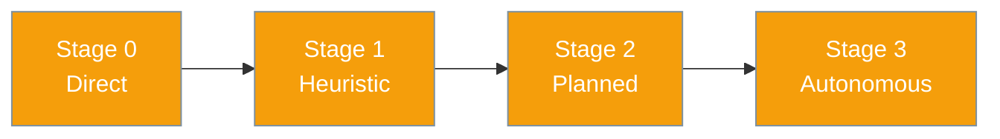

Large outputs stay outside the context window — agents explore them with artifacts, delegation, and escalation instead of stuffing everything into one prompt.

```python
from praisonaiagents import Agent, AutonomyConfig, ExecutionConfig

agent = Agent(
    instructions="You are a data analyst.",
    autonomy=AutonomyConfig(level="full_auto", max_iterations=30),
    execution=ExecutionConfig(code_execution=True),
)

agent.start("Analyse 5000 tickets and count billing issues")
```

The user requests analysis on huge data; the agent stores artifacts and delegates instead of overfilling context.



```mermaid
graph LR
    subgraph "Recursive Context"
        Query["💬 Query"] --> Agent["🤖 Agent"]
        Large["📄 Large output"] --> Store["💾 Artifacts"]
        Agent --> Store
        Agent --> Sub["👥 Sub-agent"]
        Sub --> Agent
        Agent --> Answer["✅ Answer"]
    end

    classDef input fill:#6366F1,stroke:#7C90A0,color:#fff
    classDef agent fill:#8B0000,stroke:#7C90A0,color:#fff
    classDef store fill:#189AB4,stroke:#7C90A0,color:#fff
    classDef output fill:#10B981,stroke:#7C90A0,color:#fff

    class Query input
    class Agent,Sub agent
    class Large,Store store
    class Answer output
```

## How It Works


```mermaid
sequenceDiagram
    participant User
    participant Agent
    participant RecursiveContext

    User->>Agent: Request
    Agent->>RecursiveContext: Process
    RecursiveContext-->>Agent: Result
    Agent-->>User: Response
```


## Quick Start

<Steps>
<Step title="Simple Usage">

Enable autonomy — artifacts, escalation, and doom-loop protection activate automatically:

```python
from praisonaiagents import Agent

agent = Agent(
    instructions="You are a data analyst.",
    autonomy=True,
)

agent.start("Summarise the key themes in this support inbox export")
```

</Step>

<Step title="With Configuration">

Tune iteration limits, doom-loop threshold, and code execution:

```python
from praisonaiagents import Agent, AutonomyConfig, ExecutionConfig

agent = Agent(
    instructions="You are a data analyst.",
    autonomy=AutonomyConfig(
        level="full_auto",
        max_iterations=30,
        doom_loop_threshold=3,
        auto_escalate=True,
    ),
    execution=ExecutionConfig(code_execution=True),
)

agent.start("Analyse 5000 tickets and count billing issues")
```

</Step>
</Steps>

---

## How It Works


```mermaid
sequenceDiagram
    participant User
    participant Agent
    participant Feature as Recursive Context

    User->>Agent: Request
    Agent->>Feature: Process request
    Feature-->>Agent: Result
    Agent-->>User: Response
```


Instead of loading entire documents into the LLM window, PraisonAI stores large outputs as **artifacts** and lets agents peek, grep, and chunk them on demand. When tasks grow complex, **escalation** increases capability stage-by-stage; **sub-agent delegation** handles focused subtasks with scoped budgets.


```mermaid
flowchart LR
    S0["Stage 0<br/>Direct"] --> S1["Stage 1<br/>Heuristic"]
    S1 --> S2["Stage 2<br/>Planned"]
    S2 --> S3["Stage 3<br/>Autonomous"]

    classDef stage fill:#F59E0B,stroke:#7C90A0,color:#fff
    class S0,S1,S2,S3 stage
```

| Component | Role |
|-----------|------|
| **Artifact store** | Holds large outputs; agents query with `head`, `grep`, `chunk` |
| **Escalation pipeline** | Progresses from direct answer → tools → plan → sub-agents |
| **Sub-agent delegator** | Spawns focused agents with token and step budgets |
| **Doom loop tracker** | Stops repeated identical actions |

---

## Configuration Options

### AutonomyConfig

| Option | Type | Default | Description |
|--------|------|---------|-------------|
| `level` | `str` | `"suggest"` | Autonomy level (`suggest`, `auto_edit`, `full_auto`) |
| `max_iterations` | `int` | `20` | Maximum turns before stopping |
| `doom_loop_threshold` | `int` | `3` | Repeated actions before doom-loop stop |
| `auto_escalate` | `bool` | `True` | Automatically increase complexity stage |
| `mode` | `str` | auto | `caller` or `iterative` execution mode |

### Artifact queueing

Large tool outputs above `inline_max_bytes` (default 32 KB) are stored as artifacts automatically when queueing is enabled on the agent's tool configuration.

---

## Common Patterns

### Explore a large artifact

Agents with autonomy enabled can inspect stored outputs without loading the full content:

```python
from praisonaiagents import Agent, AutonomyConfig

agent = Agent(
    instructions="Search large logs for error patterns.",
    autonomy=AutonomyConfig(level="full_auto"),
)

agent.start("Find all timeout errors in the latest deployment log")
```

### Delegate a subtask

```python
from praisonaiagents import Agent, AutonomyConfig

agent = Agent(
    instructions="Coordinate analysis across data sources.",
    autonomy=AutonomyConfig(level="full_auto"),
)

# Delegation runs inside the autonomy loop when escalation reaches Stage 3
agent.start("Count billing questions per region in the ticket export")
```

---

## Best Practices

<AccordionGroup>
  <Accordion title="Enable autonomy for large or multi-step tasks">
    Set `autonomy=True` or `AutonomyConfig(level="full_auto")` when inputs exceed a few pages or require tool loops. Simple one-shot questions do not need it.
  </Accordion>
  <Accordion title="Set doom_loop_threshold for long runs">
    Keep `doom_loop_threshold` at 3–5 so agents stop when repeating the same tool call instead of burning tokens indefinitely.
  </Accordion>
  <Accordion title="Use full_auto for repository-scale work">
    `level="full_auto"` enables iterative mode, filesystem tracking, and sub-agent delegation — appropriate for code and data analysis over large corpora.
  </Accordion>
  <Accordion title="Combine with code execution for structured data">
    Pair `ExecutionConfig(code_execution=True)` with autonomy so agents can run Python over artifact contents rather than reasoning over raw text alone.
  </Accordion>
</AccordionGroup>

---

## Related

<CardGroup cols={2}>
  <Card title="Autonomous Loops" icon="rotate" href="/docs/features/autonomy-loop">
    Run agents in iterative loops with completion signals and escalation
  </Card>
  <Card title="Context Compaction" icon="compress" href="/docs/features/context-compaction">
    Automatically trim context when the window fills up
  </Card>
</CardGroup>
