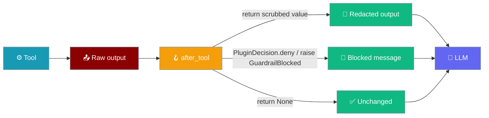
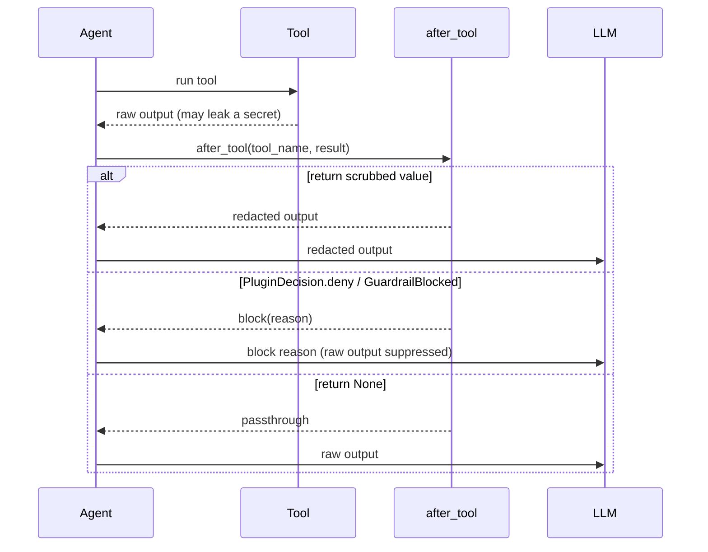

Plugins rewrite or block what a tool returns before the model ever sees it — so a leaked API key from a `fetch` tool or a PII field from a database lookup is scrubbed at the plugin layer, without changing the tool.



## Quick Start

<Steps>
<Step title="Redact secrets">

Create `~/.praisonai/plugins/redact_secrets.py`:

```python
"""
Plugin Name: Redact Secrets
Description: Scrub API keys from any tool output
Version: 1.0.0
"""

import re
from praisonaiagents.plugins import Plugin, PluginInfo, PluginHook

class RedactSecrets(Plugin):
    @property
    def info(self):
        return PluginInfo(name="redact_secrets", hooks=[PluginHook.AFTER_TOOL])

    def after_tool(self, tool_name, result):
        return re.sub(r"sk-[A-Za-z0-9]{16,}", "[REDACTED]", str(result))
```

Load it and run any agent — the plugin fires on every tool call:

```python
from praisonaiagents import Agent, discover_and_load_plugins

discover_and_load_plugins()

agent = Agent(
    name="Assistant",
    instructions="Help the user",
    tools=["fetch"],
)
agent.start("Fetch https://api.example.com/whoami")
```

The model receives `token=[REDACTED] ok` instead of `token=sk-SECRET1234567890 ok`.
</Step>

<Step title="Block on secret">

Create `~/.praisonai/plugins/block_on_secret.py`:

```python
"""
Plugin Name: Block On Secret
Description: Suppress any tool output that leaks a secret
Version: 1.0.0
"""

from praisonaiagents.plugins import Plugin, PluginInfo, PluginHook, PluginDecision

class BlockOnSecret(Plugin):
    @property
    def info(self):
        return PluginInfo(name="block_on_secret", hooks=[PluginHook.AFTER_TOOL])

    def after_tool(self, tool_name, result):
        if "sk-" in str(result):
            return PluginDecision.deny("Secret detected in tool output")
        return None  # passthrough
```

The tool still runs, but the model is told the output was blocked and never sees the leaked value.
</Step>
</Steps>

---

## How It Works

The `after_tool` hook fires once the tool returns, before the result reaches the model — on both `chat()` and `achat()`.



| Return from `after_tool` | Effect |
|--------------------------|--------|
| `None` | No-op — the original output flows to the model unchanged |
| a value (any type) | **Rewrites** the tool output — the model sees the returned value |
| `PluginDecision.deny("reason")` / `HookResult.block("reason")` | **Blocks** — the model is told the tool was blocked; raw output is suppressed |
| `raise GuardrailBlocked("reason")` | Same as `deny`, via the exception form used by `before_*` guardrails |

---

## Common Patterns

### Regex secret scrubbing

Replace anything matching a secret pattern before it reaches the model.

```python
import re
from praisonaiagents.plugins import Plugin, PluginInfo, PluginHook

PATTERNS = [
    r"sk-[A-Za-z0-9]{16,}",           # OpenAI-style keys
    r"ghp_[A-Za-z0-9]{36}",           # GitHub tokens
    r"\b\d{3}-\d{2}-\d{4}\b",         # US SSN
]

class ScrubSecrets(Plugin):
    @property
    def info(self):
        return PluginInfo(name="scrub_secrets", hooks=[PluginHook.AFTER_TOOL])

    def after_tool(self, tool_name, result):
        text = str(result)
        for pattern in PATTERNS:
            text = re.sub(pattern, "[REDACTED]", text)
        return text
```

### Allowlist-only fields

Return only the fields you trust from a structured tool result.

```python
from praisonaiagents.plugins import Plugin, PluginInfo, PluginHook

ALLOWED = {"id", "name", "status"}

class AllowlistFields(Plugin):
    @property
    def info(self):
        return PluginInfo(name="allowlist_fields", hooks=[PluginHook.AFTER_TOOL])

    def after_tool(self, tool_name, result):
        if isinstance(result, dict):
            return {k: v for k, v in result.items() if k in ALLOWED}
        return None
```

### Block with the exception form

Raise `GuardrailBlocked` from deep inside a validator that already raises.

```python
from praisonaiagents.plugins import Plugin, PluginInfo, PluginHook, GuardrailBlocked

class BlockPII(Plugin):
    @property
    def info(self):
        return PluginInfo(name="block_pii", hooks=[PluginHook.AFTER_TOOL])

    def after_tool(self, tool_name, result):
        if "ssn=" in str(result):
            raise GuardrailBlocked("PII detected in tool output")
        return None
```

### Tool-name filtering

Scope the scrub to one tool and skip the rest — the cheapest possible passthrough.

```python
from praisonaiagents.plugins import Plugin, PluginInfo, PluginHook

class RedactFetchOnly(Plugin):
    @property
    def info(self):
        return PluginInfo(name="redact_fetch_only", hooks=[PluginHook.AFTER_TOOL])

    def after_tool(self, tool_name, result):
        if tool_name != "fetch":
            return None
        return str(result).replace("sk-SECRET1234567890", "[REDACTED]")
```

---

## Best Practices

<AccordionGroup>
<Accordion title="Keep it fast">
`after_tool` runs on every tool call. Use compiled regexes and cheap string checks — no network calls or heavy parsing on the hot path.
</Accordion>
<Accordion title="Return None for passthrough">
Return `None` (not the unchanged value) when there is nothing to scrub. It signals a no-op clearly and skips the write-back.
</Accordion>
<Accordion title="Prefer block over an empty string">
When a result is unsafe to show at all, `PluginDecision.deny("reason")` tells the model why. Returning `""` hides the reason and can confuse the model into retrying.
</Accordion>
<Accordion title="Plugin vs hook">
Use a `Plugin` subclass for a reusable, distributable scrub. Reach for a function-style [HookRegistry](/features/hooks) hook when the rule is one-off and lives next to the agent.
</Accordion>
</AccordionGroup>

---

## Related

<CardGroup cols={2}>
  <Card title="Plugins" icon="puzzle-piece" href="/features/plugins">
    Full plugin bridge and lifecycle reference
  </Card>
  <Card title="Hooks" icon="webhook" href="/features/hooks">
    Function-style hooks and HookRegistry
  </Card>
  <Card title="Hook Events" icon="webhook" href="/features/hook-events">
    Complete AFTER_TOOL event reference
  </Card>
  <Card title="Inbound Message Gate" icon="shield-check" href="/features/inbound-message-gate">
    Sibling gate on inbound messages
  </Card>
</CardGroup>
