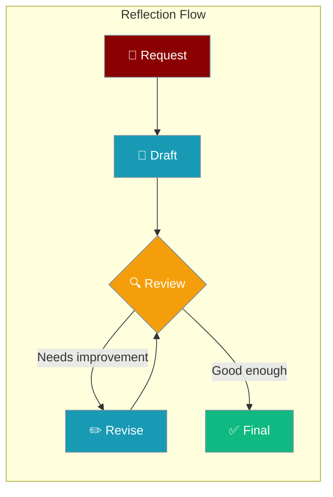
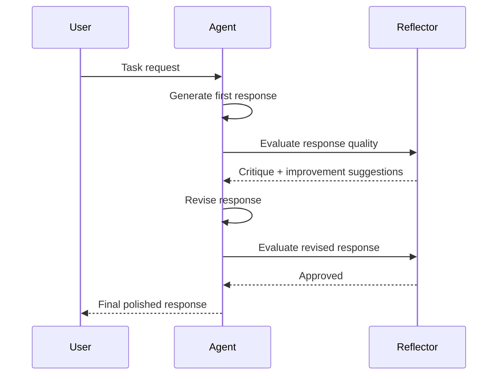
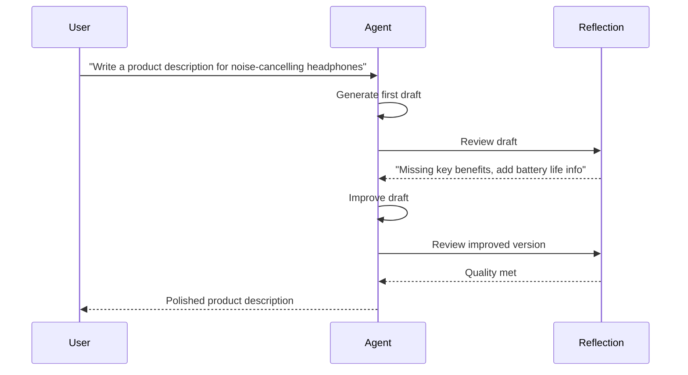

Reflection lets an agent critique and refine its own response multiple times until it meets quality criteria.



## Quick Start

<Steps>
<Step title="Enable Reflection">
Add `reflection=True` to activate self-reflection with safe defaults:

```python
from praisonaiagents import Agent

agent = Agent(
    name="Writing Agent",
    instructions="Write high-quality content on the given topic",
    reflection=True
)

agent.start("Write a blog post about the future of AI")
```
</Step>

<Step title="With Configuration">
Control iteration limits and use a custom reflection prompt:

```python
from praisonaiagents import Agent, ReflectionConfig

agent = Agent(
    name="Writing Agent",
    instructions="Write high-quality content on the given topic",
    reflection=ReflectionConfig(
        min_iterations=1,
        max_iterations=3,
        llm="gpt-4o",
        prompt="Evaluate this response for clarity, accuracy, and completeness. Improve if needed.",
    )
)

agent.start("Explain quantum entanglement simply")
```
</Step>

<Step title="Multi-Agent with Reflection">
Combine reflection with multi-agent workflows:

```python
from praisonaiagents import Agent, Task, PraisonAIAgents

writer = Agent(
    name="Writer",
    instructions="Write a detailed technical article",
    reflection=ReflectionConfig(max_iterations=2)
)

reviewer = Agent(
    name="Reviewer",
    instructions="Review the article and provide feedback"
)

task = Task(
    description="Write an article about machine learning",
    agent=writer
)

agents = PraisonAIAgents(agents=[writer, reviewer], tasks=[task])
agents.start()
```
</Step>
</Steps>

---

## How It Works



| Stage | What happens |
|-------|-------------|
| **Draft** | Agent generates an initial response |
| **Review** | Reflection LLM critiques the draft |
| **Revise** | Agent incorporates feedback and improves |
| **Approve** | Process stops when quality threshold met or `max_iterations` reached |

---

## User Interaction Flow



---

## Configuration Options

| Option | Type | Default | Description |
|--------|------|---------|-------------|
| `min_iterations` | `int` | `1` | Minimum number of reflection cycles |
| `max_iterations` | `int` | `3` | Maximum reflection cycles before stopping |
| `llm` | `str` | `None` | LLM model for reflection (defaults to agent's model) |
| `prompt` | `str` | `None` | Custom reflection prompt for quality evaluation |

### Precedence Ladder

```python
# Level 1: Bool (simplest)
agent = Agent(reflection=True)

# Level 2: Config class
agent = Agent(reflection=ReflectionConfig(max_iterations=5, llm="gpt-4o"))
```

---

## Common Patterns

### Custom Quality Prompt

```python
from praisonaiagents import Agent, ReflectionConfig

agent = Agent(
    name="Code Reviewer",
    instructions="Write clean, well-documented Python code",
    reflection=ReflectionConfig(
        prompt="Check: Is this code readable? Are edge cases handled? Add docstrings if missing.",
        max_iterations=2,
    )
)

agent.start("Write a function to parse CSV files")
```

### Strict Reflection Mode

```python
from praisonaiagents import Agent, ReflectionConfig

agent = Agent(
    name="Legal Analyst",
    instructions="Provide accurate legal analysis",
    reflection=ReflectionConfig(
        min_iterations=2,
        max_iterations=5,
        llm="gpt-4o",
    )
)

agent.start("Summarise the key risks in this contract clause")
```

### Single-Pass Review

```python
from praisonaiagents import Agent, ReflectionConfig

agent = Agent(
    name="Translator",
    instructions="Translate text accurately",
    reflection=ReflectionConfig(
        min_iterations=1,
        max_iterations=1,
        prompt="Check the translation for accuracy and natural phrasing.",
    )
)

agent.start("Translate this paragraph to Spanish")
```

---

## Best Practices

<AccordionGroup>
<Accordion title="Set realistic iteration limits">
More iterations improve quality but increase latency and cost. For most tasks, `max_iterations=2` or `3` is a good balance.

```python
# Balanced quality vs speed
agent = Agent(reflection=ReflectionConfig(max_iterations=2))

# Maximum quality (use sparingly)
agent = Agent(reflection=ReflectionConfig(max_iterations=5))
```
</Accordion>

<Accordion title="Use a dedicated reflection model">
For cost savings, use a smaller model for reflection and a larger one for generation.

```python
agent = Agent(
    llm="gpt-4o",  # Main generation model
    reflection=ReflectionConfig(llm="gpt-4o-mini")  # Cheaper reflection model
)
```
</Accordion>

<Accordion title="Write specific reflection prompts">
Vague prompts lead to vague improvements. Be specific about what quality means for your use case.

```python
# Specific — better results
prompt="Check: Is every claim cited? Is the tone professional? Are there grammatical errors?"

# Vague — less useful
prompt="Improve the response"
```
</Accordion>

<Accordion title="Combine reflection with planning for complex tasks">
Use both `planning=True` and `reflection=True` for tasks that require both strategic thinking and quality output.

```python
agent = Agent(
    planning=True,
    reflection=ReflectionConfig(max_iterations=2),
    instructions="Write a comprehensive research report"
)
```
</Accordion>
</AccordionGroup>

---

## Related

<CardGroup cols={2}>
<Card title="Planning" icon="list-check" href="/docs/features/planning">
  Break tasks into steps before executing
</Card>
<Card title="Guardrails" icon="shield-halved" href="/docs/features/guardrails">
  Validate output against custom criteria
</Card>
<Card title="Self-Reflection" icon="brain" href="/docs/features/selfreflection">
  Async self-reflection pattern
</Card>
<Card title="Autonomy" icon="robot" href="/docs/features/autonomy">
  Full autonomous agent operation
</Card>
</CardGroup>
