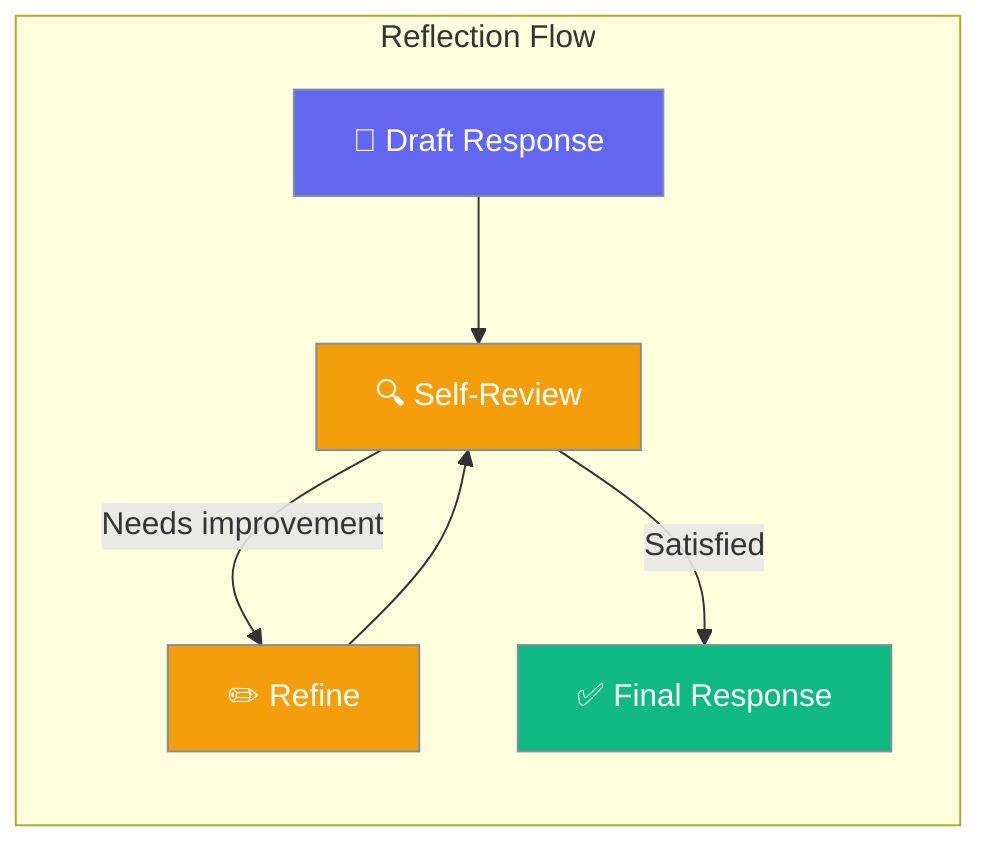
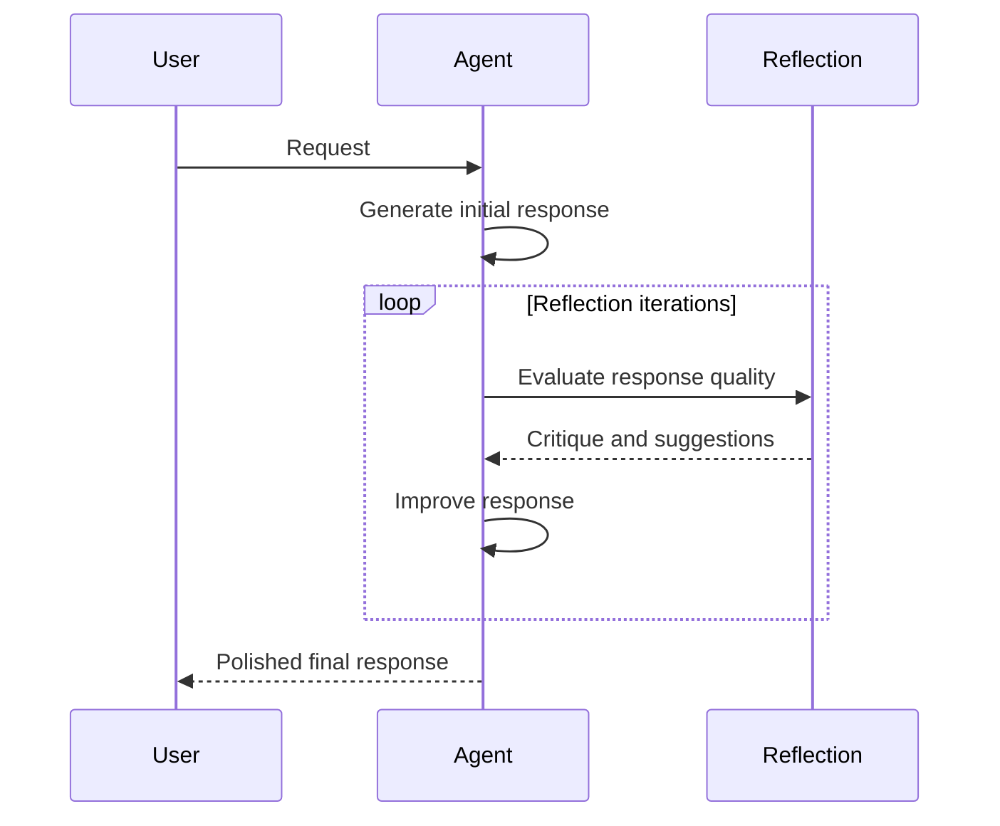

Reflection makes agents review and refine their own answers, catching mistakes and improving quality automatically.

```python
from praisonaiagents import Agent

agent = Agent(
    name="Assistant",
    instructions="You are a precise technical writer.",
    reflection=True,
)

agent.start("Explain how TCP/IP handshakes work.")
```

The user asks a question; the agent drafts, self-reviews, and refines before returning the final answer.




## Quick Start

<Steps>
<Step title="Simple Usage">
```python
from praisonaiagents import Agent

agent = Agent(instructions="You are a technical writer.", reflection=True)
agent.start("Write clear documentation for a REST API authentication flow.")
```
</Step>

<Step title="With Configuration">
```python
from praisonaiagents import Agent, ReflectionConfig

agent = Agent(
    instructions="You are a technical writer.",
    reflection=ReflectionConfig(
        min_iterations=1,
        max_iterations=3,
        llm="gpt-4o",
    ),
)
agent.start("Write a detailed security review of OAuth 2.0.")
```
</Step>

<Step title="Custom Reflection Prompt">
```python
from praisonaiagents import Agent, ReflectionConfig

agent = Agent(
    instructions="You are a code reviewer.",
    reflection=ReflectionConfig(
        max_iterations=2,
        prompt="Evaluate your response for: accuracy, completeness, and clarity. Improve if needed.",
    ),
)
agent.start("Review this Python function for bugs and performance issues.")
```
</Step>
</Steps>

---

## How It Works



| Phase | What happens |
|---|---|
| 1. Draft | Agent generates initial response |
| 2. Evaluate | Reflection checks quality against criteria |
| 3. Improve | Agent rewrites based on self-critique |
| 4. Deliver | Final polished response returned to user |

---

## Configuration Options

<Card icon="code" href="/docs/sdk/reference/python/ReflectionConfig">
  Full list of options, types, and defaults — `ReflectionConfig`
</Card>

| Option | Type | Default | Description |
|---|---|---|---|
| `min_iterations` | `int` | `1` | Minimum reflection passes (always runs at least once) |
| `max_iterations` | `int` | `3` | Maximum reflection passes |
| `llm` | `str \| None` | `None` | LLM for reflection (defaults to agent's LLM) |
| `prompt` | `str \| None` | `None` | Custom reflection evaluation prompt |

---

## Common Patterns

### Pattern 1 — Quality-focused writing
```python
from praisonaiagents import Agent, ReflectionConfig

agent = Agent(
    instructions="You are a professional copywriter.",
    reflection=ReflectionConfig(min_iterations=2, max_iterations=3),
)
response = agent.start("Write an engaging product description for a smart home speaker.")
print(response)
```

### Pattern 2 — Factual accuracy check
```python
from praisonaiagents import Agent, ReflectionConfig

agent = Agent(
    instructions="You are a fact-checking assistant.",
    reflection=ReflectionConfig(
        max_iterations=2,
        prompt="Check for factual inaccuracies, missing context, or ambiguous statements.",
    ),
)
agent.start("Summarize the key events of the Apollo 11 mission.")
```

---

## Best Practices

<AccordionGroup>
<Accordion title="When to use reflection">
Enable reflection for writing tasks, technical explanations, and any output where quality matters more than speed. Skip it for simple lookups, calculations, or real-time applications.
</Accordion>

<Accordion title="Set max_iterations to control cost">
Each reflection pass costs an additional LLM call. Set `max_iterations=1` for light review, `2` for thorough review, and only go to `3` for high-stakes content. The default is 3.
</Accordion>

<Accordion title="Use a custom prompt for domain-specific review">
Default reflection uses general quality criteria. Pass a `prompt` tailored to your domain — e.g., "Check for HIPAA compliance language" for medical agents or "Verify all code is PEP 8 compliant" for coding agents.
</Accordion>
</AccordionGroup>

---

## Related

<CardGroup cols={2}>
<Card icon="list-check" href="/docs/features/planning">
  Planning — plan before acting on complex requests
</Card>
<Card icon="rotate" href="/docs/features/selfreflection">
  Self-Reflection Deep Dive — advanced reflection patterns
</Card>
</CardGroup>
