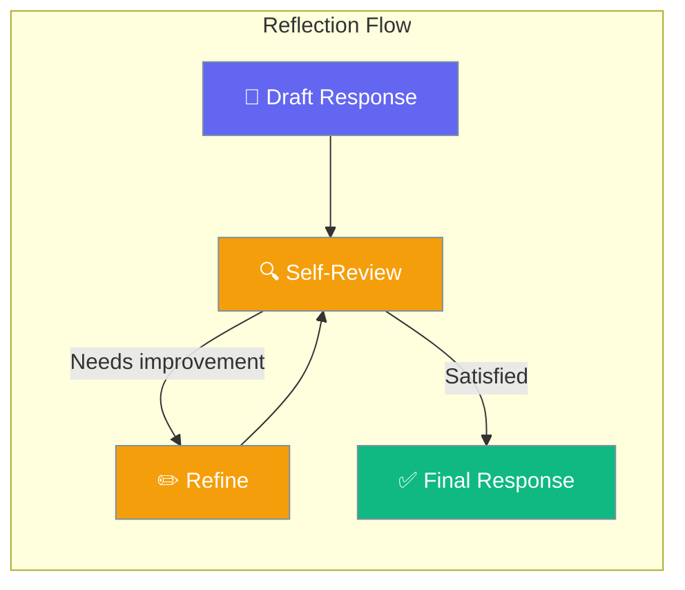
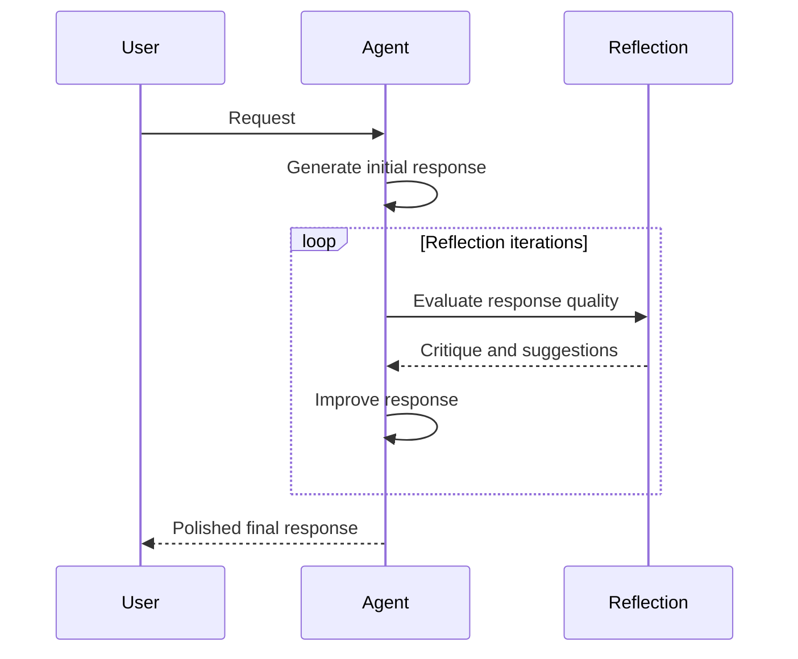

Reflection makes agents review and refine their own answers, catching mistakes and improving quality automatically.

```python
from praisonaiagents import Agent

agent = Agent(
    name="Assistant",
    instructions="You are a precise technical writer.",
    reflection=True,
)

agent.start("Explain how TCP/IP handshakes work.")
```

The user asks a question; the agent drafts, self-reviews, and refines before returning the final answer.

<Note>
`AgentTeam(reflection=…)` is not wired yet (PraisonAI [#4004](https://github.com/MervinPraison/PraisonAI/pull/4004)) — set `reflection=…` on each `Agent(...)` in the team instead.
</Note>


```mermaid
graph LR
    subgraph "Reflection Flow"
        Draft[📝 Draft Response] --> Review[🔍 Self-Review]
        Review -->|Needs improvement| Refine[✏️ Refine]
        Refine --> Review
        Review -->|Satisfied| Output[✅ Final Response]
    end

    classDef input fill:#6366F1,stroke:#7C90A0,color:#fff
    classDef process fill:#F59E0B,stroke:#7C90A0,color:#fff
    classDef output fill:#10B981,stroke:#7C90A0,color:#fff

    class Draft input
    class Review,Refine process
    class Output output
```

## Quick Start

<Steps>
<Step title="Level 1 — Bool (simplest)">

Turn on self-review with a single flag.

```python
from praisonaiagents import Agent

agent = Agent(
    name="Writer",
    instructions="You are a technical writer.",
    reflection=True,
)
agent.start("Write clear documentation for a REST API authentication flow.")
```
</Step>

<Step title="Level 2 — Config class (tune iterations and LLM)">

Use `ReflectionConfig` to control how many review passes run and which LLM critiques.

```python
from praisonaiagents import Agent, ReflectionConfig

agent = Agent(
    name="Writer",
    instructions="You are a technical writer.",
    reflection=ReflectionConfig(
        min_iterations=1,
        max_iterations=3,
        llm="gpt-4o",
    ),
)
agent.start("Write a detailed security review of OAuth 2.0.")
```
</Step>

<Step title="Level 3 — Config with a custom review prompt">

Pass a domain-specific `prompt` to steer what the self-review checks for.

```python
from praisonaiagents import Agent, ReflectionConfig

agent = Agent(
    name="Reviewer",
    instructions="You are a code reviewer.",
    reflection=ReflectionConfig(
        max_iterations=2,
        prompt="Evaluate your response for: accuracy, completeness, and clarity. Improve if needed.",
    ),
)
agent.start("Review this Python function for bugs and performance issues.")
```
</Step>
</Steps>

---

## How It Works


```mermaid
sequenceDiagram
    participant User
    participant Agent
    participant Reflection

    User->>Agent: Request
    Agent->>Agent: Generate initial response
    loop Reflection iterations
        Agent->>Reflection: Evaluate response quality
        Reflection-->>Agent: Critique and suggestions
        Agent->>Agent: Improve response
    end
    Agent-->>User: Polished final response
```

| Phase | What happens |
|---|---|
| 1. Draft | Agent generates initial response |
| 2. Evaluate | Reflection checks quality against criteria |
| 3. Improve | Agent rewrites based on self-critique |
| 4. Deliver | Final polished response returned to user |

If a reflection response cannot be parsed (for example, an OpenAI structured-output refusal, a content-filter block, or a truncation), the agent retries that pass. Retries are bounded by `max_iterations` — after that many failed passes, the agent returns the current draft un-reflected instead of continuing to retry.

---

## Troubleshooting

Persistent parse failures terminate cleanly at `max_iterations` instead of looping forever.

<Note>
When the reflection LLM keeps returning an unparseable response (a structured-output refusal, a content-filter block, or a `finish_reason="length"` truncation), the agent stops after `max_iterations` failed passes and returns the current draft un-reflected.

With `verbose=True`, look for this log line on the terminating pass:

`Maximum reflection count reached after repeated parse errors, returning current response`

If you see it often:
- Lower `max_iterations` to fail fast.
- Switch the reflection LLM with `ReflectionConfig(llm=...)` to one less prone to refusals.
- Narrow the `prompt` so the reflection response fits the required JSON shape.

If a guardrail is configured and its validation raises on that draft, `chat()` returns `None` and the chat history is rolled back to the pre-turn state.
</Note>

### What you see if reflection cannot parse

<Steps>
<Step title="Call the agent">
You call `agent.chat("...")` on an agent with `reflection=True`.
</Step>
<Step title="Draft and critique">
The agent generates a draft, then asks its reflection LLM to critique it.
</Step>
<Step title="Reflection cannot parse">
The reflection LLM returns a structured-output refusal (or the response is filtered / truncated), so parsing raises.
</Step>
<Step title="Retry, bounded">
The agent logs `Error in parsing self-reflection json ... Retrying` and tries again — up to `max_iterations` times.
</Step>
<Step title="Terminate and return">
After `max_iterations` failed passes, the agent logs `Maximum reflection count reached after repeated parse errors, returning current response` and returns the current draft. If a guardrail rejects that draft, `chat()` returns `None` and the chat history is rolled back.
</Step>
</Steps>

---

## Configuration Options

<Card icon="code" href="/sdk/reference/praisonaiagents/modules/feature_configs">
  Full list of options, types, and defaults — `ReflectionConfig`
</Card>

| Option | Type | Default | Description |
|---|---|---|---|
| `min_iterations` | `int` | `1` | Minimum reflection passes (always runs at least once) |
| `max_iterations` | `int` | `3` | Maximum reflection passes |
| `llm` | `str \| None` | `None` | LLM for reflection (defaults to agent's LLM) |
| `prompt` | `str \| None` | `None` | Custom reflection evaluation prompt |

---

## Common Patterns

### Pattern 1 — Quality-focused writing
```python
from praisonaiagents import Agent, ReflectionConfig

agent = Agent(
    instructions="You are a professional copywriter.",
    reflection=ReflectionConfig(min_iterations=2, max_iterations=3),
)
response = agent.start("Write an engaging product description for a smart home speaker.")
print(response)
```

### Pattern 2 — Factual accuracy check
```python
from praisonaiagents import Agent, ReflectionConfig

agent = Agent(
    instructions="You are a fact-checking assistant.",
    reflection=ReflectionConfig(
        max_iterations=2,
        prompt="Check for factual inaccuracies, missing context, or ambiguous statements.",
    ),
)
agent.start("Summarize the key events of the Apollo 11 mission.")
```

---

## Best Practices

<AccordionGroup>
<Accordion title="When to use reflection">
Enable reflection for writing tasks, technical explanations, and any output where quality matters more than speed. Skip it for simple lookups, calculations, or real-time applications.
</Accordion>

<Accordion title="Set max_iterations to control cost">
Each reflection pass costs an additional LLM call. Set `max_iterations=1` for light review, `2` for thorough review, and only go to `3` for high-stakes content. The default is 3. `max_iterations` also bounds parse-error retries — not just "not-yet-good-enough" passes — so a reflection LLM that keeps refusing can't loop forever.
</Accordion>

<Accordion title="Use a custom prompt for domain-specific review">
Default reflection uses general quality criteria. Pass a `prompt` tailored to your domain — e.g., "Check for HIPAA compliance language" for medical agents or "Verify all code is PEP 8 compliant" for coding agents.
</Accordion>
</AccordionGroup>

---

## Related

<CardGroup cols={2}>
<Card icon="list-check" href="/features/planning">
  Planning — plan before acting on complex requests
</Card>
<Card icon="rotate" href="/features/selfreflection">
  Self-Reflection Deep Dive — advanced reflection patterns
</Card>
</CardGroup>
