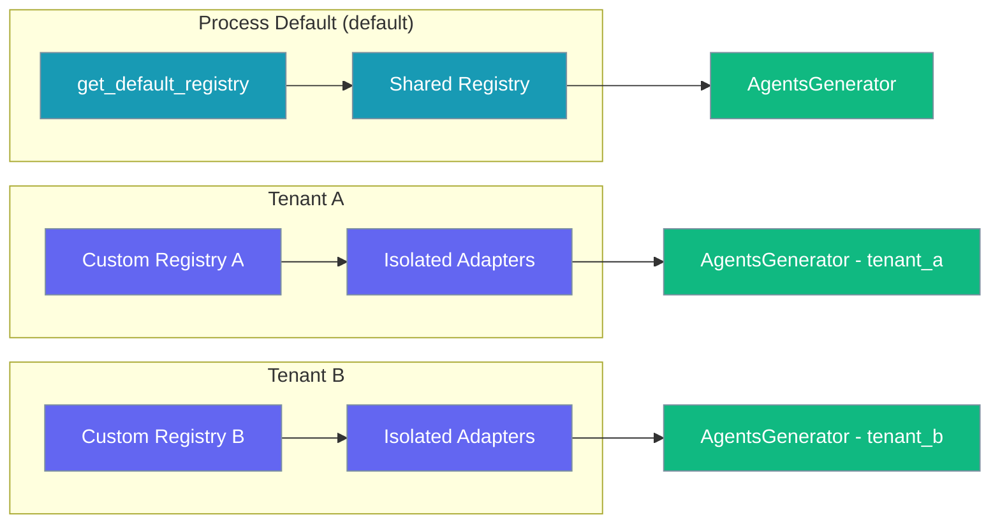
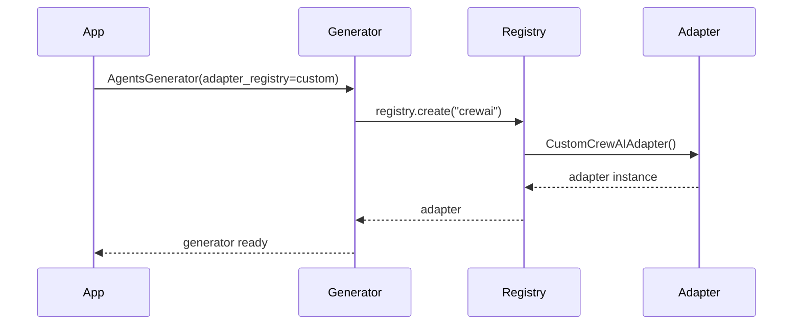

Registry dependency injection enables custom plugin registries for multi-tenant isolation, testing, and per-run overrides.



## Quick Start

<Steps>
<Step title="Default Registry (Simple)">

Use the process-default registry for normal applications:

```python
from praisonai.agents_generator import AgentsGenerator

# adapter_registry=None → uses get_default_registry()
generator = AgentsGenerator("agents.yaml", "crewai", config_list=[...])
```

</Step>

<Step title="Custom Registry (Isolation)">

Inject a custom registry for tenant isolation or testing:

```python
from praisonai.framework_adapters.registry import FrameworkAdapterRegistry
from praisonai.agents_generator import AgentsGenerator

tenant_registry = FrameworkAdapterRegistry()  # fresh, isolated
tenant_registry.register("crewai", CustomCrewAIAdapter)

generator = AgentsGenerator(
    agent_file="agents.yaml",
    framework="crewai",
    config_list=[...],
    adapter_registry=tenant_registry,  # <-- new in #1639
)
```

</Step>
</Steps>

---

## How It Works



The registry pattern supports multiple configuration levels across all four registries:

| Registry | Module | Default Factory | Backward-compat |
|----------|--------|-----------------|-----------------|
| Framework adapters | `praisonai.framework_adapters.registry` | `get_default_registry()` | `FrameworkAdapterRegistry()` directly constructible |
| External CLI integrations | `praisonai.integrations.registry` | `get_default_registry()` | `get_registry()` still exported |
| Bot platforms | `praisonai.bots._registry` | `get_default_bot_registry()` | `register_platform()`, `list_platforms()`, etc. |
| Generic base (advanced) | `praisonai._registry` | n/a | `PluginRegistry[T]` for plugin authors |

---

## Configuration Examples

### Inject Registry into AgentsGenerator

```python
from praisonai.framework_adapters.registry import FrameworkAdapterRegistry
from praisonai.agents_generator import AgentsGenerator

tenant_registry = FrameworkAdapterRegistry()
tenant_registry.register("crewai", CustomCrewAIAdapter)

generator = AgentsGenerator(
    agent_file="agents.yaml",
    framework="crewai",
    config_list=[...],
    adapter_registry=tenant_registry,
)
```

### Inject Registry into AutoGenerator

```python
from praisonai.framework_adapters.registry import FrameworkAdapterRegistry
from praisonai.auto import AutoGenerator

reg = FrameworkAdapterRegistry()
auto = AutoGenerator(
    topic="...",
    agent_file="test.yaml",
    framework="crewai",
    config_list=[...],
    adapter_registry=reg,
)
```

### Build Custom Plugin Registry

Advanced: create a custom plugin registry on top of `PluginRegistry[T]`:

```python
from praisonai._registry import PluginRegistry

def _my_loader():
    from my_pkg.adapter import MyAdapter
    return MyAdapter

reg = PluginRegistry(
    entry_point_group="my_app.adapters",
    builtins={"my_adapter": _my_loader},
)
reg.register("custom", SomeOtherAdapter)
print(reg.list_names())
```

---

## When to Use Registry DI

<Note>
Use the default registry for normal CLI / single-tenant apps — that's still the simplest path. Reach for a custom registry only when you need: (a) per-tenant adapter overrides, (b) test isolation between parallel test cases, or (c) sandboxed runs that must not leak custom registrations into the rest of the process.
</Note>

### Multi-tenant Applications

Each tenant gets isolated adapter overrides:

```python
def create_tenant_generator(tenant_id: str):
    # Each tenant gets their own registry
    registry = FrameworkAdapterRegistry()
    
    # Tenant-specific adapter configuration
    if tenant_id == "enterprise":
        registry.register("crewai", EnterpriseCrewAIAdapter)
    else:
        registry.register("crewai", StandardCrewAIAdapter)
    
    return AgentsGenerator(
        agent_file=f"tenants/{tenant_id}/agents.yaml",
        framework="crewai",
        config_list=[...],
        adapter_registry=registry
    )
```

### Test Isolation

Parallel tests don't interfere with each other:

```python
def test_custom_adapter():
    test_registry = FrameworkAdapterRegistry()
    test_registry.register("crewai", MockCrewAIAdapter)
    
    generator = AgentsGenerator(
        agent_file="test_agents.yaml", 
        framework="crewai",
        config_list=[...],
        adapter_registry=test_registry
    )
    # Test runs in isolation
```

### Sandboxed Runs

Experimental adapters don't leak into other processes:

```python
def experiment_with_adapter():
    experiment_registry = FrameworkAdapterRegistry()
    experiment_registry.register("experimental", ExperimentalAdapter)
    
    # This won't affect other parts of the application
    return AgentsGenerator(
        adapter_registry=experiment_registry,
        framework="experimental",
        # ...
    )
```

---

## Best Practices

<AccordionGroup>

<Accordion title="Prefer DI in Library Code">

Library code should accept registries as parameters rather than directly accessing defaults:

```python
# ✅ Good - accepts registry parameter
def process_with_framework(framework: str, registry: FrameworkAdapterRegistry):
    adapter = registry.create(framework)
    return adapter.run(...)

# ❌ Bad - hardcoded to default
def process_with_framework(framework: str):
    from praisonai.framework_adapters.registry import get_default_registry
    registry = get_default_registry()
    adapter = registry.create(framework)
    return adapter.run(...)
```

</Accordion>

<Accordion title="Thread Safety Considerations">

Don't share a custom registry across threads without understanding what you've registered:

```python
# ✅ Safe - each thread gets its own registry
def worker_thread():
    thread_registry = FrameworkAdapterRegistry()
    thread_registry.register("crewai", ThreadSpecificAdapter)
    # ...

# ⚠️ Careful - shared registry needs thread-safe adapters
shared_registry = FrameworkAdapterRegistry()
def worker_thread():
    # Registry operations are thread-safe, but adapter classes may not be
    adapter = shared_registry.create("crewai")
```

</Accordion>

<Accordion title="Error Handling">

Built-in plugins are loaded lazily; failures importing a single plugin do not break others:

```python
registry = FrameworkAdapterRegistry()
registry.register("broken", BrokenAdapter)
registry.register("working", WorkingAdapter)

# This will work even if BrokenAdapter fails to load
working = registry.create("working")
```

</Accordion>

</AccordionGroup>

---

## Related

<CardGroup cols={2}>
<Card title="Framework Adapter Plugins" icon="puzzle-piece" href="/docs/features/framework-adapter-plugins">
  Learn about extending PraisonAI with custom execution frameworks
</Card>
<Card title="Bot Platform Plugins" icon="puzzle-piece" href="/docs/features/bot-platform-plugins">
  Add custom messaging platforms via entry points
</Card>
</CardGroup>