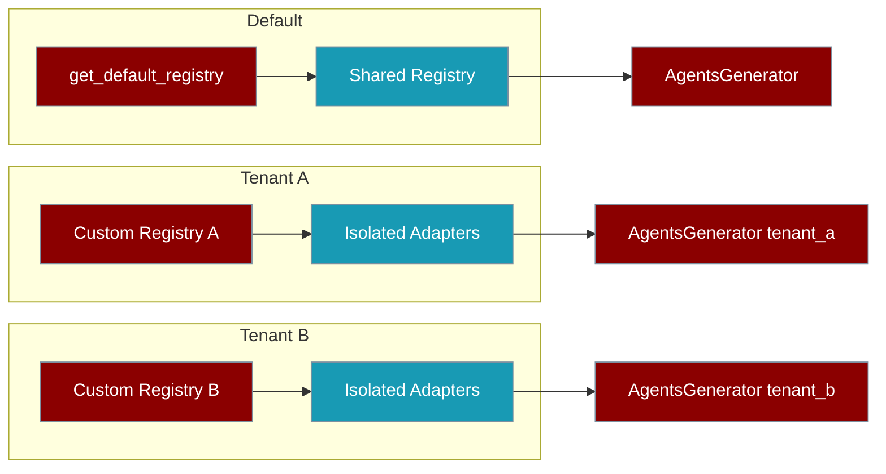
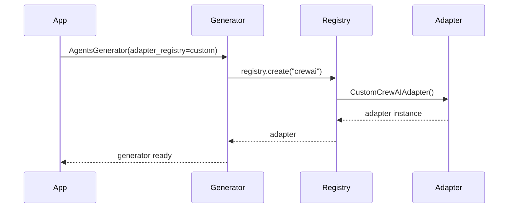

Inject a custom adapter registry when you need tenant isolation, parallel test safety, or per-run plugin overrides.

```python
from praisonai.framework_adapters.registry import FrameworkAdapterRegistry
from praisonai.agents_generator import AgentsGenerator

registry = FrameworkAdapterRegistry()
registry.register("crewai", CustomCrewAIAdapter)

generator = AgentsGenerator(
    agent_file="agents.yaml",
    framework="crewai",
    config_list=[...],
    adapter_registry=registry,
)
```



## Quick Start

<Steps>
<Step title="Simple Usage">

Use the process-default registry for normal applications:

```python
from praisonai.agents_generator import AgentsGenerator

# adapter_registry=None → uses get_default_registry()
generator = AgentsGenerator("agents.yaml", "crewai", config_list=[...])
```

</Step>

<Step title="With Configuration">

Inject a custom registry for tenant isolation or testing:

```python
from praisonai.framework_adapters.registry import FrameworkAdapterRegistry
from praisonai.agents_generator import AgentsGenerator

tenant_registry = FrameworkAdapterRegistry()
tenant_registry.register("crewai", CustomCrewAIAdapter)

generator = AgentsGenerator(
    agent_file="agents.yaml",
    framework="crewai",
    config_list=[...],
    adapter_registry=tenant_registry,
)
```

</Step>
</Steps>

---

## How It Works



| Registry | Module | Docs |
|----------|--------|------|
| Framework adapters | `praisonai.framework_adapters.registry` | [Framework Adapter Plugins](/docs/features/framework-adapter-plugins) |
| Bot platforms | `praisonai.bots._registry` | [Bot Platform Plugins](/docs/features/bot-platform-plugins) |
| Sandbox backends | `praisonai.sandbox._registry` | [Sandbox Backends](/docs/features/sandbox-backends) |
| Search providers | `praisonai.cli.features._search_registry` | [Search Providers](/docs/features/search-provider-registry) |

All plugin registries expose `Registry.default()` or `get_default_registry()` unless noted.

---

## Common Patterns

### Multi-tenant isolation

```python
def create_tenant_generator(tenant_id: str):
    registry = FrameworkAdapterRegistry()
    adapter = EnterpriseCrewAIAdapter if tenant_id == "enterprise" else StandardCrewAIAdapter
    registry.register("crewai", adapter)

    return AgentsGenerator(
        agent_file=f"tenants/{tenant_id}/agents.yaml",
        framework="crewai",
        config_list=[...],
        adapter_registry=registry,
    )
```

### Test isolation

```python
def test_custom_adapter():
    test_registry = FrameworkAdapterRegistry()
    test_registry.register("crewai", MockCrewAIAdapter)

    generator = AgentsGenerator(
        agent_file="test_agents.yaml",
        framework="crewai",
        config_list=[...],
        adapter_registry=test_registry,
    )
    # Parallel tests do not share registrations
```

### AutoGenerator with custom registry

```python
from praisonai.auto import AutoGenerator

reg = FrameworkAdapterRegistry()
auto = AutoGenerator(
    topic="...",
    agent_file="test.yaml",
    framework="crewai",
    config_list=[...],
    adapter_registry=reg,
)
```

---

## Best Practices

<AccordionGroup>

<Accordion title="Prefer DI in library code">

Accept registries as parameters rather than calling defaults inside helpers:

```python
# Good — accepts registry parameter
def process_with_framework(framework: str, registry: FrameworkAdapterRegistry):
    return registry.create(framework).run(...)

# Risky — hardcoded to default
def process_with_framework(framework: str):
    from praisonai.framework_adapters.registry import get_default_registry
    return get_default_registry().create(framework).run(...)
```

</Accordion>

<Accordion title="Give each thread its own registry">

Registry operations are thread-safe, but adapter instances may not be. Prefer one registry per worker or test case.

</Accordion>

<Accordion title="Use the default registry for single-tenant CLI apps">

Custom registries add complexity. Reach for DI only when you need tenant overrides, test isolation, or sandboxed experimental adapters.

</Accordion>

</AccordionGroup>

---

## Related

<CardGroup cols={2}>
<Card title="Framework Adapter Plugins" icon="puzzle-piece" href="/docs/features/framework-adapter-plugins">
  Extend PraisonAI with custom execution frameworks
</Card>
<Card title="Bot Platform Plugins" icon="puzzle-piece" href="/docs/features/bot-platform-plugins">
  Add custom messaging platforms via entry points
</Card>
</CardGroup>
