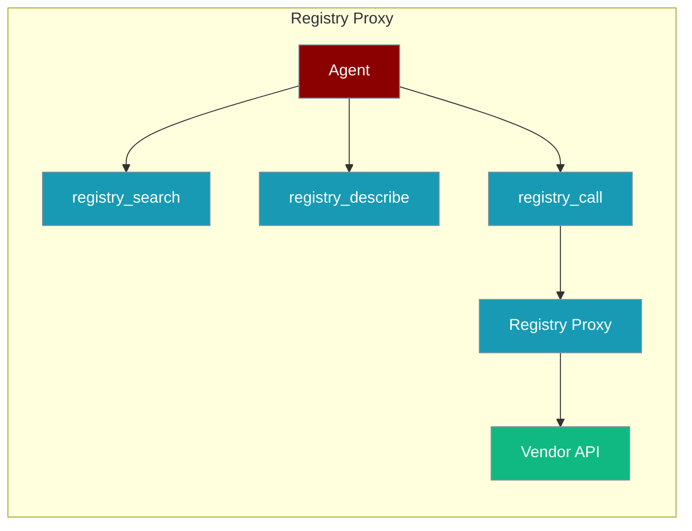
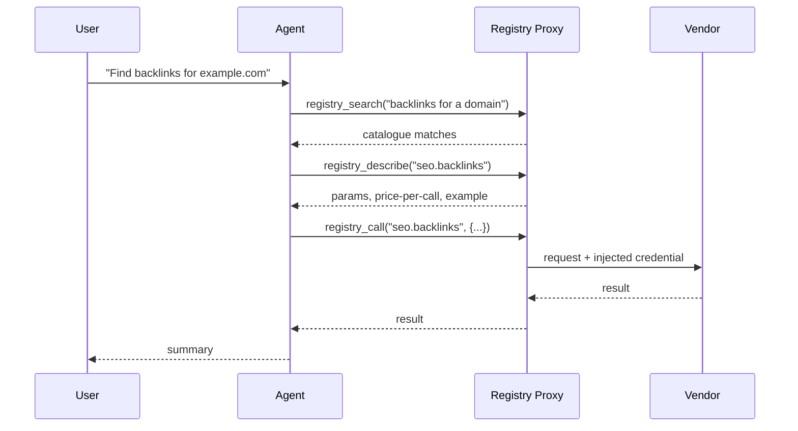
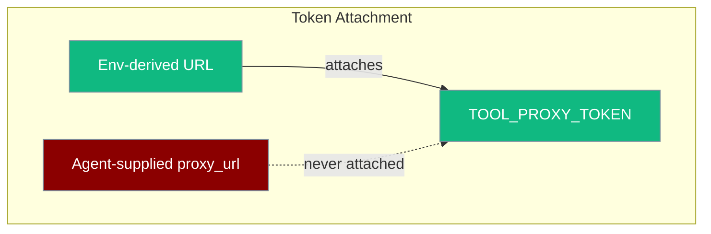

The registry proxy connector lets an agent discover and call a large catalogue of third-party API endpoints (SEO, enrichment, social data, scraping, ads) through a single token — vendor credentials are injected server-side by the registry, so the agent never holds keys.



<Note>
  **Bring your own account.** PraisonAI ships no registry code and no default endpoint. You supply your own account token or a self-hosted base URL. The connector is disabled until `TOOL_PROXY_URL` is set.
</Note>

## Quick Start

<Steps>
<Step title="Install and configure">
```bash
pip install 'praisonai-tools[registry-proxy]'
export TOOL_PROXY_URL=https://your-registry-host
export TOOL_PROXY_TOKEN=your-token
```
</Step>

<Step title="Give the three functions to an agent">
```python
from praisonai_tools.registry_proxy import registry_search, registry_describe, registry_call
from praisonaiagents import Agent

agent = Agent(
    instructions="SEO analyst",
    tools=[registry_search, registry_describe, registry_call],
)
agent.start("Find the top backlink sources for example.com and summarise")
```
</Step>
</Steps>

The agent searches the catalogue, describes a matching endpoint, then calls it — one token, no vendor keys in the agent.

---

## How It Works

The connector mirrors PraisonAI's deferred tool-search bridge with three functions over the registry's HTTP surface.



| Function | Cost | Purpose |
|----------|------|---------|
| `registry_search(query)` | free | Capability search over the catalogue |
| `registry_describe(tool_id)` | free | Params, price-per-call, example response |
| `registry_call(tool_id, params)` | paid | Invoke via proxy; credential injected server-side |

---

## The Three Functions

Each function is an agent tool that defaults to the `TOOL_PROXY_URL` / `TOOL_PROXY_TOKEN` environment variables.

### registry_search

Free capability search returning catalogue matches for a natural-language query.

```python
from praisonai_tools.registry_proxy import registry_search

registry_search("company enrichment by email")
```

### registry_describe

Free read returning an endpoint's parameters, price-per-call and an example response.

```python
from praisonai_tools.registry_proxy import registry_describe

registry_describe("seo.backlinks")
```

### registry_call

Paid invoke. The registry injects the upstream vendor credential server-side.

```python
from praisonai_tools.registry_proxy import registry_call

registry_call("seo.backlinks", {"domain": "example.com"})
```

---

## Spend Guards

`registry_call` accepts optional budget guards that deny and report a call as a tool-result error before any money is spent.

```python
from praisonai_tools.registry_proxy import registry_call

registry_call(
    "seo.backlinks",
    {"domain": "example.com"},
    max_cost_per_call=0.10,   # deny if price-per-call exceeds this
    max_session_spend=5.00,   # deny if cumulative spend would exceed this
)
```

| Parameter | Type | Default | Description |
|-----------|------|---------|-------------|
| `max_cost_per_call` | `float` | `None` | Deny the call if its price-per-call exceeds this value |
| `max_session_spend` | `float` | `None` | Deny the call if it would push cumulative spend past this value |

- Per-call price is read from `registry_describe`, so guards work without vendor-specific configuration.
- Guards **fail closed**: if a budget is set but the price cannot be validated, the call is denied.
- `max_session_spend` persists across separate `registry_call` invocations in the same process, scoped per `(proxy_url, token)` so distinct accounts never share a budget.

---

## Security Model

The connector is designed so a prompt-injected agent cannot leak the proxy token or spend uncontrolled money.



<AccordionGroup>
  <Accordion title="Credentials injected server-side">
    The registry injects the upstream vendor credential — the agent only ever holds the single proxy token, never vendor keys.
  </Accordion>
  <Accordion title="Errors returned, never raised">
    Auth, insufficient-balance, upstream and timeout failures are returned as `{"error": ...}` tool results, so a failed call never crashes the agent.
  </Accordion>
  <Accordion title="Token exfiltration guard">
    The ambient `TOOL_PROXY_TOKEN` is attached **only** when the URL is also env-derived. An agent-supplied `proxy_url` never receives it, preventing a prompt-injected agent from sending the token to an attacker-controlled endpoint.
  </Accordion>
  <Accordion title="Approval risk level">
    `registry_call` registers at **medium** risk in the approval registry because it spends money; `registry_search` and `registry_describe` are free reads.
  </Accordion>
</AccordionGroup>

---

## Zero-Config Skills Path

Registries that expose `skill install <name>` place skills in `./.claude/skills/`, which PraisonAI already scans — so registry-installed skills are discoverable with no configuration.

```bash
# via the registry CLI
skill install seo-audit
# → ./.claude/skills/seo-audit/  (discovered automatically)
```

The compatibility scan (plus an ancestor walk for monorepos) lives in core `praisonaiagents/skills/discovery.py`.

---

## Environment Recipe

Use the registry's authenticated CLI passthrough inside a sandbox or environment `setup:` so the agent's shell commands get authenticated vendor CLIs with no keys in the container.

```yaml
setup:
  - pip install 'praisonai-tools[registry-proxy]'
  - export TOOL_PROXY_TOKEN=your-token
  - registry login --token "$TOOL_PROXY_TOKEN"
```

The agent then runs authenticated vendor CLIs through the registry (for example `run gh -- pr list`) without any vendor key in the container. Sandbox and board workers inherit the same via the environment definition.

---

## Troubleshooting

<AccordionGroup>
  <Accordion title="Connector disabled">
    If `TOOL_PROXY_URL` is unset, every call returns: `Tool registry proxy is not configured. Set TOOL_PROXY_URL (and optionally TOOL_PROXY_TOKEN) to enable the connector.`
  </Accordion>
  <Accordion title="httpx not installed">
    Calls return `httpx not installed. Install with: pip install 'praisonai-tools[registry-proxy]'`. Install the extra to add `httpx`.
  </Accordion>
  <Accordion title="Error shapes">
    All failures come back as `{"error": ...}` tool results: authentication failed (HTTP 401/403), insufficient balance (HTTP 402), upstream 4xx/5xx passed through, and request timeouts.
  </Accordion>
  <Accordion title="Open compatibility items">
    Two compatibility items are tracked in PraisonAI-Tools #79 — auth-header configurability and price-field tolerance. Behaviour may broaden as these land.
  </Accordion>
</AccordionGroup>

---

## Related

<CardGroup cols={2}>
  <Card title="Tools Overview" icon="wrench" href="/tools/tools">
    Browse PraisonAI tool documentation
  </Card>
  <Card title="Custom Tools" icon="screwdriver-wrench" href="/tools/custom">
    Build your own agent tools
  </Card>
</CardGroup>
