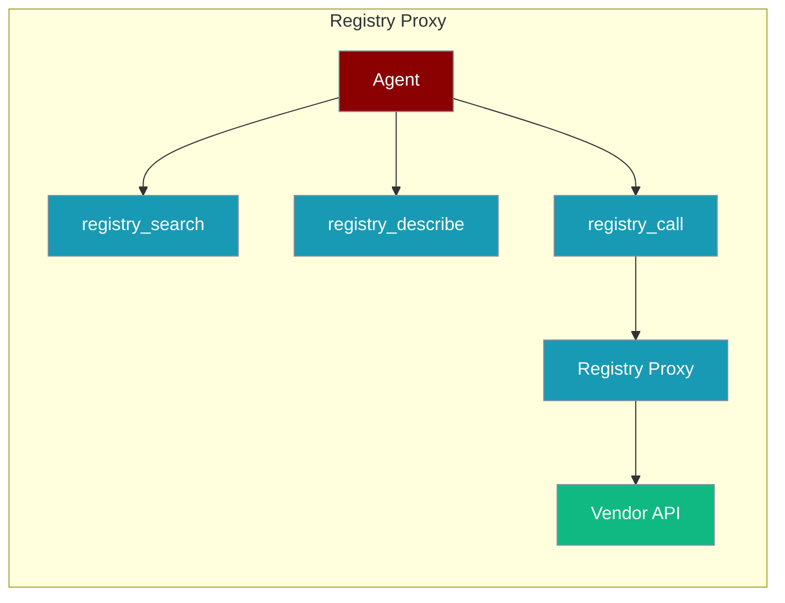
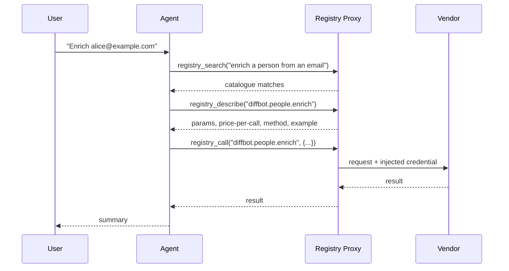
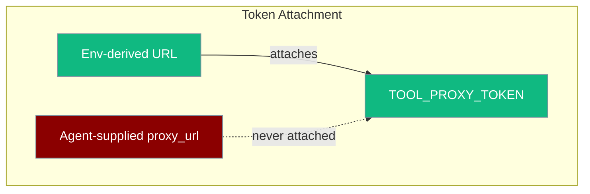

The registry proxy connector lets an agent discover and call a large catalogue of third-party API endpoints (SEO, enrichment, social data, scraping, ads) through a single token — vendor credentials are injected server-side by the registry, so the agent never holds keys.



<Note>
  **Bring your own account.** PraisonAI ships no registry code and no default endpoint. You supply your own account token or a self-hosted base URL. The connector is disabled until `TOOL_PROXY_URL` is set.
</Note>

## Quick Start

<Steps>
<Step title="Install and configure">
```bash
pip install 'praisonai-tools[registry-proxy]'
export TOOL_PROXY_URL=http://127.0.0.1:18790   # your hosted or self-hosted registry
export TOOL_PROXY_TOKEN=your-token
export TOOL_PROXY_AUTH_HEADER=X-Treg-Token      # treg wire format; omit for Bearer
```
</Step>

<Step title="Give the three functions to an agent">
```python
from praisonaiagents import Agent
from praisonai_tools.registry_proxy import registry_search, registry_describe, registry_call

agent = Agent(
    instructions="Find and use external APIs via the tool registry.",
    tools=[registry_search, registry_describe, registry_call],
)
agent.start("Enrich the person behind alice@example.com and summarise who they are.")
```
</Step>
</Steps>

The agent searches the catalogue, describes a matching endpoint, then calls it — one token, no vendor keys in the agent.

---

## How It Works

The connector exposes three functions over the registry's plain-HTTP surface.



| Function | Cost | Purpose |
|----------|------|---------|
| `registry_search(query)` | free | Capability search over the catalogue |
| `registry_describe(tool_id)` | free | Params, price-per-call, HTTP method, example response |
| `registry_call(tool_id, params)` | paid | Invoke via proxy; credential injected server-side |

The registry HTTP routes the connector talks to:

| Route | Purpose |
|-------|---------|
| `GET /catalog/search?q={query}` | Free catalogue search |
| `GET /catalog/endpoints/{id}` | Free endpoint doc (nested under `endpoint`, with a structured `cost` object) |
| `{METHOD} /call/{id}` | Proxied paid call — the registry enforces the endpoint's declared HTTP method |
| `POST /tools` | Register your own upstream endpoint (public https only; loopback/private upstreams are refused by the SSRF guard) |

---

## Self-Hosting the Registry

[treg](https://github.com/superdesigndev/treg) is an external, self-hostable tool registry. These are the exact steps to stand up a local registry for testing.

<Steps>
<Step title="Clone treg">
```bash
git clone https://github.com/superdesigndev/treg
cd treg
```
</Step>

<Step title="Install (Python 3.12–3.13)">
```bash
# If your default python is older, use uv:
uv sync --extra server --python 3.13
```
</Step>

<Step title="Boot the server">
```bash
# Default port 18790. Optionally point it at a sqlite file:
TREG_DATABASE_URL="sqlite+aiosqlite:////tmp/treg.db" .venv/bin/python -m treg
# server is now on http://127.0.0.1:18790
```
</Step>

<Step title="Mint an API token">
```bash
curl -X POST http://127.0.0.1:18790/users \
  -H 'Content-Type: application/json' \
  -d '{"email": "you@example.com"}'
# -> {"token": "..."}  — save this
```
</Step>
</Steps>

Auth on all authenticated routes is the raw token in the **`X-Treg-Token`** header — set `TOOL_PROXY_AUTH_HEADER=X-Treg-Token` so the connector sends the raw token instead of `Bearer {token}`.

---

## The Three Functions

Each function is an agent tool that defaults to the `TOOL_PROXY_URL` / `TOOL_PROXY_TOKEN` environment variables.

### registry_search

Free capability search returning catalogue matches for a natural-language query.

```python
from praisonai_tools.registry_proxy import registry_search

registry_search("enrich a person from an email address")
# {'query': ..., 'count': 2, 'results': [{'id': 'hunter.x.combined', ...}, ...]}
```

### registry_describe

Free read returning an endpoint's parameters, HTTP method, price-per-call and an example response.

```python
from praisonai_tools.registry_proxy import registry_describe

registry_describe("diffbot.people.enrich")
# {'endpoint': {'id': ..., 'method': 'GET',
#   'cost': {'value': 25, 'currency': 'credit', 'usd': 0.0299}, ...}}
```

### registry_call

Paid invoke. The registry injects the upstream vendor credential server-side. The HTTP method is auto-derived from the describe doc; GET params are sent as the query string, POST/PUT as a JSON body.

```python
from praisonai_tools.registry_proxy import registry_call

registry_call("diffbot.people.enrich", params={"type": "person", "email": "a@b.co"})
# method auto-derived as GET from the describe doc; params sent as query string
```

---

## Configuration Options

Configure the connector with environment variables (zero-code) or per-call keyword arguments.

### Environment Variables

| Variable | Default | Description |
|----------|---------|-------------|
| `TOOL_PROXY_URL` | unset (connector disabled) | Registry base URL |
| `TOOL_PROXY_TOKEN` | unset | Proxy auth token |
| `TOOL_PROXY_AUTH_HEADER` | `Authorization` | Header carrying the token. `Authorization` sends `Bearer {token}`; any other name (e.g. `X-Treg-Token`) sends the raw token |
| `TOOL_PROXY_DESCRIBE_PATH` | `/catalog/endpoints/{tool_id}` | Describe-route template; must contain `{tool_id}`. Override for registries with a different path shape |

### Constructor / Per-Call Options

`RegistryProxyTool` accepts these options; the same names work as optional keyword arguments on `registry_search`, `registry_describe` and `registry_call`.

| Option | Type | Default | Description |
|--------|------|---------|-------------|
| `proxy_url` | `str` | env `TOOL_PROXY_URL` | Registry base URL |
| `token` | `str` | env `TOOL_PROXY_TOKEN` | Auth token (see security note) |
| `timeout` | `float` | `60.0` | HTTP timeout in seconds |
| `max_cost_per_call` | `float` | `None` | Deny + report any call whose per-call price exceeds this (USD) |
| `max_session_spend` | `float` | `None` | Deny + report any call that would push cumulative session spend past this (USD); tracked per `(proxy_url, token)` pair |
| `auth_header` | `str` | env / `Authorization` | Header carrying the token |
| `method` | `str` | auto-derived | `registry_call` only. HTTP method for the endpoint. When omitted, derived from the describe doc; explicit values are validated against GET/POST/PUT/PATCH/DELETE |
| `describe_path` | `str` | env / `/catalog/endpoints/{tool_id}` | Describe-route template; must contain `{tool_id}` |

---

## Spend Guards

`registry_call` accepts optional budget guards that deny and report a call as a tool-result error before any money is spent.

```python
from praisonai_tools.registry_proxy import registry_call

registry_call(
    "diffbot.people.enrich",
    params={"type": "person", "email": "a@b.co"},
    max_cost_per_call=0.05,   # never pay more than 5 cents for one call
    max_session_spend=1.00,   # hard $1 ceiling for the whole session
)
# over budget -> {'error': 'Denied: price per call 0.0299 exceeds max_cost_per_call ...'}
```

| Parameter | Type | Default | Description |
|-----------|------|---------|-------------|
| `max_cost_per_call` | `float` | `None` | Deny the call if its price-per-call exceeds this value |
| `max_session_spend` | `float` | `None` | Deny the call if it would push cumulative spend past this value |

- Per-call price is read from `registry_describe`, so guards work without vendor-specific configuration.
- Guards **fail closed**: if a budget is set but the price cannot be read (or is non-finite/negative), the call is denied.
- `max_session_spend` persists across separate `registry_call` invocations in the same process, scoped per `(proxy_url, token)` so distinct accounts never share a budget.

---

## Security Model

The connector is designed so a prompt-injected agent cannot leak the proxy token or spend uncontrolled money.



<AccordionGroup>
  <Accordion title="Credentials injected server-side">
    The registry injects the upstream vendor credential — the agent only ever holds the single proxy token, never vendor keys.
  </Accordion>
  <Accordion title="Token-trust rule">
    The env `TOOL_PROXY_TOKEN` is attached **only** when the URL is also env-derived. If an agent supplies `proxy_url` at call time, the ambient token is **not** sent — a prompt-injected agent cannot exfiltrate the token to an attacker-controlled endpoint.
  </Accordion>
  <Accordion title="Spend guards fail closed">
    If a price cannot be read (or is non-finite/negative), a guarded call is denied rather than allowed.
  </Accordion>
  <Accordion title="Errors returned, never raised">
    Auth, insufficient-balance, upstream and timeout failures are returned as `{"error": ...}` tool results, so a failed call never crashes the agent.
  </Accordion>
</AccordionGroup>

---

## Examples

### Direct three-step flow (no agent)

```python
from praisonai_tools.registry_proxy import registry_search, registry_describe, registry_call

hits = registry_search("enrich a person from an email address")
# {'query': ..., 'count': 2, 'results': [{'id': 'hunter.x.combined', ...}, ...]}

doc = registry_describe("diffbot.people.enrich")
# {'endpoint': {'id': ..., 'method': 'GET',
#   'cost': {'value': 25, 'currency': 'credit', 'usd': 0.0299}, ...}}

result = registry_call("diffbot.people.enrich", params={"type": "person", "email": "a@b.co"})
# method auto-derived as GET from the describe doc; params sent as query string
```

### Explicit method and class form

```python
from praisonai_tools.registry_proxy import RegistryProxyTool

t = RegistryProxyTool(auth_header="X-Treg-Token", max_session_spend=2.0)
t.run(action="search", query="weather forecast")
t.run(action="describe", tool_id="{tool-id}")
t.run(action="call", tool_id="{tool-id}", params={"q": "London"}, method="GET")
```

### Different registry wire-format (non-treg deployment)

```python
from praisonai_tools.registry_proxy import RegistryProxyTool

t = RegistryProxyTool(
    auth_header="Authorization",              # Bearer token style
    describe_path="/api/v1/tools/{tool_id}",  # custom describe route
)
```

---

## Troubleshooting

<AccordionGroup>
  <Accordion title="Connector disabled (URL unset)">
    If `TOOL_PROXY_URL` is unset, every call returns: `Tool registry proxy is not configured. Set TOOL_PROXY_URL (and optionally TOOL_PROXY_TOKEN) to enable the connector.`
  </Accordion>
  <Accordion title="httpx not installed">
    Calls return `httpx not installed. Install with: pip install 'praisonai-tools[registry-proxy]'`. Install the extra to add `httpx`.
  </Accordion>
  <Accordion title="404 on describe (wrong path)">
    A 404 on `registry_describe` usually means the deployment uses a different describe route. Set `TOOL_PROXY_DESCRIBE_PATH` (or pass `describe_path`) to the correct template — it must contain `{tool_id}`.
  </Accordion>
  <Accordion title="Endpoint is GET — add method">
    Current main auto-derives the HTTP method from the describe doc. Older installs may reject a mislabelled verb; pass `method="GET"` (or the endpoint's declared method) explicitly to `registry_call`.
  </Accordion>
  <Accordion title="Marketplace-credential 404">
    A message like "no {provider} credential in this org" means the registry org has no vendor key connected — connect one on the registry side.
  </Accordion>
  <Accordion title="SSRF-guard refusals">
    Registering an upstream (`POST /tools`) with a loopback or private address is refused by the registry's SSRF guard by design — use a public https upstream.
  </Accordion>
  <Accordion title="Error shapes">
    All failures come back as `{"error": ...}` tool results: authentication failed (HTTP 401/403), insufficient balance (HTTP 402), upstream 4xx/5xx passed through, and request timeouts.
  </Accordion>
</AccordionGroup>

---

## Related

<CardGroup cols={2}>
  <Card title="Tools Overview" icon="wrench" href="/tools/tools">
    Browse PraisonAI tool documentation
  </Card>
  <Card title="Custom Tools" icon="screwdriver-wrench" href="/tools/custom">
    Build your own agent tools
  </Card>
</CardGroup>
