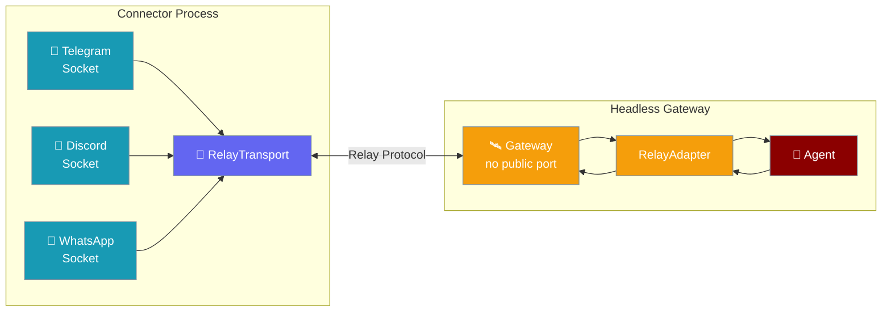

`RelayTransport` separates the **connector** (owns the platform socket) from the **gateway** (runs the agent). The connector lives where the platform can reach it; the gateway runs anywhere — behind NAT, in a serverless function, or scaled to zero.



## Quick Start

<Steps>
<Step title="Run a headless gateway with relay transport">

```python
from praisonaiagents import Agent
from praisonai.bots import Bot

agent = Agent(name="assistant", instructions="Help users")
bot = Bot(
    "telegram",
    agent=agent,
    transport=WebSocketRelayTransport(url="wss://gw.internal/relay"),
)
bot.run()  # capabilities negotiated at handshake; events relayed in
```

</Step>

<Step title="Implement a custom RelayTransport">

```python
from praisonaiagents.gateway import RelayTransport, CapabilityDescriptor

class MyRelayTransport:
    async def connect(self) -> CapabilityDescriptor:
        # Connect to relay; return channel capabilities
        return CapabilityDescriptor(
            max_message_length=4096,
            length_unit="chars",
            supports_edit=True,
            supports_draft_streaming=True,
            markdown_dialect="telegram",
        )

    def set_inbound_handler(self, handler):
        self._handler = handler

    async def send_outbound(self, message) -> None:
        # Send reply back through the relay
        await self._relay_connection.send(message)

    async def go_dormant(self) -> None:
        # Signal scale-to-zero; buffer inbound until resumed
        await self._relay_connection.send({"type": "dormant"})

    async def disconnect(self) -> None:
        await self._relay_connection.close()
```

</Step>

<Step title="Enable scale-to-zero">

```python
bot = Bot("telegram", agent=agent, transport=MyRelayTransport())

# Signal dormant state (connector buffers, gateway can shut down)
await bot.go_dormant()

# On wake-up, connector replays buffered events
bot.run()
```

</Step>
</Steps>

---

## How It Works

```mermaid
sequenceDiagram
    participant C as Connector
    participant T as RelayTransport
    participant G as Gateway
    participant A as Agent

    C->>T: connect()
    T-->>C: CapabilityDescriptor\n(max_length, markdown_dialect…)

    Note over C,G: Inbound event
    C->>T: inbound GatewayMessage
    T->>G: set_inbound_handler callback
    G->>A: session.chat(message)
    A-->>G: reply
    G->>T: send_outbound(reply)
    T-->>C: relay reply to user

    Note over C,G: Scale-to-zero
    G->>T: go_dormant()
    T-->>C: dormant signal
    Note over C: Buffers messages; gateway shuts down
    Note over C,G: Gateway wakes up
    C->>T: replays buffered messages
```

### RelayTransport Protocol

`RelayTransport` is a `@runtime_checkable` Protocol — any object that implements these five methods works:

| Method | Description |
|--------|-------------|
| `connect()` | Establish the relay connection; returns `CapabilityDescriptor` |
| `set_inbound_handler(handler)` | Register the callback for inbound messages from the connector |
| `send_outbound(message)` | Send a reply back through the relay to the platform |
| `go_dormant()` | Signal the connector to buffer; gateway can scale to zero |
| `disconnect()` | Clean shutdown |

### CapabilityDescriptor

| Field | Type | Description |
|-------|------|-------------|
| `max_message_length` | `int` | Maximum characters (or UTF-16 code units) per message |
| `length_unit` | `"chars"` \| `"utf16"` | How `max_message_length` is measured |
| `supports_edit` | `bool` | Whether the connector can edit previous messages (streaming) |
| `supports_draft_streaming` | `bool` | Whether the connector supports incremental draft updates |
| `markdown_dialect` | `str` | Markdown flavour (`"telegram"`, `"slack"`, `"discord"`, `"none"`) |

---

## Common Patterns

### One gateway, many connectors

```python
# Gateway process (no public port, no platform SDK)
from praisonai.bots import Bot
from praisonaiagents import Agent

agent = Agent(name="assistant", instructions="Help users")

# Each connector connects via relay — one agent, multiple channels
telegram_bot = Bot("telegram", agent=agent, transport=WebSocketRelayTransport(url="wss://relay/telegram"))
discord_bot  = Bot("discord",  agent=agent, transport=WebSocketRelayTransport(url="wss://relay/discord"))
```

### NAT-friendly deployment

The connector lives in a public DMZ and holds the platform WebSocket. The gateway runs in a private subnet or serverless environment — it only makes outbound calls to the relay endpoint.

```
Public DMZ:          Private subnet / serverless:
  Connector ──────────── Gateway (agent runs here)
  (owns socket)          (no inbound port needed)
```

---

## Best Practices

<AccordionGroup>

<Accordion title="Return accurate CapabilityDescriptor at handshake">
The gateway uses the descriptor to split long messages and choose the correct markdown dialect. Returning wrong values causes formatting issues or truncated replies.
</Accordion>

<Accordion title="Implement go_dormant for scale-to-zero">
A gateway that doesn't implement `go_dormant` will drop messages when it shuts down. The connector should buffer inbound messages until the gateway resumes.
</Accordion>

<Accordion title="Use runtime_checkable duck-typing">
`RelayTransport` is a `Protocol` — your transport doesn't need to inherit from any base class. Any class that implements the five methods passes the `isinstance` check.
</Accordion>

<Accordion title="Reconnect logic belongs in the connector">
The gateway treats the relay as a reliable stream. Reconnection, back-pressure, and buffering are responsibilities of the connector / relay middleware.
</Accordion>

</AccordionGroup>

---

## Related

<CardGroup cols={2}>
<Card title="Gateway Overview" icon="server" href="/docs/features/gateway-overview">
  Architecture of the PraisonAI gateway
</Card>
<Card title="Gateway Scale-to-Zero" icon="moon" href="/docs/features/gateway-scale-to-zero">
  Drain and resume gateway instances
</Card>
<Card title="Bot Gateway" icon="network-wired" href="/docs/features/bot-gateway">
  Connect bots to the gateway layer
</Card>
<Card title="Gateway Handshake Protocol" icon="handshake" href="/docs/features/gateway-handshake-protocol">
  Capability negotiation at connection time
</Card>
</CardGroup>
