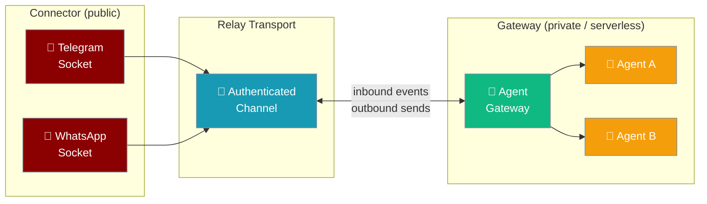
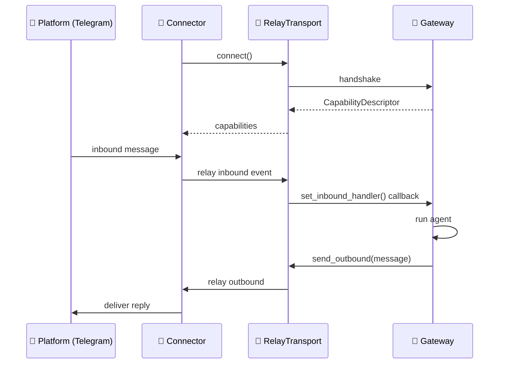

A relay transport lets a lightweight **connector** process own the Telegram/Discord/WhatsApp socket while a separate **headless gateway** handles all agent logic — enabling NAT-friendly hosting, one gateway fronting many connectors, and lossless scale-to-zero.

```python
from praisonaiagents import Agent

agent = Agent(
    name="Support",
    instructions="Answer messages routed from the connector gateway.",
)

agent.start("Summarise this inbound chat thread")
```

The user messages on a chat platform; the connector relays events to a private gateway that runs the agent.



## Quick Start

<Steps>
<Step title="In-Process (Default — No Change Needed)">
Without a relay transport, the bot adapter runs in the same process as the gateway. This is the default and requires no extra config:

```python
from praisonaiagents import Agent
from praisonai.bots import TelegramBot

agent = Agent(name="Chat Agent", instructions="Help users.")
bot = TelegramBot(token="YOUR_TOKEN", agent=agent)
await bot.start()
```
</Step>

<Step title="Out-of-Process via Relay Transport">
Pass a `transport=` to the `Bot` constructor to use a remote connector. The `transport=` parameter is **optional** and backward-compatible:

```python
from praisonaiagents import Agent
from praisonai.bots import Bot

agent = Agent(name="assistant", instructions="Help users")
bot = Bot(
    "telegram",
    agent=agent,
    transport=WebSocketRelayTransport(url="wss://gw.internal/relay"),
)
bot.run()  # capabilities negotiated at handshake; events relayed in
```

<Note>
The relay path opts out of `Bot`-level supervision automatically because the transport owns reconnect and scale-to-zero dormancy — you never need to set `enable_supervision=False` yourself. See [Auto-reconnect on `long-running-bots`](/docs/features/long-running-bots#auto-reconnect-default).
</Note>

</Step>

<Step title="Implement a custom RelayTransport">

```python
from praisonaiagents.gateway import RelayTransport, CapabilityDescriptor

class MyRelayTransport:
    async def connect(self) -> CapabilityDescriptor:
        # Connect to relay; return channel capabilities
        return CapabilityDescriptor(
            max_message_length=4096,
            length_unit="chars",
            supports_edit=True,
            supports_draft_streaming=True,
            markdown_dialect="telegram",
        )

    def set_inbound_handler(self, handler):
        self._handler = handler

    async def send_outbound(self, message) -> None:
        # Send reply back through the relay
        await self._relay_connection.send(message)

    async def go_dormant(self) -> None:
        # Signal scale-to-zero; buffer inbound until resumed
        await self._relay_connection.send({"type": "dormant"})

    async def disconnect(self) -> None:
        await self._relay_connection.close()
```

</Step>

<Step title="Enable scale-to-zero">

```python
bot = Bot("telegram", agent=agent, transport=MyRelayTransport())

# Signal dormant state (connector buffers, gateway can shut down)
await bot.go_dormant()

# On wake-up, connector replays buffered events
bot.run()
```

```python
from praisonai.bots import WebSocketRelayTransport

agent = Agent(name="Headless Agent", instructions="Help users.")

transport = WebSocketRelayTransport(
    url="wss://gw.internal/relay",
    token="YOUR_RELAY_SECRET",
)

bot = Bot("telegram", agent=agent, transport=transport)
await bot.start()
```
</Step>

<Step title="CLI Gateway with Relay">
```bash
praisonai gateway relay \
  --platform telegram \
  --to wss://gw.internal/relay \
  --token YOUR_RELAY_SECRET
```
</Step>
</Steps>

---

## How It Works



At handshake time the connector attests a `CapabilityDescriptor` — the gateway uses this to adapt streaming, markdown, and message-length behaviour to the actual platform being fronted, even though it never touches the platform socket directly.

---

## `CapabilityDescriptor` Fields

The connector attests these capabilities at handshake time:

| Field | Type | Default | Description |
|-------|------|---------|-------------|
| `max_message_length` | `int` | required | Maximum outbound message length the platform accepts |
| `length_unit` | `str` | `"chars"` | How length is measured: `"chars"` (Unicode code points) or `"utf16"` (UTF-16 code units) |
| `supports_edit` | `bool` | `False` | Platform supports editing a sent message (enables draft-streaming) |
| `supports_draft_streaming` | `bool` | `False` | Connector can stream partial drafts incrementally |
| `markdown_dialect` | `str` | `"none"` | Markdown flavour: `"none"`, `"markdown"`, `"markdownv2"`, `"html"` |

---

## `RelayTransport` Protocol

Implement these methods to create a custom transport:

| Method | Description |
|--------|-------------|
| `connect() -> CapabilityDescriptor` | Establish relay and complete handshake; returns connector capabilities |
| `set_inbound_handler(handler)` | Register coroutine called for each inbound event |
| `send_outbound(target, message) -> DeliveryResult` | Relay an outbound message to a target via the connector |
| `go_dormant()` | Pause inbound dispatch without dropping the connection (scale-to-zero) |
| `disconnect()` | Tear down the relay connection |

---

## When to Use a Relay

```mermaid
graph TB
    Q1{Is the gateway\nin a private network\nor serverless?}
    Q1 -->|Yes| Q2{Do you need\none gateway to front\nmultiple platforms?}
    Q1 -->|No| INPROC[✅ In-process adapter\n(default)]
    Q2 -->|Yes| RELAY[✅ Relay transport]
    Q2 -->|No| Q3{Will the gateway\nscale to zero?}
    Q3 -->|Yes| RELAY
    Q3 -->|No| INPROC

    classDef decision fill:#189AB4,stroke:#7C90A0,color:#fff
    classDef inproc fill:#10B981,stroke:#7C90A0,color:#fff
    classDef relay fill:#F59E0B,stroke:#7C90A0,color:#fff

    class Q1,Q2,Q3 decision
    class INPROC inproc
    class RELAY relay
```

---

## Scale-to-Zero with `go_dormant()`

When the gateway scales to zero, call `go_dormant()` to pause inbound dispatch:

```python
transport = WebSocketRelayTransport(url="wss://gw.internal/relay")
caps = await transport.connect()

await transport.go_dormant()
```

The connector **keeps the platform socket open** and buffers inbound events while the gateway is dormant. When the gateway wakes, it drains the backlog losslessly — no messages are dropped during the idle period.

---

## Best Practices

<AccordionGroup>
<Accordion title="Secure the relay with a shared secret">
The relay transport authenticates with a `token` passed at `connect()` time. Use a long, random secret and rotate it with your other infrastructure credentials.
</Accordion>

<Accordion title="Use go_dormant() during scale-to-zero, not disconnect()">
`disconnect()` tears down the connection and the connector stops buffering. `go_dormant()` keeps the connector alive and buffering, so events that arrive while the gateway is sleeping are drained on wake.
</Accordion>

<Accordion title="Capability negotiation at handshake">
Always use the `CapabilityDescriptor` returned by `connect()` to configure your delivery layer. Never hard-code platform limits — the connector is the authority on what the actual platform supports.
</Accordion>

<Accordion title="The transport= parameter is optional">
Omit `transport=` entirely to keep the existing in-process behaviour. No existing code needs to change; just add the parameter when you need an out-of-process connector.
</Accordion>
</AccordionGroup>

---

## Related

<CardGroup cols={2}>
<Card title="Gateway Overview" icon="gateway" href="/docs/features/gateway-overview">
  How the gateway connects agents to channels
</Card>
<Card title="Gateway Scale-to-Zero" icon="power" href="/docs/features/gateway-scale-to-zero">
  Idle dormancy and wake-up behaviour
</Card>
<Card title="Durable Outbound Delivery" icon="shield-check" href="/docs/features/durable-outbound-delivery">
  Retry and DLQ for all channels
</Card>
<Card title="Multi-Channel Bots" icon="layers" href="/docs/features/multi-channel-bots">
  One gateway, many platforms
</Card>
</CardGroup>
