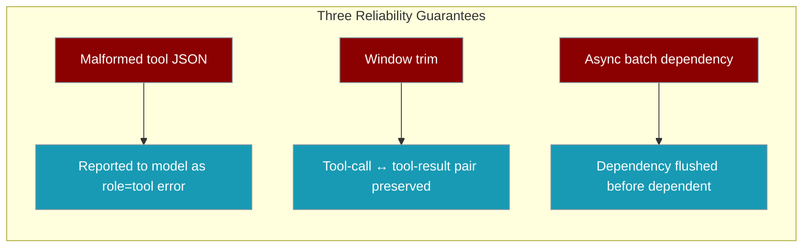
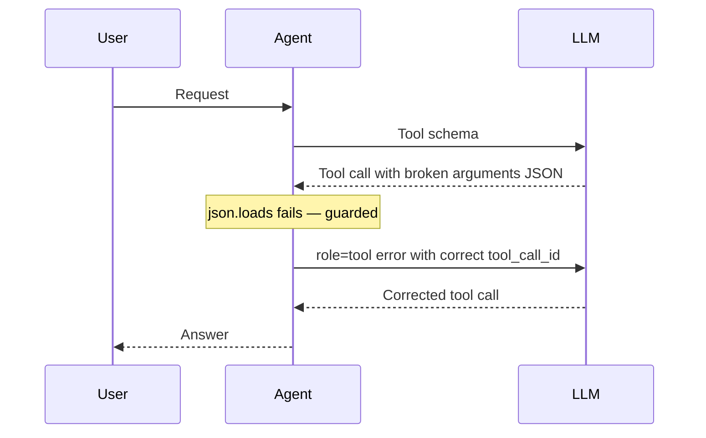
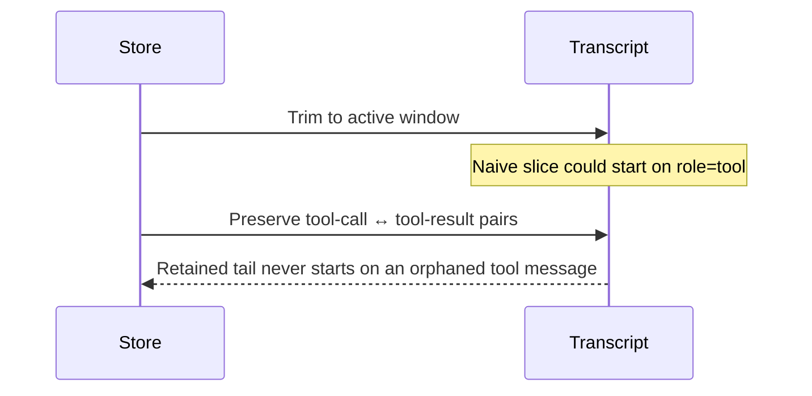
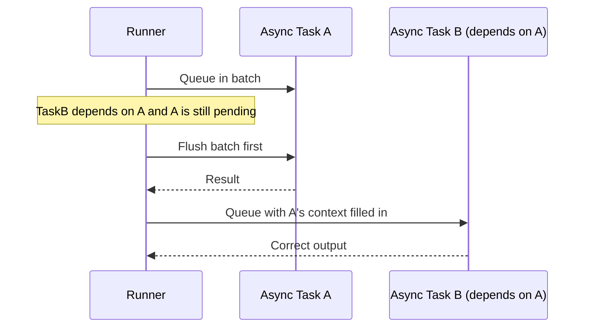

<Note>
This page covers three **default, automatic** correctness guarantees for tool-using and multi-task runs: malformed tool-call JSON recovery, tool-pair-safe window trimming, and same-batch async dependency ordering. For **task/workflow-level** reliability knobs (retry jitter, `workflow_timeout`, failure policies), see [Reliability](/features/reliability).
</Note>

Long tool-using conversations and mixed async task batches used to fail in three subtle ways. Those failure classes are now handled automatically — no configuration, no new imports, no API changes.

```python
from praisonaiagents import Agent, Task, PraisonAIAgents

researcher = Agent(name="Researcher", instructions="Research the topic")
writer = Agent(name="Writer", instructions="Write based on the research")

research = Task(
    name="research",
    description="Research quantum computing",
    agent=researcher,
    async_execution=True,
)

article = Task(
    name="article",
    description="Write an article using the research",
    agent=writer,
    async_execution=True,
    context=[research],
)

PraisonAIAgents(agents=[researcher, writer], tasks=[research, article]).start()
```

The `article` task depends on `research`. Even when both run async in the same batch, the dependency is awaited first — `article` never sees an empty result.



## Quick Start

<Steps>
<Step title="Tool-using agent survives a malformed tool call">

If the model emits a tool call whose `arguments` JSON is truncated or malformed, the parse failure is reported back to the model as a `role="tool"` error and the run continues. Nothing to enable.

```python
from praisonaiagents import Agent

def search_web(query: str) -> str:
    """Search the web for a query."""
    return f"Results for {query}"

agent = Agent(
    name="Researcher",
    instructions="Answer using the search tool",
    tools=[search_web],
)

agent.start("Find recent papers on quantum error correction")
```

</Step>

<Step title="A Session that survives long tool-using conversations">

A windowed `Session` never emits a transcript that starts on an orphaned `role="tool"` message, so strict providers keep accepting it after many tool turns.

```python
from praisonaiagents import Session

session = Session(session_id="research_chat", user_id="user_1")
agent = session.Agent(name="Assistant", role="Research helper")

agent.start("Summarise today's findings")
session.save_state({"topic": "quantum computing"})
```

</Step>

<Step title="Dependent async tasks keep their context">

Two `async_execution=True` tasks in the same batch, where the second depends on the first via `context=[...]`, run in the correct order automatically.

```python
from praisonaiagents import Agent, Task, PraisonAIAgents

researcher = Agent(name="Researcher", instructions="Research the topic")
writer = Agent(name="Writer", instructions="Write based on the research")

research = Task(
    name="research",
    description="Research quantum computing",
    agent=researcher,
    async_execution=True,
)

article = Task(
    name="article",
    description="Write an article using the research",
    agent=writer,
    async_execution=True,
    context=[research],
)

PraisonAIAgents(agents=[researcher, writer], tasks=[research, article]).start()
```

</Step>
</Steps>

---

## How It Works

### Malformed tool-call JSON



The non-streaming tool loop now matches the streaming path: a parse failure becomes a `role="tool"` error message (`{"error": "Invalid arguments JSON: ..."}`) tagged with the correct `tool_call_id`. The tool-error message also recovers the real function name (for example `search_web`) instead of reporting an unknown function, so the model has a clear signal to self-correct.

### Tool-pair-safe window trim



Windowed retention in `DefaultSessionStore` routes its slice through a tool-pair-safe guard, and the `TruncateOptimizer` / `SlidingWindowOptimizer` context strategies skip any leading orphaned `role="tool"` messages after trimming. Strict providers (OpenAI, Anthropic) reject a transcript that opens on a tool result whose originating assistant `tool_calls` message was trimmed away — that shape is no longer emitted.

### Same-batch async dependency ordering



`arun_all_tasks` tracks pending `(task_id, coroutine)` pairs. Before queuing an async task whose dependency is still pending in the current batch, it flushes the batch so the dependency finishes first. If the just-flushed dependency ended up `failed`, the failure cascades to the dependent instead of running it with missing upstream context. Both dependency edges are covered: `task.context` and workflow `previous_tasks` (from `next_tasks`).

---

## Configuration Options

No configuration required — these are default, automatic behaviours. There are no new flags, no new config options, and no import changes. Upgrading is enough.

---

## Best Practices

<AccordionGroup>

<Accordion title="Prefer role=tool error surfaces over try/except around agent.start()">

You do not need to wrap `agent.start(...)` in `try/except` to guard against malformed tool-call output. The parse failure is already reported back to the model as a `role="tool"` error, giving it a turn to self-correct.

</Accordion>

<Accordion title="Set a Session retention window without worrying about tool-message boundaries">

Bounded retention preserves tool-call ↔ tool-result pairs automatically. The retained tail never starts on an orphaned tool message, so you can cap history freely without provider-side "invalid conversation" errors.

</Accordion>

<Accordion title="Give dependent async tasks their context=[...]">

Declare dependencies with `context=[task]` (or a workflow `next_tasks` edge). Batch ordering is preserved for you — the dependency is flushed before the dependent runs, so the dependent always sees real upstream output.

</Accordion>

</AccordionGroup>

---

## Related

<CardGroup cols={2}>
<Card title="Reliability" icon="shield-halved" href="/features/reliability">
  Retry jitter, workflow timeouts, and task failure policies
</Card>
<Card title="Tasks" icon="list-checks" href="/concepts/tasks">
  Task definitions, dependencies, and async execution
</Card>
<Card title="Tools" icon="wrench" href="/concepts/tools">
  Define and call tools from agents
</Card>
<Card title="Sessions" icon="database" href="/concepts/session-management">
  Persistent state and windowed conversation history
</Card>
</CardGroup>
