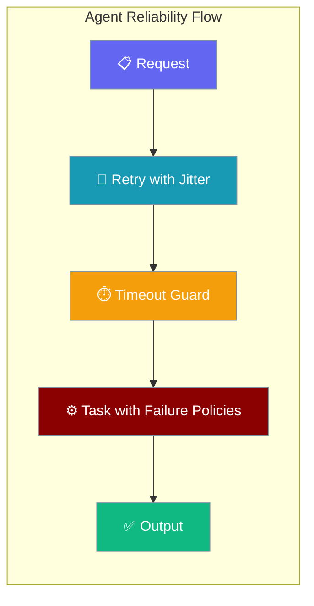
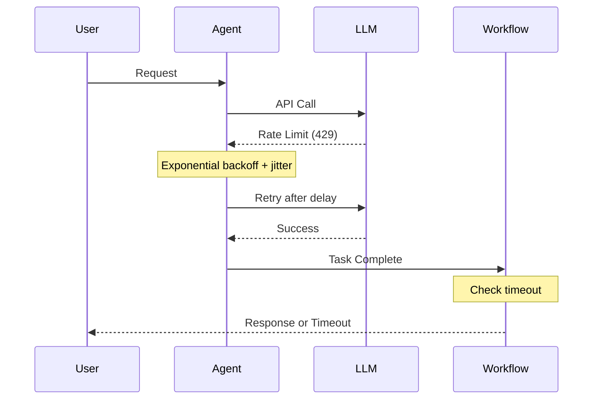
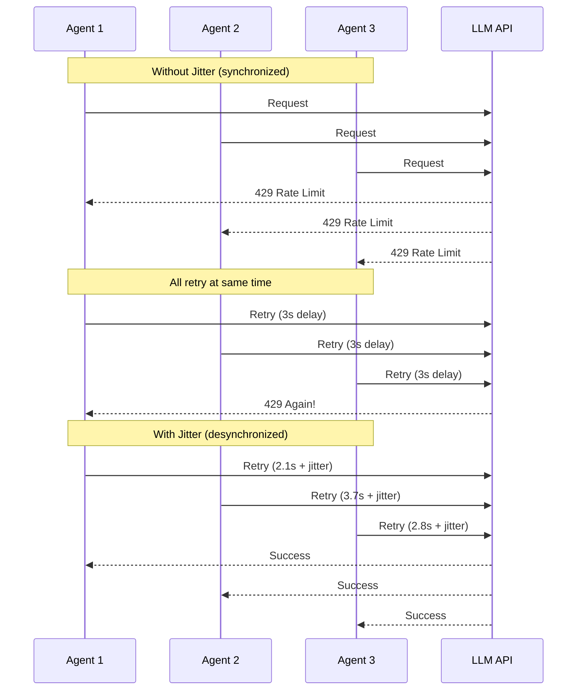
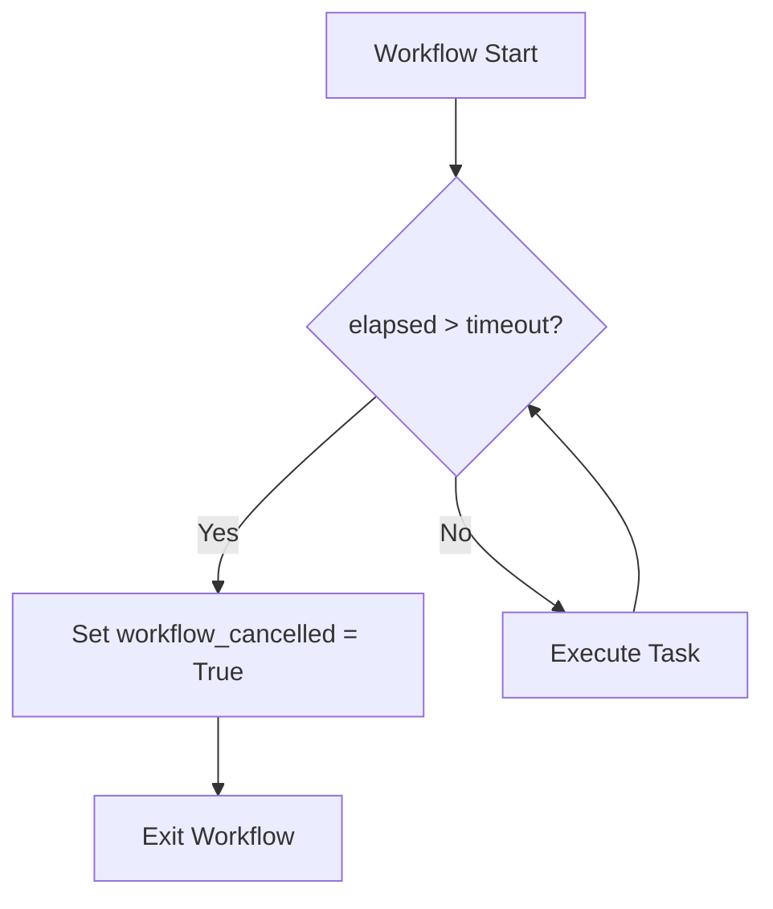
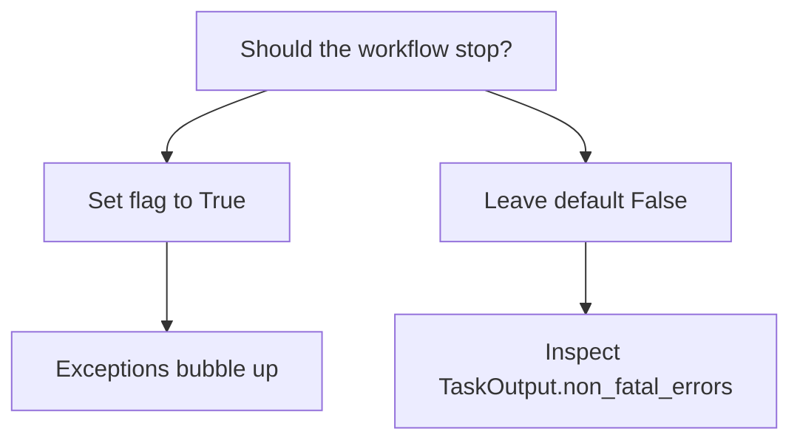

Make your agents survive flaky LLMs, hung workflows, and broken callbacks.



## Quick Start

<Steps>
<Step title="Simple Usage">
```python
from praisonaiagents import Agent, Task, PraisonAIAgents

task = Task(
    description="Summarise the article",
    fail_on_callback_error=True,   # surface callback bugs instead of swallowing
    fail_on_memory_error=False,    # tolerate memory hiccups
)

workflow = PraisonAIAgents(
    agents=[Agent(name="Writer", instructions="Summarise clearly")],
    tasks=[task],
    workflow_timeout=120,           # hard kill after 2 min (sync + async)
)
workflow.start()
```
</Step>

<Step title="Production Configuration">
```python
from praisonaiagents import Agent, Task, PraisonAIAgents

# Strict mode for CI/testing
strict_task = Task(
    description="Validate the output",
    fail_on_callback_error=True,
    fail_on_memory_error=True,
)

# Lenient mode for production
lenient_task = Task(
    description="Generate content",
    fail_on_callback_error=False,  # default
    fail_on_memory_error=False,    # default
)

workflow = PraisonAIAgents(
    agents=[Agent(name="Validator", instructions="Check quality")],
    tasks=[strict_task, lenient_task],
    workflow_timeout=300,
)

result = workflow.start()
# Check for non-fatal errors in production
if result.non_fatal_errors:
    logger.warning(f"Non-fatal errors: {result.non_fatal_errors}")
```
</Step>
</Steps>

---

## How It Works



| Component | Purpose | Behavior |
|-----------|---------|----------|
| Retry Jitter | Prevents thundering herd | Random delays for multi-agent rate limits |
| Workflow Timeout | Stops hung processes | Hard kill after specified seconds |
| Failure Policies | Controls error handling | Surface or swallow exceptions |

---

## Retry Jitter (LLM Backoff)

Prevents multi-agent thundering herd when many agents hit rate limits at once.



| Error category | Behavior | Floor | Cap |
|---|---|---|---|
| `RATE_LIMIT` | exp backoff (×3) + full jitter | `base_delay` (default `1.0`) | 60.0s |
| `TRANSIENT` | exp backoff (×2) + full jitter | `base_delay` (default `1.0`) | 30.0s |
| `CONTEXT_LIMIT` | deterministic | `0.5s` | `0.5s` |
| `AUTH` / `INVALID_REQUEST` / `PERMANENT` | no retry | — | `0` |

Jitter is automatic — there is no flag to turn it off.

---

## Workflow Timeout

Stop runaway sync workflows that previously ignored `workflow_timeout`.



```python
PraisonAIAgents(agents=[...], tasks=[...], workflow_timeout=60)
```

`workflow_cancelled` is the read-only flag set when a timeout fires (useful for downstream callbacks).

**Scope change:** async already enforced this; **sync now does too**.

---

## Task Failure Policies

By default, callback and memory exceptions are logged and swallowed. These flags surface them.



| Param | Type | Default | Effect when `True` |
|---|---|---|---|
| `fail_on_callback_error` | `bool` | `False` | Re-raises any exception thrown inside `task.callback`. |
| `fail_on_memory_error` | `bool` | `False` | Re-raises memory-store failures (both inside and after the task). |

```python
from praisonaiagents import Agent, Task

def buggy_callback(task_output):
    raise ValueError("This callback always fails!")

# This task will crash the workflow when callback fails
strict_task = Task(
    description="Process data",
    callback=buggy_callback,
    fail_on_callback_error=True,  # Surface the bug
)

# This task will log the error but continue
lenient_task = Task(
    description="Process data", 
    callback=buggy_callback,
    fail_on_callback_error=False,  # Swallow and log
)

# Check non-fatal errors after execution
result = agent.start(lenient_task)
print(f"Callback error: {result.callback_error}")
print(f"All non-fatal errors: {result.non_fatal_errors}")
```

---

## Common Patterns

**Strict CI mode:**
```python
task = Task(
    description="Validate output",
    fail_on_callback_error=True,
    fail_on_memory_error=True,
)
workflow = PraisonAIAgents(tasks=[task], workflow_timeout=60)
```

**Lenient production mode:**
```python
task = Task(
    description="Generate content",
    fail_on_callback_error=False,
    fail_on_memory_error=False,
)
result = workflow.start()
if result.non_fatal_errors:
    metrics.increment("non_fatal_errors", tags={"task": task.name})
```

**Multi-agent fan-out:**
```python
# Jitter automatically prevents thundering herd
agents = [Agent(name=f"Worker-{i}") for i in range(10)]
# All agents hitting same LLM get automatic jitter - no config needed
```

---

## Best Practices

<AccordionGroup>
<Accordion title="Set workflow_timeout for any agent that calls external APIs">
Network calls can hang indefinitely. Always set a reasonable timeout:

```python
# Good: timeout prevents hung workflows
workflow = PraisonAIAgents(workflow_timeout=300)

# Bad: no timeout, workflow can hang forever
workflow = PraisonAIAgents()
```

Use 60s for quick tasks, 300s for complex multi-step workflows.
</Accordion>

<Accordion title="Turn fail_on_callback_error=True in tests, leave False in prod">
Tests should surface bugs immediately, production should be resilient:

```python
# Test environment
if os.getenv("ENV") == "test":
    fail_on_callback_error = True
else:
    fail_on_callback_error = False

task = Task(
    description="Process data",
    fail_on_callback_error=fail_on_callback_error
)
```
</Accordion>

<Accordion title="Don't catch jitter-related delays — let the SDK handle backoff">
The retry system is designed to handle rate limits automatically:

```python
# Good: let SDK handle retries
agent = Agent(name="Worker")
result = agent.start("Process this data")

# Bad: don't manually catch and retry
try:
    result = agent.start("Process this data")
except RateLimitError:
    time.sleep(5)  # Wrong! SDK already does this with jitter
    result = agent.start("Process this data")
```
</Accordion>

<Accordion title="Inspect TaskOutput.non_fatal_errors in your monitoring pipeline">
Non-fatal errors indicate potential issues that should be tracked:

```python
result = workflow.start()
for error in result.non_fatal_errors:
    logger.warning(f"Non-fatal error in {task.name}: {error}")
    metrics.increment("task.non_fatal_error", tags={
        "task": task.name,
        "error_type": type(error).__name__
    })
```
</Accordion>
</AccordionGroup>

---

## Related

<CardGroup cols={2}>
<Card title="Task Configuration" icon="gear" href="/concepts/tasks">
  Task parameters and configuration options
</Card>
<Card title="Process Execution" icon="play" href="/concepts/process">
  Workflow execution and management
</Card>
</CardGroup>