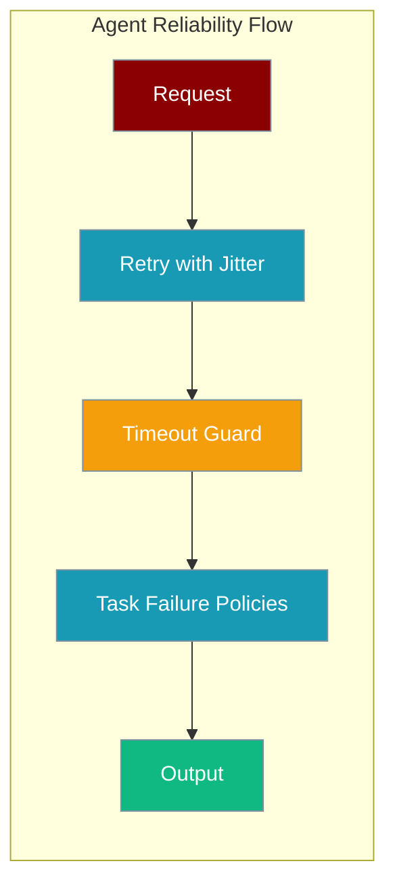
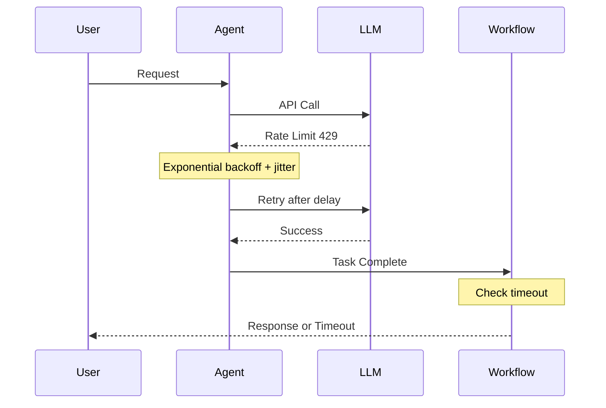

<Note>
This page covers **task/workflow-level** reliability (retry jitter, `workflow_timeout`, `fail_on_callback_error`). If you are looking for the **gateway-level** reliability preset (`reliability="production"` on `BotOS` / gateway YAML / CLI), see [Gateway Reliability Preset](/docs/features/gateway-reliability) — it is a separate feature that composes drain and admission control.
</Note>

Make agents survive flaky LLMs, hung workflows, and broken callbacks with built-in retry jitter and configurable failure policies.

<Note>This page covers **task/workflow reliability** (retry, timeouts, failure policies). For **gateway reliability** (graceful drain + inbound admission control presets), see [Gateway Reliability](/docs/features/gateway-reliability).</Note>

```python
from praisonaiagents import Agent, Task, PraisonAIAgents

task = Task(
    description="Summarise the article",
    fail_on_callback_error=True,
    fail_on_memory_error=False,
)

workflow = PraisonAIAgents(
    agents=[Agent(name="Writer", instructions="Summarise clearly")],
    tasks=[task],
    workflow_timeout=120,
)
workflow.start()
```

The user starts a workflow; retries, timeouts, and failure policies keep flaky LLM or callback errors from aborting the run.




## Quick Start

<Steps>
<Step title="Simple Usage">

```python
from praisonaiagents import Agent, Task, PraisonAIAgents

task = Task(
    description="Summarise the article",
    fail_on_callback_error=True,
    fail_on_memory_error=False,
)

workflow = PraisonAIAgents(
    agents=[Agent(name="Writer", instructions="Summarise clearly")],
    tasks=[task],
    workflow_timeout=120,
)
workflow.start()
```

</Step>

<Step title="With Configuration">

Strict mode for CI; lenient mode for production with non-fatal error inspection:

```python
from praisonaiagents import Agent, Task, PraisonAIAgents

strict_task = Task(
    description="Validate the output",
    fail_on_callback_error=True,
    fail_on_memory_error=True,
)

lenient_task = Task(
    description="Generate content",
    fail_on_callback_error=False,
    fail_on_memory_error=False,
)

workflow = PraisonAIAgents(
    agents=[Agent(name="Validator", instructions="Check quality")],
    tasks=[strict_task, lenient_task],
    workflow_timeout=300,
)

result = workflow.start()
if result.non_fatal_errors:
    logger.warning(f"Non-fatal errors: {result.non_fatal_errors}")
```

</Step>
</Steps>

---

## How It Works



| Component | Purpose |
|-----------|---------|
| Retry jitter | Desynchronises multi-agent retries on rate limits |
| Workflow timeout | Hard kill after specified seconds (sync and async) |
| Failure policies | Surface or swallow callback and memory exceptions |

---

## Configuration Options

| Param | Type | Default | Effect when `True` |
|-------|------|---------|-------------------|
| `fail_on_callback_error` | `bool` | `False` | Re-raises exceptions inside `task.callback` |
| `fail_on_memory_error` | `bool` | `False` | Re-raises memory-store failures |
| `workflow_timeout` | `int` | `None` | Seconds before workflow cancellation |

### Retry categories

| Error category | Behaviour | Cap |
|----------------|-----------|-----|
| `RATE_LIMIT` | exp backoff ×3 + full jitter | 60s |
| `TRANSIENT` | exp backoff ×2 + full jitter | 30s |
| `CONTEXT_LIMIT` | deterministic 0.5s | 0.5s |
| `AUTH` / `INVALID_REQUEST` / `PERMANENT` | no retry | — |

Jitter is automatic — there is no flag to turn it off.

---

## Common Patterns

### Strict CI mode

```python
task = Task(
    description="Validate output",
    fail_on_callback_error=True,
    fail_on_memory_error=True,
)
workflow = PraisonAIAgents(tasks=[task], workflow_timeout=60)
```

### Lenient production mode

```python
result = workflow.start()
for error in result.non_fatal_errors:
    metrics.increment("task.non_fatal_error", tags={"error_type": type(error).__name__})
```

### Multi-agent fan-out

```python
agents = [Agent(name=f"Worker-{i}") for i in range(10)]
# Jitter prevents thundering herd — no config needed
```

---

## Best Practices

<AccordionGroup>

<Accordion title="Set workflow_timeout for external API calls">

Network calls can hang indefinitely. Use 60s for quick tasks, 300s for multi-step workflows.

</Accordion>

<Accordion title="Use fail_on_callback_error=True in tests">

Tests should surface bugs immediately; production should log and continue unless the callback is critical.

</Accordion>

<Accordion title="Do not manually retry rate limits">

The SDK already applies exponential backoff with jitter. Catching `RateLimitError` and sleeping duplicates that work.

</Accordion>

<Accordion title="Track non_fatal_errors in monitoring">

Non-fatal errors indicate latent issues — increment metrics and log them even when the workflow completes.

</Accordion>

</AccordionGroup>

---

## Related

<CardGroup cols={2}>
<Card title="Task Retry Policy" icon="rotate-ccw" href="/docs/features/task-retry-policy">
  Per-task retry with exponential backoff
</Card>
<Card title="Workflow Error Recovery" icon="shield-halved" href="/docs/features/workflow-error-recovery">
  Recover from workflow failures gracefully
</Card>
</CardGroup>
