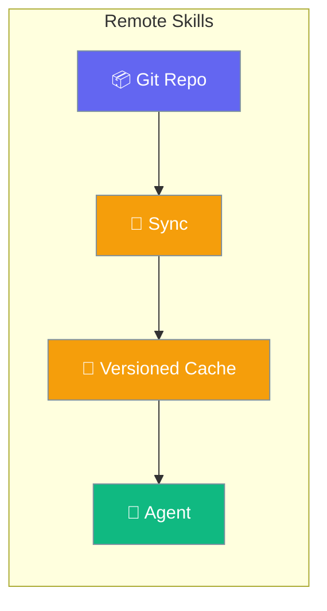
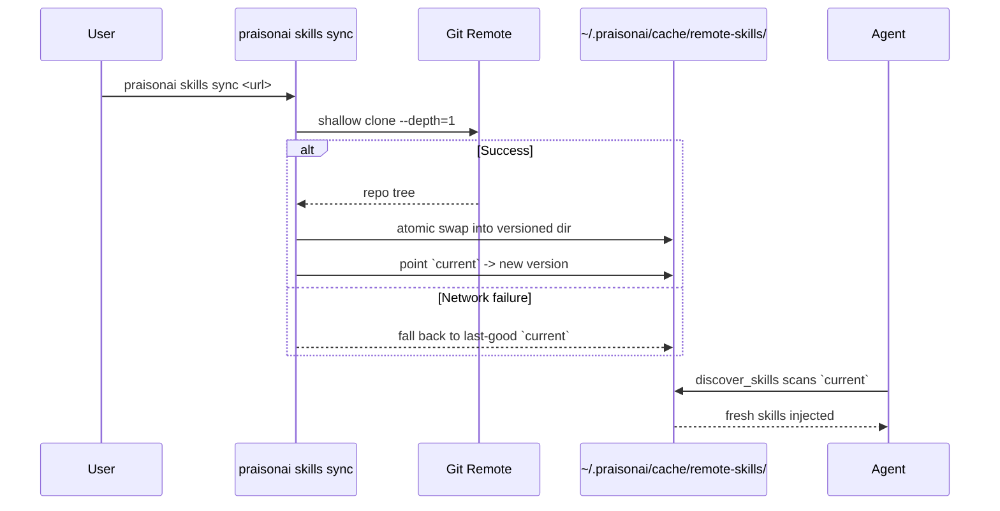
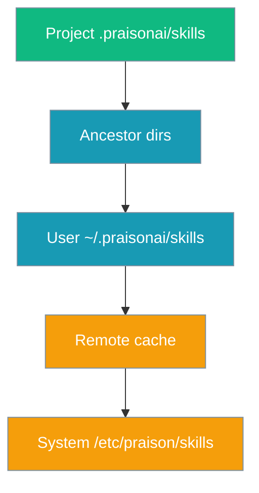

Point your agents at a git URL of skills — every project pulls the latest without a manual install.



## Quick Start

<Steps>
<Step title="Python">
Pass a git URL to `sources=` and the agent picks up the latest on next run:

```python
from praisonaiagents import Agent
from praisonaiagents.skills import discover_skills

skills = discover_skills(sources=["https://github.com/acme/skills-repo"])

agent = Agent(
    name="Assistant",
    instructions="You are a helpful assistant.",
    skills=[str(s.path) for s in skills],
)
agent.start("Deploy the latest build to staging")
```
</Step>

<Step title="CLI">
Force a refresh into the local cache, or pin a ref:

```bash
# Force refresh
praisonai skills sync https://github.com/acme/skills-repo

# Pin a branch, tag, or commit
praisonai skills sync https://github.com/acme/skills-repo --ref v1.2.0

# Or list URLs in praisonai.yaml and run sync bare:
praisonai skills sync
```
</Step>

<Step title="YAML">
Declare shared sources in project or user config:

```yaml
# praisonai.yaml (project) or ~/.praisonai/config.yaml (user)
skills:
  urls:
    - https://github.com/acme/skills-repo
    - https://github.com/acme/other-skills
  # OR (same key aliased):
  sources:
    - url: https://github.com/acme/skills-repo
      ref: v1.2.0
```
</Step>
</Steps>

---

## How It Works

Sync shallow-clones the repo, atomically swaps it into a versioned cache, and points `current` at it. If the remote is unreachable, the last-good cache is served instead.



---

## Precedence

Local always wins on a name collision; the remote cache is appended after user skills.



---

## Cache Layout

Each source is cached by a stable id under a shared cache root:

```
~/.praisonai/cache/remote-skills/
└── <sha256-16-of-"url@ref">/
    ├── <commit-sha-16>/       # versioned cache
    │   └── <skill-dirs>...
    └── current -> <commit-sha-16>   # atomically-swapped alias
```

- Old versioned dirs are pruned after each successful sync (keep-newest-only).
- `current` is a symlink; on filesystems without symlink support (some Windows configs), it falls back to a copy.
- Live versions never get overwritten — the swap is atomic via `os.replace`.

---

## Configuration Options

`praisonai skills sync` takes a URL and an optional ref:

| Option | Type | Default | Description |
|--------|------|---------|-------------|
| `url` (positional) | `str` | `None` | Git URL. If omitted, `skills.urls` / `skills.sources` from config are used. |
| `--ref` / `-r` | `str` | `None` | Pin a branch, tag, or commit SHA. |

Custom backends implement `RemoteSkillSourceProtocol`:

| Method | Signature | Returns |
|--------|-----------|---------|
| `fetch(cache_dir)` | `(Path) -> List[Path]` | Local dirs containing fetched skills. Falls back to cache on network failure rather than raising. |

---

## Common Patterns

### Python API

```python
from praisonaiagents.skills import discover_skills

skills = discover_skills(sources=["https://github.com/acme/skills-repo"])
```

### Custom source

Implement `RemoteSkillSourceProtocol.fetch` to support non-git backends (S3, HTTP tarball, and so on):

```python
from pathlib import Path
from typing import List
from praisonaiagents.skills import discover_skills

class TarballSource:
    def fetch(self, cache_dir: Path) -> List[Path]:
        # download + extract into cache_dir, return dirs holding skills
        return [cache_dir / "my-skills"]

skills = discover_skills(sources=[TarballSource()])
```

### Team-wide skills via a monorepo

Check `skills.urls` into `praisonai.yaml`; every teammate and CI pulls the same version on the next `sync`:

```yaml
# praisonai.yaml
skills:
  urls:
    - https://github.com/acme/skills-repo
```

### Pinned production

```bash
praisonai skills sync https://github.com/acme/skills-repo --ref v1.2.0
```

---

## Best Practices

<AccordionGroup>
<Accordion title="Pin refs in production">
Plain URLs float on the default branch. Pin `--ref v1.2.0` so teams don't drift silently onto an upstream commit.
</Accordion>

<Accordion title="Treat remote content as untrusted">
The fetcher re-validates with the standard skill parser, but still review the source repo before adding it to `skills.urls`.
</Accordion>

<Accordion title="Local wins on collision">
A project-local skill with the same `name` shadows the remote one. Rename local skills you didn't mean to override.
</Accordion>

<Accordion title="Offline is fine">
The last-good cache is served when the git remote is unreachable, so agents keep working when the network doesn't.
</Accordion>
</AccordionGroup>

---

## Related

<CardGroup cols={2}>
<Card title="Agent Skills" icon="puzzle-piece" href="/docs/features/skills">
  Author SKILL.md files and configure skills on agents
</Card>
<Card title="Skill Invocation" icon="slash" href="/docs/features/skills-invocation">
  Slash commands, argument substitution, and invocation policy
</Card>
<Card title="Skill Bundles" icon="boxes-stacked" href="/docs/features/skill-bundles">
  Group multiple skills under one selector
</Card>
<Card title="Skill Manage" icon="wand-magic-sparkles" href="/docs/features/skill-manage">
  Agent-created skills with human approval
</Card>
</CardGroup>
