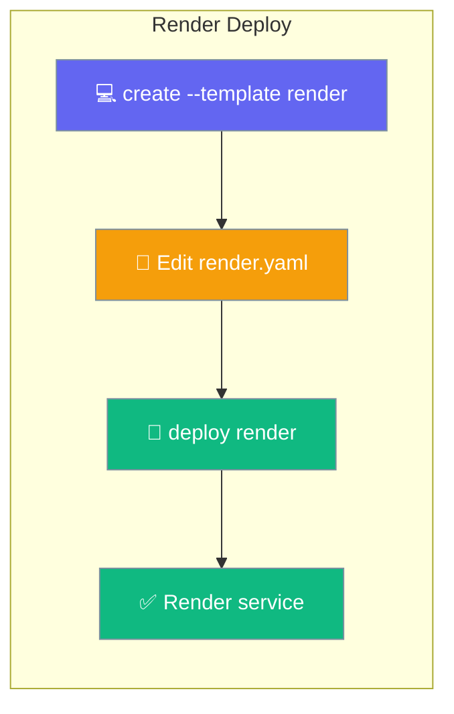
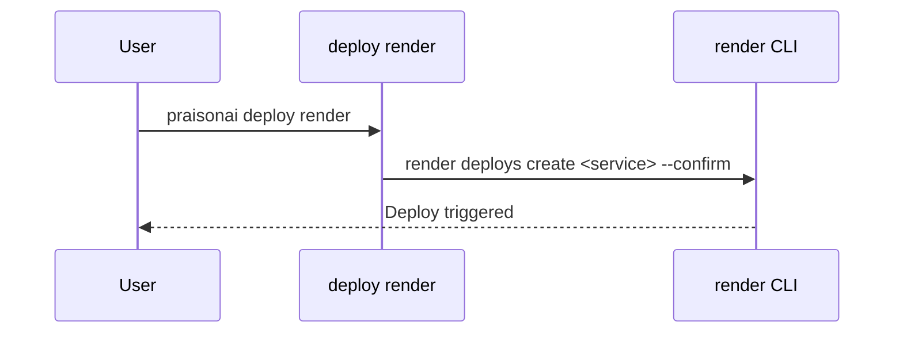

Deploy your agents to Render with a starter `render.yaml` and a single deploy command.



<Warning>
Starter templates ship in the git checkout, **not** in the PyPI wheel (`MANIFEST.in` excludes `infra/`). Run `create` from a monorepo checkout, or set `PRAISONAI_STARTERS_ROOT` / `PRAISONAI_INFRA_ROOT`.
</Warning>

## Quick Start

<Steps>
<Step title="Scaffold the project">
The starter drops `render.yaml` and `agents.yaml` into the current directory.

```bash
praisonai deploy create --template render
```
</Step>

<Step title="Set your API key">
Render marks `OPENAI_API_KEY` as `sync: false`, so set it in the dashboard.

```text
Render dashboard → Environment → OPENAI_API_KEY
```
</Step>

<Step title="Deploy">
Trigger a Render deploy.

```bash
praisonai deploy render
```
</Step>
</Steps>

---

## How It Works

The command shells out to the Render CLI to create a deploy.



---

## Command Options

| Argument | Default | Description |
|----------|---------|-------------|
| `FILE` (positional) | `agents.yaml` | Agent file to deploy. |

---

## Starter `render.yaml`

The `render` starter deploys the prebuilt image.

| Setting | Value |
|---------|-------|
| `runtime` | `image` |
| `image.url` | `ghcr.io/mervinpraison/praisonai:latest` |
| `healthCheckPath` | `/health` |
| `OPENAI_API_KEY` | `sync: false` (set in dashboard) |
| `PRAISONAI_API_AUTH` | `enabled` |

---

## Doctor

Check Render readiness before deploying.

```bash
praisonai deploy doctor --provider render
```

<Note>
`deploy doctor --provider render` now checks the Render CLI — previously this reported "Unknown provider".
</Note>

---

## Best Practices

<AccordionGroup>
<Accordion title="Pin the image tag for production">
The starter uses `latest`. Pin a released `ghcr.io/mervinpraison/praisonai` tag in `render.yaml`.
</Accordion>

<Accordion title="Keep OPENAI_API_KEY out of Git">
The starter sets `sync: false` for `OPENAI_API_KEY`, so it must be entered in the Render dashboard rather than committed.
</Accordion>

<Accordion title="Destroy from the dashboard">
`praisonai deploy destroy` is not automated for Render — delete the service in the Render dashboard.
</Accordion>
</AccordionGroup>

---

## Related

<CardGroup cols={2}>
<Card title="Deploy Templates" icon="file-code" href="/docs/features/create-templates">
  Scaffold the render starter.
</Card>
<Card title="Deploy to Fly.io" icon="plane" href="/docs/features/fly">
  Another one-command PaaS target.
</Card>
</CardGroup>
