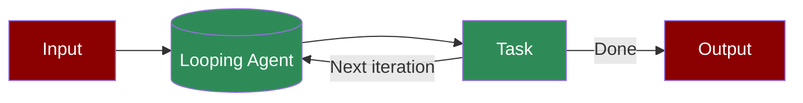

A workflow optimization pattern where agents handle repetitive tasks through automated loops, processing multiple instances efficiently while maintaining consistency.

## Quick Start

<Steps>
    <Step title="Install Package">
        First, install the PraisonAI Agents package:
        ```bash
        pip install praisonaiagents
        ```
    </Step>

    <Step title="Set API Key">
        Set your OpenAI API key as an environment variable in your terminal:
        ```bash
        export OPENAI_API_KEY=your_api_key_here
        ```
    </Step>

    <Step title="Create a file">
        Create a new file `repetitive_agent.py` with the basic setup:
        ```python
        from praisonaiagents import Agent, Task, PraisonAIAgents

        agent = Agent(
            instructions="You are a loop agent that creating a loop of tasks."
        )

        task = Task(
            description="Create the list of tasks to be looped through.",
            agent=agent,
            task_type="loop",
            input_file="tasks.csv"
        )

        agents = PraisonAIAgents(
            agents=[agent],
            tasks=[task],
            process="workflow",
            max_iter=30
        )

        agents.start()
        ```
    </Step>

    <Step title="Start Agents">
        Type this in your terminal to run your agents:
        ```bash
        python repetitive_agent.py
        ```
    </Step>
</Steps>

<Note>
  **Requirements**
  - Python 3.10 or higher
  - OpenAI API key. Generate OpenAI API key [here](https://platform.openai.com/api-keys). Use Other models using [this guide](/models).   
</Note>

## Understanding Repetitive Agents

<Card title="What are Repetitive Agents?" icon="question">
  Repetitive agents enable:
  - Automated task loops
  - Batch processing
  - Consistent task execution
  - Efficient handling of multiple similar tasks
</Card>

## Features

<CardGroup cols={2}>
  <Card title="Task Looping" icon="repeat">
    Process multiple tasks through automated loops.
  </Card>
  <Card title="Batch Processing" icon="layer-group">
    Handle multiple similar tasks efficiently.
  </Card>
  <Card title="Input Management" icon="file-csv">
    Process tasks from structured input files.
  </Card>
  <Card title="Progress Tracking" icon="chart-line">
    Monitor task completion and progress.
  </Card>
</CardGroup>

## Loop Tasks with File Input

Process batches of tasks from CSV or other structured files:

```python
from praisonaiagents import Agent, Task, PraisonAIAgents

# Create agent for processing questions
qa_agent = Agent(
    name="QA Bot",
    role="Answer questions",
    goal="Provide accurate answers to user questions"
)

# Create loop task that processes questions from CSV
loop_task = Task(
    name="process_questions",
    description="Answer each question",
    expected_output="Answer for each question",
    agent=qa_agent,
    task_type="loop",
    input_file="questions.csv"  # Each row becomes a subtask
)

# Create workflow
agents = PraisonAIAgents(
    agents=[qa_agent],
    tasks=[loop_task],
    process="workflow"  # Use workflow for loop tasks
)

# Run the batch processing
result = agents.start()
```

### CSV File Format

The input CSV file should have headers that correspond to task parameters:

```csv
question,context,priority
"What is Python?","Programming language context","high"
"Explain machine learning","AI and ML context","medium"
"How does Docker work?","Container technology context","high"
```

### Advanced File Processing

#### Processing with Multiple Columns

```python
# Agent that uses multiple CSV columns
analyzer = Agent(
    name="Data Analyzer",
    role="Analyze data entries",
    goal="Process and analyze each data entry"
)

# Task that uses multiple columns from CSV
analysis_task = Task(
    name="analyze_entries",
    description="Analyze data: {title} with context: {context}",
    expected_output="Analysis report for each entry",
    agent=analyzer,
    task_type="loop",
    input_file="data_entries.csv",
    # Map CSV columns to task parameters
    column_mapping={
        "title": "title",
        "context": "context",
        "category": "metadata.category"
    }
)
```

#### Processing Different File Types

```python
# JSON file processing
json_task = Task(
    name="process_json_data",
    description="Process JSON entries",
    expected_output="Processed results",
    agent=processor,
    task_type="loop",
    input_file="data.json",
    file_format="json"  # Specify file format
)

# Text file processing (one task per line)
text_task = Task(
    name="process_lines",
    description="Process text: {line}",
    expected_output="Processed line",
    agent=processor,
    task_type="loop",
    input_file="tasks.txt",
    file_format="text"
)
```

### Batch Processing Patterns

#### Parallel Processing

```python
# Configure parallel processing for better performance
agents = PraisonAIAgents(
    agents=[qa_agent],
    tasks=[loop_task],
    process="workflow",
    max_workers=5,  # Process 5 items in parallel
    batch_size=10   # Process in batches of 10
)
```

#### Sequential Processing with Dependencies

```python
# First loop task processes data
extract_task = Task(
    name="extract_data",
    description="Extract data from {source}",
    expected_output="Extracted data",
    agent=extractor,
    task_type="loop",
    input_file="sources.csv"
)

# Second loop task uses results from first
transform_task = Task(
    name="transform_data",
    description="Transform extracted data",
    expected_output="Transformed data",
    agent=transformer,
    task_type="loop",
    depends_on=["extract_data"]  # Uses output from extract_data
)
```

### Error Handling and Recovery

```python
# Configure error handling for batch processing
loop_task = Task(
    name="process_with_recovery",
    description="Process item safely",
    expected_output="Processed result",
    agent=processor,
    task_type="loop",
    input_file="items.csv",
    error_handling={
        "continue_on_error": True,  # Don't stop on errors
        "max_retries": 3,          # Retry failed items
        "log_errors": True         # Log all errors
    }
)
```

### Progress Tracking

Monitor batch processing progress:

```python
from praisonaiagents.callbacks import Callback

class BatchProgressTracker(Callback):
    def __init__(self):
        self.processed = 0
        self.total = 0
        
    def on_task_start(self, task, **kwargs):
        if task.task_type == "loop" and self.total == 0:
            # Count total items
            import csv
            with open(task.input_file, 'r') as f:
                self.total = sum(1 for line in csv.reader(f)) - 1
    
    def on_subtask_complete(self, subtask, result, **kwargs):
        self.processed += 1
        print(f"Progress: {self.processed}/{self.total} ({self.processed/self.total*100:.1f}%)")

# Use progress tracker
agents = PraisonAIAgents(
    agents=[qa_agent],
    tasks=[loop_task],
    callbacks=[BatchProgressTracker()]
)
```

### Output Aggregation

Collect and aggregate results from loop tasks:

```python
# Task that aggregates all loop results
summary_task = Task(
    name="summarize_results",
    description="Create summary of all processed items",
    expected_output="Comprehensive summary report",
    agent=summarizer,
    depends_on=["process_questions"],  # Depends on loop task
    aggregate_results=True  # Receives all loop results
)

# Complete workflow
agents = PraisonAIAgents(
    agents=[qa_agent, summarizer],
    tasks=[loop_task, summary_task],
    process="workflow"
)
```

### Best Practices

1. **File Validation**: Always validate input files before processing
```python
import os
import csv

def validate_input_file(filepath):
    if not os.path.exists(filepath):
        raise FileNotFoundError(f"Input file not found: {filepath}")
    
    with open(filepath, 'r') as f:
        reader = csv.reader(f)
        headers = next(reader, None)
        if not headers:
            raise ValueError("CSV file is empty or has no headers")
    
    return True
```

2. **Memory Management**: For large files, use streaming
```python
loop_task = Task(
    name="process_large_file",
    description="Process item",
    expected_output="Result",
    agent=processor,
    task_type="loop",
    input_file="large_data.csv",
    streaming=True,  # Process one item at a time
    chunk_size=100   # Read 100 rows at a time
)
```

3. **Result Storage**: Save results progressively
```python
loop_task = Task(
    name="process_and_save",
    description="Process and save",
    expected_output="Saved result",
    agent=processor,
    task_type="loop",
    input_file="data.csv",
    output_file="results.csv",  # Save results to file
    append_mode=True  # Append results as processed
)
```

## Troubleshooting

<CardGroup cols={2}>
  <Card title="Loop Issues" icon="triangle-exclamation">
    If loops aren't working as expected:
    - Verify input file format
    - Check task configurations
    - Enable verbose mode for debugging
  </Card>

  <Card title="Performance Issues" icon="gauge-high">
    If processing is slow:
    - Check batch sizes
    - Verify resource allocation
    - Monitor memory usage
  </Card>
</CardGroup>

## Next Steps

<CardGroup cols={2}>
  <Card title="AutoAgents" icon="robot" href="./autoagents">
    Learn about automatically created and managed AI agents
  </Card>
  <Card title="Mini Agents" icon="microchip" href="./mini">
    Explore lightweight, focused AI agents
  </Card>
</CardGroup>

<Note>
  For optimal results, ensure your input files are properly formatted and your task configurations are appropriate for your use case.
</Note>
