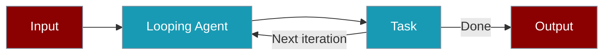

Run the same agent step over a list, CSV, or text file — then aggregate results in one workflow.

```python
from praisonaiagents import Agent, AgentFlow, loop

processor = Agent(
    name="Processor",
    instructions="Process each item thoroughly.",
)

workflow = AgentFlow(
    steps=[
        loop(processor, over="topics"),
        Agent(name="Summariser", instructions="Summarise all processed results."),
    ],
    variables={"topics": ["AI Ethics", "Machine Learning", "Neural Networks"]},
)

result = workflow.start("Research and summarise these AI topics")
```


```mermaid
graph LR
    In[Input] --> LoopAgent[Looping Agent]
    LoopAgent --> Task[Task]
    Task -->|Next iteration| LoopAgent
    Task -->|Done| Out[Output]

    classDef agent fill:#8B0000,stroke:#7C90A0,color:#fff
    classDef tool fill:#189AB4,stroke:#7C90A0,color:#fff

    class In,Out agent
    class LoopAgent,Task tool
    classDef agent fill:#8B0000,color:#fff
    classDef tool fill:#189AB4,color:#fff
```

## Quick Start

<Steps>
<Step title="Simple Usage">

Loop an agent over a variable list:

```python
from praisonaiagents import Agent, AgentFlow, loop

processor = Agent(name="Processor", instructions="Process each item thoroughly.")

workflow = AgentFlow(
    steps=[
        loop(processor, over="topics"),
        Agent(name="Summariser", instructions="Summarise all processed results."),
    ],
    variables={"topics": ["AI Ethics", "Machine Learning", "Neural Networks"]},
)

result = workflow.start("Research and summarise these AI topics")
print(result["output"][:500])
```

</Step>

<Step title="With Configuration">

Process rows from a CSV file with a custom handler:

```python
from praisonaiagents import Agent, AgentFlow, WorkflowContext, StepResult, loop

support_agent = Agent(
    name="Support Agent",
    instructions="Resolve customer issues efficiently.",
    llm="gpt-4o-mini",
)

def handle_customer(ctx: WorkflowContext) -> StepResult:
    row = ctx.variables.get("item", {})
    name = row.get("name", "unknown")
    issue = row.get("issue", "unknown")
    response = support_agent.chat(f"Help {name} with: {issue}")
    return StepResult(output=f"{name}: {response}")

workflow = AgentFlow(steps=[loop(handle_customer, from_csv="customers.csv")])
result = workflow.start("Process all customer issues")
```

</Step>
</Steps>

---

## How It Works

```mermaid
sequenceDiagram
    participant Flow as AgentFlow
    participant Loop as loop()
    participant Agent
    participant File as CSV / list

    Flow->>Loop: iterate over items
    Loop->>File: read row or list item
    Loop->>Agent: run step per item
    Agent-->>Loop: StepResult
    Loop-->>Flow: loop_outputs
```

| Input source | Parameter | Behaviour |
|--------------|-----------|-----------|
| Variable list | `over="topics"` | Iterates `variables["topics"]` |
| CSV file | `from_csv="data.csv"` | One sub-step per row |
| Text file | `from_file="urls.txt"` | One sub-step per line |
| Parallel | `parallel=True` | Runs iterations concurrently |

Loop outputs are stored in `result["variables"]["loop_outputs"]` by default.

---

## Common Patterns

### CSV customer support

```csv
name,issue
John,Billing problem
Jane,Technical issue
Sarah,Password reset
```

```python
workflow = AgentFlow(steps=[loop(handle_customer, from_csv="customers.csv")])
```

### Line-by-line URL analysis

```python
def analyse_url(ctx: WorkflowContext) -> StepResult:
    url = ctx.variables.get("item", "")
    result = url_agent.chat(f"Analyse this website: {url}")
    return StepResult(output=f"{url}: {result}")

workflow = AgentFlow(steps=[loop(analyse_url, from_file="urls.txt")])
```

### Parallel batch processing

```python
workflow = AgentFlow(
    steps=[loop(process_item, from_csv="data.csv", parallel=True, max_workers=4)]
)
```

---

## Best Practices

<AccordionGroup>

<Accordion title="Validate input files before starting">

Check that CSV files exist and have headers. Empty files produce zero iterations silently.

</Accordion>

<Accordion title="Use parallel=True for independent items">

When sub-steps do not depend on each other, set `parallel=True` and cap workers with `max_workers`.

</Accordion>

<Accordion title="Aggregate with a final summariser step">

Add a summariser agent after the loop step rather than embedding aggregation inside each iteration.

</Accordion>

<Accordion title="Keep loop handlers focused">

Pass row data via `ctx.variables["item"]` and return a `StepResult` — avoid side effects outside the workflow context.

</Accordion>

</AccordionGroup>

---

## Related

<CardGroup cols={2}>
<Card title="Workflow Loop" icon="arrows-rotate" href="/docs/features/workflow-loop">
  Loop patterns inside multi-step workflows
</Card>
<Card title="Workflow Parallel Execution" icon="layer-group" href="/docs/features/workflow-parallel">
  Run independent workflow branches concurrently
</Card>
</CardGroup>
