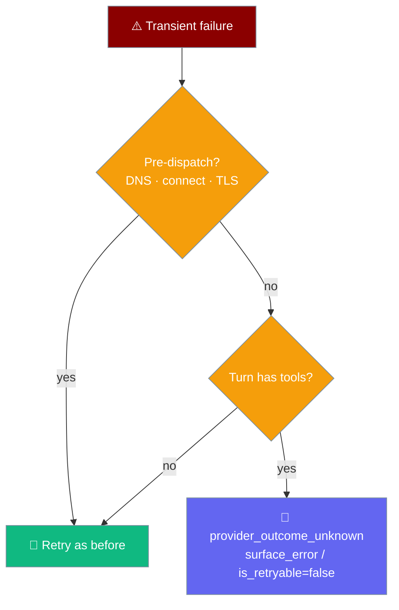
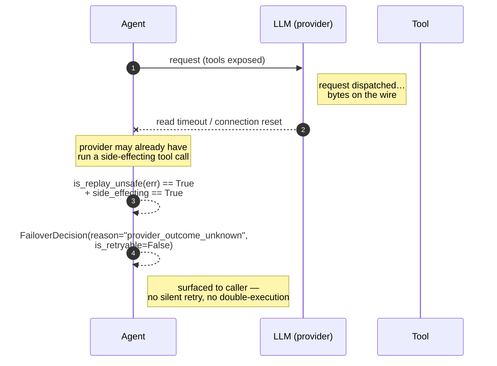

On a tool-calling turn, PraisonAI never silently retries a failure that happened after the request was dispatched — it surfaces `provider_outcome_unknown` so you decide.



<Note>
If your tool ran but the network dropped, PraisonAI tells you instead of running the tool twice.
</Note>

## Quick Start

<Steps>
<Step title="Nothing to configure">
Replay-safety is default-on for tool-calling turns. No new config keys, no new Agent params.

```python
from praisonaiagents import Agent

agent = Agent(
    name="Bookings",
    instructions="Book flights on request.",
    tools=[book_flight],  # a side-effecting tool
)

# On a mid-response network failure you'll see:
#   FailoverDecision(reason='provider_outcome_unknown', is_retryable=False)
# instead of a silent retry that could book the flight twice.
agent.start("Book me on the next flight to Tokyo")
```
</Step>

<Step title="Handle the surfaced outcome">
A surfaced `provider_outcome_unknown` means the provider may already have run your tool — you choose whether to verify state, ask the user, or retry deliberately.

```python
from praisonaiagents import Agent

agent = Agent(
    name="Bookings",
    instructions="Book flights on request.",
    tools=[book_flight],
)

try:
    agent.start("Book me on the next flight to Tokyo")
except Exception as e:
    # reason='provider_outcome_unknown' — decide, don't blindly replay
    print("Provider outcome unknown; verifying booking state before retrying.")
```
</Step>
</Steps>

---

## The Invariant

On a tool-calling turn, a **post-dispatch** transient failure surfaces as `provider_outcome_unknown` instead of auto-retrying. Tool-less turns and pre-dispatch failures still auto-retry exactly as before.

Replaying a post-dispatch failure on a tool-calling turn could **double-execute** the tool — double billing, or a re-run of a side-effecting action. The gate stops that.



---

## What Counts as Post-Dispatch (Replay-Unsafe)

Failures that happen once bytes are on the wire — the provider may already have produced output.

| Signal | Exception |
|--------|-----------|
| Read timeout | `httpx.ReadTimeout` / `requests` `ReadTimeout` |
| Read timeout (urllib3) | `urllib3.ReadTimeoutError` |
| Connection reset mid-response | `ConnectionResetError` |
| Truncated body | `ChunkedEncodingError` |
| Partial read | `http.client.IncompleteRead` |
| Peer closed mid-response | `httpx.RemoteProtocolError` |
| Protocol error mid-response | `urllib3.ProtocolError` |
| Provider request timeout (post-send) | `APITimeoutError` |

Message patterns treated as post-dispatch: `read timeout`, `connection reset`, `peer closed`, `incomplete read`, `chunked`, `response ended prematurely`, `server disconnected`.

## What Counts as Pre-Dispatch (Replay-Safe)

Failures that prove the request never reached the provider — always safe to replay, retried as before.

| Signal | Exception |
|--------|-----------|
| Connect timeout | `ConnectTimeout` / `ConnectTimeoutError` |
| Connection refused | `ConnectionRefusedError` |
| Connect error (httpx) | `ConnectError` |
| Connection never established | `NewConnectionError` |
| DNS resolution failure | `socket.gaierror` |
| TLS handshake failure | `ssl.SSLError` / `SSLCertVerificationError` |

Message patterns treated as pre-dispatch: `connect timed out`, `connection refused`, `name resolution`, `getaddrinfo`, `ssl`, `handshake`, `tls`.

<Info>
Ambiguous transient errors — plain 5xx or "service unavailable" — default to **safe**, preserving existing auto-retry behaviour.
</Info>

---

## Building Your Own Retry Wrapper

The classifier is public — import it if you write your own retry loop.

```python
from praisonaiagents.llm.error_classifier import is_replay_unsafe

try:
    call_provider(...)
except Exception as e:
    if is_replay_unsafe(e) and turn_has_tools:
        raise  # surface — do not replay
    # otherwise: safe to retry
```

`is_replay_unsafe(error)` returns `True` when the failure signals the provider may already have processed the request.

---

## Best Practices

<AccordionGroup>
<Accordion title="Treat provider_outcome_unknown as 'verify, then decide'">
The provider may already have run your tool. Check downstream state — was the flight booked, the charge made — before retrying the turn.
</Accordion>

<Accordion title="Make side-effecting tools idempotent where you can">
Idempotency keys turn a risky replay into a safe one. When a tool is idempotent, a deliberate retry after `provider_outcome_unknown` is cheap.
</Accordion>

<Accordion title="Only block retries on tool-calling turns">
Tool-less completions have no external side effects. Replaying a post-dispatch failure there is safe, so the gate only fires when the turn exposes tools.
</Accordion>

<Accordion title="Trust the classifier over message text">
`is_replay_unsafe` walks the exception's class hierarchy first, so provider SDK subclasses are matched even when their messages vary.
</Accordion>
</AccordionGroup>

---

## Related

<CardGroup cols={2}>
<Card title="Tools" icon="wrench" href="/features/tools">
Author side-effecting tools that behave well under replay-safety.
</Card>
<Card title="LLM Error Classification" icon="rotate" href="/features/llm-error-classification">
How PraisonAI categorises provider errors for retry decisions.
</Card>
</CardGroup>
