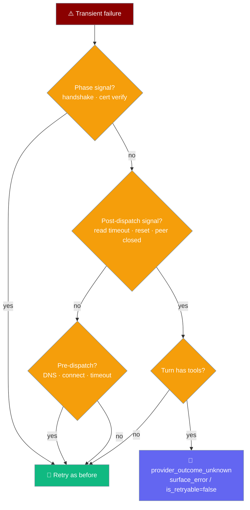
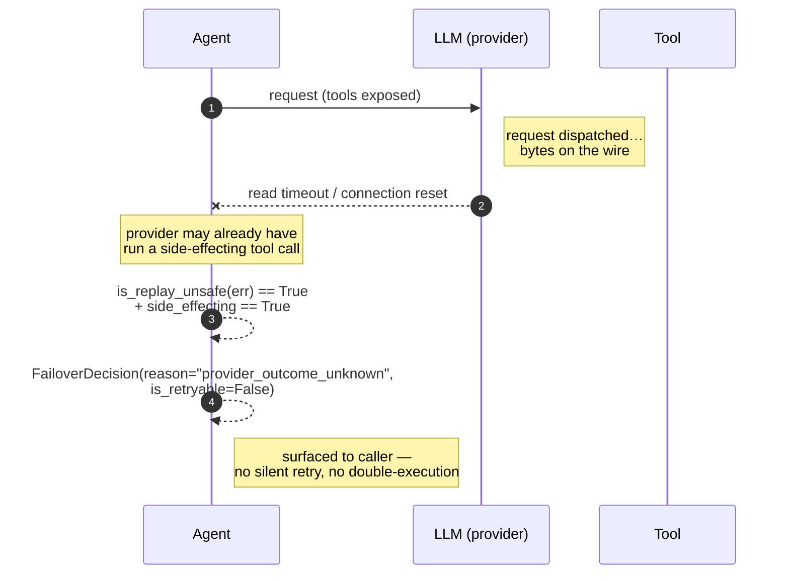

On a tool-calling turn, PraisonAI never silently retries a failure that happened after the request was dispatched — not from the retry driver, and not from the streaming → non-streaming fallback. The post-dispatch error surfaces to your code so you decide what to do.


```mermaid
graph TB
    A[⚠️ Transient failure] --> P{Phase signal?<br/>handshake · cert verify}
    P -- yes --> R[🔁 Retry as before]
    P -- no --> B{Post-dispatch signal?<br/>read timeout · reset · peer closed}
    B -- yes --> C{Turn has tools?}
    B -- no --> D{Pre-dispatch?<br/>DNS · connect · timeout}
    D -- yes --> R
    D -- no --> R
    C -- no --> R
    C -- yes --> S[🚦 provider_outcome_unknown<br/>surface_error / is_retryable=false]

    classDef fail fill:#8B0000,stroke:#7C90A0,color:#fff
    classDef check fill:#F59E0B,stroke:#7C90A0,color:#fff
    classDef retry fill:#10B981,stroke:#7C90A0,color:#fff
    classDef surface fill:#6366F1,stroke:#7C90A0,color:#fff
    class A fail
    class P,B,C,D check
    class R retry
    class S surface
```

<Note>
If your tool ran but the network dropped, PraisonAI tells you instead of running the tool twice.
</Note>

## Quick Start

<Steps>
<Step title="Nothing to configure">
Replay-safety is default-on for tool-calling turns. No new config keys, no new Agent params.

```python
from praisonaiagents import Agent

agent = Agent(
    name="Bookings",
    instructions="Book flights on request.",
    tools=[book_flight],  # a side-effecting tool
)

# On a mid-response network failure you'll see:
#   FailoverDecision(reason='provider_outcome_unknown', is_retryable=False)
# instead of a silent retry that could book the flight twice.
agent.start("Book me on the next flight to Tokyo")
```
</Step>

<Step title="Handle the surfaced outcome">
A surfaced `provider_outcome_unknown` means the provider may already have run your tool — you choose whether to verify state, ask the user, or retry deliberately.

```python
from praisonaiagents import Agent

agent = Agent(
    name="Bookings",
    instructions="Book flights on request.",
    tools=[book_flight],
)

try:
    agent.start("Book me on the next flight to Tokyo")
except Exception as e:
    # reason='provider_outcome_unknown' — decide, don't blindly replay
    print("Provider outcome unknown; verifying booking state before retrying.")
```
</Step>
</Steps>

---

## The Invariant

On a tool-calling turn, a **post-dispatch** transient failure surfaces as `provider_outcome_unknown` instead of auto-retrying. Tool-less turns and pre-dispatch failures still auto-retry exactly as before.

Replaying a post-dispatch failure on a tool-calling turn could **double-execute** the tool — double billing, or a re-run of a side-effecting action. The gate stops that.

<Note>
Extended in [PR #5443](https://github.com/MervinPraison/PraisonAI/pull/5443) — generic TLS/SSL labels no longer mask explicit post-dispatch signals. The replay-safety contract was first introduced for [#3860](https://github.com/MervinPraison/PraisonAI/pull/3860).
</Note>


```mermaid
sequenceDiagram
    autonumber
    participant Agent
    participant LLM as LLM (provider)
    participant Tool

    Agent->>LLM: request (tools exposed)
    Note right of LLM: request dispatched…<br/>bytes on the wire
    LLM--xAgent: read timeout / connection reset
    Note over Agent: provider may already have<br/>run a side-effecting tool call
    Agent-->>Agent: is_replay_unsafe(err) == True<br/>+ side_effecting == True
    Agent-->>Agent: FailoverDecision(reason="provider_outcome_unknown",<br/>is_retryable=False)
    Note right of Agent: surfaced to caller —<br/>no silent retry, no double-execution
```

---

## Streaming → Non-Streaming Fallback is Gated Too

When streaming fails, PraisonAI used to silently retry the same request with `stream=False`. On a tool-calling turn that is still a provider replay — the tool may already have run server-side mid-response. The fallback now respects the same replay-safety gate.

```mermaid
sequenceDiagram
    autonumber
    participant Agent
    participant LLM as LLM (streaming)
    participant Tool

    Agent->>LLM: request (stream=True, tools exposed)
    Note right of LLM: streaming started…<br/>bytes on the wire
    LLM--xAgent: read timeout mid-stream
    Note over Agent: provider may already have<br/>run a side-effecting tool call
    Agent-->>Agent: is_replay_unsafe_chain(err) == True<br/>+ side_effecting == True
    Agent-->>Agent: surface original error
    Note right of Agent: NO second request with stream=False

    classDef agent fill:#8B0000,stroke:#7C90A0,color:#fff
    classDef llm fill:#189AB4,stroke:#7C90A0,color:#fff
    classDef tool fill:#F59E0B,stroke:#7C90A0,color:#fff

    class Agent agent
    class LLM llm
    class Tool tool
```

Both fallback sites are gated:

| Site | Where | What was happening before | What happens now |
|------|-------|---------------------------|------------------|
| `LLM.get_response` streaming branch | `praisonaiagents/llm/llm.py` | `use_streaming = False` on any streaming exception | On a tool turn (`formatted_tools` or `execute_tool_fn`), a replay-unsafe streaming failure re-raises instead of reissuing with `stream=False` |
| `ChatMixin._stream_fallback_chat` | `praisonaiagents/agent/chat_mixin.py` | Reissued `chat()` unconditionally | On a tool turn (request `tools` or instance `self.tools`), a replay-unsafe streaming failure surfaces instead of reissuing |

Tool-less turns and pre-dispatch failures (connect / DNS / TLS) still fall back to non-streaming exactly as before.

### Agent example

```python
from praisonaiagents import Agent

def book_flight(destination: str) -> str:
    """Side-effecting tool — charges a card, calls an API."""
    ...

agent = Agent(
    name="Bookings",
    instructions="Book flights on request.",
    tools=[book_flight],
)

try:
    # Streams by default; if the stream drops mid-response AFTER
    # the request reached the provider, you get the original error
    # instead of a silent stream=False retry that could book twice.
    agent.start("Book me on the next flight to Tokyo", stream=True)
except Exception as e:
    print("Streaming failed mid-response; verifying booking state before retrying.")
```

---

## What Counts as Post-Dispatch (Replay-Unsafe)

Failures that happen once bytes are on the wire — the provider may already have produced output.

| Signal | Exception |
|--------|-----------|
| Read timeout | `httpx.ReadTimeout` / `requests` `ReadTimeout` |
| Read timeout (urllib3) | `urllib3.ReadTimeoutError` |
| Connection reset mid-response | `ConnectionResetError` |
| Truncated body | `ChunkedEncodingError` |
| Partial read | `http.client.IncompleteRead` |
| Peer closed mid-response | `httpx.RemoteProtocolError` |
| Protocol error mid-response | `urllib3.ProtocolError` |
| Provider request timeout (post-send) | `APITimeoutError` |

Message patterns treated as post-dispatch: `read timeout`, `connection reset`, `reset by peer`, `peer closed`, `incomplete read`, `chunked`, `response ended prematurely`, `server disconnected`.

## What Counts as Pre-Dispatch (Replay-Safe)

Failures that prove the request never reached the provider — always safe to replay, retried as before.

| Signal | Exception |
|--------|-----------|
| Connect timeout | `ConnectTimeout` / `ConnectTimeoutError` |
| Connection refused | `ConnectionRefusedError` |
| Connect error (httpx) | `ConnectError` |
| Connection never established | `NewConnectionError` |
| DNS resolution failure | `socket.gaierror` |
| TLS handshake failure *(message must mention `handshake`)* | `ssl.SSLError` |
| Certificate verification failure | `ssl.SSLError` (with `certificate verify failed` / `cert verif` in message) or `ssl.SSLCertVerificationError` |

Message patterns treated as pre-dispatch: `connect timed out`, `connection refused`, `name resolution`, `getaddrinfo`, `handshake`, `certificate verify failed`, `cert verif`.

The bare `ssl` and `tls` tokens are **not** pre-dispatch signals — `ssl.SSLError` is raised for both handshake failures *and* mid-response read/reset failures, so a transport label alone does not establish that the request failed before dispatch. Use the phase-specific `handshake` or `certificate verify` message to mark a TLS error as pre-dispatch.

### Phase-Specific Precedence

A TLS **handshake** or **certificate verification** phase completes before any request byte is written, so an error naming either phase wins over a post-dispatch token.

| Example message | Classified as | Why |
|-----------------|---------------|-----|
| `connection reset by peer during TLS handshake` | pre-dispatch (safe) | handshake phase wins over `reset` |
| `server disconnected during TLS handshake` | pre-dispatch (safe) | handshake phase wins over `disconnected` |
| `certificate verify failed; connection reset` | pre-dispatch (safe) | cert-verify phase wins over `reset` |
| `SSL connection reset by peer` | post-dispatch (unsafe) | no phase signal — generic transport label does not win |
| `TLS transport: read timeout` | post-dispatch (unsafe) | no phase signal — generic transport label does not win |

<Info>
Ambiguous transient errors — plain 5xx or "service unavailable" — default to **safe**, preserving existing auto-retry behaviour.
</Info>

---

## Building Your Own Retry Wrapper

The classifier is public — import it if you write your own retry loop.

```python
from praisonaiagents.llm.error_classifier import is_replay_unsafe

try:
    call_provider(...)
except Exception as e:
    if is_replay_unsafe(e) and turn_has_tools:
        raise  # surface — do not replay
    # otherwise: safe to retry
```

`is_replay_unsafe(error)` returns `True` when the failure signals the provider may already have processed the request.

### Walk the Exception Chain

The streaming path re-raises wrapping the cause (`raise Exception(...) from read_timeout`), so the replay-unsafe signal lives on `__cause__` / `__context__` rather than the outermost exception. Use `is_replay_unsafe_chain()` to walk the chain:

```python
from praisonaiagents.llm.error_classifier import is_replay_unsafe_chain

try:
    call_provider_stream(...)
except Exception as e:
    # Even if `e` is a wrapper, is_replay_unsafe_chain finds the
    # read-timeout underneath via __cause__/__context__.
    if is_replay_unsafe_chain(e) and turn_has_tools:
        raise  # surface — do not fall back to non-streaming or retry
    # otherwise: safe to retry / fall back
```

| Helper | Walks cause chain? | Use when |
|--------|-------------------|----------|
| `is_replay_unsafe(error)` | ❌ | You hold the original exception |
| `is_replay_unsafe_chain(error)` | ✅ | The exception may wrap the real signal (streaming paths, re-raise with `from`) |

The chain is treated as unsafe if **any** link is unsafe — a pre-dispatch (safe) link does not override an unsafe one found elsewhere in the chain.

---

## Common Patterns

A TLS-labelled read timeout or mid-response reset on a tool turn now surfaces instead of silently retrying.

```python
import ssl
from praisonaiagents.llm.error_classifier import is_replay_unsafe

# Fixed in PR #5443 — previously returned False, retrying twice could re-run the tool.
assert is_replay_unsafe(Exception("TLS transport: read timeout")) is True
assert is_replay_unsafe(ssl.SSLError("SSL connection reset by peer")) is True

# Phase-specific pre-dispatch signals still auto-retry safely.
assert is_replay_unsafe(ssl.SSLError("TLS handshake failed")) is False
assert is_replay_unsafe(ssl.SSLError("certificate verify failed")) is False
assert is_replay_unsafe(ssl.SSLError(
    "connection reset by peer during TLS handshake"
)) is False  # phase signal wins over reset token
```

---

## Best Practices

<AccordionGroup>
<Accordion title="Treat provider_outcome_unknown as 'verify, then decide'">
The provider may already have run your tool. Check downstream state — was the flight booked, the charge made — before retrying the turn.
</Accordion>

<Accordion title="Make side-effecting tools idempotent where you can">
Idempotency keys turn a risky replay into a safe one. When a tool is idempotent, a deliberate retry after `provider_outcome_unknown` is cheap.
</Accordion>

<Accordion title="Only block retries on tool-calling turns">
Tool-less completions have no external side effects. Replaying a post-dispatch failure there is safe, so the gate only fires when the turn exposes tools.
</Accordion>

<Accordion title="Trust the classifier over message text">
`is_replay_unsafe` walks the exception's class hierarchy first, so provider SDK subclasses are matched even when their messages vary. For paths that re-raise with `from` (streaming is one), use `is_replay_unsafe_chain()` so a wrapped cause is still detected.
</Accordion>
</AccordionGroup>

---

## Related

<CardGroup cols={2}>
<Card title="Tools" icon="wrench" href="/features/tools">
Author side-effecting tools that behave well under replay-safety.
</Card>
<Card title="LLM Error Classification" icon="rotate" href="/features/llm-error-classification">
How PraisonAI categorises provider errors for retry decisions.
</Card>
<Card icon="bolt" href="/features/streaming">
How tool turns stay safe when a stream drops mid-response.
</Card>
</CardGroup>
