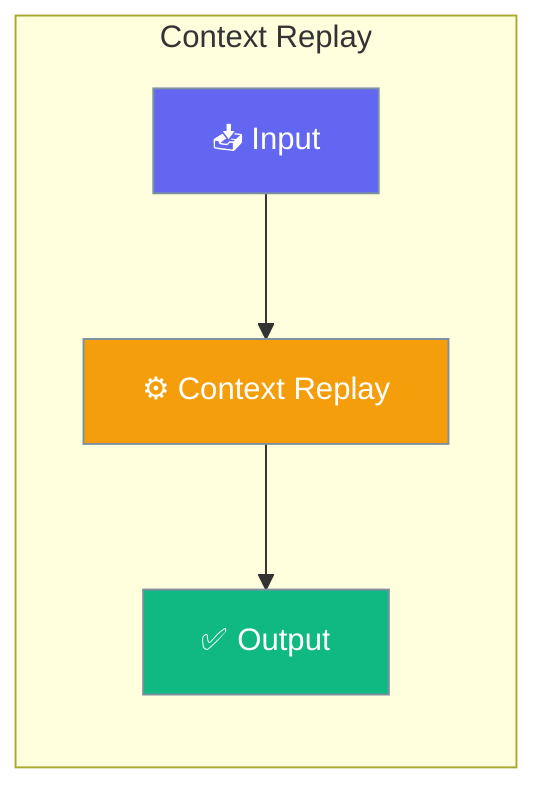

# Context Replay

Context Replay allows you to track and replay the context passed to agents during execution. This is invaluable for debugging, understanding agent behavior, and optimizing context usage.




## Quick Start


<Steps>
<Step title="Simple Usage">
### 1. Run with Replay Saving

```bash
# Run a recipe and save the replay trace
praisonai recipe run my-recipe --save

# Run agents.yaml with replay saving
praisonai agents.yaml --save

# Run workflow with replay saving
praisonai workflow run my-workflow --save
```
</Step>

<Step title="With Configuration">
### 2. List Available Replays

```bash
praisonai replay list
```

### 3. Replay a Session

```bash
# Interactive step-through replay
praisonai replay context <session_id>

# View agent flow visualization
praisonai replay flow <session_id>

# Show all events (non-interactive)
praisonai replay show <session_id>
```

### 4. Clean Up Old Traces

```bash
praisonai replay cleanup --max-age 7
```

### Enable Tracing

```python
from praisonaiagents import Agent
from praisonaiagents.trace import ContextTraceEmitter, ContextListSink

# Create a trace sink
sink = ContextListSink()
emitter = ContextTraceEmitter(sink=sink, session_id="my-session")

# Use the emitter to track context changes
emitter.session_start()
emitter.agent_start("researcher")
emitter.message_added("researcher", "user", "Find info about AI", 1, 100)
# ... agent execution ...
emitter.agent_end("researcher")
emitter.session_end()

# Access events
for event in sink.get_events():
    print(f"{event.event_type}: {event.agent_name}")
```

### Persist to File

```python
from praisonai.replay import ContextTraceWriter
from praisonaiagents.trace import ContextTraceEmitter

# Write traces to disk
writer = ContextTraceWriter(session_id="my-session")
emitter = ContextTraceEmitter(sink=writer, session_id="my-session")

emitter.session_start()
# ... your agent code ...
emitter.session_end()
writer.close()  # Flush and close
```

### Replay via CLI

```bash
# List available traces
praisonai replay list

# Interactive replay
praisonai replay context my-session

# Show events without interaction
praisonai replay show my-session

# Filter by agent
praisonai replay show my-session --agent researcher

# JSON output
praisonai replay show my-session --json
```
</Step>
</Steps>


## Best Practices

<AccordionGroup>
  <Accordion title="Start simple">
    Enable the feature with a single parameter before adding configuration. Verify it works, then layer in options.
  </Accordion>
  <Accordion title="Use environment variables for secrets">
    Never hardcode API keys or tokens. Use `os.getenv("KEY_NAME")` to read from environment variables.
  </Accordion>
  <Accordion title="Test with minimal examples first">
    Copy the Quick Start example, run it, then extend it. This confirms your environment is set up correctly.
  </Accordion>
  <Accordion title="Check the logs">
    Set `verbose=True` on your agent to see detailed execution logs when debugging unexpected behavior.
  </Accordion>
</AccordionGroup>

## Related

<CardGroup cols={2}>
  <Card title="Features Overview" icon="grid-2" href="/docs/features">
    Browse all PraisonAI features
  </Card>
  <Card title="Quick Start" icon="rocket" href="/docs/introduction">
    Get started with PraisonAI agents
  </Card>
</CardGroup>
