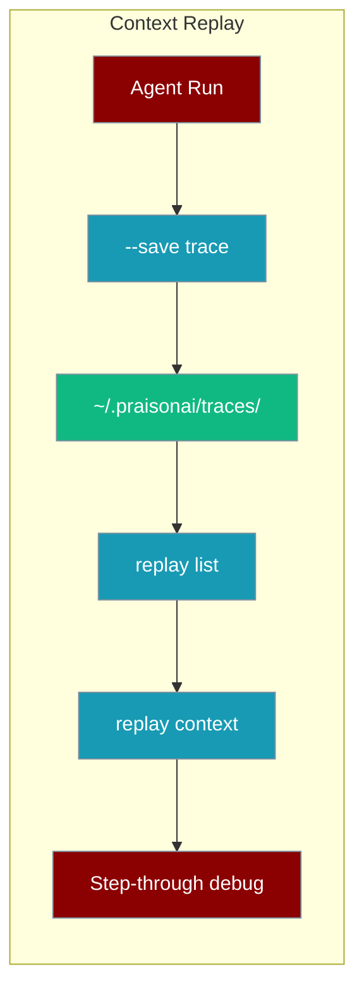
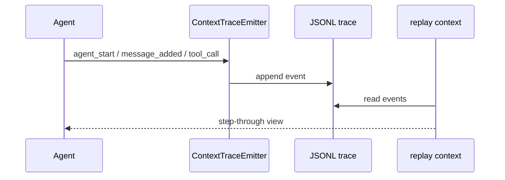

```python
from praisonaiagents import Agent

agent = Agent(name="replay-agent", instructions="Replay recorded agent sessions for debugging.")
agent.start("Replay the session from yesterday to reproduce the bug.")
```

<Note>
**Different feature from the [Run-State Journal](/docs/features/run-state-journal).** This page is about *context replay* — recording a run's trace and stepping through it in a debugger. The **run-state journal** is about *resumable execution* — persisting the per-event cursor so a crashed run continues without re-executing tools. Pick the run-state journal for crash-safe production runs; pick context replay to inspect a completed run for debugging.
</Note>

The user saves a trace during a run, then steps through recorded context events to debug handoffs and tools.


Record agent context events during a run, then step through them interactively to debug handoffs, tool calls, and token growth.

```bash
praisonai recipe run my-recipe --save
praisonai replay list
praisonai replay context <session_id>
```



## Quick Start

<Steps>
<Step title="Simple Usage">

Save a trace during a recipe or workflow run:

```bash
# Recipe run with trace saving
praisonai recipe run my-recipe --save

# agents.yaml or workflow
praisonai agents.yaml --save
praisonai workflow run my-workflow --save

# List and replay
praisonai replay list
praisonai replay context <session_id>
```

</Step>

<Step title="With Configuration">

Emit traces from Python and persist to disk:

```python
from praisonai.replay import ContextTraceWriter
from praisonaiagents import ContextTraceEmitter

writer = ContextTraceWriter(session_id="my-session")
emitter = ContextTraceEmitter(sink=writer, session_id="my-session", redact=True)

emitter.session_start()
emitter.agent_start("researcher")
emitter.message_added("researcher", "user", "Find info about AI", 1, 100)
emitter.agent_end("researcher")
emitter.session_end()
writer.close()
```

</Step>
</Steps>

---

## How It Works



| Event type | Description |
|------------|-------------|
| `SESSION_START` / `SESSION_END` | Session boundaries |
| `AGENT_START` / `AGENT_END` | Agent lifecycle |
| `AGENT_HANDOFF` | Handoff to another agent |
| `MESSAGE_ADDED` | Context message appended |
| `TOOL_CALL_START` / `TOOL_CALL_END` | Tool execution |
| `LLM_REQUEST` / `LLM_RESPONSE` | LLM API calls |
| `CONTEXT_SNAPSHOT` | Full context state captured |

Traces are stored as JSONL in `~/.praisonai/traces/`.

---

## CLI Commands

| Command | Purpose |
|---------|---------|
| `praisonai replay list` | List available traces |
| `praisonai replay context <id>` | Interactive step-through |
| `praisonai replay flow <id>` | Agent flow visualisation |
| `praisonai replay show <id>` | Dump events (non-interactive) |
| `praisonai replay delete <id>` | Delete a trace |
| `praisonai replay cleanup` | Remove old traces |

### Interactive navigation

In `replay context`: `Enter`/`n` next, `p` previous, `g <N>` go to event, `q` quit.

### Filters

```bash
praisonai replay show my-session --agent researcher
praisonai replay show my-session --type agent_start
praisonai replay show my-session --json
```

---

## Common Patterns

### In-memory trace during tests

```python
from praisonaiagents import ContextTraceEmitter, ContextListSink

sink = ContextListSink()
emitter = ContextTraceEmitter(sink=sink, session_id="test-session")

emitter.session_start()
# ... agent execution ...
emitter.session_end()

for event in sink.get_events():
    print(f"{event.event_type}: {event.agent_name}")
```

### Read traces programmatically

```python
from praisonai.replay import ContextTraceReader, ReplayPlayer

reader = ContextTraceReader("my-session")
if reader.exists:
    player = ReplayPlayer(reader, use_rich=True)
    player.run()
```

### Cleanup old traces

```bash
praisonai replay cleanup --max-age 7
praisonai replay cleanup --max-size 200 --dry-run
```

---

## Best Practices

<AccordionGroup>

<Accordion title="Use meaningful session IDs">

Include a timestamp or task identifier so traces are easy to find in `replay list`.

</Accordion>

<Accordion title="Keep redaction enabled">

`redact=True` (default) strips sensitive data from persisted traces.

</Accordion>

<Accordion title="Use snapshots sparingly">

Full `CONTEXT_SNAPSHOT` events can be large — prefer message and tool events for routine debugging.

</Accordion>

<Accordion title="Run cleanup periodically">

Use `replay cleanup --max-age 7` so trace storage does not grow unbounded on developer machines.

</Accordion>

</AccordionGroup>

---

## Related

<CardGroup cols={2}>
<Card title="Run History" icon="clock-rotate-left" href="/docs/features/run-history">
  Inspect past agent runs and session metadata
</Card>
<Card title="Observability Hooks" icon="chart-line" href="/docs/features/observability-hooks">
  Emit structured events for external observability tools
</Card>
</CardGroup>
