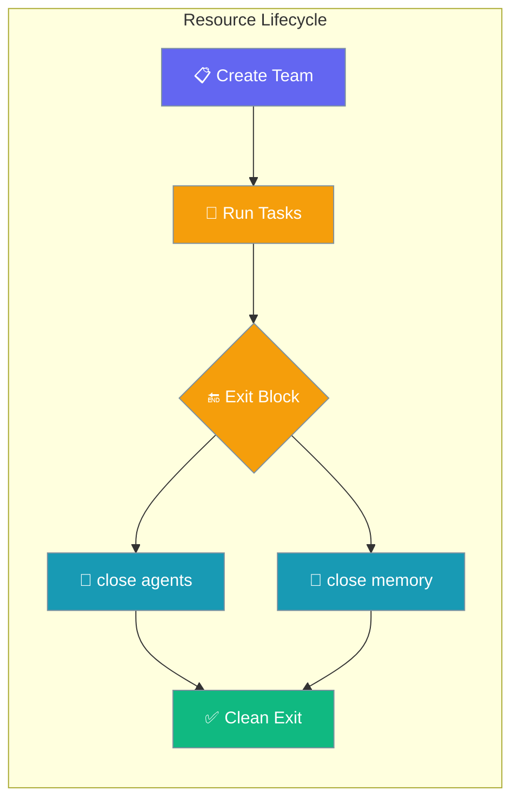
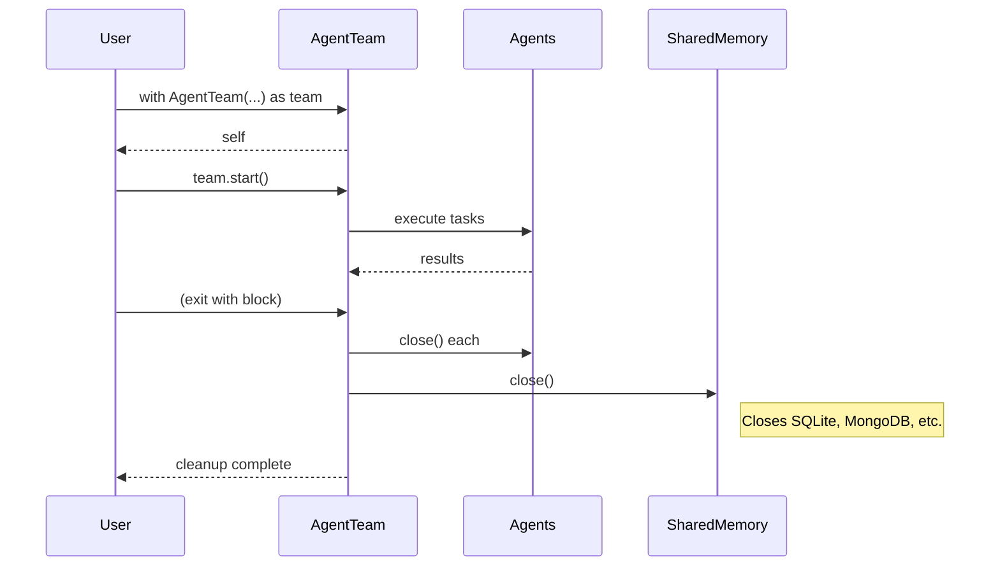
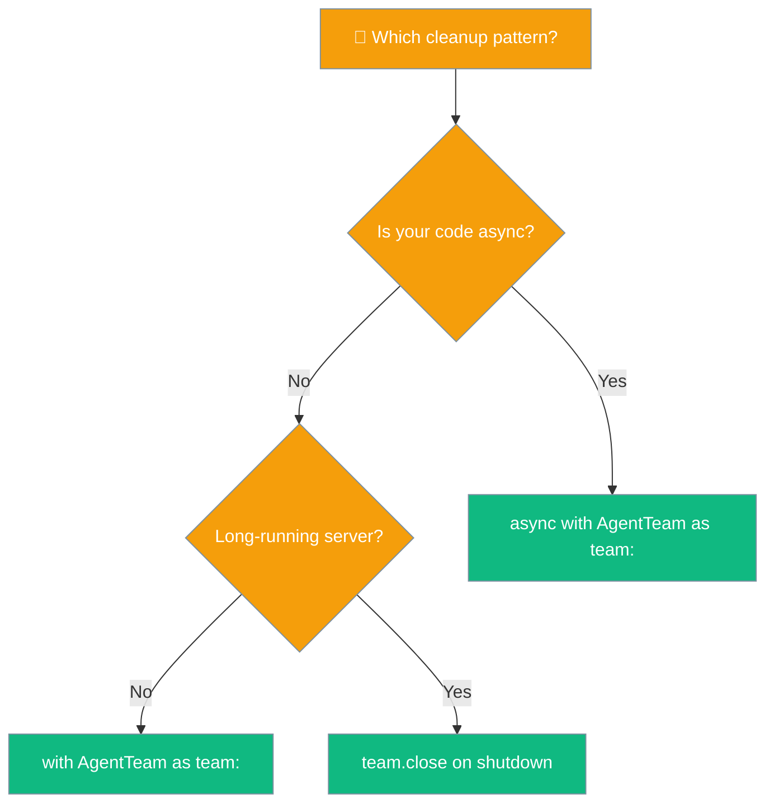

Use `with` or `async with` on `AgentTeam` to automatically close connections, memory stores, and per-agent resources when your workflow finishes.



## Quick Start

<Steps>
<Step title="Sync usage">
```python
from praisonaiagents import Agent, Task, PraisonAIAgents

researcher = Agent(name="Researcher", instructions="Research topics thoroughly")
task = Task(description="Research quantum computing", agent=researcher)

with PraisonAIAgents(agents=[researcher], tasks=[task]) as workflow:
    result = workflow.start()

print(result)
```
</Step>

<Step title="Async usage">
```python
import asyncio
from praisonaiagents import Agent, Task, PraisonAIAgents

async def main():
    researcher = Agent(name="Researcher", instructions="Research topics")
    task = Task(description="Research AI trends", agent=researcher)

    async with PraisonAIAgents(agents=[researcher], tasks=[task]) as workflow:
        result = await workflow.astart()
    print(result)

asyncio.run(main())
```
</Step>
</Steps>

---

## How It Works



| Entry Point | Method | Description |
|-------------|---------|-------------|
| `with team:` | `__enter__` / `__exit__` | Sync context manager - calls `close()` on exit |
| `async with team:` | `__aenter__` / `__aexit__` | Async context manager - prefers `aclose()` when available |
| Manual cleanup | `team.close()` | Explicit cleanup call |

---

## Choosing the right approach



---

## Common Patterns

### Using with shared memory
```python
from praisonaiagents import Agent, Task, PraisonAIAgents
from praisonaiagents.memory import ChromaMemory

researcher = Agent(name="Researcher", instructions="Research and remember findings")
task = Task(description="Research renewable energy trends", agent=researcher)

with PraisonAIAgents(
    agents=[researcher], 
    tasks=[task],
    shared_memory=ChromaMemory()
) as workflow:
    result = workflow.start()
    # ChromaDB connection automatically closed here
```

### Using inside FastAPI endpoint
```python
from fastapi import FastAPI
from praisonaiagents import Agent, Task, PraisonAIAgents

app = FastAPI()

@app.post("/research")
async def research_topic(topic: str):
    researcher = Agent(name="Researcher", instructions="Research topics")
    task = Task(description=f"Research {topic}", agent=researcher)
    
    async with PraisonAIAgents(agents=[researcher], tasks=[task]) as workflow:
        result = await workflow.astart()
    
    return {"research": result}
    # All resources cleaned up even if an exception occurs
```

### Explicit cleanup in long-running worker
```python
from praisonaiagents import Agent, Task, PraisonAIAgents

# Initialize once
researcher = Agent(name="Researcher", instructions="Research topics")
workflow = PraisonAIAgents(agents=[researcher])

try:
    # Use multiple times
    workflow.add_task(Task(description="Research AI", agent=researcher))
    result1 = workflow.start()
    
    workflow.add_task(Task(description="Research ML", agent=researcher))
    result2 = workflow.start()
finally:
    # Clean up when shutting down
    workflow.close()
```

---

## User interaction flow

A user sends a research request to your FastAPI application. The endpoint creates an AgentTeam with a research agent inside an `async with` block. The agent uses ChromaDB for memory storage and external APIs for research. When the request completes successfully or fails with an exception, the `async with` block automatically calls `close()`, ensuring ChromaDB connections, agent resources, and any open file handles are properly released without manual intervention.

---

## Best Practices

<AccordionGroup>
<Accordion title="Always prefer context managers over manual close()">
Use `with` or `async with` instead of calling `close()` manually. Context managers guarantee cleanup even when exceptions occur.

```python
# ✅ Good - automatic cleanup
with PraisonAIAgents(agents=[agent]) as workflow:
    result = workflow.start()

# ❌ Risky - cleanup might be skipped on exception
workflow = PraisonAIAgents(agents=[agent])
result = workflow.start()
workflow.close()  # Might not be called if exception occurs
```
</Accordion>

<Accordion title="Cleanup is best-effort - failures are logged, never raised">
Resource cleanup failures are logged as warnings but don't raise exceptions. This prevents cleanup failures from masking the original issue.

```python
# Cleanup failures won't raise exceptions
async with PraisonAIAgents(agents=[agent]) as workflow:
    result = await workflow.astart()
# Any agent.close() or memory.close() failures are logged, not raised
```
</Accordion>

<Accordion title="MongoDB connections are now included in cleanup">
Since PR #1514, `Memory.close_connections()` also closes MongoDB clients when present. Multiple calls to `close_connections()` are safe (idempotent). Agent `__del__` provides a safety net but should not be relied upon:

```python
# Explicit cleanup (preferred)
with Agent(name="Analyst", instructions="Analyze quarterly numbers.") as agent:
    agent.start("Summarize Q1 revenue.")
# MongoDB / SQLite / registered connections closed here.

# Async form  
async with Agent(name="Analyst", instructions="...") as agent:
    await agent.astart("...")
```
</Accordion>

<Accordion title="Don't reuse a team after exiting its with block">
Once you exit a `with` block, consider the AgentTeam closed. Create a new one for additional work.

```python
# ✅ Good - create new team for each batch
with PraisonAIAgents(agents=[agent1]) as workflow1:
    result1 = workflow1.start()

with PraisonAIAgents(agents=[agent2]) as workflow2:
    result2 = workflow2.start()

# ❌ Bad - reusing after cleanup
with PraisonAIAgents(agents=[agent]) as workflow:
    result1 = workflow.start()
# workflow is closed here
workflow.start()  # Undefined behavior
```
</Accordion>

<Accordion title="For multi-request servers, create one team per request">
Instead of sharing an AgentTeam across requests, create one team per request inside the `with` block. This isolates resources and prevents connection leaks.

```python
# ✅ Good - isolated per request
@app.post("/analyze")
async def analyze(data: str):
    agent = Agent(name="Analyzer", instructions="Analyze data")
    async with PraisonAIAgents(agents=[agent]) as workflow:
        return await workflow.astart()

# ❌ Risky - shared team across requests
global_workflow = PraisonAIAgents(agents=[agent])  # Shared state problems
```
</Accordion>
</AccordionGroup>

---

## Configuration Options

| Method | Async | Description |
|--------|-------|-------------|
| `close()` | No | Closes all agents, shared memory, and context manager resources. Best-effort; logs warnings on failure. |
| `__enter__` / `__exit__` | No | Enables `with team: …` — calls `close()` on exit. |
| `__aenter__` / `__aexit__` | Yes | Enables `async with team: …` — prefers `aclose()` on agents/memory when available, falls back to sync `close()`. |

<Card icon="code" href="/sdk/reference/praisonaiagents/functions/AgentTeam-context_manager">
  Auto-generated SDK reference
</Card>

---

## Related

<CardGroup cols={2}>
<Card title="Agent Management" icon="user" href="/concepts/agents">
  Core agent concepts and configuration
</Card>
<Card title="Memory Systems" icon="brain" href="/memory/overview">
  Shared memory stores that benefit from automatic cleanup
</Card>
</CardGroup>