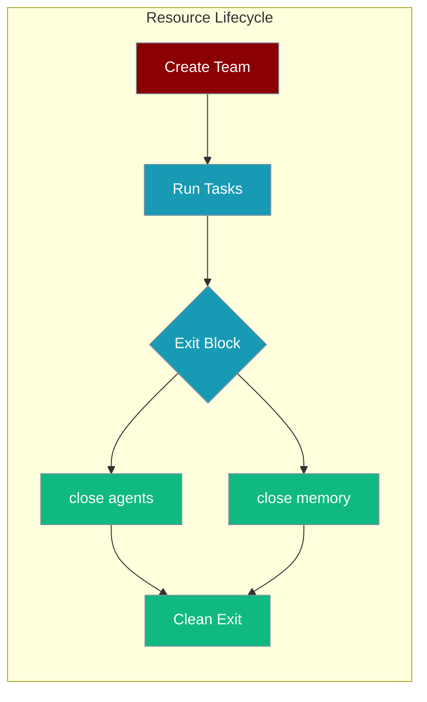
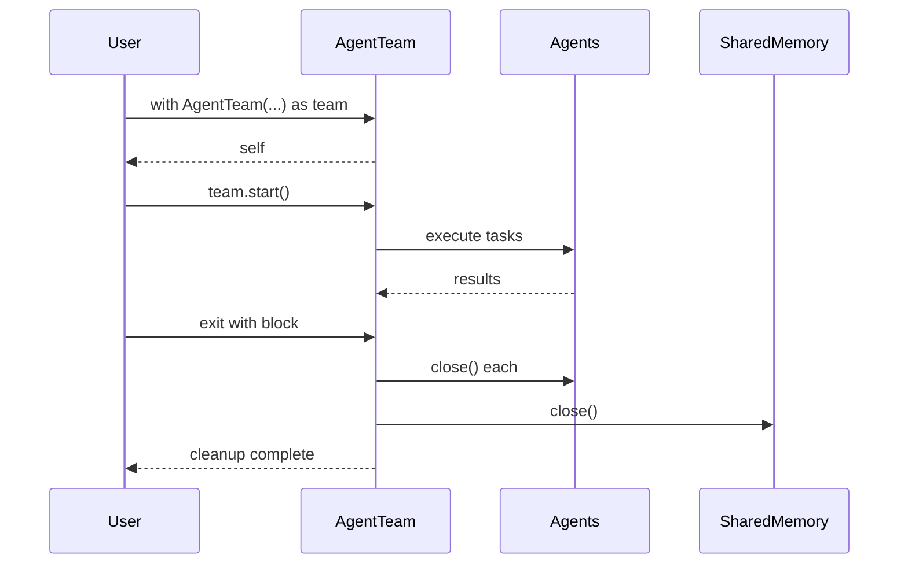

Use `with` or `async with` on `PraisonAIAgents` to close agents, memory stores, and connections when a workflow finishes.

```python
from praisonaiagents import Agent, Task, PraisonAIAgents

researcher = Agent(name="Researcher", instructions="Research topics thoroughly")
task = Task(description="Research quantum computing", agent=researcher)

with PraisonAIAgents(agents=[researcher], tasks=[task]) as workflow:
    result = workflow.start()

print(result)
```



## Quick Start

<Steps>
<Step title="Simple Usage">

```python
from praisonaiagents import Agent, Task, PraisonAIAgents

researcher = Agent(name="Researcher", instructions="Research topics thoroughly")
task = Task(description="Research quantum computing", agent=researcher)

with PraisonAIAgents(agents=[researcher], tasks=[task]) as workflow:
    result = workflow.start()

print(result)
```

</Step>

<Step title="With Configuration">

Async usage with shared memory inside a FastAPI endpoint:

```python
import asyncio
from fastapi import FastAPI
from praisonaiagents import Agent, Task, PraisonAIAgents, ChromaMemory

app = FastAPI()

@app.post("/research")
async def research_topic(topic: str):
    researcher = Agent(name="Researcher", instructions="Research topics")
    task = Task(description=f"Research {topic}", agent=researcher)

    async with PraisonAIAgents(
        agents=[researcher],
        tasks=[task],
        shared_memory=ChromaMemory(),
    ) as workflow:
        result = await workflow.astart()

    return {"research": result}
```

</Step>
</Steps>

---

## How It Works



| Entry point | Method | Description |
|-------------|--------|-------------|
| `with team:` | `__enter__` / `__exit__` | Sync — calls `close()` on exit |
| `async with team:` | `__aenter__` / `__aexit__` | Async — prefers `aclose()` when available |
| Manual | `team.close()` | Explicit cleanup for long-running workers |

---

## Common Patterns

### Shared memory cleanup

```python
from praisonaiagents import ChromaMemory

with PraisonAIAgents(
    agents=[researcher],
    tasks=[task],
    shared_memory=ChromaMemory(),
) as workflow:
    result = workflow.start()
# ChromaDB connection closed here
```

### Long-running worker shutdown

```python
workflow = PraisonAIAgents(agents=[researcher])
try:
    workflow.add_task(Task(description="Research AI", agent=researcher))
    workflow.start()
finally:
    workflow.close()
```

### Per-request isolation in servers

```python
@app.post("/analyse")
async def analyse(data: str):
    agent = Agent(name="Analyzer", instructions="Analyse data")
    async with PraisonAIAgents(agents=[agent]) as workflow:
        return await workflow.astart()
```

---

## Best Practices

<AccordionGroup>

<Accordion title="Prefer context managers over manual close()">

`with` and `async with` guarantee cleanup even when exceptions occur.

</Accordion>

<Accordion title="Cleanup is best-effort">

`close()` logs warnings on failure but does not raise — cleanup failures will not mask the original error.

</Accordion>

<Accordion title="Do not reuse a team after exiting its block">

Create a new `PraisonAIAgents` instance for each batch or request.

</Accordion>

<Accordion title="Create one team per request in servers">

Avoid sharing a global workflow across HTTP requests — isolate resources per call.

</Accordion>

</AccordionGroup>

---

## Related

<CardGroup cols={2}>
<Card title="Advanced Memory System" icon="brain" href="/docs/features/advanced-memory">
  Shared memory stores that benefit from automatic cleanup
</Card>
<Card title="MongoDB Memory" icon="database" href="/docs/features/mongodb-memory">
  MongoDB-backed memory with connection lifecycle support
</Card>
</CardGroup>
