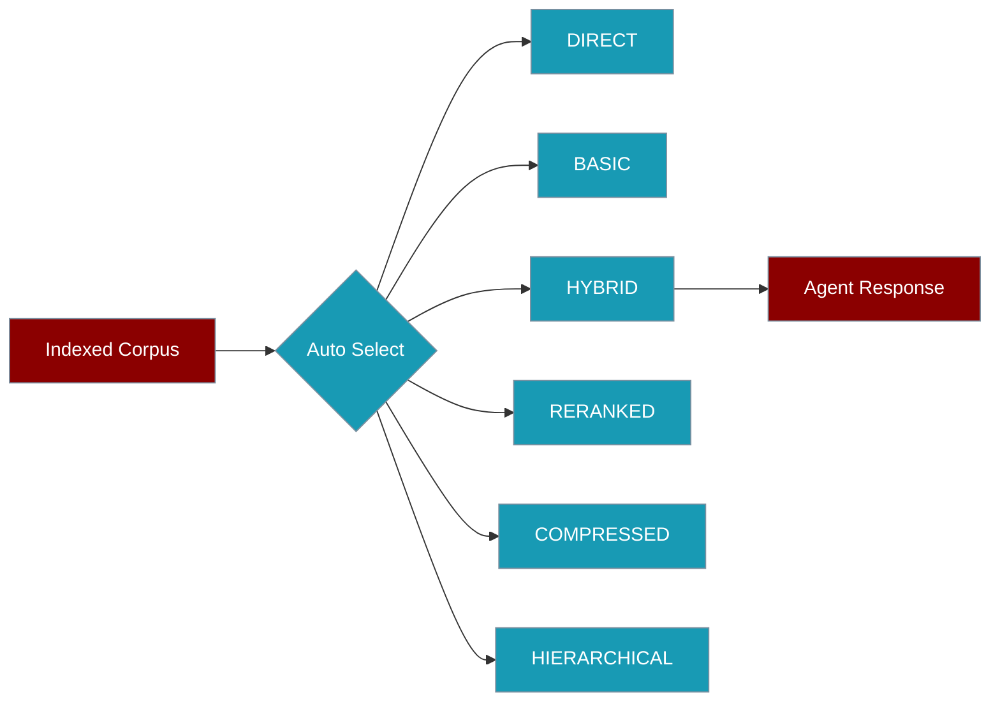

PraisonAI picks the best retrieval strategy from your indexed corpus size — from direct loading for tiny folders to hierarchical search for massive libraries.

```python
from praisonaiagents import Agent

agent = Agent(
    name="Researcher",
    instructions="Answer from the knowledge base.",
    knowledge={"sources": ["docs/"], "retrieval_k": 10, "rerank": True},
)
response = agent.start("What are the key features?")
```

The user asks a question; PraisonAI selects the best retrieval strategy for the indexed corpus size.




## Quick Start

<Steps>
<Step title="Simple Usage">

Strategy selection is automatic when you attach knowledge to an agent:

```python
from praisonaiagents import Agent

agent = Agent(
    name="Researcher",
    instructions="Answer from the knowledge base.",
    knowledge={"sources": ["docs/"], "retrieval_k": 10, "rerank": True},
)
response = agent.start("What are the key features?")
```

</Step>

<Step title="With Configuration">

Override the auto-selected strategy via `KnowledgeConfig.config`:

```python
from praisonaiagents import Agent, KnowledgeConfig

agent = Agent(
    name="Researcher",
    instructions="Answer from documents.",
    knowledge=KnowledgeConfig(
        sources=["docs/"],
        rerank=True,
        config={"strategy": "hybrid", "top_k": 10, "hybrid": True},
    ),
)
```

</Step>
</Steps>

---

## Strategy Selection

| File count | Strategy | Technique |
|------------|----------|-----------|
| &lt; 10 | DIRECT | Load all content |
| &lt; 100 | BASIC | Semantic search |
| &lt; 1,000 | HYBRID | Keyword + semantic |
| &lt; 10,000 | RERANKED | Hybrid + reranking |
| &lt; 100,000 | COMPRESSED | Reranked + compression |
| ≥ 100,000 | HIERARCHICAL | Multi-level summaries |

```python
from praisonaiagents.rag import select_strategy
from praisonaiagents.knowledge.indexing import CorpusStats

stats = CorpusStats(file_count=500)
strategy = select_strategy(stats)
print(strategy.value)  # hybrid
```

---

## Configuration Options

| Option | Type | Default | Description |
|--------|------|---------|-------------|
| `strategy` | `str` | `"auto"` | `auto`, `direct`, `basic`, `hybrid`, `reranked`, `compressed`, `hierarchical` |
| `top_k` | `int` | `5` | Chunks to retrieve |
| `rerank` | `bool` | `False` | Enable cross-encoder reranking |
| `hybrid` | `bool` | `False` | Combine keyword and semantic search |
| `compress` | `bool` | `False` | Compress retrieved context |

---

## CLI Usage

```bash
praisonai knowledge search "query" --strategy hybrid
praisonai knowledge search "query" --rerank --compress --max-context-tokens 4000
```

---

## Best Practices

<AccordionGroup>

<Accordion title="Start with auto-selection">

Let the SDK pick the strategy from corpus size unless you have measured latency or quality requirements.

</Accordion>

<Accordion title="Enable rerank for large corpora">

Set `rerank=True` when `retrieval_k` is high — reranking improves relevance on noisy result sets.

</Accordion>

<Accordion title="Use hybrid for mixed terminology">

Technical docs with exact identifiers benefit from `strategy="hybrid"` or `hybrid=True`.

</Accordion>

<Accordion title="Profile before overriding">

Run a few queries with auto-selection first; only pin a strategy when benchmarks show a clear win.

</Accordion>

</AccordionGroup>

---

## Related

<CardGroup cols={2}>
<Card title="Retrieval Configuration" icon="magnifying-glass" href="/docs/features/retrieval">
  Configure retrieval behaviour on agents
</Card>
<Card title="Vector Store" icon="database" href="/docs/features/vector-store">
  Pluggable embedding store with namespace support
</Card>
</CardGroup>
