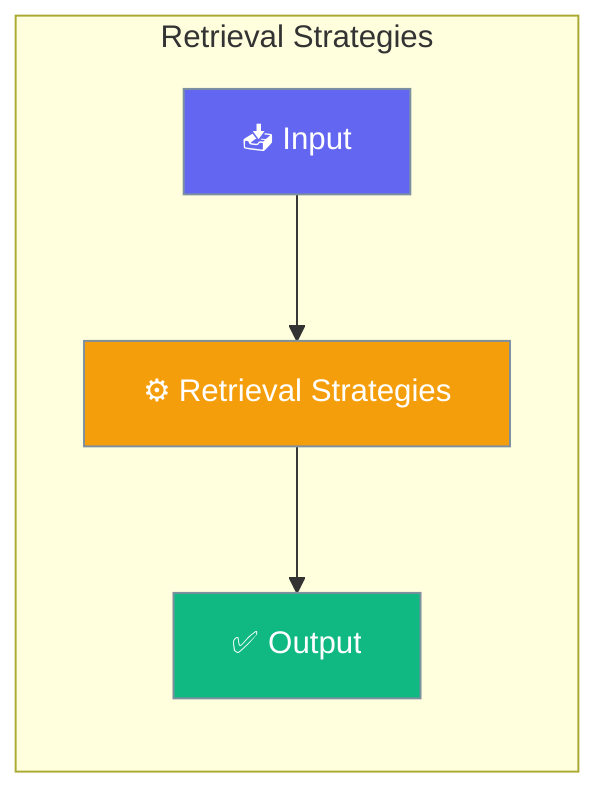

# Retrieval Strategies

The retrieval strategy system automatically selects the optimal retrieval approach based on corpus size, ensuring efficient and accurate knowledge retrieval.




## Overview

Available strategies:
- **DIRECT** - Load all content directly (small corpora)
- **BASIC** - Semantic search only
- **HYBRID** - Keyword + semantic search
- **RERANKED** - Hybrid + reranking
- **COMPRESSED** - Reranked + compression
- **HIERARCHICAL** - Multi-level summaries for very large corpora

## Quick Start


<Steps>
<Step title="Quick Start">
```python
from praisonaiagents.rag import select_strategy, RetrievalStrategy

# Auto-select based on corpus size
strategy = select_strategy(corpus_tokens=5000)
print(f"Selected strategy: {strategy.value}")

# Manual strategy selection
strategy = RetrievalStrategy.HYBRID
```
</Step>
</Steps>


## Best Practices

<AccordionGroup>
  <Accordion title="Start simple">
    Enable the feature with a single parameter before adding configuration. Verify it works, then layer in options.
  </Accordion>
  <Accordion title="Use environment variables for secrets">
    Never hardcode API keys or tokens. Use `os.getenv("KEY_NAME")` to read from environment variables.
  </Accordion>
  <Accordion title="Test with minimal examples first">
    Copy the Quick Start example, run it, then extend it. This confirms your environment is set up correctly.
  </Accordion>
  <Accordion title="Check the logs">
    Set `verbose=True` on your agent to see detailed execution logs when debugging unexpected behavior.
  </Accordion>
</AccordionGroup>

## Related

<CardGroup cols={2}>
  <Card title="Features Overview" icon="grid-2" href="/docs/features">
    Browse all PraisonAI features
  </Card>
  <Card title="Quick Start" icon="rocket" href="/docs/introduction">
    Get started with PraisonAI agents
  </Card>
</CardGroup>
