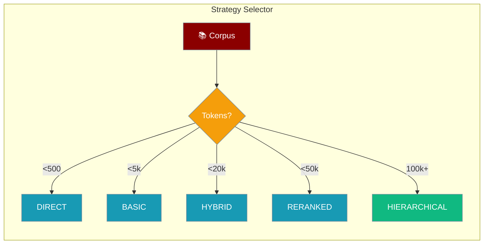
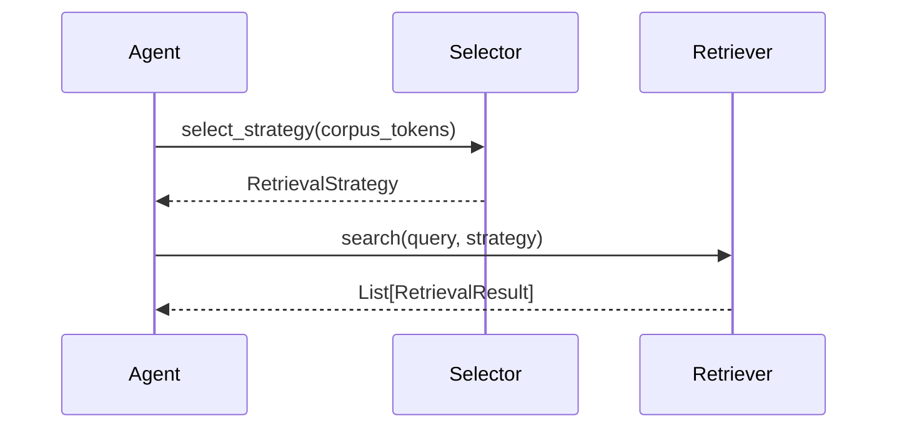

The retrieval strategy system automatically selects the optimal retrieval approach based on corpus size, ensuring efficient and accurate knowledge retrieval.

## Quick Start

<Steps>
<Step title="Auto-select strategy">
```python
from praisonaiagents.rag import select_strategy

strategy = select_strategy(corpus_tokens=5000)
print(f"Selected strategy: {strategy.value}")
```
</Step>

<Step title="Use with an agent">
```python
from praisonaiagents import Agent

agent = Agent(
    name="SmartRetriever",
    instructions="Answer questions using the knowledge base.",
    knowledge={
        "sources": ["./docs"],
        "retrieval_k": 10,
        "rerank": True,
    }
)

response = agent.chat("What are the key features?")
```
</Step>
</Steps>

---

## How It Works



---

## Overview

Available strategies:
- **DIRECT** - Load all content directly (small corpora)
- **BASIC** - Semantic search only
- **HYBRID** - Keyword + semantic search
- **RERANKED** - Hybrid + reranking
- **COMPRESSED** - Reranked + compression
- **HIERARCHICAL** - Multi-level summaries for very large corpora

## Strategy Selection

### Automatic Selection

The system automatically selects strategies based on corpus size:

| Corpus Size | Strategy | Description |
|-------------|----------|-------------|
| < 500 tokens | DIRECT | Load all content |
| < 5,000 tokens | BASIC | Semantic search |
| < 20,000 tokens | HYBRID | Keyword + semantic |
| < 50,000 tokens | RERANKED | Hybrid + reranking |
| < 100,000 tokens | COMPRESSED | With compression |
| > 100,000 tokens | HIERARCHICAL | Multi-level summaries |

```python
from praisonaiagents.rag import select_strategy

# Examples
select_strategy(corpus_tokens=100)    # -> DIRECT
select_strategy(corpus_tokens=3000)   # -> BASIC
select_strategy(corpus_tokens=10000)  # -> HYBRID
select_strategy(corpus_tokens=30000)  # -> RERANKED
select_strategy(corpus_tokens=75000)  # -> COMPRESSED
select_strategy(corpus_tokens=200000) # -> HIERARCHICAL
```

### Manual Override

```python
from praisonaiagents.rag import RetrievalConfig, RetrievalStrategy

config = RetrievalConfig(
    strategy=RetrievalStrategy.RERANKED,
    top_k=10,
    min_score=0.5,
)
```

## Strategy Details

### DIRECT Strategy

Best for very small corpora where all content fits in context:

```python
# All content loaded directly
# No retrieval overhead
# Maximum context utilization
```

### BASIC Strategy

Semantic search using embeddings:

```python
from praisonaiagents.rag import SmartRetriever

retriever = SmartRetriever()
results = retriever.search(
    query="What is the API key?",
    top_k=5,
)
```

### HYBRID Strategy

Combines keyword (BM25) and semantic search:

```python
from praisonaiagents.rag import SmartRetriever

retriever = SmartRetriever(
    use_hybrid=True,
    keyword_weight=0.3,
    semantic_weight=0.7,
)
results = retriever.search(query, top_k=10)
```

### RERANKED Strategy

Adds reranking for improved relevance:

```python
from praisonaiagents.rag import SmartRetriever

retriever = SmartRetriever(use_reranking=True)
results = retriever.search(query, top_k=20)
reranked = retriever.rerank(query, results, top_k=5)
```

### COMPRESSED Strategy

Includes context compression:

```python
from praisonaiagents.rag import ContextCompressor

compressor = ContextCompressor(
    max_tokens=4000,
    target_ratio=0.5,
)
compressed = compressor.compress(chunks, query=query)
```

### HIERARCHICAL Strategy

Uses multi-level summaries:

```python
from praisonaiagents.rag import HierarchicalSummarizer

summarizer = HierarchicalSummarizer(max_levels=3)
result = summarizer.build_hierarchy(files, base_path="./docs")
answer = summarizer.query("What are the main features?")
```

## CLI Usage

```bash
# Search with specific strategy
praisonai knowledge search "query" --strategy hybrid

# Search with reranking
praisonai knowledge search "query" --rerank

# Search with compression
praisonai knowledge search "query" --compress --max-context-tokens 4000

# Combined options
praisonai knowledge search "query" --strategy reranked --rerank --compress
```

## Integration with Agents

```python
from praisonaiagents import Agent

agent = Agent(
    name="SmartRetriever",
    instructions="Answer questions using the knowledge base.",
    knowledge={
        "sources": ["./docs"],
        "retrieval_k": 10,
        "rerank": True,
    }
)

response = agent.chat("What are the key features?")
```

## Best Practices

<AccordionGroup>
<Accordion title="Start with auto-selection">
Let `select_strategy(corpus_tokens=...)` choose the right strategy. Only override when you have specific latency or quality requirements.
</Accordion>

<Accordion title="Monitor performance">
Use `--verbose` in CLI or `verbose=True` in config to profile retrieval time and see which strategy was selected.
</Accordion>

<Accordion title="Increase top_k and enable reranking for quality">
For RERANKED and above strategies, set `retrieval_k=20` and `rerank=True` to improve result ordering.
</Accordion>

<Accordion title="Consider latency tradeoffs">
More complex strategies (RERANKED, HIERARCHICAL) add latency. For real-time use cases, benchmark each strategy and pick the fastest that meets your quality bar.
</Accordion>
</AccordionGroup>

---

## Related

<CardGroup cols={2}>
<Card title="Smart Retrieval" icon="magnifying-glass" href="/features/smart-retrieval">
  Hybrid search with BM25, semantic, and reranking
</Card>
<Card title="Hierarchical Summaries" icon="sitemap" href="/features/hierarchical-summaries">
  Multi-level summaries for very large corpora
</Card>
</CardGroup>

## API Reference

### RetrievalStrategy Enum

```python
class RetrievalStrategy(str, Enum):
    DIRECT = "direct"
    BASIC = "basic"
    HYBRID = "hybrid"
    RERANKED = "reranked"
    COMPRESSED = "compressed"
    HIERARCHICAL = "hierarchical"
```

### select_strategy Function

```python
def select_strategy(
    corpus_tokens: int = 0,
    corpus_files: int = 0,
    query_complexity: str = "medium",
) -> RetrievalStrategy:
    """Select optimal strategy based on corpus characteristics."""
```
