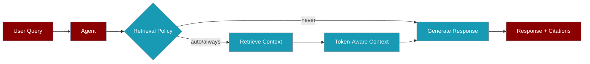

Control how agents retrieve and inject knowledge through the `knowledge` parameter — one surface for sources, chunking, reranking, and retrieval policy.

```python
from praisonaiagents import Agent

agent = Agent(
    name="Research Agent",
    instructions="Answer questions based on the provided documents.",
    knowledge={
        "sources": ["docs/", "papers.pdf"],
        "retrieval_k": 5,
        "rerank": True,
    },
)
response = agent.start("What are the key findings?")
```



## Quick Start

<Steps>
<Step title="Simple Usage">

```python
from praisonaiagents import Agent

agent = Agent(
    name="Research Agent",
    instructions="Answer questions based on the provided documents.",
    knowledge={
        "sources": ["docs/"],
        "retrieval_k": 5,
        "rerank": True,
    },
)
response = agent.start("What are the key findings?")
```

</Step>

<Step title="With Configuration">

```python
from praisonaiagents import Agent, KnowledgeConfig

agent = Agent(
    name="Agent",
    instructions="You are a helpful assistant.",
    knowledge=KnowledgeConfig(
        sources=["documents/"],
        embedder="openai",
        chunking_strategy="semantic",
        chunk_size=1000,
        chunk_overlap=200,
        retrieval_k=5,
        retrieval_threshold=0.3,
        rerank=True,
        auto_retrieve=True,
        vector_store={"provider": "chroma", "collection_name": "default"},
    ),
)
```

</Step>
</Steps>

---

## Configuration Options

| Option | Type | Default | Description |
|--------|------|---------|-------------|
| `sources` | `List[str]` | `[]` | Files, directories, or URLs to index |
| `embedder` | `str` | `"openai"` | Embedding provider |
| `chunking_strategy` | `str` | `"semantic"` | Chunking method |
| `chunk_size` | `int` | `1000` | Target chunk size in tokens |
| `chunk_overlap` | `int` | `200` | Overlap between chunks |
| `retrieval_k` | `int` | `5` | Number of chunks to retrieve |
| `retrieval_threshold` | `float` | `0.0` | Minimum relevance score (0.0–1.0) |
| `rerank` | `bool` | `False` | Enable reranking |
| `rerank_model` | `str` | `None` | Custom rerank model |
| `auto_retrieve` | `bool` | `True` | Inject context automatically |
| `vector_store` | `dict` | `None` | Vector store provider config |

---

## Agent Methods

### `agent.start()` / `agent.chat()`

Conversation with automatic retrieval when `auto_retrieve=True`:

```python
response = agent.start("What is the main topic?")
response = agent.start("Hello", force_retrieval=True)
response = agent.start("What is 2+2?", skip_retrieval=True)
```

### `agent.query()`

Structured answer with citations:

```python
result = agent.query("What are the main findings?")
print(result.answer)
for citation in result.citations:
    print(f"[{citation.id}] {citation.source} (score: {citation.score:.2f})")
```

### `agent.retrieve()`

Retrieval only — no LLM generation:

```python
context_pack = agent.retrieve("What are the key points?")
print(f"Found {len(context_pack.citations)} sources")
```

---

## Multi-Agent Shared Knowledge

```python
from praisonaiagents import Agent, Knowledge

shared = Knowledge(config={"vector_store": {"provider": "chroma", "config": {"collection_name": "shared_docs"}}})
shared.add("company_docs/")

analyst = Agent(
    name="Analyst",
    instructions="Analyse data from documents.",
    knowledge={"sources": shared, "retrieval_k": 10},
)

summariser = Agent(
    name="Summariser",
    instructions="Summarise key points.",
    knowledge={"sources": shared, "retrieval_k": 5},
)
```

---

## Best Practices

<AccordionGroup>

<Accordion title="Set retrieval_threshold for noisy corpora">

Use `retrieval_threshold=0.3` or higher when low-scoring chunks pollute answers.

</Accordion>

<Accordion title="Retrieve more, rerank down">

For large bases, set `retrieval_k=20` with `rerank=True` — cast a wide net, then keep the best chunks.

</Accordion>

<Accordion title="Use skip_retrieval for non-RAG prompts">

Arithmetic, greetings, and meta questions do not need retrieval — pass `skip_retrieval=True`.

</Accordion>

<Accordion title="Index once, share across agents">

Create one `Knowledge` instance and pass it as `sources` to multiple agents to avoid re-indexing.

</Accordion>

</AccordionGroup>

---

## Related

<CardGroup cols={2}>
<Card title="Retrieval Strategies" icon="route" href="/docs/features/retrieval-strategies">
  Auto-select strategy by corpus size
</Card>
<Card title="CLI Retrieval" icon="terminal" href="/docs/cli/retrieval">
  Run retrieval from the command line
</Card>
</CardGroup>
