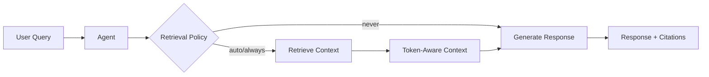

## Overview

The Agent-first retrieval system provides a unified way to configure how agents retrieve and use knowledge. All retrieval behavior is controlled through the `knowledge` parameter.



## Quick Start


<Steps>
<Step title="Quick Start">
```python
from praisonaiagents import Agent

agent = Agent(
    name="Research Agent",
    instructions="Answer questions based on the provided documents.",
    knowledge={
        "sources": ["docs/", "papers.pdf"],
        "retrieval_k": 5,        # Number of chunks to retrieve
        "rerank": True,          # Enable reranking for better results
    }
)

# Chat with automatic retrieval
response = agent.chat("What are the key findings?")
print(response)
```
</Step>
</Steps>


## Best Practices

<AccordionGroup>
  <Accordion title="Start simple">
    Enable the feature with a single parameter before adding configuration. Verify it works, then layer in options.
  </Accordion>
  <Accordion title="Use environment variables for secrets">
    Never hardcode API keys or tokens. Use `os.getenv("KEY_NAME")` to read from environment variables.
  </Accordion>
  <Accordion title="Test with minimal examples first">
    Copy the Quick Start example, run it, then extend it. This confirms your environment is set up correctly.
  </Accordion>
  <Accordion title="Check the logs">
    Set `verbose=True` on your agent to see detailed execution logs when debugging unexpected behavior.
  </Accordion>
</AccordionGroup>

## Related

<CardGroup cols={2}>
  <Card title="Features Overview" icon="grid-2" href="/docs/features">
    Browse all PraisonAI features
  </Card>
  <Card title="Quick Start" icon="rocket" href="/docs/introduction">
    Get started with PraisonAI agents
  </Card>
</CardGroup>
