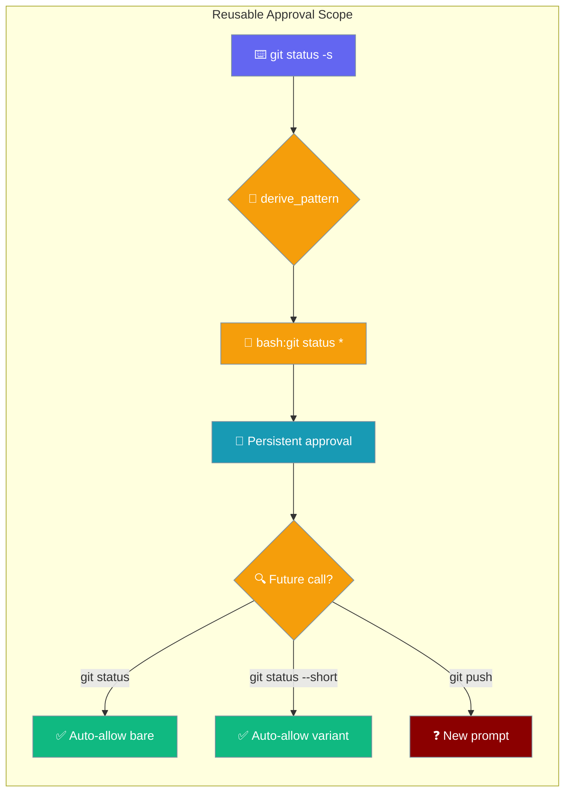
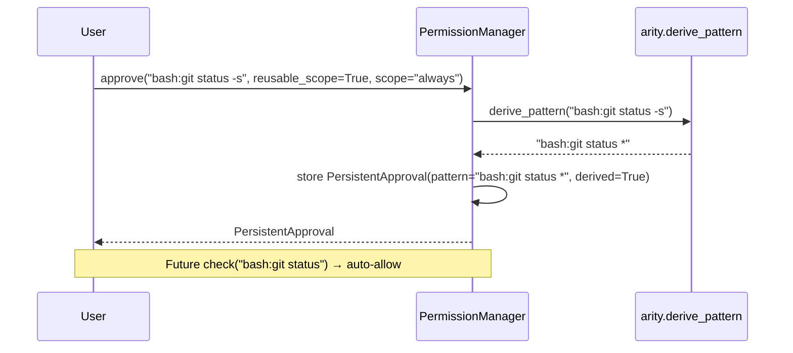

Reusable scopes let one persistent approval cover every trailing-arg variant of the same command — approve `git status` and future `git status -s` runs never re-prompt.

<Warning>
**Planned feature — not yet in the current SDK release.**
`reusable_scope`, `suggest_scope_pattern`, and the `derived` field on `PersistentApproval` are being added in [PraisonAI PR #2576](https://github.com/MervinPraison/PraisonAI/pull/2576). Until that PR is merged and synced here, calling `manager.approve(..., reusable_scope=True)` will raise `TypeError`. Use explicit glob patterns with the current API instead:

```python
from praisonaiagents.permissions import PermissionManager, PersistentApproval
from praisonaiagents.permissions.rules import PermissionAction

manager = PermissionManager()
manager.approve("bash:git status *", True, scope="always")
```
</Warning>



## Quick Start

<Steps>

<Step title="Programmatic approval with reusable scope">

```python
from praisonaiagents.permissions import PermissionManager

manager = PermissionManager()

approval = manager.approve(
    target="bash:git status -s",
    approved=True,
    scope="always",
    reusable_scope=True,
)

print(approval.pattern)   # 'bash:git status *'
print(approval.derived)   # True
```

Future calls to `bash:git status`, `bash:git status --short`, or any `bash:git status …` variant are auto-approved without prompting.

</Step>

<Step title="Inspect the suggested pattern before saving">

```python
from praisonaiagents.permissions import PermissionManager

manager = PermissionManager()

suggested = manager.suggest_scope_pattern("bash:git status -s")
print(suggested)  # 'bash:git status *'

approval = manager.approve(
    target="bash:git status -s",
    approved=True,
    scope="always",
    pattern=suggested,
)
```

Pass `pattern=` to override the derived pattern with any string you prefer.

</Step>

</Steps>

---

## How It Works

When `reusable_scope=True` and `scope` is `"session"` or `"always"`, `PermissionManager.approve()` calls `suggest_scope_pattern()` internally. That delegates to `arity.derive_pattern()`, which looks up the command in a small arity table and builds a glob.



The stored `PersistentApproval` has `derived=True`, which enables a bare-prefix fallback in `matches()`: `bash:git status *` (derived) also matches the bare `bash:git status`.

| Situation | Stored pattern | Matches |
|-----------|---------------|---------|
| `reusable_scope=False` (default) | Literal `bash:git status -s` | Only that exact command |
| `reusable_scope=True`, known command | Derived `bash:git status *` | Any `git status …` — including bare `git status` |
| `reusable_scope=True`, bare command (`bash:git`) | Literal `bash:git` | Only bare `git` — never all git subcommands |
| `reusable_scope=True`, compound (`cd /tmp && rm x`) | Literal (unchanged) | Only that compound command |
| `reusable_scope=True`, non-shell (`read:/etc/hosts`) | Literal (unchanged) | Non-shell prefixes are never generalised |
| `pattern="bash:git *"` explicit override | User's exact string | `derived=False` — exact `fnmatch` semantics, no bare-prefix fallback |

---

## The Arity Table

`arity.derive_pattern` uses this built-in table to decide how many leading tokens to keep as the reusable prefix.

| Category | Commands | Arity | Example |
|----------|----------|-------|---------|
| Version control | `git`, `gh`, `hg`, `svn` | 2 | `git status -s` → `bash:git status *` |
| Package managers | `npm`, `yarn`, `pnpm`, `pip`, `cargo`, `go`, `poetry`, `uv`, `make` | 2 | `npm run build` → `bash:npm run *` |
| Containers | `docker`, `docker compose`, `kubectl`, `helm` | 2 | `docker compose up -d` → `bash:docker compose *` |
| Python tooling | `python`, `python3`, `ruff` | 2 | `ruff check .` → `bash:ruff check *` |
| Python tooling | `pytest` | 1 | `pytest tests/` → `bash:pytest *` |
| System | `apt`, `apt-get`, `brew`, `systemctl` | 2 | `apt install pkg` → `bash:apt install *` |
| Unknown / other | — | 1 (conservative) | `foo bar baz` → `bash:foo *` (only if there are trailing args) |

Multi-word keys win over their base command: `docker compose` (arity 2) keeps `docker compose`, not just `docker`.

### Behaviour table

| Input `target` | Output | Reason |
|----------------|--------|--------|
| `bash:git status` | `bash:git status *` | git arity 2, appends ` *` |
| `bash:git status -s` | `bash:git status *` | same — trailing args replaced |
| `bash:npm run build` | `bash:npm run *` | npm arity 2 |
| `bash:docker compose up -d` | `bash:docker compose *` | multi-word key wins |
| `bash:git` | `bash:git` | bare single-token → literal |
| `bash:cd /tmp && rm -rf x` | `bash:cd /tmp && rm -rf x` | `&&` → literal |
| `bash:echo $(rm x)` | `bash:echo $(rm x)` | command substitution → literal |
| `bash:ls \| grep x` | `bash:ls \| grep x` | pipe → literal |
| `bash:git status *` | `bash:git status *` | already contains glob → unchanged |
| `read:/etc/hosts` | `read:/etc/hosts` | non-shell prefix → literal |
| `shell:ls -la` | `shell:ls *` | `shell:` prefix also generalised |

---

## What Never Gets Generalised

`derive_pattern` is conservative. These cases always return the literal target unchanged:

- **Non-shell targets** — anything that doesn't start with `bash:` or `shell:`.
- **Empty commands** — `bash:` with no command string.
- **Existing globs** — targets already containing `*` or `?`.
- **Shell control operators** — targets containing `&&`, `||`, `|`, `;`, `&`, `$(`, `` ` ``, `>`, `<`, or a newline.
- **Bare single-token commands** — `bash:git`, `bash:ls` — never become `bash:git *`.

This prevents a compound-command approval from silently expanding its scope to cover a second unrelated command.

---

## Common Patterns

**Approve once, cover all trailing-arg variants**

```python
from praisonaiagents.permissions import PermissionManager

manager = PermissionManager()

manager.approve("bash:git status -s", True, scope="always", reusable_scope=True)

manager.check("bash:git status").is_allowed          # True
manager.check("bash:git status --short").is_allowed  # True
manager.check("bash:git status").is_allowed          # True (bare form)
manager.check("bash:git push").is_allowed            # False — new prompt
```

**Bare command stays literal**

```python
manager.approve("bash:git", True, scope="always", reusable_scope=True)

approval = manager.check("bash:git")
print(approval.pattern)  # 'bash:git'  — NOT 'bash:git *'
```

**Compound commands stay literal**

```python
manager.approve("bash:cd /tmp && rm x", True, scope="always", reusable_scope=True)

approval = manager.check("bash:cd /tmp && rm x")
print(approval.pattern)  # 'bash:cd /tmp && rm x'  — literal, not generalised
```

---

## Best Practices

<AccordionGroup>

<Accordion title="Use reusable_scope=True for routine shell commands">
Routine VCS and build commands (`git status`, `npm run`, `pytest`) are the best candidates. They have stable subcommand prefixes and many trailing-arg variants.
</Accordion>

<Accordion title="Pass an explicit pattern= to override the suggestion">
If `suggest_scope_pattern` returns a pattern that is broader or narrower than you want, override it with `pattern=`. The stored approval will have `derived=False`, keeping exact `fnmatch` semantics.
</Accordion>

<Accordion title="Compound approvals are intentionally narrow">
A `cd /tmp && rm x` approval covers only that exact string. If you want to reuse two operations independently, create two separate approvals — one for `cd` variants and one for `rm` variants.
</Accordion>

<Accordion title="Non-shell targets stay literal">
`read:`, `write:`, and `write_file:` patterns are never derived. Use explicit globs for those, e.g. `pattern="read:/tmp/*"`.
</Accordion>

</AccordionGroup>

---

## API Reference

### `PermissionManager.approve()`

```python
manager.approve(
    target: str,
    approved: bool,
    scope: str = "once",           # "once" | "session" | "always"
    agent_name: Optional[str] = None,
    reusable_scope: bool = False,  # derive prefix glob when True
    pattern: Optional[str] = None, # override target and derivation
) -> PersistentApproval
```

| Parameter | Type | Default | Description |
|-----------|------|---------|-------------|
| `target` | `str` | — | The target that was approved/denied (e.g. `"bash:git status -s"`) |
| `approved` | `bool` | — | Whether approved (`True`) or denied (`False`) |
| `scope` | `str` | `"once"` | `"once"`, `"session"`, or `"always"` |
| `agent_name` | `str \| None` | `None` | Scope to a specific agent |
| `reusable_scope` | `bool` | `False` | When `True` and scope is `session`/`always`, derive a reusable prefix glob |
| `pattern` | `str \| None` | `None` | Explicit pattern — overrides `target` and `reusable_scope` |

### `PermissionManager.suggest_scope_pattern()`

```python
manager.suggest_scope_pattern(target: str) -> str
```

Exception-safe wrapper around `arity.derive_pattern`. Returns the derived glob pattern, or the original `target` unchanged if derivation is not possible.

### `PersistentApproval.derived`

`bool`, default `False`. Set to `True` when the pattern was auto-generated by `derive_pattern`. Controls the bare-prefix fallback in `matches()`: only `derived=True` shell patterns trigger the extra match for the bare form.

---

## Related

<CardGroup cols={2}>
  <Card title="Interactive Approval" icon="shield-check" href="/docs/features/interactive-approval">
    Terminal-prompt approval flow — `[A] Always allow` persists rules
  </Card>
  <Card title="Declarative Permissions" icon="shield-halved" href="/docs/features/declarative-permissions">
    Pre-declare allow/deny rules in YAML, CLI, or Python
  </Card>
  <Card title="Permissions" icon="shield" href="/docs/features/permissions">
    Full `PermissionManager` Python SDK reference
  </Card>
  <Card title="Workspace Boundary" icon="folder-lock" href="/docs/features/workspace">
    Restrict agent file access to the project directory
  </Card>
</CardGroup>
