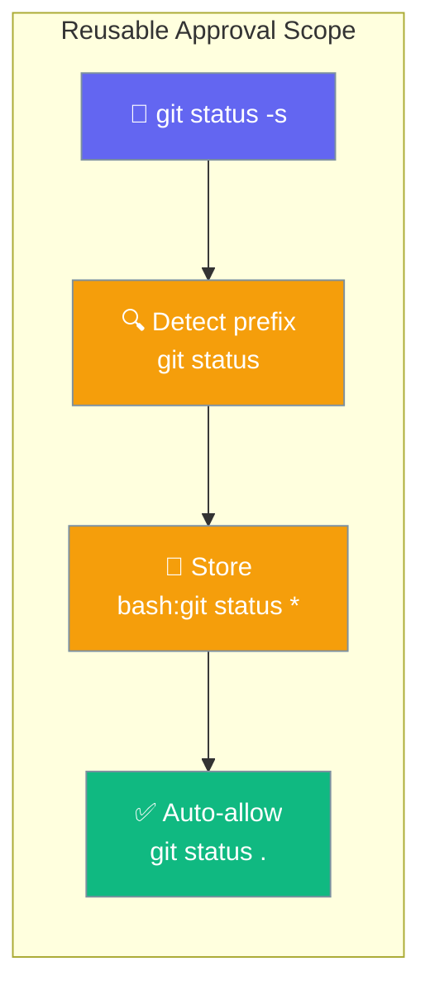
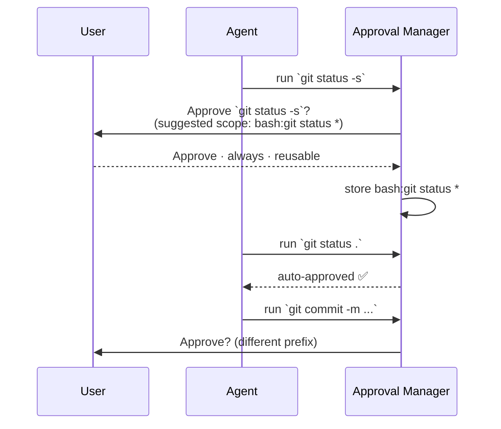
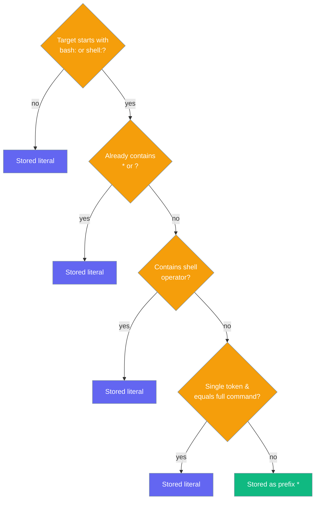

Approve `git status` once and it also covers `git status -s`, `git status .`, and every other flag — without granting all of `git`.



## Quick Start

<Steps>
<Step title="Enable reusable scopes on your Agent">

Add one line to opt in — approval fatigue drops immediately:

```python
from praisonaiagents import Agent

agent = Agent(
    name="Shell Assistant",
    instructions="Run git commands the user asks for",
    tools=["shell"],
    approval={"reusable_scope": True},
)

agent.start("Show me the status and then the last five commits")
```

The first time the agent runs `git status -s`, the user sees the prompt once. Every subsequent `git status <flags>` variant is auto-approved for the session.

</Step>

<Step title="Preview and store scopes programmatically">

For advanced workflows — CLIs, approval UIs, or testing — call the `PermissionManager` API directly:

```python
from praisonaiagents.permissions import PermissionManager

mgr = PermissionManager()

suggested = mgr.suggest_scope_pattern("bash:git status -s")
print(suggested)
# => "bash:git status *"

mgr.approve(
    target="bash:git status -s",
    approved=True,
    scope="always",
    reusable_scope=True,
)
```

`suggest_scope_pattern()` lets you surface the derived pattern in your UI before committing it, so users can review what `always` will cover.

</Step>
</Steps>

---

## How It Works



When the user approves with `reusable_scope=True`, PraisonAI:

1. Parses the command into tokens
2. Looks up the top-level command name (`git`) in the built-in arity table
3. Takes the first N tokens where N is the arity for that command (e.g. `git` → arity 2, so `git status`)
4. Stores the pattern as `bash:git status *`

A later `git status .` matches `bash:git status *` via prefix — no second prompt.

| Phase | What Happens |
|-------|-------------|
| **Derive** | `derive_pattern("bash:git status -s")` → `"bash:git status *"` |
| **Store** | Pattern saved as a `PersistentApproval` with `derived=True` flag |
| **Match** | `rules.PersistentApproval.matches("bash:git status .")` → `True` |
| **Skip prompt** | Agent proceeds without user interaction |

---

## When Does a Pattern Stay Literal?

Not every approval becomes a prefix glob. The derivation is intentionally conservative:



**Escape hatches — these always stay literal:**

| Condition | Example target | Stored as |
|-----------|---------------|-----------|
| Non-shell target | `read:/etc/hosts` | `read:/etc/hosts` |
| Already globbed | `bash:git status *` | `bash:git status *` |
| Contains `&&`, `\|\|`, `\|`, `;`, `&` | `bash:cd /tmp && rm -rf x` | exact string |
| Contains `$(`, backtick, `>`, `<`, newline | `bash:echo $(whoami)` | exact string |
| Bare single token equals the full command | `bash:git` | `bash:git` |

The bare-single-token rule is the most important: approving `bash:git` stays literal — it never automatically covers `bash:git push --force`.

---

## Configuration — Arity Table

The arity table tells PraisonAI how many tokens to include in the prefix. A command with arity 2 means "take the first two tokens as the stable prefix":

| Command | Arity | Example approved | Pattern stored |
|---------|-------|-----------------|---------------|
| `git` | 2 | `git status -s` | `bash:git status *` |
| `npm` | 2 | `npm run build` | `bash:npm run *` |
| `docker` | 2 | `docker compose up -d` | `bash:docker compose *` |
| `ls` | 1 | `ls -la` | `bash:ls *` |
| `cat` | 1 | `cat file.txt` | `bash:cat *` |
| `echo` | 1 | `echo hello` | `bash:echo *` |
| `python` | 1 | `python script.py` | `bash:python *` |
| `go` | 2 | `go test ./...` | `bash:go test *` |
| `cargo` | 2 | `cargo build --release` | `bash:cargo build *` |
| `kubectl` | 2 | `kubectl get pods` | `bash:kubectl get *` |
| `yarn` | 2 | `yarn add lodash` | `bash:yarn add *` |
| `pip` | 2 | `pip install requests` | `bash:pip install *` |

<Note>
Multi-word keys in the arity table win over single-word keys. `docker compose` (arity 2 for the subcommand) overrides `docker` (arity 1), so `docker compose up -d` derives `bash:docker compose *` rather than `bash:docker *`.
</Note>

### Extend the arity table for your own tools

Pass a custom `arity_map` to `derive_pattern()` to add commands not in the built-in table:

```python
from praisonaiagents.permissions import derive_pattern

my_tools = {"mytool": 2, "mytool sub": 3}

pattern = derive_pattern("bash:mytool sub action --flag", arity_map=my_tools)
print(pattern)
# => "bash:mytool sub action *"
```

---

## Common Patterns

### Session vs Always scope

```python
from praisonaiagents.permissions import PermissionManager

mgr = PermissionManager()

mgr.approve(
    target="bash:npm run build",
    approved=True,
    scope="session",
    reusable_scope=True,
)

mgr.approve(
    target="bash:git status -s",
    approved=True,
    scope="always",
    reusable_scope=True,
)
```

Use `session` for exploratory work and `always` only for commands you trust unconditionally across all future sessions.

### Preview before storing

```python
from praisonaiagents.permissions import PermissionManager

mgr = PermissionManager()

targets = [
    "bash:git log --oneline",
    "bash:npm run test",
    "bash:docker ps",
]

for t in targets:
    print(f"{t!r}  →  {mgr.suggest_scope_pattern(t)!r}")
```

```
'bash:git log --oneline'  →  'bash:git log *'
'bash:npm run test'       →  'bash:npm run *'
'bash:docker ps'          →  'bash:docker *'
```

### Non-shell targets stay literal

Path-based approvals are never globbed — `read:/etc/hosts` only covers that exact file:

```python
from praisonaiagents.permissions import derive_pattern

print(derive_pattern("read:/etc/hosts"))
# => "read:/etc/hosts"   (unchanged — non-bash target)
```

---

## Best Practices

<AccordionGroup>

<Accordion title="Preview the scope before storing">

Call `suggest_scope_pattern()` in your CLI or approval UI so users can see exactly what `always` will cover before confirming. A pattern like `bash:rm *` deserves a careful second look:

```python
from praisonaiagents.permissions import PermissionManager

mgr = PermissionManager()
pattern = mgr.suggest_scope_pattern("bash:rm -rf /tmp/build")
print(f"This will auto-approve: {pattern}")
```

</Accordion>

<Accordion title="Prefer session over always for reusable scopes">

A bad derived pattern that uses `always` persists across all future sessions. Use `session` by default for reusable scopes — if the pattern turns out to be safe, upgrade it to `always` deliberately:

```python
mgr.approve(target="bash:git status -s", approved=True, scope="session", reusable_scope=True)
```

</Accordion>

<Accordion title="Non-shell targets stay literal — that is intentional">

Path approvals such as `read:/etc/hosts` or `write:/tmp/report.txt` must remain exact. File paths that look like prefixes (`read:/etc/`) would grant access to all files under `/etc/`, which is a security anti-pattern. The literal-only behaviour for non-shell targets is by design.

</Accordion>

<Accordion title="Extend ARITY for your own CLI tools">

If your agent uses an internal tool (`mytool`) or a domain-specific CLI (`kubectl`), pass a custom `arity_map` to `derive_pattern()` so the prefix is derived correctly:

```python
from praisonaiagents.permissions import derive_pattern

corp_tools = {
    "deploy": 2,
    "deploy rollback": 2,
}

pattern = derive_pattern("bash:deploy rollback service-a --dry-run", arity_map=corp_tools)
# => "bash:deploy rollback *"
```

</Accordion>

</AccordionGroup>

---

## Related

<CardGroup cols={2}>
<Card title="Approval" icon="shield" href="/docs/features/approval">
  How PraisonAI approvals work end-to-end
</Card>
<Card title="Security" icon="lock" href="/docs/security">
  Security model and best practices
</Card>
<Card title="Approval Backends" icon="server" href="/docs/features/approval-backends">
  Store approvals in Redis, PostgreSQL, or custom backends
</Card>
<Card title="Durable Approvals" icon="database" href="/docs/features/durable-approvals">
  Persist approvals across process restarts
</Card>
</CardGroup>
