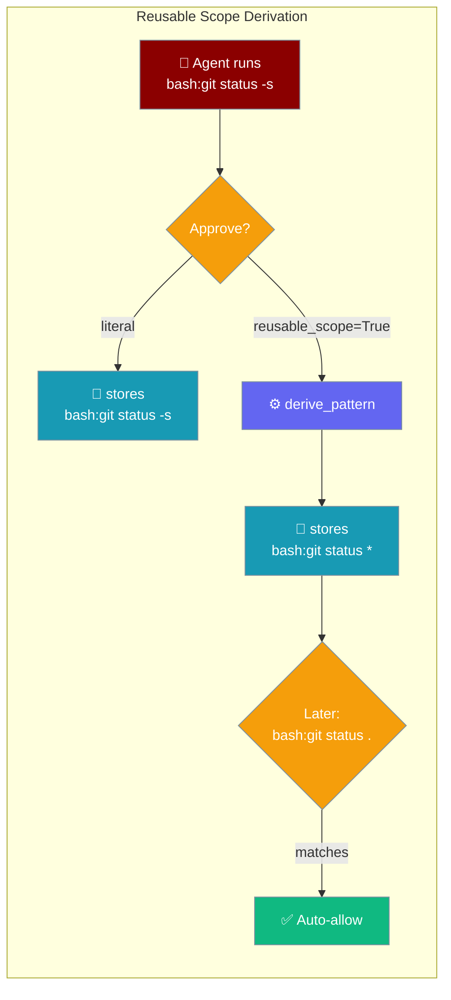
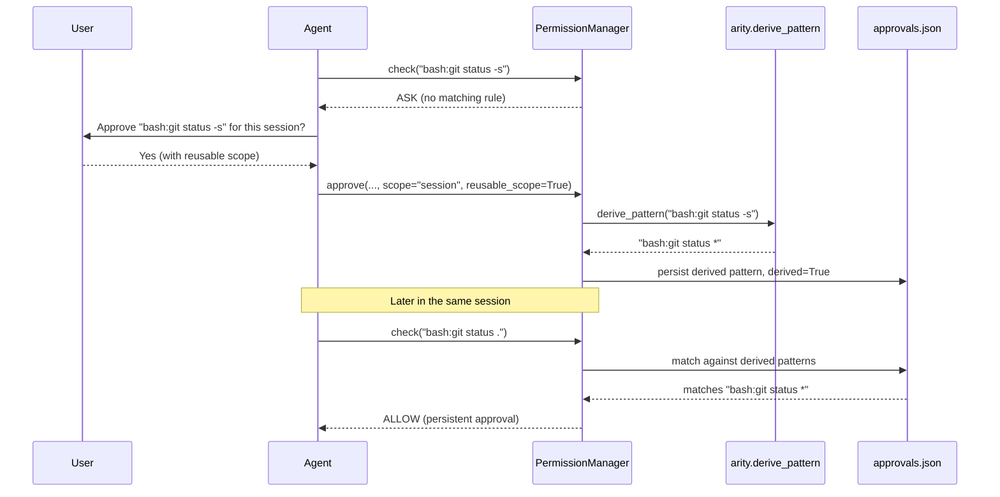

Approve `git status` with a reusable scope and the same session also covers `git status -s`, `git status .`, and every other `git status *` — no re-prompting for trivial arg changes.



## Quick Start

<Steps>
<Step title="Auto-derive at approval time">

Enable reusable scopes by passing `reusable_scope=True` to `PermissionManager.approve()`. The manager derives a prefix glob from the command and stores it instead of the literal command.

```python
from praisonaiagents.permissions import PermissionManager

manager = PermissionManager()

# User approves "git status -s" for this session
manager.approve(
    "bash:git status -s",
    approved=True,
    scope="session",
    reusable_scope=True,
)

# Later: "git status ." auto-approved — matches "bash:git status *"
result = manager.check("bash:git status .")
print(result.is_allowed)  # True
```

</Step>

<Step title="Suggest and let the user edit">

Call `suggest_scope_pattern()` to preview the derived pattern before saving — useful for CLI or UI flows where the user should confirm the scope.

```python
from praisonaiagents.permissions import PermissionManager

manager = PermissionManager()

target = "bash:npm run build"
suggestion = manager.suggest_scope_pattern(target)
print(suggestion)  # "bash:npm run *"

# User can tweak the suggestion before saving
manager.approve(
    target,
    approved=True,
    scope="always",
    pattern=suggestion,  # or a user-edited version
)
```

</Step>
</Steps>

---

## How It Works



When `reusable_scope=True` and `scope` is `session` or `always`, `approve()` calls `derive_pattern()` to compute a prefix glob. The resulting `PersistentApproval` is stored with `derived=True`, which enables a bare-prefix fallback so `bash:git status *` also matches `bash:git status` (no trailing args).

---

## The ARITY Table

The derivation uses a built-in arity table that maps each command to the number of leading tokens to keep as the reusable prefix. The longest matching multi-word key wins (`docker compose` beats `docker`).

| Command | Arity | Example → derived pattern |
|---|---|---|
| `git` | 2 | `bash:git status -s` → `bash:git status *` |
| `gh` | 2 | `bash:gh pr create` → `bash:gh pr *` |
| `hg` | 2 | `bash:hg commit -m msg` → `bash:hg commit *` |
| `svn` | 2 | `bash:svn update .` → `bash:svn update *` |
| `npm` | 2 | `bash:npm run build` → `bash:npm run *` |
| `yarn` | 2 | `bash:yarn add lodash` → `bash:yarn add *` |
| `pnpm` | 2 | `bash:pnpm install pkg` → `bash:pnpm install *` |
| `pip` | 2 | `bash:pip install x` → `bash:pip install *` |
| `cargo` | 2 | `bash:cargo run --bin x` → `bash:cargo run *` |
| `go` | 2 | `bash:go test ./...` → `bash:go test *` |
| `poetry` | 2 | `bash:poetry add httpx` → `bash:poetry add *` |
| `uv` | 2 | `bash:uv add fastapi` → `bash:uv add *` |
| `make` | 2 | `bash:make build ARG=1` → `bash:make build *` |
| `docker` | 2 | `bash:docker compose up` → `bash:docker compose *` |
| `docker compose` | 2 | `bash:docker compose up -d` → `bash:docker compose *` (multi-word key wins over `docker`) |
| `kubectl` | 2 | `bash:kubectl get pods` → `bash:kubectl get *` |
| `helm` | 2 | `bash:helm install chart .` → `bash:helm install *` |
| `python` | 2 | `bash:python -m pytest` → `bash:python -m *` |
| `python3` | 2 | `bash:python3 -m pip` → `bash:python3 -m *` |
| `pytest` | 1 | `bash:pytest tests/` → `bash:pytest *` |
| `ruff` | 2 | `bash:ruff check .` → `bash:ruff check *` |
| `apt` | 2 | `bash:apt install pkg` → `bash:apt install *` |
| `apt-get` | 2 | `bash:apt-get install pkg` → `bash:apt-get install *` |
| `brew` | 2 | `bash:brew install pkg` → `bash:brew install *` |
| `systemctl` | 2 | `bash:systemctl restart svc` → `bash:systemctl restart *` |

**Unknown commands** fall back to a single-token prefix (conservative). A bare command with no subcommand (e.g. `bash:git`) is kept literal — never generalised to `bash:git *`.

---

## When Derivation Is Refused

Some targets are intentionally left unchanged. Document these cases so you know when to expect a literal pattern instead of a glob.

| Case | Example input | Result |
|---|---|---|
| Non-shell target | `read:/etc/hosts` | unchanged — only `bash:` and `shell:` are generalised |
| Already-globbed command | `bash:git *` | unchanged — user glob wins |
| Contains a shell operator | `bash:cd /tmp && rm x` | unchanged — would swallow second command into scope |
| Bare single-token command | `bash:git` | unchanged — would over-generalise to all git subcommands |
| Unknown bare command | `bash:frobnicate` | unchanged — single token equals full command, nothing to generalise |
| Empty command | `bash:` | unchanged |

<Warning>
Commands with `&&`, `||`, `|`, `;`, `&`, `$(`, `` ` ``, `>`, `<`, or newlines are always kept literal. Generalising a compound command would silently include the second operation in the approval scope.
</Warning>

---

## Configuration Options

### `PermissionManager.approve()` — new kwargs

| Option | Type | Default | Description |
|---|---|---|---|
| `reusable_scope` | `bool` | `False` | When `True` and `scope` is `"session"` or `"always"`, store the derived prefix glob instead of the literal command. Ignored when `pattern=` is given. |
| `pattern` | `str \| None` | `None` | Explicit pattern to record. Overrides both `target` and `reusable_scope` derivation — use this to let a CLI or UI show the suggestion and let the user tweak it before saving. |

### `PersistentApproval.derived`

| Field | Type | Default | Description |
|---|---|---|---|
| `derived` | `bool` | `False` | `True` when the pattern was auto-generated by `derive_pattern()`. Enables the bare-prefix fallback in `matches()`. Loaded from `approvals.json` — older files default to `False` (backward compatible). |

<Card title="PermissionManager API Reference" icon="code" href="/docs/features/permissions">
  Full `PermissionManager` configuration and rule options
</Card>

---

## Common Patterns

**Auto-derive at approval time:**

```python
from praisonaiagents.permissions import PermissionManager

manager = PermissionManager()

# Approving "git status -s" stores "bash:git status *"
approval = manager.approve(
    "bash:git status -s",
    approved=True,
    scope="session",
    reusable_scope=True,
)
print(approval.pattern)   # "bash:git status *"
print(approval.derived)   # True

# Now "git status ." and "git status" both auto-approve
print(manager.check("bash:git status .").is_allowed)   # True
print(manager.check("bash:git status").is_allowed)     # True
```

**Suggest-and-edit (CLI/UI flow):**

```python
from praisonaiagents.permissions import PermissionManager

manager = PermissionManager()
target = "bash:npm run build"

# Show suggestion to user, let them edit
suggestion = manager.suggest_scope_pattern(target)
# suggestion == "bash:npm run *"

# User narrows it to all npm commands
user_pattern = "bash:npm *"

manager.approve(
    target,
    approved=True,
    scope="always",
    pattern=user_pattern,
)
```

**Custom arity map for project-specific commands:**

```python
from praisonaiagents.permissions.arity import derive_pattern

# Teach the engine about your own CLI tool
custom_map = {"mycli": 2}
pattern = derive_pattern("bash:mycli deploy prod", arity_map=custom_map)
print(pattern)  # "bash:mycli deploy *"
```

---

## Best Practices

<AccordionGroup>
<Accordion title="Turn on for developer sessions, off for production automation">
Reusable scopes reduce approval fatigue during development but broaden the approval blast radius. Enable them when working interactively; leave `reusable_scope=False` (the default) for unattended CI runs.
</Accordion>

<Accordion title="Show the suggestion, let the user tweak it">
Call `suggest_scope_pattern(target)` before saving and display the result. Users may want a narrower pattern (`bash:git status *`) or a broader one (`bash:git *`) depending on their workflow. Save with `pattern=` to respect their choice.
</Accordion>

<Accordion title="Compound commands are always kept literal">
`bash:cd /tmp && rm x` is intentionally never generalised. Approve compound commands one at a time, or create an explicit `PermissionRule` instead of relying on session approvals.
</Accordion>

<Accordion title="Combine with the workspace boundary">
A broad `bash:git *` reusable scope still won't reach outside `workspace_root` if the workspace boundary is active. Layer reusable scopes on top of boundary rules for defence in depth.
</Accordion>
</AccordionGroup>

---

## Related

<CardGroup cols={2}>
<Card title="Permissions Module" icon="shield-halved" href="/docs/features/permissions">
  Pattern-based rules, PermissionManager API
</Card>
<Card title="Durable Approvals" icon="database" href="/docs/features/durable-approvals">
  Persist approvals across restarts
</Card>
<Card title="Interactive Approval" icon="shield-check" href="/docs/features/interactive-approval">
  Terminal approval flow and persistence
</Card>
<Card title="Command-Aware Permissions" icon="terminal" href="/docs/features/command-aware-permissions">
  How compound shell commands are evaluated
</Card>
</CardGroup>
