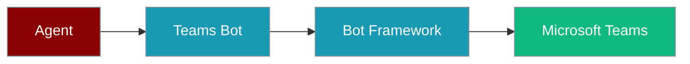
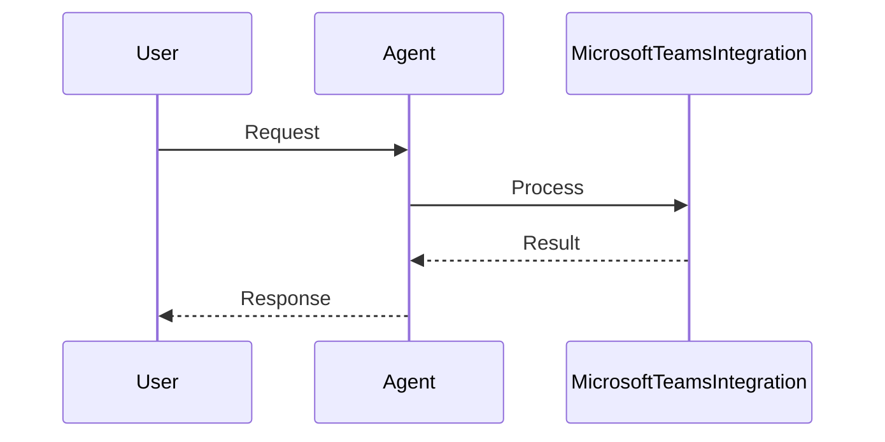
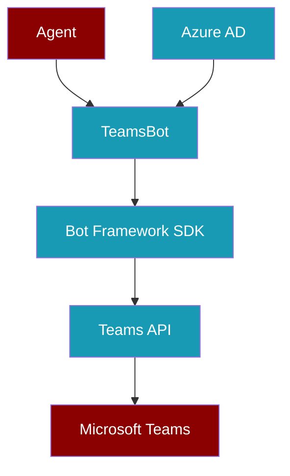

Run PraisonAI agents in Microsoft Teams channels via BotOS — enterprise collaboration with the same agent brain as Telegram and Discord.

```python
import os
from praisonaiagents import Agent
from praisonai.bots import Bot

agent = Agent(
    name="Teams Assistant",
    instructions="Help users in Microsoft Teams channels.",
)

bot = Bot(
    "teams",
    agent=agent,
    app_id=os.getenv("TEAMS_APP_ID"),
    app_password=os.getenv("TEAMS_APP_PASSWORD"),
)
bot.run()
```

The user messages in Microsoft Teams; BotOS routes the conversation to the same agent used on other channels.




## How It Works




## Quick Start

<Steps>
<Step title="Simple Usage">

```python
import os
from praisonaiagents import Agent
from praisonai.bots import Bot

agent = Agent(
    name="Teams Assistant",
    instructions="Help users in Microsoft Teams channels.",
)

bot = Bot(
    "teams",
    agent=agent,
    app_id=os.getenv("TEAMS_APP_ID"),
    app_password=os.getenv("TEAMS_APP_PASSWORD"),
)
bot.run()
```

</Step>

<Step title="With Configuration">

Add Teams to a multi-platform BotOS setup:

```python
import os
from praisonaiagents import Agent
from praisonai.bots import BotOS

agent = Agent(name="Assistant", instructions="Be helpful.")

botos = BotOS(
    agent=agent,
    platforms={
        "teams": {
            "app_id": os.getenv("TEAMS_APP_ID"),
            "app_password": os.getenv("TEAMS_APP_PASSWORD"),
            "tenant_id": os.getenv("AZURE_TENANT_ID"),
        },
    },
)
botos.run()
```

</Step>
</Steps>

<Info>
**RFC Status**: Draft | **Priority**: High | **Timeline**: Q2 2026
</Info>

---

## Overview

This RFC proposes Microsoft Teams as a first-class PraisonAI messaging channel for enterprise RFPs and Microsoft 365-first organisations.

### Success Criteria

- Full BotOS protocol compatibility
- Multi-agent deployment in Teams channels
- Enterprise security and compliance features
- Rich message formatting and adaptive cards
- SSO and Azure AD integration

---

## Architecture



---

## Configuration

```yaml
# teams-bot.yaml
platform: teams
app_id: ${TEAMS_APP_ID}
app_password: ${TEAMS_APP_PASSWORD}
tenant_id: ${AZURE_TENANT_ID}

agent:
  name: TeamsAssistant
  instructions: You are a helpful assistant in Microsoft Teams

features:
  adaptive_cards: true
  file_uploads: true
  threading: true

security:
  sso_enabled: true
  audit_logging: true
```

---

## Implementation Plan

| Phase | Duration | Scope |
|-------|----------|-------|
| 1 — Core Messaging | 4 weeks | Bot Framework SDK, send/receive, BotOS protocol |
| 2 — Advanced Features | 3 weeks | Adaptive cards, Azure AD, audit logging |
| 3 — Production | 2 weeks | Test suite, security audit, documentation |

---

## Security

<Warning>
Enterprise deployments require audit logging, encryption in transit and at rest, and GDPR/CCPA compliance for EU/CA tenants.
</Warning>

| Layer | Implementation |
|-------|----------------|
| Authentication | Azure AD OAuth 2.0 |
| Encryption | TLS 1.3 + Azure Key Vault |
| Audit trail | Azure Monitor + PraisonAI logs |
| Rate limiting | Azure API Management |

---

## Best Practices

<AccordionGroup>

<Accordion title="Use Azure Key Vault for credentials">

Store `TEAMS_APP_ID` and `TEAMS_APP_PASSWORD` in Key Vault — never commit secrets to source control.

</Accordion>

<Accordion title="Deploy AgentTeam across channels">

Use `AgentTeam` for multi-agent Teams channels with session management per conversation.

</Accordion>

<Accordion title="Enable SSO for enterprise tenants">

Configure Azure AD SSO so users authenticate with existing Microsoft 365 credentials.

</Accordion>

<Accordion title="Use adaptive cards for approvals">

Human-in-the-loop workflows map cleanly to Teams adaptive card submit actions.

</Accordion>

</AccordionGroup>

---

## Related

<CardGroup cols={2}>
<Card title="Messaging Channels Strategy" icon="users-gear" href="/docs/features/messaging-channels-strategy">
  Overall messaging platform roadmap
</Card>
<Card title="Agent Server" icon="server" href="/docs/features/agent-server">
  Deploy agents with HTTP APIs
</Card>
</CardGroup>

<Info>
**Review & Feedback**: Comment on GitHub issue #1311 with questions or suggestions.
</Info>
