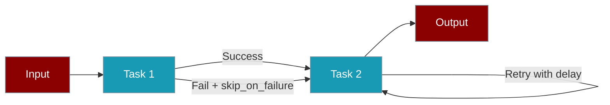
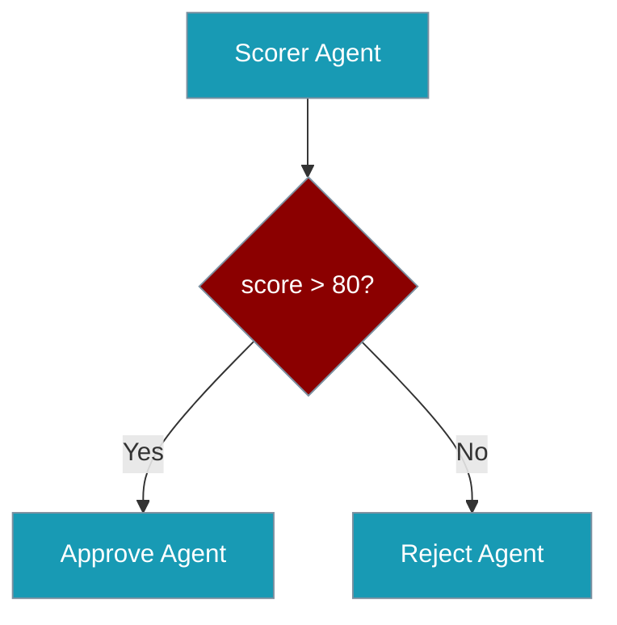

# Workflow Robustness

Build production-ready AI workflows that handle failures gracefully and provide debugging insights.



## Quick Start

<CodeGroup>
```python Python
from praisonaiagents import Task, Agent
from praisonaiagents.workflows import Workflow

# Task with graceful degradation
task = Task(
    description="Optional enrichment step",
    skip_on_failure=True,   # Continue if this fails
    retry_delay=1.0,        # Wait 1s between retries
    max_retries=3
)

# Workflow with history tracking
workflow = Workflow(
    steps=[task1, task2, task3],
    history=True  # Enable execution trace
)

result = workflow.start("input")
history = workflow.get_history()  # Debug execution
```

```yaml YAML
name: Robust Workflow
history: true  # Enable execution trace

steps:
  - agent: researcher
    action: Research AI trends
    max_retries: 3
    retry_delay: 1.0
  
  - agent: enricher
    action: Add examples
    skip_on_failure: true  # Optional step
    retry_delay: 0.5
```
</CodeGroup>

## Features

<CardGroup cols={2}>
  <Card title="Graceful Degradation" icon="parachute-box">
    Continue workflow execution when optional steps fail
  </Card>
  <Card title="Retry Control" icon="rotate">
    Configure retry delays with exponential backoff support
  </Card>
  <Card title="Execution History" icon="clock-rotate-left">
    Track step execution for debugging and auditing
  </Card>
  <Card title="Conditional Branching" icon="code-branch">
    Route workflow based on results with `when()`
  </Card>
</CardGroup>

## Task Robustness Parameters

### skip_on_failure

Allow the workflow to continue even if this task fails.

```python
task = Task(
    description="Optional data enrichment",
    skip_on_failure=True,  # Default: False
    agent=enricher_agent
)
```

<Tip>
Use `skip_on_failure=True` for optional enhancement steps that shouldn't block the main workflow.
</Tip>

### retry_delay

Configure the delay between retry attempts (in seconds).

```python
task = Task(
    description="API call with rate limiting",
    retry_delay=2.0,  # Wait 2 seconds between retries
    max_retries=5,
    agent=api_agent
)
```

<Note>
The `retry_delay` supports exponential backoff when used with the retry logic in agents.
</Note>

## Workflow History

Enable execution tracing to debug workflow issues.

### Enable History

```python
workflow = Workflow(
    steps=[agent1, agent2, agent3],
    history=True  # Enable execution trace
)
```

### Get Execution History

```python
result = workflow.start("input")

# Get execution trace
history = workflow.get_history()

for entry in history:
    print(f"Step: {entry['step']}")
    print(f"Success: {entry['success']}")
    print(f"Timestamp: {entry['timestamp']}")
    if entry.get('error'):
        print(f"Error: {entry['error']}")
```

### History Entry Format

Each history entry contains:

| Field | Type | Description |
|-------|------|-------------|
| `step` | string | Step name or agent name |
| `timestamp` | string | ISO format timestamp |
| `success` | boolean | Whether the step succeeded |
| `output` | string | Truncated output (first 500 chars) |
| `error` | string | Error message if failed |

## Conditional Branching

Use `when()` for cleaner conditional logic:

```python
from praisonaiagents.workflows import Workflow, when

workflow = Workflow(steps=[
    scorer_agent,
    when(
        condition="{{score}} > 80",
        then_steps=[approve_agent],
        else_steps=[reject_agent]
    )
])
```



<Warning>
`if_()` is deprecated. Use `when()` for cleaner syntax.
</Warning>

## YAML Configuration

Full robustness configuration in YAML:

```yaml
name: Production Workflow
description: Robust workflow with all features
history: true

agents:
  researcher:
    role: Research Expert
    goal: Find accurate information
    llm: gpt-4o-mini
  
  writer:
    role: Content Writer
    goal: Create engaging content
    llm: gpt-4o-mini

steps:
  - agent: researcher
    action: Research the topic thoroughly
    max_retries: 3
    retry_delay: 1.0
    expected_output: Comprehensive research summary
  
  - agent: writer
    action: Write based on research
    skip_on_failure: false
    max_retries: 2
    retry_delay: 0.5

input: AI trends for 2025
```

## Best Practices

<Steps>
  <Step title="Identify Critical vs Optional Steps">
    Mark enhancement steps with `skip_on_failure=True`, keep critical steps strict.
  </Step>
  <Step title="Configure Appropriate Retries">
    Use higher `retry_delay` for rate-limited APIs, lower for fast operations.
  </Step>
  <Step title="Enable History in Development">
    Always use `history=True` during development for debugging.
  </Step>
  <Step title="Check History After Failures">
    Use `get_history()` to understand what went wrong and where.
  </Step>
</Steps>

## Example: Production Workflow

<Accordion title="Complete Python Example">
```python
from praisonaiagents import Agent, Task
from praisonaiagents.workflows import Workflow

# Create agents
researcher = Agent(
    name="researcher",
    role="Research Expert",
    llm="gpt-4o-mini"
)

enricher = Agent(
    name="enricher", 
    role="Data Enricher",
    llm="gpt-4o-mini"
)

writer = Agent(
    name="writer",
    role="Content Writer",
    llm="gpt-4o-mini"
)

# Create tasks with robustness
research_task = Task(
    description="Research AI trends",
    agent=researcher,
    max_retries=3,
    retry_delay=1.0
)

enrich_task = Task(
    description="Add real-world examples",
    agent=enricher,
    skip_on_failure=True,  # Optional step
    retry_delay=0.5
)

write_task = Task(
    description="Write summary",
    agent=writer,
    max_retries=3,
    retry_delay=1.0
)

# Create workflow with history
workflow = Workflow(
    name="Robust Research Workflow",
    steps=[research_task, enrich_task, write_task],
    history=True
)

# Run and debug
result = workflow.start("AI agents 2025")
history = workflow.get_history()

for entry in history:
    status = "✓" if entry.get("success") else "✗"
    print(f"{status} {entry.get('step')}")
```
</Accordion>

## Related

<CardGroup cols={2}>
  <Card title="Workflows" icon="diagram-project" href="/features/workflows">
    Learn about workflow patterns and orchestration
  </Card>
  <Card title="Tasks" icon="list-check" href="/concepts/tasks">
    Understand task configuration and execution
  </Card>
  <Card title="Error Handling" icon="triangle-exclamation" href="/features/guardrails">
    Configure guardrails and validation
  </Card>
  <Card title="Monitoring" icon="chart-line" href="/observability/monitoring">
    Monitor workflow execution in production
  </Card>
</CardGroup>
