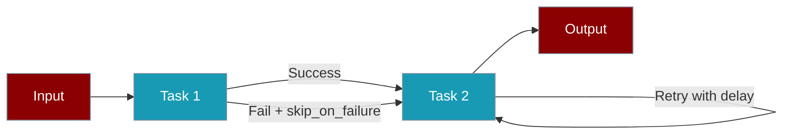

Build production-ready workflows that continue when optional steps fail and leave an execution trace for debugging.

```python
from praisonaiagents import Agent, Task, AgentFlow

researcher = Agent(name="researcher", instructions="Research topics thoroughly")
enricher = Agent(name="enricher", instructions="Add real-world examples")

workflow = AgentFlow(
    steps=[
        Task(description="Research AI trends", agent=researcher, max_retries=3, retry_delay=1.0),
        Task(description="Add examples", agent=enricher, skip_on_failure=True, retry_delay=0.5),
    ],
    history=True,
)
result = workflow.start("AI agents 2025")
```

The user starts a multi-step workflow; optional steps can fail without aborting the run, with execution history for debugging.



```mermaid
graph LR
    Input[Input] --> Task1[Task 1]
    Task1 --> |Success| Task2[Task 2]
    Task1 --> |Fail + skip_on_failure| Task2
    Task2 --> |Retry with delay| Task2
    Task2 --> Output[Output]

    classDef agent fill:#8B0000,stroke:#7C90A0,color:#fff
    classDef tool fill:#189AB4,stroke:#7C90A0,color:#fff
    classDef output fill:#10B981,stroke:#7C90A0,color:#fff

    class Input,Output agent
    class Task1,Task2 tool
```

## Quick Start

<Steps>
<Step title="Simple Usage">

```python
from praisonaiagents import Agent, Task, AgentFlow

researcher = Agent(name="researcher", instructions="Research topics thoroughly")
enricher = Agent(name="enricher", instructions="Add real-world examples")

workflow = AgentFlow(
    steps=[
        Task(description="Research AI trends", agent=researcher, max_retries=3, retry_delay=1.0),
        Task(description="Add examples", agent=enricher, skip_on_failure=True),
    ],
    history=True,
)
result = workflow.start("AI agents 2025")
history = workflow.get_history()
```

</Step>

<Step title="With Configuration">

Full YAML with retries, optional steps, and execution history:

```yaml
name: Robust Workflow
history: true

steps:
  - agent: researcher
    action: Research AI trends
    max_retries: 3
    retry_delay: 1.0

  - agent: enricher
    action: Add examples
    skip_on_failure: true
    retry_delay: 0.5
```

</Step>
</Steps>

---

## Configuration Options

| Param | Type | Default | Description |
|-------|------|---------|-------------|
| `skip_on_failure` | `bool` | `False` | Continue workflow if this task fails |
| `retry_delay` | `float` | `0.0` | Seconds between retries |
| `max_retries` | `int` | `3` | Maximum retry attempts |
| `history` | `bool` | `False` | Enable execution trace on `AgentFlow` |

---

## Task Parameters

### skip_on_failure

```python
task = Task(
    description="Optional data enrichment",
    skip_on_failure=True,
    agent=enricher,
)
```

### retry_delay

```python
task = Task(
    description="API call with rate limiting",
    retry_delay=2.0,
    max_retries=5,
    agent=api_agent,
)
```

---

## Workflow History

```python
workflow = AgentFlow(steps=[task1, task2], history=True)
result = workflow.start("input")

for entry in workflow.get_history():
    print(f"{entry['step']}: {'ok' if entry['success'] else 'failed'}")
    if entry.get("error"):
        print(f"  Error: {entry['error']}")
```

| Field | Type | Description |
|-------|------|-------------|
| `step` | `str` | Step or agent name |
| `timestamp` | `str` | ISO timestamp |
| `success` | `bool` | Whether the step succeeded |
| `output` | `str` | Truncated output (500 chars) |
| `error` | `str` | Error message if failed |

---

## Conditional Branching

```python
from praisonaiagents import AgentFlow, when

workflow = AgentFlow(steps=[
    scorer_agent,
    when(
        condition="{{score}} > 80",
        then_steps=[approve_agent],
        else_steps=[reject_agent],
    ),
])
```

<Warning>
`if_()` is deprecated. Use `when()` instead.
</Warning>

---

## Best Practices

<AccordionGroup>

<Accordion title="Mark optional steps with skip_on_failure">

Enhancement and enrichment tasks should not block the main workflow path.

</Accordion>

<Accordion title="Use higher retry_delay for rate-limited APIs">

Set `retry_delay=2.0` or more when calling external APIs with throttling.

</Accordion>

<Accordion title="Enable history during development">

Always set `history=True` while building workflows — inspect `get_history()` after failures.

</Accordion>

<Accordion title="Separate critical from optional in YAML">

Keep required steps strict (`skip_on_failure: false`) and flag enrichers as optional explicitly.

</Accordion>

</AccordionGroup>

---

## Related

<CardGroup cols={2}>
<Card title="Workflows" icon="diagram-project" href="/docs/features/workflows">
  Workflow patterns and orchestration
</Card>
<Card title="Workflow Error Recovery" icon="shield-halved" href="/docs/features/workflow-error-recovery">
  Recover from workflow failures gracefully
</Card>
</CardGroup>
