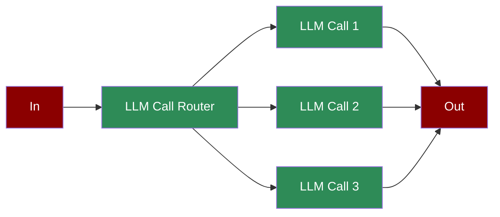

A low-latency workflow where inputs are dynamically routed to the most appropriate LLM instance or configuration, optimizing efficiency and specialization.

## Quick Start

<Steps>
    <Step title="Install Package">
        First, install the PraisonAI Agents package:
        ```bash
        pip install praisonaiagents
        ```
    </Step>

    <Step title="Set API Key">
        Set your OpenAI API key as an environment variable in your terminal:
        ```bash
        export OPENAI_API_KEY=your_api_key_here
        ```
    </Step>

    <Step title="Create a file">
        Create a new file `app.py` with the basic setup:
        ```python
        from praisonaiagents.agent import Agent
        from praisonaiagents.task import Task
        from praisonaiagents.agents import PraisonAIAgents
        import time

        def get_time_check():
            current_time = int(time.time())
            result = "even" if current_time % 2 == 0 else "odd"
            print(f"Time check: {current_time} is {result}")
            return result

        # Create specialized agents
        router = Agent(
            name="Router",
            role="Input Router",
            goal="Evaluate input and determine routing path",
            instructions="Analyze input and decide whether to proceed or exit",
            tools=[get_time_check]
        )

        processor1 = Agent(
            name="Processor 1",
            role="Secondary Processor",
            goal="Process valid inputs that passed initial check",
            instructions="Process data that passed the routing check"
        )

        processor2 = Agent(
            name="Processor 2",
            role="Final Processor",
            goal="Perform final processing on validated data",
            instructions="Generate final output for processed data"
        )

        # Create tasks with routing logic
        routing_task = Task(
            name="initial_routing",
            description="check the time and return according to what is returned",
            expected_output="pass or fail based on what is returned",
            agent=router,
            is_start=True,
            task_type="decision",
            condition={
                "pass": ["process_valid"],
                "fail": ["process_invalid"]
            }
        )

        processing_task = Task(
            name="process_valid",
            description="Process validated input",
            expected_output="Processed data ready for final step",
            agent=processor1,
        )

        final_task = Task(
            name="process_invalid",
            description="Generate final output",
            expected_output="Final processed result",
            agent=processor2
        )

        # Create and run workflow
        workflow = PraisonAIAgents(
            agents=[router, processor1, processor2],
            tasks=[routing_task, processing_task, final_task],
            process="workflow",
            verbose=True
        )

        print("\nStarting Routing Workflow...")
        print("=" * 50)

        results = workflow.start()

        print("\nWorkflow Results:")
        print("=" * 50)
        for task_id, result in results["task_results"].items():
            if result:
                task_name = result.description
                print(f"\nTask: {task_name}")
                print(f"Result: {result.raw}")
                print("-" * 50)
        ```
    </Step>

    <Step title="Start Agents">
        Type this in your terminal to run your agents:
        ```bash
        python app.py
        ```
    </Step>
</Steps>

<Note>
  **Requirements**
  - Python 3.10 or higher
  - OpenAI API key. Generate OpenAI API key [here](https://platform.openai.com/api-keys). Use Other models using [this guide](/models).   
  - Basic understanding of Python
</Note>

<div className="relative w-full aspect-video">
  <iframe
    className="absolute top-0 left-0 w-full h-full"
    src="https://www.youtube.com/embed/KNDVWGN3TpM"
    title="YouTube video player"
    allow="accelerometer; autoplay; clipboard-write; encrypted-media; gyroscope; picture-in-picture"
    allowFullScreen
  ></iframe>
</div>

## Understanding Agentic Routing

<Card title="What is Agentic Routing?" icon="question">
  Agentic routing enables:
  - Dynamic decision-making in workflows
  - Conditional task execution paths
  - Automated process branching
  - Intelligent workflow management
</Card>

## Features

<CardGroup cols={2}>
  <Card title="Dynamic Routing" icon="route">
    Route tasks based on real-time decisions and conditions.
  </Card>
  <Card title="Conditional Logic" icon="code-branch">
    Implement complex branching logic in workflows.
  </Card>
  <Card title="Task Management" icon="tasks">
    Handle task dependencies and execution order.
  </Card>
  <Card title="Process Control" icon="sliders">
    Control workflow execution with detailed monitoring.
  </Card>
</CardGroup>

## Configuration Options

```python
# Create a router agent
router = Agent(
    name="Router",
    role="Input Router",
    goal="Evaluate input and determine routing path",
    instructions="Analyze input and decide whether to proceed or exit",
    tools=[get_time_check],  # Custom tools for routing decisions
    verbose=True  # Enable detailed logging
)

# Task with routing configuration
routing_task = Task(
    name="initial_routing",
    description="Route based on conditions",
    expected_output="Routing decision",
    agent=router,
    is_start=True,
    task_type="decision",
    condition={
        "pass": ["next_task"],
        "fail": ["alternate_task"]
    }
)
```

## RouterAgent - Advanced Dynamic Routing

The RouterAgent is a specialized agent that provides intelligent model selection based on task requirements, optimizing for both performance and cost.

### RouterAgent Features

<CardGroup cols={2}>
  <Card title="Dynamic Model Selection" icon="brain">
    Automatically selects the best model based on:
    - Task complexity and requirements
    - Context length needs
    - Cost constraints
    - Performance requirements
  </Card>
  <Card title="Cost Optimization" icon="dollar-sign">
    Minimizes costs by:
    - Using cheaper models for simple tasks
    - Switching to powerful models only when needed
    - Tracking cost per task
    - Providing cost analytics
  </Card>
  <Card title="Fallback Handling" icon="shield">
    Ensures reliability with:
    - Automatic model fallbacks
    - Error recovery
    - Retry mechanisms
    - Quality validation
  </Card>
  <Card title="Performance Tracking" icon="chart-line">
    Monitors and optimizes:
    - Response times
    - Success rates
    - Model performance
    - Task outcomes
  </Card>
</CardGroup>

### Using RouterAgent

```python
from praisonaiagents.agent import RouterAgent
from praisonaiagents import Task, PraisonAIAgents

# Create a RouterAgent with model selection rules
router_agent = RouterAgent(
    name="Intelligent Router",
    role="Dynamic Model Selector",
    goal="Route tasks to optimal models based on requirements",
    model_config={
        "simple_tasks": ["gpt-3.5-turbo", "claude-instant"],
        "complex_tasks": ["gpt-4", "claude-3-opus"],
        "coding_tasks": ["gpt-4", "deepseek-coder"],
        "long_context": ["claude-3-sonnet", "gpt-4-turbo"],
        "creative_tasks": ["claude-3-opus", "gpt-4"]
    },
    routing_strategy="cost_optimized",  # or "performance_optimized"
    fallback_model="gpt-3.5-turbo"
)

# Create tasks that will be routed to different models
tasks = [
    Task(
        description="What is 2+2?",
        expected_output="Simple calculation result",
        agent=router_agent,
        task_type="simple"
    ),
    Task(
        description="Write a complex algorithm for distributed systems",
        expected_output="Detailed code implementation",
        agent=router_agent,
        task_type="coding",
        complexity="high"
    ),
    Task(
        description="Analyze this 100-page document and provide insights",
        expected_output="Comprehensive analysis",
        agent=router_agent,
        task_type="analysis",
        context_length=50000
    )
]

# Run workflow with RouterAgent
workflow = PraisonAIAgents(
    agents=[router_agent],
    tasks=tasks,
    verbose=True
)

results = workflow.start()

# View routing decisions and costs
print("\nRouting Summary:")
for task_id, decision in router_agent.get_routing_decisions().items():
    print(f"Task {task_id}: {decision['model']} (Cost: ${decision['cost']:.4f})")

print(f"\nTotal Cost: ${router_agent.get_total_cost():.2f}")
print(f"Cost Savings: ${router_agent.get_cost_savings():.2f}")
```

### Advanced RouterAgent Configuration

```python
# Create RouterAgent with advanced configuration
advanced_router = RouterAgent(
    name="Advanced Router",
    role="Intelligent Task Router",
    goal="Optimize model selection for best results",
    
    # Model selection configuration
    model_config={
        "models": {
            "gpt-4": {
                "cost_per_1k_tokens": 0.03,
                "capabilities": ["reasoning", "coding", "analysis"],
                "max_context": 128000,
                "quality_score": 0.95
            },
            "gpt-3.5-turbo": {
                "cost_per_1k_tokens": 0.001,
                "capabilities": ["general", "fast"],
                "max_context": 16000,
                "quality_score": 0.75
            },
            "claude-3-sonnet": {
                "cost_per_1k_tokens": 0.015,
                "capabilities": ["long_context", "writing"],
                "max_context": 200000,
                "quality_score": 0.90
            }
        }
    },
    
    # Routing rules
    routing_rules=[
        {
            "condition": "task.complexity > 0.8",
            "models": ["gpt-4", "claude-3-opus"],
            "reason": "High complexity requires advanced reasoning"
        },
        {
            "condition": "task.context_length > 100000",
            "models": ["claude-3-sonnet"],
            "reason": "Long context requires specialized model"
        },
        {
            "condition": "task.urgency == 'high' and task.complexity < 0.5",
            "models": ["gpt-3.5-turbo"],
            "reason": "Simple urgent tasks need fast response"
        }
    ],
    
    # Performance optimization
    optimization_config={
        "enable_caching": True,
        "cache_ttl": 3600,
        "enable_parallel_routing": True,
        "max_retries": 3,
        "timeout_seconds": 300
    },
    
    # Cost controls
    cost_config={
        "max_cost_per_task": 1.0,
        "daily_budget": 100.0,
        "alert_threshold": 0.8,
        "require_approval_above": 5.0
    }
)
```

### RouterAgent with Learning

```python
# RouterAgent that learns from outcomes
learning_router = RouterAgent(
    name="Learning Router",
    role="Adaptive Model Selector",
    goal="Learn and improve routing decisions over time",
    
    learning_config={
        "enabled": True,
        "feedback_collection": True,
        "model_performance_tracking": True,
        "optimization_interval": 100,  # tasks
        "performance_metrics": [
            "task_success_rate",
            "response_quality",
            "cost_efficiency",
            "execution_time"
        ]
    }
)

# Provide feedback to improve routing
learning_router.record_feedback(
    task_id="task_123",
    model_used="gpt-4",
    success=True,
    quality_score=0.9,
    execution_time=2.3
)

# Get routing recommendations based on learning
recommendation = learning_router.get_learned_recommendation(
    task_type="analysis",
    complexity=0.7
)
print(f"Recommended model: {recommendation['model']}")
print(f"Confidence: {recommendation['confidence']}")
```

## Troubleshooting

<CardGroup cols={2}>
  <Card title="Routing Issues" icon="triangle-exclamation">
    If routing doesn't work as expected:
    - Verify condition mappings
    - Check task dependencies
    - Enable verbose mode for debugging
  </Card>

  <Card title="Workflow Flow" icon="diagram-project">
    If workflow is unclear:
    - Review task connections
    - Verify agent configurations
    - Check routing conditions
  </Card>
</CardGroup>

## Next Steps

<CardGroup cols={2}>
  <Card title="AutoAgents" icon="robot" href="./autoagents">
    Learn about automatically created and managed AI agents
  </Card>
  <Card title="Mini Agents" icon="microchip" href="./mini">
    Explore lightweight, focused AI agents
  </Card>
</CardGroup>

<Note>
  For optimal results, ensure your routing conditions are well-defined and your task dependencies are properly configured.
</Note>
