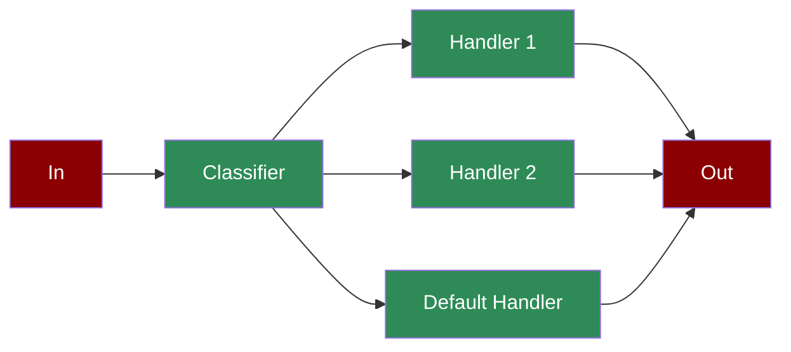

A workflow pattern where inputs are dynamically routed to the most appropriate handler based on classification, optimizing efficiency and specialization.

## Quick Start

<Steps>
    <Step title="Install Package">
        First, install the PraisonAI Agents package:
        ```bash
        pip install praisonaiagents
        ```
    </Step>

    <Step title="Set API Key">
        Set your OpenAI API key as an environment variable in your terminal:
        ```bash
        export OPENAI_API_KEY=your_api_key_here
        ```
    </Step>

    <Step title="Create a file">
        Create a new file `app.py` with the basic setup:
        ```python
        from praisonaiagents import Agent, Workflow
        from praisonaiagents.workflows import route

        # Create classifier agent
        classifier = Agent(
            name="Classifier",
            role="Request Classifier",
            goal="Classify incoming requests",
            instructions="Classify the request. Respond with ONLY 'technical', 'creative', or 'general'."
        )

        # Create specialized handler agents
        tech_agent = Agent(
            name="TechExpert",
            role="Technical Expert",
            goal="Handle technical questions",
            instructions="You are a technical expert. Provide detailed technical answers."
        )

        creative_agent = Agent(
            name="CreativeWriter",
            role="Creative Writer", 
            goal="Handle creative requests",
            instructions="You are a creative writer. Write engaging, creative content."
        )

        general_agent = Agent(
            name="GeneralAssistant",
            role="General Assistant",
            goal="Handle general requests",
            instructions="You are a helpful assistant. Provide clear, helpful responses."
        )

        # Create workflow with routing
        workflow = Workflow(
            steps=[
                classifier,
                route({
                    "technical": [tech_agent],
                    "creative": [creative_agent],
                    "default": [general_agent]
                })
            ]
        )

        # Test routing
        result = workflow.start("How does machine learning work?")
        print(f"Technical Result: {result['output'][:200]}...")

        result = workflow.start("Write a poem about the ocean")
        print(f"Creative Result: {result['output'][:200]}...")
        ```
    </Step>

    <Step title="Start Workflow">
        Type this in your terminal to run your workflow:
        ```bash
        python app.py
        ```
    </Step>
</Steps>

<Note>
  **Requirements**
  - Python 3.10 or higher
  - OpenAI API key. Generate OpenAI API key [here](https://platform.openai.com/api-keys). Use Other models using [this guide](/models).   
  - Basic understanding of Python
</Note>

<div className="relative w-full aspect-video">
  <iframe
    className="absolute top-0 left-0 w-full h-full"
    src="https://www.youtube.com/embed/KNDVWGN3TpM"
    title="YouTube video player"
    allow="accelerometer; autoplay; clipboard-write; encrypted-media; gyroscope; picture-in-picture"
    allowFullScreen
  ></iframe>
</div>

## Understanding Agentic Routing

<Card title="What is Agentic Routing?" icon="question">
  Agentic routing enables:
  - Dynamic decision-making in workflows
  - Conditional task execution paths
  - Automated process branching
  - Intelligent workflow management
</Card>

## Features

<CardGroup cols={2}>
  <Card title="Dynamic Routing" icon="route">
    Route tasks based on real-time decisions and conditions.
  </Card>
  <Card title="Conditional Logic" icon="code-branch">
    Implement complex branching logic in workflows.
  </Card>
  <Card title="Task Management" icon="tasks">
    Handle task dependencies and execution order.
  </Card>
  <Card title="Process Control" icon="sliders">
    Control workflow execution with detailed monitoring.
  </Card>
</CardGroup>

## Configuration Options

```python
from praisonaiagents import Workflow, WorkflowContext, StepResult
from praisonaiagents.workflows import route

# Simple routing with functions
workflow = Workflow(
    steps=[
        classifier_step,
        route({
            "category_a": [handler_a],
            "category_b": [handler_b],
            "default": [fallback_handler]
        })
    ]
)

# Multi-step routes
workflow = Workflow(
    steps=[
        classifier_step,
        route({
            "complex": [step1, step2, step3],  # Multiple steps in sequence
            "simple": [quick_handler],
            "default": [fallback]
        })
    ]
)

# With callbacks for monitoring
workflow = Workflow(
    steps=[classifier, route({"a": [handler_a], "b": [handler_b]})],
    on_step_complete=lambda name, result: print(f"{name}: {result.output}")
)
```

## RouterAgent - Advanced Dynamic Routing

The RouterAgent is a specialized agent that provides intelligent model selection based on task requirements, optimizing for both performance and cost.

### RouterAgent Features

<CardGroup cols={2}>
  <Card title="Dynamic Model Selection" icon="brain">
    Automatically selects the best model based on:
    - Task complexity and requirements
    - Context length needs
    - Cost constraints
    - Performance requirements
  </Card>
  <Card title="Cost Optimization" icon="dollar-sign">
    Minimizes costs by:
    - Using cheaper models for simple tasks
    - Switching to powerful models only when needed
    - Tracking cost per task
    - Providing cost analytics
  </Card>
  <Card title="Fallback Handling" icon="shield">
    Ensures reliability with:
    - Automatic model fallbacks
    - Error recovery
    - Retry mechanisms
    - Quality validation
  </Card>
  <Card title="Performance Tracking" icon="chart-line">
    Monitors and optimizes:
    - Response times
    - Success rates
    - Model performance
    - Task outcomes
  </Card>
</CardGroup>

### Using RouterAgent

<Warning>
  The RouterAgent must be imported from `praisonaiagents.agent.router_agent`, not directly from `praisonaiagents`.
</Warning>

```python
from praisonaiagents.agent.router_agent import RouterAgent
from praisonaiagents.llm.model_router import ModelRouter
from praisonaiagents import Task, PraisonAIAgents

# Option 1: Simple RouterAgent with model list
router_agent = RouterAgent(
    name="Smart Router",
    role="Task Router",  # Use 'role' not 'description'
    goal="Route tasks to optimal models",
    backstory="I analyze tasks and select the most appropriate model",
    models=["gpt-4o-mini", "gpt-4o", "claude-3-5-sonnet-20241022"],
    routing_strategy="cost-optimized",  # "auto", "manual", "cost-optimized", "performance-optimized"
    verbose=True
)

# Execute tasks (not chat)
result = router_agent.execute("What is 2+2?")
print(f"Result: {result}")

# For complex tasks
result = router_agent.execute("Write a comprehensive business plan for a SaaS startup")
print(f"Result: {result}")

# Get usage report to see which models were used
usage_report = router_agent.get_usage_report()
print(f"Usage report: {usage_report}")
```

### RouterAgent with Custom ModelRouter

For more control over cost thresholds and provider preferences, use a custom ModelRouter:

```python
from praisonaiagents.agent.router_agent import RouterAgent
from praisonaiagents.llm.model_router import ModelRouter

# Create custom ModelRouter with cost control
custom_router = ModelRouter(
    cost_threshold=0.10,  # Max cost per request
    preferred_providers=["openai", "anthropic"]
)

# Create RouterAgent with custom router
router_agent = RouterAgent(
    name="Smart Router",
    role="Task Router",
    goal="Route tasks to optimal models with cost control",
    model_router=custom_router,
    routing_strategy="auto",
    verbose=True
)
```

### Using RouterAgent with Tasks and Workflows

The RouterAgent is designed to work within the PraisonAI framework:

```python
from praisonaiagents.agent.router_agent import RouterAgent
from praisonaiagents import Task, PraisonAIAgents

# Create router agent
router_agent = RouterAgent(
    name="Adaptive Assistant",
    role="Multi-Model Assistant",
    goal="Complete tasks using the most appropriate model",
    backstory="I intelligently route tasks to different models based on complexity",
    models=["gpt-4o-mini", "gpt-4o", "claude-3-5-sonnet-20241022"],
    routing_strategy="auto",
    verbose=True
)

# Create tasks for the router agent
simple_task = Task(
    description="What is the capital of France?",
    expected_output="A simple answer",
    agent=router_agent
)

complex_task = Task(
    description="Analyze the economic impact of renewable energy adoption in developing countries",
    expected_output="A comprehensive analysis",
    agent=router_agent
)

# Run with PraisonAIAgents
agents = PraisonAIAgents(
    agents=[router_agent],
    tasks=[simple_task, complex_task],
    process="sequential"
)

results = agents.start()

# View results
for task_id, result in results['task_results'].items():
    print(f"Task: {result.description[:50]}...")
    print(f"Result: {result.raw[:100]}...")
    print("-" * 50)
```

### RouterAgent Initialization Parameters

The RouterAgent accepts these parameters:

| Parameter | Type | Description | Default |
|-----------|------|-------------|---------|
| `models` | List[str] or Dict | List of model names or model configuration | None |
| `model_router` | ModelRouter | Custom ModelRouter instance | None |
| `routing_strategy` | str | Strategy: "auto", "manual", "cost-optimized", "performance-optimized" | "auto" |
| `primary_model` | str | Primary model to use | None |
| `fallback_model` | str | Fallback model for errors | None |
| `**kwargs` | Any | Standard Agent parameters (name, role, goal, etc.) | - |

### Real-World Example: Multi-Provider Cost Optimization

```python
from praisonaiagents.agent.router_agent import RouterAgent
from praisonaiagents import Task, PraisonAIAgents

# Example from examples/agents/router-agent-cost-optimization.py
router = RouterAgent(
    name="Cost-Optimized Assistant",
    role="Efficient Task Processor",
    goal="Complete tasks with optimal cost-performance balance",
    models=[
        "gpt-4o-mini",      # Cheap, fast for simple tasks
        "gpt-4o",           # Balanced for medium complexity
        "gpt-4",            # Powerful for complex tasks
        "claude-3-5-sonnet-20241022"  # Alternative provider
    ],
    routing_strategy="cost-optimized",
    primary_model="gpt-4o-mini",
    fallback_model="gpt-4o"
)

# The router will automatically:
# - Use gpt-4o-mini for simple queries
# - Upgrade to gpt-4o or gpt-4 for complex tasks
# - Fall back to gpt-4o if the primary model fails
```

### Important Notes

<Note>
  - The RouterAgent uses `execute()` or `start()` methods, not `chat()`
  - Cost threshold is set on ModelRouter, not RouterAgent directly
  - Provider preferences are configured via ModelRouter
  - Model tracking is done via `get_usage_report()`, not `last_model_used`
</Note>
```

## Troubleshooting

<CardGroup cols={2}>
  <Card title="Routing Issues" icon="triangle-exclamation">
    If routing doesn't work as expected:
    - Verify condition mappings
    - Check task dependencies
    - Enable verbose mode for debugging
  </Card>

  <Card title="Workflow Flow" icon="diagram-project">
    If workflow is unclear:
    - Review task connections
    - Verify agent configurations
    - Check routing conditions
  </Card>
</CardGroup>

## Next Steps

<CardGroup cols={2}>
  <Card title="AutoAgents" icon="robot" href="./autoagents">
    Learn about automatically created and managed AI agents
  </Card>
  <Card title="Mini Agents" icon="microchip" href="./mini">
    Explore lightweight, focused AI agents
  </Card>
</CardGroup>

<Note>
  For optimal results, ensure your routing conditions are well-defined and your task dependencies are properly configured.
</Note>
