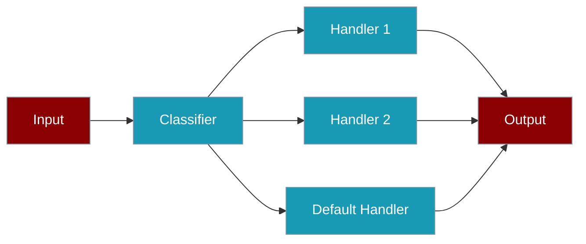

Route each request to the best handler agent — a classifier picks the path, specialised agents do the work.

```python
from praisonaiagents import Agent, AgentFlow, route

classifier = Agent(
    name="Classifier",
    instructions="Classify the request. Reply with ONLY 'technical', 'creative', or 'general'.",
)

tech_agent = Agent(name="TechExpert", instructions="Answer technical questions in detail.")
creative_agent = Agent(name="CreativeWriter", instructions="Write engaging creative content.")
general_agent = Agent(name="GeneralAssistant", instructions="Give clear, helpful responses.")

workflow = AgentFlow(steps=[
    classifier,
    route({
        "technical": [tech_agent],
        "creative": [creative_agent],
        "default": [general_agent],
    }),
])

result = workflow.start("How does machine learning work?")
```


```mermaid
flowchart LR
    In[Input] --> Router[Classifier]
    Router --> H1[Handler 1]
    Router --> H2[Handler 2]
    Router --> H3[Default Handler]
    H1 --> Out[Output]
    H2 --> Out
    H3 --> Out

    classDef agent fill:#8B0000,stroke:#7C90A0,color:#fff
    classDef tool fill:#189AB4,stroke:#7C90A0,color:#fff

    class In,Out agent
    class Router,H1,H2,H3 tool
```

## Quick Start

<Steps>
<Step title="Simple Usage">

```python
from praisonaiagents import Agent, AgentFlow, route

classifier = Agent(
    name="Classifier",
    instructions="Classify the request. Reply with ONLY 'technical', 'creative', or 'general'.",
)
tech_agent = Agent(name="TechExpert", instructions="Answer technical questions.")
creative_agent = Agent(name="CreativeWriter", instructions="Write creative content.")
general_agent = Agent(name="GeneralAssistant", instructions="Give helpful responses.")

workflow = AgentFlow(steps=[
    classifier,
    route({"technical": [tech_agent], "creative": [creative_agent], "default": [general_agent]}),
])

print(workflow.start("Write a poem about the ocean"))
```

</Step>

<Step title="With Configuration">

Multi-step routes and step-complete hooks:

```python
from praisonaiagents import AgentFlow, route
from praisonaiagents.workflows import WorkflowHooksConfig

workflow = AgentFlow(
    steps=[
        classifier,
        route({
            "complex": [step1, step2, step3],
            "simple": [quick_handler],
            "default": [fallback],
        }),
    ],
    hooks=WorkflowHooksConfig(
        on_step_complete=lambda name, result: print(f"{name}: done"),
    ),
)
```

</Step>
</Steps>

---

## Configuration Options

| Pattern | Description |
|---------|-------------|
| `route({"key": [agent]})` | Single handler per classification |
| `route({"key": [a, b, c]})` | Sequential multi-step route |
| `"default"` key | Fallback when no match |

---

## RouterAgent — Model Selection

<Warning>
Import `RouterAgent` from `praisonaiagents.agent.router_agent` — it is not re-exported at the top level.
</Warning>

```python
from praisonaiagents.agent.router_agent import RouterAgent

router = RouterAgent(
    name="Smart Router",
    role="Task Router",
    goal="Route tasks to optimal models",
    models=["gpt-4o-mini", "gpt-4o", "claude-3-5-sonnet-20241022"],
    routing_strategy="cost-optimized",
)

result = router.execute("What is 2+2?")
print(router.get_usage_report())
```

| Parameter | Default | Options |
|-----------|---------|---------|
| `routing_strategy` | `"auto"` | `auto`, `manual`, `cost-optimized`, `performance-optimized` |
| `models` | `None` | List of model names |
| `primary_model` | `None` | Default model |
| `fallback_model` | `None` | Model on error |

---

## Best Practices

<AccordionGroup>

<Accordion title="Keep classifier output constrained">

Instruct the classifier to reply with exact route keys — free-form labels break mapping.

</Accordion>

<Accordion title="Always provide a default route">

Unhandled classifications should fall through to a general handler, not fail silently.

</Accordion>

<Accordion title="Use cost-optimized routing in production">

`RouterAgent` with `routing_strategy="cost-optimized"` saves cost on simple queries automatically.

</Accordion>

<Accordion title="Enable hooks while debugging routes">

`on_step_complete` shows which handler ran — useful when classification is ambiguous.

</Accordion>

</AccordionGroup>

---

## Related

<CardGroup cols={2}>
<Card title="Workflows" icon="diagram-project" href="/docs/features/workflows">
  Workflow patterns and orchestration
</Card>
<Card title="AutoAgents" icon="robot" href="/docs/features/autoagents">
  Automatically created and managed agents
</Card>
</CardGroup>
