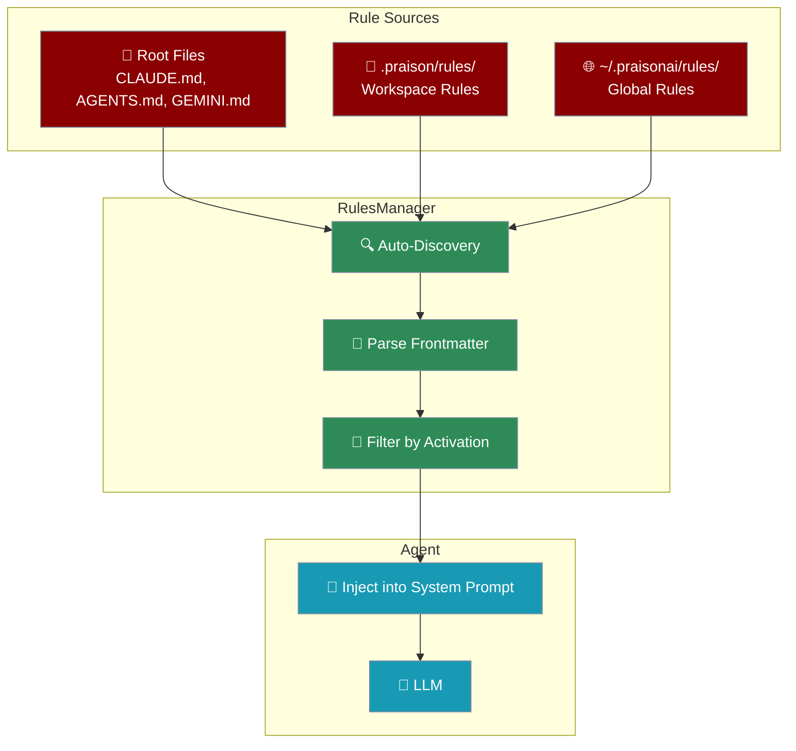

# Rules & Instructions

PraisonAI automatically discovers and applies rules/instructions from multiple sources, similar to Cursor, Windsurf, Claude Code, and Codex CLI.


```mermaid
graph TB
    subgraph "Rule Sources"
        ROOT["📄 Root Files<br/>CLAUDE.md, AGENTS.md, GEMINI.md"]
        WORKSPACE["📁 .praison/rules/<br/>Workspace Rules"]
        GLOBAL["🌐 ~/.praisonai/rules/<br/>Global Rules"]
    end
    
    subgraph "RulesManager"
        DISCOVER["🔍 Auto-Discovery"]
        PARSE["📝 Parse Frontmatter"]
        FILTER["🎯 Filter by Activation"]
    end
    
    subgraph "Agent"
        INJECT["💉 Inject into System Prompt"]
        LLM["🤖 LLM"]
    end
    
    ROOT --> DISCOVER
    WORKSPACE --> DISCOVER
    GLOBAL --> DISCOVER
    
    DISCOVER --> PARSE
    PARSE --> FILTER
    FILTER --> INJECT
    INJECT --> LLM
    
    classDef source fill:#8B0000,stroke:#7C90A0,color:#fff
    classDef manager fill:#2E8B57,stroke:#7C90A0,color:#fff
    classDef agent fill:#189AB4,stroke:#7C90A0,color:#fff
    
    class ROOT,WORKSPACE,GLOBAL source
    class DISCOVER,PARSE,FILTER manager
    class INJECT,LLM agent
```

## Supported Instruction Files

PraisonAI automatically loads these files from your project root and git root:

| File | Description | Priority |
|------|-------------|----------|
| `PRAISON.md` | PraisonAI native instructions | High (500) |
| `PRAISON.local.md` | Local overrides (gitignored) | Higher (600) |
| `CLAUDE.md` | Claude Code memory file | High (500) |
| `CLAUDE.local.md` | Local overrides (gitignored) | Higher (600) |
| `AGENTS.md` | OpenAI Codex CLI instructions | High (500) |
| `GEMINI.md` | Gemini CLI memory file | High (500) |
| `.cursorrules` | Cursor IDE rules (legacy) | High (500) |
| `.windsurfrules` | Windsurf IDE rules (legacy) | High (500) |
| `.claude/rules/*.md` | Claude Code modular rules | Medium (50) |
| `.windsurf/rules/*.md` | Windsurf modular rules | Medium (50) |
| `.cursor/rules/*.mdc` | Cursor modular rules | Medium (50) |
| `.praison/rules/*.md` | Workspace rules | Medium (0) |
| `~/.praisonai/rules/*.md` | Global modular rules | Low (-1000) |
| `~/.praisonai/AGENTS.md` | Global single-file instructions | Lowest (loaded by `load_context_files()`) |

<Note>
`~/.praisonai/AGENTS.md` is the global single-file layer used by `load_context_files()`. It is separate from the modular `~/.praisonai/rules/*.md` files managed by `RulesManager` and has the lowest precedence — project-level files always override it.
</Note>

<Note>
**Local Override Files**: `CLAUDE.local.md` and `PRAISON.local.md` are personal overrides that should be gitignored. They have higher priority than the main files, allowing you to customize rules without affecting the shared project configuration.
</Note>

## Quick Start


<Steps>
<Step title="Quick Start">
Rules are automatically loaded when you create an Agent:

```python
from praisonaiagents import Agent

# Create CLAUDE.md in your project root
# Agent auto-discovers and applies it
agent = Agent(
    name="Assistant",
    instructions="You are helpful."
)

# Rules are injected into system prompt automatically
response = agent.chat("Help me with Python")
```
</Step>
</Steps>


## Best Practices

<AccordionGroup>
  <Accordion title="Start simple">
    Enable the feature with a single parameter before adding configuration. Verify it works, then layer in options.
  </Accordion>
  <Accordion title="Use environment variables for secrets">
    Never hardcode API keys or tokens. Use `os.getenv("KEY_NAME")` to read from environment variables.
  </Accordion>
  <Accordion title="Test with minimal examples first">
    Copy the Quick Start example, run it, then extend it. This confirms your environment is set up correctly.
  </Accordion>
  <Accordion title="Check the logs">
    Set `verbose=True` on your agent to see detailed execution logs when debugging unexpected behavior.
  </Accordion>
</AccordionGroup>

## Related

<CardGroup cols={2}>
  <Card title="Features Overview" icon="grid-2" href="/docs/features">
    Browse all PraisonAI features
  </Card>
  <Card title="Quick Start" icon="rocket" href="/docs/introduction">
    Get started with PraisonAI agents
  </Card>
</CardGroup>
