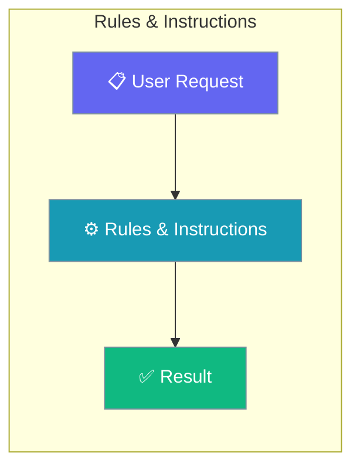
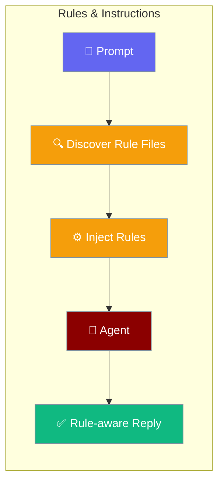
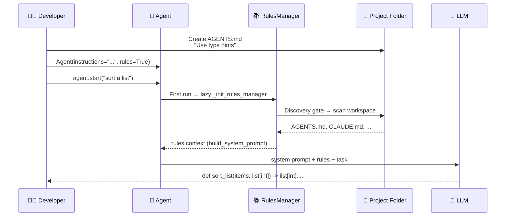
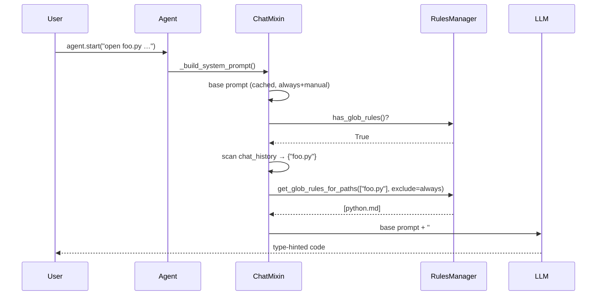
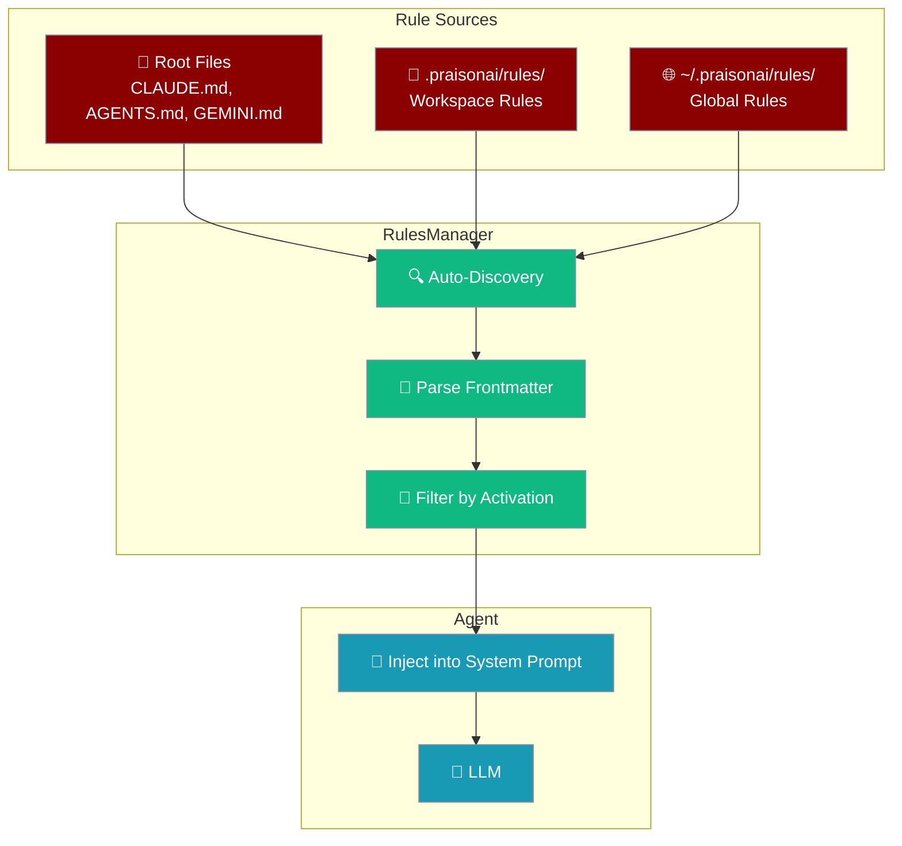
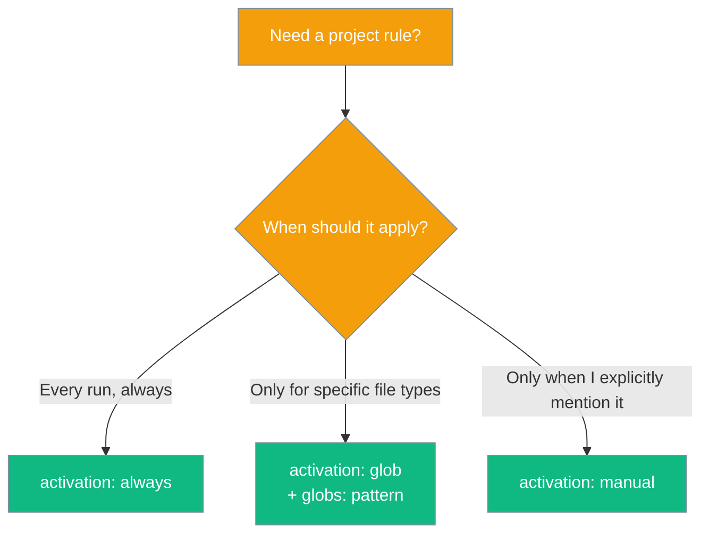
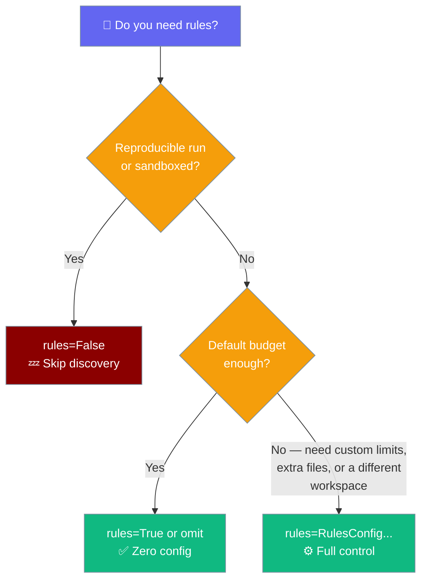
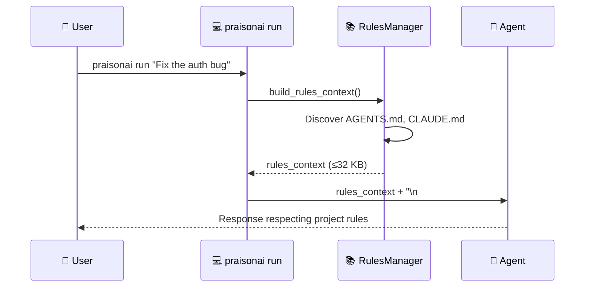

PraisonAI auto-discovers per-project instruction files (`AGENTS.md`, `CLAUDE.md`, `.praisonai/rules/*.md`) and injects them into every agent run — CLI **and** direct `Agent(...)` from Python. Opt out with `rules=False` when you need a sandboxed / reproducible run.



```mermaid
graph LR
    subgraph "Rules & Instructions"
        Request[📋 User Request] --> Process[⚙️ Rules & Instructions]
        Process --> Result[✅ Result]
    end

    classDef input fill:#6366F1,stroke:#7C90A0,color:#fff
    classDef process fill:#189AB4,stroke:#7C90A0,color:#fff
    classDef output fill:#10B981,stroke:#7C90A0,color:#fff

    class Request input
    class Process process
    class Result output
```

The user works in a repo with instruction files; the agent discovers them and injects the rules into the system prompt on every run.

<Note>
The [Model Harness](/docs/features/model-harness) fragment sits *before* the rules block in the assembled system prompt, so family-tuned guidance comes first, then your project rules.
</Note>


```mermaid
graph LR
    subgraph "Rules & Instructions"
        In[📝 Prompt] --> Discover[🔍 Discover Rule Files]
        Discover --> Inject[⚙️ Inject Rules]
        Inject --> Agent[🤖 Agent]
        Agent --> Out[✅ Rule-aware Reply]
    end

    classDef input fill:#6366F1,stroke:#7C90A0,color:#fff
    classDef process fill:#F59E0B,stroke:#7C90A0,color:#fff
    classDef agent fill:#8B0000,stroke:#7C90A0,color:#fff
    classDef output fill:#10B981,stroke:#7C90A0,color:#fff

    class In input
    class Discover,Inject process
    class Agent agent
    class Out output
```

## How It Works


```mermaid
sequenceDiagram
    participant Dev as 👨‍💻 Developer
    participant Agent as 🤖 Agent
    participant RM as 📚 RulesManager
    participant FS as 📂 Project Folder
    participant LLM as 🧠 LLM

    Dev->>FS: Create AGENTS.md<br/>"Use type hints"
    Dev->>Agent: Agent(instructions="...", rules=True)
    Dev->>Agent: agent.start("sort a list")
    Agent->>RM: First run → lazy _init_rules_manager
    RM->>FS: Discovery gate → scan workspace
    FS-->>RM: AGENTS.md, CLAUDE.md, ...
    RM-->>Agent: rules context (build_system_prompt)
    Agent->>LLM: system prompt + rules + task
    LLM-->>Dev: def sort_list(items: list[int]) -> list[int]: ...
```

`always` rules ship in the cached base prompt above; `glob` rules follow a second, per-turn path shown next.

#### Glob rules — per-turn


```mermaid
sequenceDiagram
    participant User
    participant Agent
    participant Chat as ChatMixin
    participant RM as RulesManager
    participant LLM

    User->>Agent: agent.start("open foo.py …")
    Agent->>Chat: _build_system_prompt()
    Chat->>Chat: base prompt (cached, always+manual)
    Chat->>RM: has_glob_rules()?
    RM-->>Chat: True
    Chat->>Chat: scan chat_history → {"foo.py"}
    Chat->>RM: get_glob_rules_for_paths(["foo.py"], exclude=always)
    RM-->>Chat: [python.md]
    Chat->>LLM: base prompt + "## Path-Scoped Rules …" + python.md
    LLM-->>User: type-hinted code
```


```mermaid
graph TB
    subgraph "Rule Sources"
        ROOT["📄 Root Files<br/>CLAUDE.md, AGENTS.md, GEMINI.md"]
        WORKSPACE["📁 .praisonai/rules/<br/>Workspace Rules"]
        GLOBAL["🌐 ~/.praisonai/rules/<br/>Global Rules"]
    end
    
    subgraph "RulesManager"
        DISCOVER["🔍 Auto-Discovery"]
        PARSE["📝 Parse Frontmatter"]
        FILTER["🎯 Filter by Activation"]
    end
    
    subgraph "Agent"
        INJECT["💉 Inject into System Prompt"]
        LLM["🤖 LLM"]
    end
    
    ROOT --> DISCOVER
    WORKSPACE --> DISCOVER
    GLOBAL --> DISCOVER
    
    DISCOVER --> PARSE
    PARSE --> FILTER
    FILTER --> INJECT
    INJECT --> LLM
    
    classDef source fill:#8B0000,stroke:#7C90A0,color:#fff
    classDef manager fill:#10B981,stroke:#7C90A0,color:#fff
    classDef agent fill:#189AB4,stroke:#7C90A0,color:#fff
    
    class ROOT,WORKSPACE,GLOBAL source
    class DISCOVER,PARSE,FILTER manager
    class INJECT,LLM agent
```

## Supported Instruction Files

PraisonAI automatically loads these files from your project root and git root:

| File | Description | Priority |
|------|-------------|----------|
| `PRAISON.md` | PraisonAI native instructions | High (500) |
| `PRAISON.local.md` | Local overrides (gitignored) | Higher (600) |
| `CLAUDE.md` | Claude Code memory file | High (500) |
| `CLAUDE.local.md` | Local overrides (gitignored) | Higher (600) |
| `AGENTS.md` | OpenAI Codex CLI instructions | High (500) |
| `GEMINI.md` | Gemini CLI memory file | High (500) |
| `.cursorrules` | Cursor IDE rules (legacy) | High (500) |
| `.windsurfrules` | Windsurf IDE rules (legacy) | High (500) |
| `.claude/rules/*.md` | Claude Code modular rules | Medium (50) |
| `.windsurf/rules/*.md` | Windsurf modular rules | Medium (50) |
| `.cursor/rules/*.mdc` | Cursor modular rules | Medium (50) |
| `.praisonai/rules/*.md` | Workspace rules | Medium (0) |
| `~/.praisonai/rules/*.md` | Global modular rules | Low (-1000) |
| `~/.praisonai/AGENTS.md` | Global single-file instructions | Lowest (loaded by `load_context_files()`) |

<Note>
`~/.praisonai/AGENTS.md` is the global single-file layer used by `load_context_files()`. It is separate from the modular `~/.praisonai/rules/*.md` files managed by `RulesManager` and has the lowest precedence — project-level files always override it.
</Note>

<Note>
**Local Override Files**: `CLAUDE.local.md` and `PRAISON.local.md` are personal overrides that should be gitignored. They have higher priority than the main files, allowing you to customize rules without affecting the shared project configuration.
</Note>

## Quick Start

<Steps>
<Step title="Simple">

Drop an instruction file in your project — the agent picks it up automatically.

```python
from praisonaiagents import Agent

agent = Agent(
    name="Assistant",
    instructions="You help users with Python.",
    rules=True,          # same as omitting — auto-discover + apply
)
agent.start("Sort a list of dicts by the 'priority' key.")
```

</Step>

<Step title="With Configuration">

Use `RulesConfig` when you need a character budget, extra rule files, or a different workspace root.

```python
from praisonaiagents import Agent, RulesConfig

agent = Agent(
    name="Assistant",
    instructions="You help users with Python.",
    rules=RulesConfig(
        char_budget=6000,
        files=["docs/CONVENTIONS.md"],
    ),
)
agent.start("Refactor this module in line with our conventions.")
```

</Step>
</Steps>

<Note>
**Opt out:** pass `rules=False` for sandboxed / reproducible runs where project files must not leak into the prompt.

```python
from praisonaiagents import Agent

agent = Agent(name="Sandbox", instructions="You are helpful.", rules=False)
agent.start("Explain closures.")
```
</Note>

## Precedence

`rules=` climbs the ladder from simplest to most explicit — `Bool` then `RulesConfig` — with `rules=False` as a standalone opt-out.

| You pass | What happens |
|----------|--------------|
| Nothing (omit `rules=`) | Auto-discover and apply if files exist |
| `rules=None` | Same as omitting — auto-discover and apply |
| `rules=True` | Same as above — auto-discover and apply |
| `rules=RulesConfig(...)` | Full control (custom budget / files / workspace) |
| `rules=False` | **Off** — no discovery, no injection, sandboxed run |

## CLI Usage

Project instruction files are auto-injected into `praisonai run`, `chat`, and `code` — no Python required.

```bash
# 1. Create an instruction file in your project
echo "Always use type hints" > AGENTS.md

# 2. Run any CLI command — instructions load automatically
praisonai run "Help me with Python"
```

## Rule File Format

Rules support YAML frontmatter for advanced configuration:

<CodeGroup>
```markdown Simple Rule (PRAISON.md)
# Project Guidelines

- Always use type hints for functions
- Follow PEP 8 style guide
- Write docstrings for public APIs
- Prefer async when possible
```

```markdown With Frontmatter
---
description: Python coding guidelines
globs: ["**/*.py", "**/*.pyx"]
activation: always
priority: 10
---

# Python Guidelines

- Use type hints for all functions
- Follow PEP 8 style guide
- Write docstrings for public APIs
- Prefer composition over inheritance
```

```markdown Glob-Based Rule
---
description: Testing guidelines
globs: ["**/*.test.*", "**/test_*.py", "**/*_test.py"]
activation: glob
priority: 20
---

# Testing Guidelines

- Use pytest for all tests
- Aim for 80% code coverage
- Mock external dependencies
- Use fixtures for common setup
```

```markdown Manual Rule
---
description: Security review checklist
activation: manual
priority: 100
---

# Security Checklist

- [ ] Validate all user inputs
- [ ] Use parameterized queries
- [ ] Implement rate limiting
- [ ] Check for SQL injection
- [ ] Verify authentication
```
</CodeGroup>

<Note>
Glob rules are appended **after** the cached base prompt on every turn. This means:
- Cache hits are unaffected — your `always` rules stay in the cached prefix.
- Glob rules can appear or disappear between turns as the touched-files set changes — no restart needed.
</Note>

<Note>
Recursive globs (`**/*.py`) match both full paths (`src/main.py`) **and** bare filenames (`foo.py`). A user prompt like *"open foo.py"* is enough to activate the rule; a full path is not required.
</Note>

## Activation Modes

| Mode | Description | Use Case |
|------|-------------|----------|
| `always` | Always applied (default) — ships in the cached base prompt | General guidelines |
| `glob` | Injected **only for files the agent has actually touched this turn**; matches paths that appear in the running conversation | Language-specific rules |
| `manual` | Only via @mention | Security checklists, special procedures |
| `ai_decision` | AI decides when to apply | Context-dependent rules |

<Note>
`always` rules ship in the cached base prompt. `glob` rules are evaluated **per-turn** and appended after the cache, so they can change from turn to turn as the agent opens new files. This is intentional — it keeps the cached prefix stable and lets path-scoped guidance follow the work.
</Note>

## How path-scoped rules activate

Rules with `activation: glob` fire the moment your agent reads or edits a matching file — no wiring needed.

```python
from praisonaiagents import Agent

agent = Agent(
    name="Dev",
    instructions="Refactor the codebase",
)
agent.start("Open foo.py and add type hints")   # → python.md rule activates
```

The rule lives on disk as usual:

```markdown
---
activation: glob
globs: ["**/*.py"]
---
Use type hints on every function and method.
```

Pick an activation mode based on when the rule should apply:


```mermaid
graph TB
    A[Need a project rule?] --> B{When should it apply?}
    B -->|Every run, always| C[activation: always]
    B -->|Only for specific file types| D[activation: glob<br/>+ globs: pattern]
    B -->|Only when I explicitly mention it| E[activation: manual]

    classDef question fill:#F59E0B,stroke:#7C90A0,color:#fff
    classDef choice fill:#10B981,stroke:#7C90A0,color:#fff

    class A,B question
    class C,D,E choice
```

<Note>
Workspaces without any `activation: glob` rules pay zero cost — the whole path is gated on a cheap `has_glob_rules()` check.
</Note>

<Tip>
A rule that is already emitted as `always` (or manually pinned) is **not** duplicated when a glob match also selects it. Path-scoped injection only adds rules not already present.
</Tip>

## Path-Scoped Rules in Action

Author a `glob` rule and it fires the moment the agent touches a matching file during a run.

```python
from praisonaiagents import Agent

# File on disk: .praisonai/rules/python.md
# ---
# description: Python style
# globs: ["**/*.py"]
# activation: glob
# ---
# Use type hints on every function.

agent = Agent(
    name="Coder",
    instructions="Help with code.",
)
agent.start("Open foo.py and describe it")
# ↑ mentions foo.py → python.md rule is injected this turn.
```


```mermaid
sequenceDiagram
    participant User
    participant Agent
    participant Chat as ChatMixin
    participant RM as RulesManager
    participant LLM

    User->>Agent: agent.start("open foo.py …")
    Agent->>Chat: _build_system_prompt()
    Chat->>Chat: base prompt (cached, always+manual)
    Chat->>RM: has_glob_rules()?
    RM-->>Chat: True
    Chat->>Chat: scan chat_history → {"foo.py"}
    Chat->>RM: get_glob_rules_for_paths(["foo.py"], exclude=always)
    RM-->>Chat: [python.md]
    Chat->>LLM: base prompt + "## Path-Scoped Rules …" + python.md
    LLM-->>User: type-hinted code
```

A rule with `globs: ["**/*.py"]` fires only when a filename token actually appears in the conversation:

| User / tool text mentions | Rule (`globs: ["**/*.py"]`) fires? |
|---------------------------|-------------------------------------|
| `"open foo.py"`           | ✅ yes                              |
| `"src/main.py"`           | ✅ yes                              |
| `"the .py file"`          | ❌ no (no filename token)           |
| `"hello world"`           | ❌ no                               |
| Agent reads `foo.js`      | ❌ no (extension does not match)    |

<Info>
Path collection is heuristic — it scans user prompts and tool result strings for tokens that look like a filename (`something.ext`, plus paths and quoted forms). Any tool that includes the file path in its result — the built-in file tools do — is enough for the matching glob rule to fire on the next turn. There is no need to thread paths through your own tools.
</Info>

## Configuration (`RulesConfig`)

Pass a `RulesConfig` when you need more than the default zero-config behaviour.

```python
from praisonaiagents import Agent, RulesConfig

agent = Agent(
    name="Assistant",
    instructions="You are helpful.",
    rules=RulesConfig(
        char_budget=6000,
        files=["docs/CONVENTIONS.md"],
        workspace_path="/path/to/project",
    ),
)
agent.start("Summarise the project conventions.")
```

| Option | Type | Default | Description |
|--------|------|---------|-------------|
| `char_budget` | `Optional[int]` | `None` | Character budget for injected rules context. `None` = RulesManager default. |
| `files` | `Optional[List[str]]` | `None` | Extra instruction file paths / globs registered with high priority beyond auto-discovery. |
| `workspace_path` | `Optional[str]` | `None` | Workspace path override. Defaults to `os.getcwd()`. |

<Note>
**Discovery gate**: the first time the agent runs, the workspace is scanned; if no instruction file is found, the RulesManager is dropped and every later run pays zero cost. Extra `files` are registered **before** the gate, so a workspace whose only rules are explicit `files=[...]` is never dropped. Programmatic equivalent: call `RulesManager.add_rule_file(path)` — the same machinery `RulesConfig(files=[...])` uses under the hood.
</Note>

### Choose an option


```mermaid
graph TB
    START[🎯 Do you need rules?] --> Q1{Reproducible run<br/>or sandboxed?}
    Q1 -->|Yes| OFF[rules=False<br/>💤 Skip discovery]
    Q1 -->|No| Q2{Default budget<br/>enough?}
    Q2 -->|Yes| DEFAULT[rules=True or omit<br/>✅ Zero config]
    Q2 -->|No — need custom limits,<br/>extra files, or a different<br/>workspace| CONFIG[rules=RulesConfig...<br/>⚙️ Full control]

    classDef start fill:#6366F1,stroke:#7C90A0,color:#fff
    classDef decide fill:#F59E0B,stroke:#7C90A0,color:#fff
    classDef result fill:#10B981,stroke:#7C90A0,color:#fff
    classDef off fill:#8B0000,stroke:#7C90A0,color:#fff

    class START start
    class Q1,Q2 decide
    class DEFAULT,CONFIG result
    class OFF off
```

## @Import Syntax (like Claude Code)

Include other files in your rules using the `@path/to/file` syntax:

<CodeGroup>
```markdown Basic Import
# CLAUDE.md
See @README for project overview
See @docs/architecture.md for system design

# Additional Instructions
- Follow the patterns in @src/examples/
```

```markdown Home Directory Import
# CLAUDE.md
# Import personal preferences from home directory
@~/.praisonai/my-preferences.md

# Project-specific rules
- Use TypeScript for all new code
```

```markdown Relative Import
# .praisonai/rules/python.md
# Import shared guidelines
@./shared/code-style.md

# Python-specific additions
- Use type hints
- Follow PEP 8
```
</CodeGroup>

<Note>
**Import Depth Limit**: Imports are limited to 5 levels deep to prevent circular dependencies. Code spans like `` `@org/package` `` are not treated as imports.
</Note>

## Git Root Discovery

PraisonAI automatically discovers rules from the git repository root, enabling monorepo support:

```
monorepo/                    # Git root
├── .git/
├── CLAUDE.md               # Discovered for all subdirs
├── .praisonai/rules/       # Discovered for all subdirs
├── packages/
│   ├── frontend/
│   │   ├── CLAUDE.md       # Higher priority for frontend
│   │   └── .praisonai/rules/
│   └── backend/
│       └── CLAUDE.md       # Higher priority for backend
```

Rules closer to the current working directory have higher priority than rules at the git root.

The wrapper-layer `load_context_files()` (used by `configure_host` / `context_paths`) uses the same git-root walk-up and adds layered merge semantics — collecting `AGENTS.md`, `CLAUDE.md`, `agents.md`, and `.agents/AGENTS.md` at every directory level from `~/.praisonai/AGENTS.md` (lowest) up through the git root to `cwd` (highest). See [Context Files → CLI auto-loading](/docs/features/context-files#cli-auto-loading) for how `chat`, `run`, `code`, and `tui` automatically inject this context into the agent system prompt.

Monorepos with per-subtree instruction files: see [On-demand Subtree Attachment](/docs/features/context-files#on-demand-subtree-attachment) for how a sibling package's `AGENTS.md` attaches the moment the agent opens a file inside it.

## Storage Structure

```
project/
├── CLAUDE.md              # Auto-loaded (Claude Code compatible)
├── CLAUDE.local.md        # Local overrides (gitignored)
├── AGENTS.md              # Auto-loaded (Codex CLI compatible)
├── GEMINI.md              # Auto-loaded (Gemini CLI compatible)
├── PRAISON.md             # Auto-loaded (PraisonAI native)
├── PRAISON.local.md       # Local overrides (gitignored)
├── .cursorrules           # Auto-loaded (Cursor legacy)
├── .windsurfrules         # Auto-loaded (Windsurf legacy)
├── .claude/
│   └── rules/             # Claude Code modular rules
│       ├── code-style.md
│       └── testing.md
├── .windsurf/
│   └── rules/             # Windsurf modular rules
├── .cursor/
│   └── rules/             # Cursor modular rules
├── .praisonai/
│   ├── rules/             # Workspace rules
│   │   ├── python.md      # globs: ["**/*.py"]
│   │   ├── testing.md     # globs: ["**/*.test.*"]
│   │   └── security.md    # activation: manual
│   ├── workflows/         # Reusable workflows
│   └── hooks.json         # Pre/post operation hooks
└── ~/.praisonai/
    └── rules/             # Global rules (all projects)
        └── global.md
```

## Security & Path Safety

<Note>
**Enhanced in PR #1597:** MCP `praisonai.rules.*` tools now validate `rule_name` against path traversal attacks.
</Note>

The `praisonai.rules.show`, `create`, and `delete` MCP tools validate rule names to prevent path traversal:

**Rejected inputs:**
- Contains `/`, `\`, or `\x00` (NUL byte)
- Starts with `.` (blocks hidden files and `..`)
- Equals `.` or `..`
- The resolved path escapes `~/.praisonai/rules/` (symlink-safe)

**Allowed pattern:** Single filename with alphanumerics, underscores, hyphens, and dots (not leading), located strictly inside `~/.praisonai/rules/`.

**Error format:** `Error: invalid rule_name: '<value>'`

## Programmatic Rules Management

```python
from praisonaiagents.memory import RulesManager

# Create manager for your workspace
rules = RulesManager(workspace_path="/path/to/project")

# Get all loaded rules
all_rules = rules.get_all_rules()
for rule in all_rules:
    print(f"{rule.name}: {rule.description} (priority: {rule.priority})")

# Get active rules (always + ai_decision)
active = rules.get_active_rules()

# Get rules for a specific file (includes glob matches)
python_rules = rules.get_rules_for_file("src/main.py")

# Cheap gate — True if any activation: glob rule is loaded.
if rules.has_glob_rules():
    # Return glob rules matching any of these paths,
    # skipping names already emitted in the base prompt.
    matching = rules.get_glob_rules_for_paths(
        ["foo.py", "src/main.py"],
        exclude_names={"root", "python"},
    )
    for rule in matching:  # sorted by priority, highest first
        print(rule.name, rule.description)

# Get a specific rule by name (for @mention)
security_rule = rules.get_rule_by_name("security")

# Build context string for LLM
context = rules.build_rules_context(
    file_path="src/main.py",
    include_manual=["security"]  # Include manual rules via @mention
)

# Register extra instruction files beyond auto-discovery.
# Accepts a concrete path OR a glob; each match wins over auto-discovered
# rules via a +200 priority bump. Returns the number of files added.
added = rules.add_rule_file("docs/CONVENTIONS.md")            # concrete path
added = rules.add_rule_file(".praisonai/team-rules/*.md")     # glob
```

The two glob helpers power the per-turn path-scoped injection shown in [Path-Scoped Rules in Action](#path-scoped-rules-in-action).

| Method | Signature | Returns |
|--------|-----------|---------|
| `has_glob_rules` | `() -> bool` | `True` if any glob-activation rule is loaded. Cheap gate used to short-circuit per-turn work when no glob rules exist. |
| `get_glob_rules_for_paths` | `(file_paths: List[str], exclude_names: Optional[set] = None) -> List[Rule]` | Glob rules matching any of the given paths, deduped by name, `exclude_names` skipped, sorted by priority descending. |

## Creating Rules Programmatically

```python
from praisonaiagents.memory import RulesManager

rules = RulesManager(workspace_path="/path/to/project")

# Create a new rule
rules.create_rule(
    name="api_guidelines",
    content="""# API Guidelines
- Use RESTful conventions
- Version all endpoints
- Return proper status codes
- Document with OpenAPI
""",
    description="REST API development guidelines",
    globs=["**/api/**/*.py", "**/routes/**/*.py"],
    activation="glob",
    priority=15,
    scope="workspace"  # or "global"
)

# Delete a rule
rules.delete_rule("old_rule")

# Reload rules from disk
rules.reload()

# Get statistics
stats = rules.get_stats()
print(stats)
# {
#   'total_rules': 8,
#   'always_rules': 3,
#   'glob_rules': 2,
#   'manual_rules': 1,
#   'ai_decision_rules': 2,
#   'root_rules': 3,
#   'gitroot_rules': 1,
#   'workspace_rules': 2,
#   'claude_rules': 1,
#   'windsurf_rules': 1,
#   'global_rules': 0,
#   'sources': {'root': 3, 'workspace': 2, 'claude': 1, ...}
# }
```

## AI Decision Activation

For `ai_decision` rules, PraisonAI can use an LLM to decide if a rule should be applied:

```python
from praisonaiagents.memory import RulesManager

rules = RulesManager(workspace_path="/path/to/project")

# Get an ai_decision rule
rule = rules.get_rule_by_name("security")

# Evaluate if it should be applied to current context
def llm_func(prompt):
    return agent.chat(prompt)

should_apply = rules.evaluate_ai_decision(
    rule=rule,
    context="User is asking about database queries",
    llm_func=llm_func
)

if should_apply:
    print("Security rule should be applied")
```

<Note>
Without an LLM function, `ai_decision` rules default to being included. This ensures rules are not accidentally skipped.
</Note>

## Agent Integration

Rules are auto-applied on every `.start()` / `.chat()` / `.run()` call — no manual wiring needed.

```python
from praisonaiagents import Agent, RulesConfig

# Default: auto-discover + apply (equivalent to rules=True or omitting the param)
agent = Agent(name="Coder", instructions="Help with code")

# Opt out for a reproducible sandbox run
sandbox = Agent(name="Sandbox", rules=False)

# Full control
strict = Agent(
    name="Strict",
    rules=RulesConfig(char_budget=4000, files=["docs/CONVENTIONS.md"]),
)
```

### Inspect what was loaded

```python
from praisonaiagents import Agent

agent = Agent(name="Assistant", instructions="You are helpful.")
agent.start("hello")   # triggers discovery on first run

if agent.rules_manager:
    stats = agent.rules_manager.get_stats()
    print(f"Loaded {stats['total_rules']} rules from {list(stats['sources'].keys())}")

    # Preview the exact string injected into the system prompt
    context = agent.get_rules_context(
        file_path="src/main.py",
        include_manual=["security"]
    )
    print(context)
```

## CLI Integration

Project instruction files are auto-injected into `praisonai run`, `praisonai chat`, and `praisonai code` runs — no Python required.


```mermaid
sequenceDiagram
    participant U as 👤 User
    participant CLI as 💻 praisonai run
    participant RM as 📚 RulesManager
    participant LLM as 🤖 Agent

    U->>CLI: praisonai run "Fix the auth bug"
    CLI->>RM: build_rules_context()
    RM->>RM: Discover AGENTS.md, CLAUDE.md
    RM-->>CLI: rules_context (≤32 KB)
    CLI->>LLM: rules_context + "\n# Task:\nFix the auth bug"
    LLM-->>U: Response respecting project rules
```

### CLI flags

| Flag | Effect |
|------|--------|
| _(default)_ | Auto-inject all discovered instruction files |
| `--no-rules` | Skip auto-injection for this run |
| `--include-rules <names>` | Force-include named rules (comma-separated) |
| `--include-rules auto` | Explicitly enable auto (same as default) |
| `--verbose` | Print loaded files: `Loaded project instructions: AGENTS.md, CLAUDE.md` |

### Configuration

Global opt-out via `~/.praisonai/config.toml`:

```toml
[rules]
auto = false        # Disable everywhere
max_chars = 16000   # Or shrink the budget
```

See [CLI Config](/cli/config) for the full TOML reference.

## Cross-Tool Compatibility

PraisonAI rules are compatible with other AI coding assistants:

| Tool | File | Compatibility |
|------|------|---------------|
| **Claude Code** | `CLAUDE.md` | ✅ Full |
| **Codex CLI** | `AGENTS.md` | ✅ Full |
| **Gemini CLI** | `GEMINI.md` | ✅ Full |
| **Cursor** | `.cursorrules`, `.cursor/rules/*.mdc` | ✅ Partial |
| **Windsurf** | `.windsurfrules`, `.windsurf/rules/*.md` | ✅ Partial |

<Note>
PraisonAI reads the same instruction files used by other AI coding assistants, making it easy to switch between tools while maintaining consistent behavior.
</Note>

## Best Practices

<AccordionGroup>
  <Accordion title="Use PRAISON.md for project-specific rules">
    Create a `PRAISON.md` file in your project root with guidelines specific to your project. This file is automatically loaded with high priority.
  </Accordion>
  <Accordion title="Use glob patterns for language-specific rules">
    Put language-specific rules in `.praisonai/rules/` with appropriate glob patterns. For example, `python.md` with `globs: ["**/*.py"]`.
  </Accordion>
  <Accordion title="Use manual activation for checklists">
    Security checklists, deployment procedures, and other special rules should use `activation: manual` and be invoked via @mention when needed.
  </Accordion>
  <Accordion title="Set appropriate priorities">
    Use higher priority (50+) for critical rules that should override others. Default priority is 0 for workspace rules, -1000 for global rules.
  </Accordion>
  <Accordion title="Keep rules concise">
    Rules are injected into the system prompt, consuming context window. Keep rules focused and concise to leave room for conversation.
  </Accordion>
</AccordionGroup>

## Related

<CardGroup cols={2}>
  <Card title="Context Files" icon="file-lines" href="/docs/features/context-files">
    CLI auto-loading of AGENTS.md and CLAUDE.md
  </Card>
  <Card title="Hooks" icon="plug" href="/docs/features/hooks">
    Pre/post operation hooks for custom actions
  </Card>
</CardGroup>
