# Rules & Instructions

PraisonAI automatically discovers and applies rules/instructions from multiple sources, similar to Cursor, Windsurf, Claude Code, and Codex CLI.

```mermaid
graph TB
    subgraph "Rule Sources"
        ROOT["📄 Root Files<br/>CLAUDE.md, AGENTS.md, GEMINI.md"]
        WORKSPACE["📁 .praison/rules/<br/>Workspace Rules"]
        GLOBAL["🌐 ~/.praison/rules/<br/>Global Rules"]
    end
    
    subgraph "RulesManager"
        DISCOVER["🔍 Auto-Discovery"]
        PARSE["📝 Parse Frontmatter"]
        FILTER["🎯 Filter by Activation"]
    end
    
    subgraph "Agent"
        INJECT["💉 Inject into System Prompt"]
        LLM["🤖 LLM"]
    end
    
    ROOT --> DISCOVER
    WORKSPACE --> DISCOVER
    GLOBAL --> DISCOVER
    
    DISCOVER --> PARSE
    PARSE --> FILTER
    FILTER --> INJECT
    INJECT --> LLM
    
    classDef source fill:#8B0000,stroke:#7C90A0,color:#fff
    classDef manager fill:#2E8B57,stroke:#7C90A0,color:#fff
    classDef agent fill:#189AB4,stroke:#7C90A0,color:#fff
    
    class ROOT,WORKSPACE,GLOBAL source
    class DISCOVER,PARSE,FILTER manager
    class INJECT,LLM agent
```



## Supported Instruction Files

PraisonAI automatically loads these files from your project root:

| File | Description | Priority |
|------|-------------|----------|
| `PRAISON.md` | PraisonAI native instructions | High (500) |
| `CLAUDE.md` | Claude Code memory file | High (500) |
| `AGENTS.md` | OpenAI Codex CLI instructions | High (500) |
| `GEMINI.md` | Gemini CLI memory file | High (500) |
| `.cursorrules` | Cursor IDE rules (legacy) | High (500) |
| `.windsurfrules` | Windsurf IDE rules (legacy) | High (500) |
| `.praison/rules/*.md` | Workspace rules | Medium (0) |
| `~/.praison/rules/*.md` | Global rules | Low (-1000) |

## Quick Start

Rules are automatically loaded when you create an Agent:

```python
from praisonaiagents import Agent

# Create CLAUDE.md in your project root
# Agent auto-discovers and applies it
agent = Agent(
    name="Assistant",
    instructions="You are helpful."
)

# Rules are injected into system prompt automatically
response = agent.chat("Help me with Python")
```

## Rule File Format

Rules support YAML frontmatter for advanced configuration:

<CodeGroup>
```markdown Simple Rule (PRAISON.md)
# Project Guidelines

- Always use type hints for functions
- Follow PEP 8 style guide
- Write docstrings for public APIs
- Prefer async when possible
```

```markdown With Frontmatter
---
description: Python coding guidelines
globs: ["**/*.py", "**/*.pyx"]
activation: always
priority: 10
---

# Python Guidelines

- Use type hints for all functions
- Follow PEP 8 style guide
- Write docstrings for public APIs
- Prefer composition over inheritance
```

```markdown Glob-Based Rule
---
description: Testing guidelines
globs: ["**/*.test.*", "**/test_*.py", "**/*_test.py"]
activation: glob
priority: 20
---

# Testing Guidelines

- Use pytest for all tests
- Aim for 80% code coverage
- Mock external dependencies
- Use fixtures for common setup
```

```markdown Manual Rule
---
description: Security review checklist
activation: manual
priority: 100
---

# Security Checklist

- [ ] Validate all user inputs
- [ ] Use parameterized queries
- [ ] Implement rate limiting
- [ ] Check for SQL injection
- [ ] Verify authentication
```
</CodeGroup>

## Activation Modes

| Mode | Description | Use Case |
|------|-------------|----------|
| `always` | Always applied (default) | General guidelines |
| `glob` | Applied when file matches pattern | Language-specific rules |
| `manual` | Only via @mention | Security checklists, special procedures |
| `ai_decision` | AI decides when to apply | Context-dependent rules |

## Storage Structure

```
project/
├── CLAUDE.md              # Auto-loaded (Claude Code compatible)
├── AGENTS.md              # Auto-loaded (Codex CLI compatible)
├── GEMINI.md              # Auto-loaded (Gemini CLI compatible)
├── PRAISON.md             # Auto-loaded (PraisonAI native)
├── .cursorrules           # Auto-loaded (Cursor legacy)
├── .windsurfrules         # Auto-loaded (Windsurf legacy)
├── .praison/
│   └── rules/             # Workspace rules
│       ├── python.md      # globs: ["**/*.py"]
│       ├── testing.md     # globs: ["**/*.test.*"]
│       └── security.md    # activation: manual
└── ~/.praison/
    └── rules/             # Global rules (all projects)
        └── global.md
```

## Programmatic Rules Management

```python
from praisonaiagents.memory import RulesManager

# Create manager for your workspace
rules = RulesManager(workspace_path="/path/to/project")

# Get all loaded rules
all_rules = rules.get_all_rules()
for rule in all_rules:
    print(f"{rule.name}: {rule.description} (priority: {rule.priority})")

# Get active rules (always + ai_decision)
active = rules.get_active_rules()

# Get rules for a specific file (includes glob matches)
python_rules = rules.get_rules_for_file("src/main.py")

# Get a specific rule by name (for @mention)
security_rule = rules.get_rule_by_name("security")

# Build context string for LLM
context = rules.build_rules_context(
    file_path="src/main.py",
    include_manual=["security"]  # Include manual rules via @mention
)
```

## Creating Rules Programmatically

```python
from praisonaiagents.memory import RulesManager

rules = RulesManager(workspace_path="/path/to/project")

# Create a new rule
rules.create_rule(
    name="api_guidelines",
    content="""# API Guidelines
- Use RESTful conventions
- Version all endpoints
- Return proper status codes
- Document with OpenAPI
""",
    description="REST API development guidelines",
    globs=["**/api/**/*.py", "**/routes/**/*.py"],
    activation="glob",
    priority=15,
    scope="workspace"  # or "global"
)

# Delete a rule
rules.delete_rule("old_rule")

# Reload rules from disk
rules.reload()

# Get statistics
stats = rules.get_stats()
print(stats)
# {
#   'total_rules': 5,
#   'always_rules': 2,
#   'glob_rules': 2,
#   'manual_rules': 1,
#   'root_rules': 3,
#   'workspace_rules': 2,
#   'global_rules': 0
# }
```

## Agent Integration

The Agent class automatically initializes RulesManager:

```python
from praisonaiagents import Agent

agent = Agent(
    name="Assistant",
    instructions="You are helpful."
)

# Access rules manager
if agent._rules_manager:
    stats = agent._rules_manager.get_stats()
    print(f"Loaded {stats['total_rules']} rules")

# Get rules context manually
context = agent.get_rules_context(
    file_path="src/main.py",
    include_manual=["security"]
)
print(context)
```

## Cross-Tool Compatibility

PraisonAI rules are compatible with other AI coding assistants:

| Tool | File | Compatibility |
|------|------|---------------|
| **Claude Code** | `CLAUDE.md` | ✅ Full |
| **Codex CLI** | `AGENTS.md` | ✅ Full |
| **Gemini CLI** | `GEMINI.md` | ✅ Full |
| **Cursor** | `.cursorrules`, `.cursor/rules/*.mdc` | ✅ Partial |
| **Windsurf** | `.windsurfrules`, `.windsurf/rules/*.md` | ✅ Partial |

<Note>
PraisonAI reads the same instruction files used by other AI coding assistants, making it easy to switch between tools while maintaining consistent behavior.
</Note>

## Best Practices

<AccordionGroup>
  <Accordion title="Use PRAISON.md for project-specific rules">
    Create a `PRAISON.md` file in your project root with guidelines specific to your project. This file is automatically loaded with high priority.
  </Accordion>
  <Accordion title="Use glob patterns for language-specific rules">
    Put language-specific rules in `.praison/rules/` with appropriate glob patterns. For example, `python.md` with `globs: ["**/*.py"]`.
  </Accordion>
  <Accordion title="Use manual activation for checklists">
    Security checklists, deployment procedures, and other special rules should use `activation: manual` and be invoked via @mention when needed.
  </Accordion>
  <Accordion title="Set appropriate priorities">
    Use higher priority (50+) for critical rules that should override others. Default priority is 0 for workspace rules, -1000 for global rules.
  </Accordion>
  <Accordion title="Keep rules concise">
    Rules are injected into the system prompt, consuming context window. Keep rules focused and concise to leave room for conversation.
  </Accordion>
</AccordionGroup>

## See Also

<CardGroup cols={2}>
  <Card title="Agent Memory" icon="memory" href="/docs/features/memory">
    Persistent memory for agents with session save/resume
  </Card>
  <Card title="Advanced Memory" icon="brain" href="/docs/features/advanced-memory">
    Multi-tiered memory with quality scoring and vector search
  </Card>
</CardGroup>
