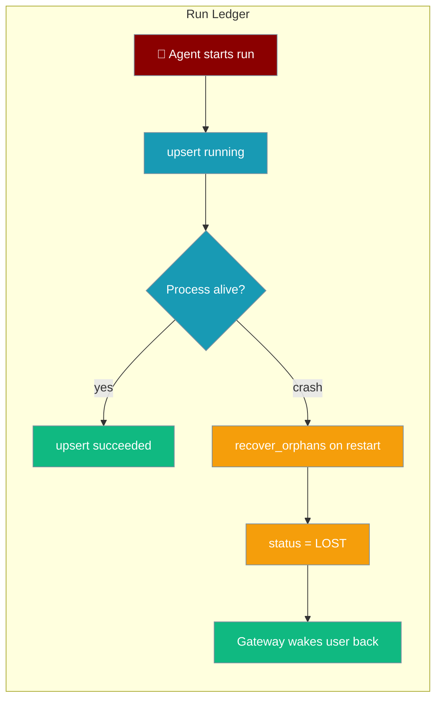
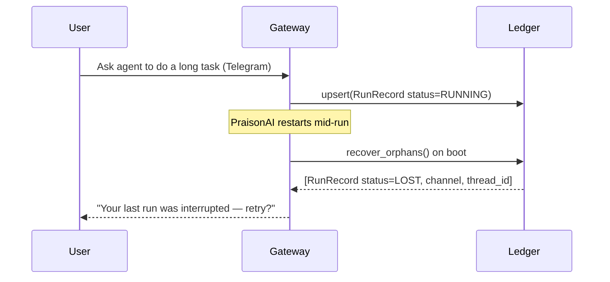

Give a background agent a stable ID that survives a restart — if PraisonAI crashes mid-run, the ledger reconciles it to `LOST` so you can wake the user and re-route.

<Note>
**Complements — does not replace — the [Run-State Journal](/docs/features/run-state-journal).** The ledger tracks run **status** (queued/running/done/failed/lost); the journal tracks the per-event **cursor** (model decision, tool call, tool result, iteration index) so a crashed run can resume without re-executing tools or re-billing LLM calls. Use the ledger to answer *"is this run alive?"*; use the journal to answer *"where in the loop did it die?"*
</Note>

```python
from praisonaiagents.runs import SQLiteRunLedger

ledger = SQLiteRunLedger()
```

No config, no new dependencies — SQLite lives at `~/.praisonai/runs/ledger.db`.



## Quick Start

<Steps>
<Step title="Get the default ledger">
```python
from praisonaiagents.runs import SQLiteRunLedger

ledger = SQLiteRunLedger()
```
</Step>

<Step title="Track a run">
```python
from praisonaiagents.runs import SQLiteRunLedger, RunRecord, RunStatus

ledger = SQLiteRunLedger()
ledger.upsert(RunRecord(
    run_id="run-123",
    agent_id="researcher",
    channel="telegram",
    thread_id="8765",
    status=RunStatus.RUNNING,
))
```
</Step>

<Step title="Reconcile on startup">
```python
from praisonaiagents.runs import SQLiteRunLedger

ledger = SQLiteRunLedger()
for lost in ledger.recover_orphans():
    print(f"Run {lost.run_id} was interrupted — re-routing to {lost.channel}")

for r in ledger.list_active():
    print(r.run_id, r.status)
```
</Step>
</Steps>

<Note>
`recover_orphans()` returns the list of records it marked `LOST`. It preserves each run's `channel` and `thread_id` so the gateway can wake the same user back.
</Note>

---

## How It Works

A run is recorded as it starts, updated as it progresses, and finalised with a terminal status. If a process dies while a run is still active, the next boot reconciles it to `LOST`.



### Run statuses

`RunStatus` partitions every run into **active** (recoverable) or **terminal** (done).

| Status | Category | Meaning |
|--------|----------|---------|
| `queued` | active | Accepted, not yet started |
| `running` | active | Executing |
| `waiting` | active | Blocked on an external signal (approval, tool, human input) |
| `succeeded` | terminal | Finished cleanly |
| `failed` | terminal | Errored |
| `cancelled` | terminal | Explicitly cancelled |
| `lost` | terminal | Orphaned by a crashed process; set by `recover_orphans()` |
| `unknown` | neither | Written by a newer process; never finalised so its real state is never lost |

Check the partition with the `is_active` / `is_terminal` helpers:

```python
from praisonaiagents.runs import RunStatus

RunStatus.RUNNING.is_active      # True
RunStatus.RUNNING.is_terminal    # False
RunStatus.LOST.is_terminal       # True
RunStatus.UNKNOWN.is_active      # False — neither active nor terminal
```

`RunStatus` is a `str` enum, so `RunStatus.RUNNING == "running"`.

---

## Configuration Options

### RunRecord

A durable record of a single run. `channel` and `thread_id` capture the origin route so the gateway can wake the user back.

| Field | Type | Default | Description |
|-------|------|---------|-------------|
| `run_id` | `str` | *(required)* | Stable ID, survives restarts |
| `agent_id` | `str` | `""` | Which agent ran it |
| `channel` | `str` | `""` | Origin channel (e.g. `"telegram"`) |
| `thread_id` | `str \| None` | `None` | Origin thread, to reply back |
| `status` | `RunStatus` | `RunStatus.QUEUED` | Current lifecycle status |
| `progress` | `str \| None` | `None` | Human-readable progress summary |
| `terminal_outcome` | `str \| None` | `None` | Final result or error note |
| `created_at` | `float` | `time.time()` | Creation timestamp |
| `updated_at` | `float` | `time.time()` | Last-update timestamp |
| `metadata` | `dict` | `{}` | Free-form extra data |

`to_dict()` / `from_dict()` roundtrip a record to a JSON/SQLite-friendly dict and back.

```python
from praisonaiagents.runs import RunRecord, RunStatus

rec = RunRecord(run_id="r1", channel="#ops", status=RunStatus.RUNNING)
restored = RunRecord.from_dict(rec.to_dict())
assert restored.status == RunStatus.RUNNING
```

### RunLedgerProtocol

The pluggable store contract — swap in a heavier backend by implementing these four methods.

| Method | Returns | Description |
|--------|---------|-------------|
| `upsert(record)` | `None` | Insert or update, keyed by `run_id` |
| `get(run_id)` | `RunRecord \| None` | Fetch one run, or `None` if unknown |
| `list_active()` | `list[RunRecord]` | All runs still in an active status |
| `recover_orphans()` | `list[RunRecord]` | Mark active runs `LOST`, return them (idempotent) |

### SQLiteRunLedger

The zero-dependency default, backed by stdlib `sqlite3`.

| Option | Type | Default | Description |
|--------|------|---------|-------------|
| `db_path` | `str \| None` | `~/.praisonai/runs/ledger.db` | Database file; use `":memory:"` for tests |

- **No new dependencies** — stdlib `sqlite3` only.
- **Thread-safe** — a re-entrant lock guards a shared WAL connection.
- **`recover_orphans()`** preserves the origin route and is idempotent (a second call returns `[]`).
- **`close()`** releases the connection; the file persists across restarts.

---

## Common Patterns

### Mark a run terminal on success

```python
from praisonaiagents.runs import SQLiteRunLedger, RunRecord, RunStatus

ledger = SQLiteRunLedger()
ledger.upsert(RunRecord(
    run_id="run-123",
    status=RunStatus.SUCCEEDED,
    terminal_outcome="report delivered",
))
```

### Wake users after a crash

```python
from praisonaiagents.runs import SQLiteRunLedger

ledger = SQLiteRunLedger()

def on_boot(send):
    for lost in ledger.recover_orphans():
        if lost.thread_id:
            send(lost.channel, lost.thread_id,
                 "Your last run was interrupted — retry?")
```

### List recent runs regardless of status

```python
from praisonaiagents.runs import SQLiteRunLedger

ledger = SQLiteRunLedger()
for r in ledger.list_all(limit=50):
    print(r.run_id, r.status, r.updated_at)
```

---

## Best Practices

<AccordionGroup>
<Accordion title="Call recover_orphans() once at boot">
Run reconciliation on gateway startup, before accepting new work. Active runs left by the previous process become `LOST`, and you get their origin routes back to notify users.
</Accordion>

<Accordion title="Always set channel and thread_id">
These fields are the only way the gateway can wake the right user back. Set them when the run starts so a later `LOST` reconciliation can reach the origin thread.
</Accordion>

<Accordion title="Update status at each transition">
Call `upsert()` as the run moves `queued → running → waiting → succeeded/failed`. The more current the status, the fewer false `LOST` reconciliations after a restart.
</Accordion>

<Accordion title="Swap the store for heavier backends">
`SQLiteRunLedger` is the default, but any object implementing `RunLedgerProtocol` (Postgres, Redis, a hosted queue) drops in unchanged — the gateway only depends on the protocol.
</Accordion>
</AccordionGroup>

---

## What The User Sees

<Steps>
<Step title="User asks for a long task">
A user messages a Telegram bot: "Research the top 10 databases and write a comparison." The agent starts, and the run is recorded as `RUNNING` with `channel="telegram"` and the user's `thread_id`.
</Step>

<Step title="PraisonAI restarts mid-run">
The process is killed or crashes before the run finishes. In-memory state is gone, but the ledger row on disk survives.
</Step>

<Step title="The gateway wakes the user back">
On boot, `recover_orphans()` marks the run `LOST` and returns it with the original `channel` and `thread_id`. The gateway posts back to the same Telegram thread: "Your last run was interrupted — retry?"
</Step>
</Steps>

---

## Related

<CardGroup cols={2}>
<Card title="Background Tasks" icon="clock" href="/docs/features/background-tasks">
  Run agent work in the background and collect results later.
</Card>
<Card title="Background Subagents" icon="rocket" href="/docs/features/background-subagents">
  Spawn subagents that return a job ID immediately — the general-purpose ledger backs their durable state.
</Card>
</CardGroup>
